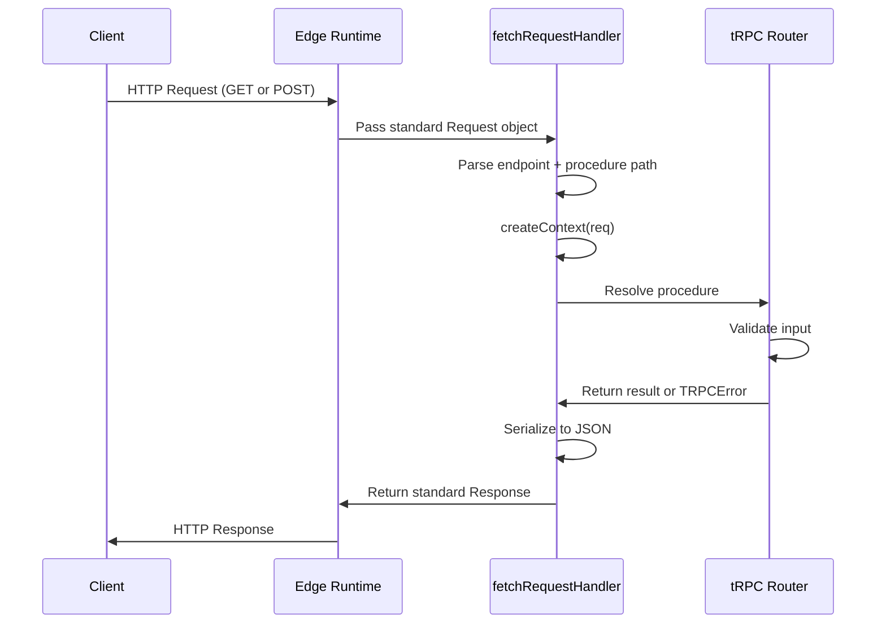

## tRPC Fetch Adapter for Edge Runtimes

The Fetch adapter enables tRPC to run in environments that implement the Web Fetch API — including Cloudflare Workers, Vercel Edge Functions, Deno Deploy, and any runtime that exposes a standard `Request`/`Response` interface. Unlike the Express or Fastify adapters, it has no dependency on Node.js built-ins, making it suitable for edge and serverless deployments.

---

### Why a Separate Adapter for Edge

Node.js-based adapters rely on `http.IncomingMessage` and `http.ServerResponse`. Edge runtimes do not expose these — they implement the WHATWG Fetch API instead. The Fetch adapter bridges tRPC to this interface, accepting a standard `Request` and returning a standard `Response`.

[Inference: Any runtime that fully conforms to the WHATWG Fetch API specification should be compatible with this adapter, though behavior may vary across partial implementations.]

---

### Installation

```bash
npm install @trpc/server
```

No additional adapter package is needed. The Fetch adapter is included in `@trpc/server`:

```ts
import { fetchRequestHandler } from '@trpc/server/adapters/fetch';
```

---

### Defining the Router

The router definition is identical to any other tRPC setup — the adapter layer is what changes.

```ts
// src/router.ts
import { initTRPC } from '@trpc/server';

const t = initTRPC.create();

export const appRouter = t.router({
  ping: t.procedure.query(() => 'pong'),
  greet: t.procedure
    .input((val: unknown) => {
      if (typeof val === 'string') return val;
      throw new Error('Expected string');
    })
    .query(({ input }) => ({ message: `Hello, ${input}` })),
});

export type AppRouter = typeof appRouter;
```

---

### Creating the Context

The Fetch adapter passes a standard `Request` object — not a Fastify `req` or Express `req`. The context factory signature reflects this:

```ts
// src/context.ts
import { type FetchCreateContextFnOptions } from '@trpc/server/adapters/fetch';

export function createContext({ req }: FetchCreateContextFnOptions) {
  const token = req.headers.get('authorization') ?? null;
  return { token };
}

export type Context = Awaited<ReturnType<typeof createContext>>;
```

**Key Points:**
- `req` is a standard WHATWG `Request` — use `req.headers.get()`, not `req.headers['key']`
- No `res` object is available in the Fetch adapter context; responses are constructed by the adapter itself
- `resHeaders` is available in some versions as a `Headers` instance to set response headers from context [Unverified: availability of `resHeaders` may vary by `@trpc/server` version]

---

### Cloudflare Workers

Cloudflare Workers expose a `fetch` event handler that receives a `Request` and expects a `Response` in return — a natural fit for the Fetch adapter.

```ts
// src/worker.ts
import { fetchRequestHandler } from '@trpc/server/adapters/fetch';
import { appRouter } from './router';
import { createContext } from './context';

export default {
  async fetch(request: Request): Promise<Response> {
    return fetchRequestHandler({
      endpoint: '/trpc',
      req: request,
      router: appRouter,
      createContext,
      onError({ path, error }) {
        console.error(`[${path}] ${error.message}`);
      },
    });
  },
};
```

**Key Points:**
- `endpoint` must match the path prefix under which tRPC procedures are accessed
- The `fetch` export is the Cloudflare Workers module syntax entry point
- `fetchRequestHandler` returns a `Promise<Response>` directly — no framework plumbing needed

---

### Vercel Edge Functions

Vercel Edge Functions use the same Fetch API surface. The adapter integrates without modification:

```ts
// app/api/trpc/[trpc]/route.ts  (Next.js App Router, edge runtime)
import { fetchRequestHandler } from '@trpc/server/adapters/fetch';
import { appRouter } from '@/server/router';
import { createContext } from '@/server/context';

const handler = (req: Request) =>
  fetchRequestHandler({
    endpoint: '/api/trpc',
    req,
    router: appRouter,
    createContext,
  });

export const GET = handler;
export const POST = handler;

export const runtime = 'edge';
```

**Key Points:**
- Both `GET` and `POST` must be exported — queries use GET, mutations use POST
- `export const runtime = 'edge'` opts this route into the Vercel edge runtime
- This pattern also applies to the Next.js Pages Router using `export const config = { runtime: 'edge' }`

---

### Deno Deploy

Deno Deploy supports the Fetch API natively. The adapter works with Deno's `serve` function:

```ts
import { fetchRequestHandler } from 'npm:@trpc/server/adapters/fetch';
import { appRouter } from './router.ts';
import { createContext } from './context.ts';

Deno.serve((req: Request) =>
  fetchRequestHandler({
    endpoint: '/trpc',
    req,
    router: appRouter,
    createContext,
  })
);
```

[Unverified: Deno Deploy's `npm:` specifier compatibility with `@trpc/server` may require specific version pinning.]

---

### Request and Response Flow



---

### `endpoint` Path Matching

The `endpoint` parameter tells the adapter what URL prefix to strip when resolving procedure names.

| Registered endpoint | Request URL | Resolved procedure |
|---|---|---|
| `/trpc` | `/trpc/greet` | `greet` |
| `/api/trpc` | `/api/trpc/greet` | `greet` |
| `/trpc` | `/trpc/user.getById` | `user.getById` |

If the request URL does not match the `endpoint` prefix, behavior may vary — the adapter may return a 404 or an unhandled error depending on the version. [Inference]

---

### Setting Response Headers from Context

Some use cases require setting response headers (e.g., `Set-Cookie`, `Cache-Control`) from within the context or procedure. The Fetch adapter supports this via a `responseMeta` option:

```ts
fetchRequestHandler({
  endpoint: '/trpc',
  req,
  router: appRouter,
  createContext,
  responseMeta({ ctx, paths, type, errors }) {
    const allPublic = paths && paths.every((path) => path.startsWith('public.'));
    if (type === 'query' && allPublic && errors.length === 0) {
      return {
        headers: {
          'cache-control': 'public, max-age=60',
        },
      };
    }
    return {};
  },
});
```

**Key Points:**
- `responseMeta` receives context, resolved paths, procedure type, and any errors
- Return an object with `headers` and optionally `status` to override defaults
- This is the primary mechanism for cache control in edge deployments

---

### Error Handling

The `onError` callback receives structured error information and is the appropriate place for logging or monitoring integration:

```ts
fetchRequestHandler({
  endpoint: '/trpc',
  req,
  router: appRouter,
  createContext,
  onError({ error, type, path, input, ctx }) {
    if (error.code === 'INTERNAL_SERVER_ERROR') {
      // forward to error tracking service
      console.error('Unhandled error', { path, input, error });
    }
  },
});
```

Errors surfaced here are `TRPCError` instances with a `code` property mapping to HTTP status codes. The adapter handles serialization and HTTP status assignment automatically.

---

### Limitations in Edge Runtimes

| Limitation | Notes |
|---|---|
| No Node.js built-ins | `fs`, `path`, `crypto` (Node version) unavailable — use Web Crypto API |
| No WebSocket subscriptions | The Fetch adapter does not support tRPC subscriptions; use a separate WebSocket server for that |
| Cold start constraints | Large router bundles increase cold start latency; keep routers lean at the edge |
| Execution time limits | Cloudflare Workers (CPU time) and Vercel Edge have strict limits — long-running procedures may be terminated |
| No persistent connections | Each request is stateless; connection-level state is not available |

[Inference: Subscription support at the edge may become viable as runtimes adopt WebSocket hibernation APIs, such as Cloudflare's Durable Objects with WebSocket support, but this would require a custom integration beyond the standard Fetch adapter.]

---

### Comparison: Fetch Adapter vs Node.js Adapters

| Characteristic | Fetch Adapter | Express / Fastify Adapters |
|---|---|---|
| Runtime requirement | WHATWG Fetch API | Node.js |
| `req` type | `Request` (WHATWG) | `IncomingMessage` / Fastify request |
| `res` in context | Not available | Available |
| Subscription support | No | Yes (with WSS) |
| Deployment targets | Edge, serverless, Deno | Traditional servers, containers |
| Bundle size sensitivity | High | Lower concern |

---

**Conclusion:** The Fetch adapter is the correct choice for any tRPC deployment targeting edge or serverless runtimes. It requires no Node.js dependencies, integrates naturally with the WHATWG `Request`/`Response` model, and supports response metadata control for caching and header management. Its primary constraint is the absence of subscription support, which remains tied to persistent connection adapters.

**Next Steps:** Consider how `responseMeta` can be used for fine-grained cache control in edge-deployed queries, or proceed to tRPC middleware patterns for shared authentication logic across procedures.