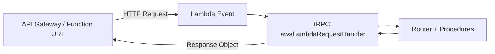

## tRPC with AWS Lambda Adapter

### Overview

The AWS Lambda adapter allows a tRPC router to be deployed as a serverless function on AWS Lambda. Instead of running a persistent HTTP server, the router handles invocations triggered by API Gateway (REST or HTTP API) or Lambda Function URLs.

tRPC provides a dedicated adapter package for this: `@trpc/server/adapters/aws-lambda`.

---

### Installation

```bash
npm install @trpc/server
```

The Lambda adapter is included within `@trpc/server` — no separate package is needed.

---

### How It Works

In a traditional Node.js server deployment, tRPC wraps an Express or Fastify server. In Lambda, the entry point is a **handler function** that receives an AWS event object and a context object, then returns a response.

The tRPC Lambda adapter bridges these two models:



The adapter translates the Lambda event into a format tRPC understands, routes it through the router, and converts the result back into an API Gateway–compatible response object.

---

### Basic Setup

#### Router Definition

```ts
// router.ts
import { initTRPC } from '@trpc/server';

const t = initTRPC.create();

export const appRouter = t.router({
  hello: t.procedure
    .input((val: unknown) => {
      if (typeof val === 'string') return val;
      throw new Error('Input must be a string');
    })
    .query(({ input }) => {
      return { greeting: `Hello, ${input}` };
    }),
});

export type AppRouter = typeof appRouter;
```

#### Lambda Handler

```ts
// handler.ts
import {
  awsLambdaRequestHandler,
  CreateAWSLambdaContextOptions,
} from '@trpc/server/adapters/aws-lambda';
import type { APIGatewayProxyEventV2 } from 'aws-lambda';
import { appRouter } from './router';

const createContext = ({
  event,
  context,
}: CreateAWSLambdaContextOptions<APIGatewayProxyEventV2>) => {
  return {
    event,
    context,
    // Add auth headers, user info, etc. here
  };
};

export const handler = awsLambdaRequestHandler({
  router: appRouter,
  createContext,
});
```

**Key Points**
- `awsLambdaRequestHandler` is the main adapter function.
- `createContext` receives the raw Lambda event and context, and returns whatever your procedures will receive as `ctx`.
- The exported `handler` is the Lambda entry point (e.g., `handler.handler` in your function config).

---

### Event Type Variants

The adapter supports multiple AWS event shapes. The generic type parameter controls which event type is expected.

| Event Type | Import | Use Case |
|---|---|---|
| `APIGatewayProxyEvent` | `aws-lambda` | API Gateway REST API (v1) |
| `APIGatewayProxyEventV2` | `aws-lambda` | API Gateway HTTP API (v2) |
| `APIGatewayProxyWithCognitoAuthorizerEvent` | `aws-lambda` | REST API with Cognito |

**Key Points**
- V2 (HTTP API)
## tRPC with AWS Lambda Adapter

### Overview

The AWS Lambda adapter allows a tRPC router to be deployed as a serverless function on AWS Lambda. Instead of running a persistent HTTP server, the router handles invocations triggered by API Gateway (REST or HTTP API) or Lambda Function URLs.

tRPC provides a dedicated adapter package for this: `@trpc/server/adapters/aws-lambda`.

---

### Installation

```bash
npm install @trpc/server
```

The Lambda adapter is included within `@trpc/server` — no separate package is needed.

---

### How It Works

In a traditional Node.js server deployment, tRPC wraps an Express or Fastify server. In Lambda, the entry point is a **handler function** that receives an AWS event object and a context object, then returns a response.

The tRPC Lambda adapter bridges these two models:


The adapter translates the Lambda event into a format tRPC understands, routes it through the router, and converts the result back into an API Gateway–compatible response object.

---

### Basic Setup

#### Router Definition

```ts
// router.ts
import { initTRPC } from '@trpc/server';

const t = initTRPC.create();

export const appRouter = t.router({
  hello: t.procedure
    .input((val: unknown) => {
      if (typeof val === 'string') return val;
      throw new Error('Input must be a string');
    })
    .query(({ input }) => {
      return { greeting: `Hello, ${input}` };
    }),
});

export type AppRouter = typeof appRouter;
```

#### Lambda Handler

```ts
// handler.ts
import {
  awsLambdaRequestHandler,
  CreateAWSLambdaContextOptions,
} from '@trpc/server/adapters/aws-lambda';
import type { APIGatewayProxyEventV2 } from 'aws-lambda';
import { appRouter } from './router';

const createContext = ({
  event,
  context,
}: CreateAWSLambdaContextOptions<APIGatewayProxyEventV2>) => {
  return {
    event,
    context,
    // Add auth headers, user info, etc. here
  };
};

export const handler = awsLambdaRequestHandler({
  router: appRouter,
  createContext,
});
```

**Key Points**
- `awsLambdaRequestHandler` is the main adapter function.
- `createContext` receives the raw Lambda event and context, and returns whatever your procedures will receive as `ctx`.
- The exported `handler` is the Lambda entry point (e.g., `handler.handler` in your function config).

---

### Event Type Variants

The adapter supports multiple AWS event shapes. The generic type parameter controls which event type is expected.

| Event Type | Import | Use Case |
|---|---|---|
| `APIGatewayProxyEvent` | `aws-lambda` | API Gateway REST API (v1) |
| `APIGatewayProxyEventV2` | `aws-lambda` | API Gateway HTTP API (v2) |
| `APIGatewayProxyWithCognitoAuthorizerEvent` | `aws-lambda` | REST API with Cognito |

**Key Points**
- V2 (HTTP API) is generally lower latency and cheaper than V1 (REST API). [Inference — based on AWS pricing documentation patterns; verify against current AWS docs.]
- Lambda Function URLs also emit `APIGatewayProxyEventV2`-shaped events. [Unverified — confirm against current AWS Lambda Function URL documentation.]

---

### Context Creation

The context is created once per invocation. It has access to the full Lambda event and context objects.

```ts
import type { APIGatewayProxyEventV2 } from 'aws-lambda';
import { CreateAWSLambdaContextOptions } from '@trpc/server/adapters/aws-lambda';

export const createContext = async ({
  event,
  context,
}: CreateAWSLambdaContextOptions<APIGatewayProxyEventV2>) => {
  const authHeader = event.headers?.authorization ?? '';

  const user = authHeader.startsWith('Bearer ')
    ? await verifyToken(authHeader.slice(7))
    : null;

  return { user };
};
```

The return value becomes the `ctx` argument in every procedure within that invocation.

---

### Accessing Raw Event in Procedures

Because the context is user-defined, you can forward the raw event to procedures if needed:

```ts
const createContext = ({
  event,
  context,
}: CreateAWSLambdaContextOptions<APIGatewayProxyEventV2>) => ({
  event,
  lambdaContext: context,
});

// In a procedure:
const myProcedure = t.procedure.query(({ ctx }) => {
  const ip = ctx.event.requestContext?.http?.sourceIp;
  return { ip };
});
```

---

### Batching Behavior

tRPC's client-side request batching works with the Lambda adapter. When batching is enabled on the client, multiple procedure calls are sent as a single HTTP request. The adapter handles the batch, routes each call through the router, and returns a batched response.

**Key Points**
- Each Lambda invocation still handles one HTTP request — batching reduces the number of invocations from the client side, but does not split work across multiple Lambda instances. [Inference]
- Batching can be disabled per-client if cold start latency is a concern, so each call is an independent invocation.

---

### Error Handling

Standard tRPC error handling applies. `TRPCError` thrown inside procedures is serialized and returned with appropriate HTTP status codes.

```ts
import { TRPCError } from '@trpc/server';

const protectedProcedure = t.procedure.query(({ ctx }) => {
  if (!ctx.user) {
    throw new TRPCError({
      code: 'UNAUTHORIZED',
      message: 'You must be logged in.',
    });
  }
  return { secret: 'data' };
});
```

The adapter maps tRPC error codes to HTTP status codes automatically (e.g., `UNAUTHORIZED` → 401, `NOT_FOUND` → 404).

---

### Deployment Considerations

#### Cold Starts

Lambda functions incur a cold start on the first invocation after a period of inactivity. tRPC router initialization runs at module load time, which contributes to cold start duration.

**Key Points**
- Keep the router module lean. Avoid heavy imports at the top level if they are not needed for every procedure. [Inference]
- Using Provisioned Concurrency on AWS reduces cold start impact but increases cost. [Unverified — confirm against current AWS Lambda pricing.]

#### Bundling

Lambda deployments typically require bundling your TypeScript source into a single JS file. Common tools:

- **esbuild** (fast, recommended for Lambda)
- **Webpack**
- **tsup**

Example `esbuild` command:

```bash
esbuild handler.ts --bundle --platform=node --target=node18 --outfile=dist/handler.js
```

#### Timeout

Lambda has a maximum execution timeout (15 minutes as of current documentation, but verify). Long-running tRPC procedures are bounded by this limit. tRPC itself does not add a separate timeout layer. [Unverified — confirm current Lambda timeout limits with AWS docs.]

---

### Minimal Working Example (End-to-End)

```
project/
├── src/
│   ├── router.ts
│   └── handler.ts
├── package.json
└── tsconfig.json
```

```ts
// src/router.ts
import { initTRPC } from '@trpc/server';

const t = initTRPC.create();

export const appRouter = t.router({
  ping: t.procedure.query(() => 'pong'),
});

export type AppRouter = typeof appRouter;
```

```ts
// src/handler.ts
import {
  awsLambdaRequestHandler,
  CreateAWSLambdaContextOptions,
} from '@trpc/server/adapters/aws-lambda';
import type { APIGatewayProxyEventV2 } from 'aws-lambda';
import { appRouter } from './router';

const createContext = (
  _opts: CreateAWSLambdaContextOptions<APIGatewayProxyEventV2>
) => ({});

export const handler = awsLambdaRequestHandler({
  router: appRouter,
  createContext,
});
```

Deploy `dist/handler.js` to Lambda with handler set to `handler.handler`.

---

### Limitations and Caveats

| Concern | Detail |
|---|---|
| Subscriptions | WebSocket-based subscriptions are not supported via this adapter. Lambda's request/response model does not support persistent connections. |
| Response size | API Gateway has response payload size limits (10 MB for HTTP API). [Unverified — verify current limits.] |
| Streaming | tRPC response streaming is not supported through the standard Lambda adapter. [Inference — based on the stateless request/response model of Lambda.] |
| State | Lambda instances may be reused between invocations but this is not guaranteed. Do not rely on in-memory state persisting across calls. |

---

### Summary

The AWS Lambda adapter (`awsLambdaRequestHandler`) maps Lambda invocation events to tRPC procedure calls with minimal configuration. The main responsibilities when using it are: defining the router, implementing `createContext` to extract auth or request metadata from the Lambda event, and deploying the bundled handler to Lambda behind API Gateway or a Function URL. Subscriptions and response streaming are not supported under this model.