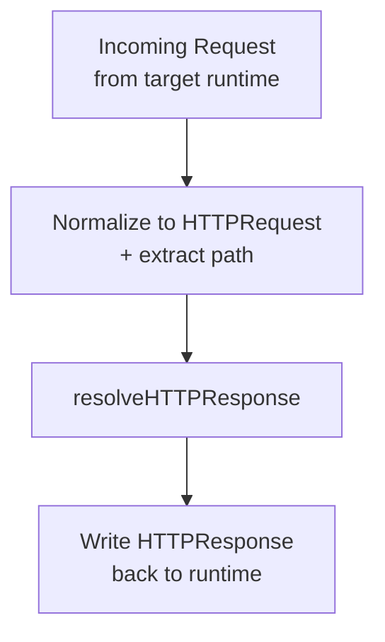

## Building Custom tRPC Adapters

### Overview

A custom adapter is the bridge between an arbitrary runtime or framework and the tRPC router. When no official adapter exists for your target environment — a custom HTTP framework, a WebSocket server, a message queue consumer, or an embedded runtime — you build one by calling tRPC's internal request resolution API directly.

The core function is `resolveHTTPResponse` (for HTTP-like transports) or `callProcedure` (for direct, non-HTTP invocations).

---

### When to Build a Custom Adapter

| Scenario | Approach |
|---|---|
| Unsupported HTTP framework | `resolveHTTPResponse` |
| Non-HTTP transport (queues, IPC, sockets) | `callProcedure` or `resolveHTTPResponse` with synthetic requests |
| Testing / in-process calls | `createCaller` (not a full adapter, but often sufficient) |
| Custom middleware pipeline integration | `resolveHTTPResponse` |

---

### Core Internal API

tRPC exposes adapter primitives from `@trpc/server/http`:

```ts
import { resolveHTTPResponse } from '@trpc/server/http';
```

`resolveHTTPResponse` is the primary building block for HTTP-based custom adapters. It takes a normalized request description and returns a normalized response description — no Node.js `req`/`res` objects involved.

---

### The `resolveHTTPResponse` Signature

```ts
resolveHTTPResponse(opts: ResolveHTTPRequestOptions): Promise<HTTPResponse>
```

#### Input: `ResolveHTTPRequestOptions`

| Field | Type | Description |
|---|---|---|
| `router` | `AnyRouter` | Your tRPC router instance |
| `req` | `HTTPRequest` | Normalized request object (see below) |
| `path` | `string` | The procedure path, e.g. `"user.getById"` |
| `createContext` | `() => Promise<TContext>` | Factory returning the context for this request |
| `responseMeta` | `ResponseMetaFn` (optional) | Hook to customize response headers/status |
| `onError` | `(opts) => void` (optional) | Called when a procedure throws |
| `batching` | `{ enabled: boolean }` (optional) | Whether to allow batched requests |

#### The Normalized `HTTPRequest` Object

```ts
type HTTPRequest = {
  method: string;           // 'GET' | 'POST' | etc.
  headers: HTTPHeaders;     // Record<string, string | string[] | undefined>
  query: URLSearchParams;   // parsed query string
  body: unknown;            // parsed request body (string, object, null)
};
```

**Key Points**
- `body` should be the already-parsed body, not a raw stream. Your adapter is responsible for reading and parsing the body before passing it in.
- `query` must be a `URLSearchParams` instance, not a plain object.

#### Output: `HTTPResponse`

```ts
type HTTPResponse = {
  status: number;
  headers: Record<string, string | string[]>;
  body: string;
};
```

Your adapter takes this output and writes it into the target runtime's response mechanism.

---

### Anatomy of a Custom Adapter

The pattern is always the same three steps:



1. **Normalize** — translate the runtime's request representation into `HTTPRequest` and extract the procedure path.
2. **Resolve** — call `resolveHTTPResponse` with the normalized input.
3. **Write** — take the returned `HTTPResponse` and write status, headers, and body back through the runtime's response API.

---

### Building an Adapter for a Generic Node.js HTTP Server

This example uses Node's built-in `http` module directly, with no framework.

```ts
import { createServer, IncomingMessage, ServerResponse } from 'http';
import { resolveHTTPResponse } from '@trpc/server/http';
import { AnyRouter } from '@trpc/server';

type NodeHTTPAdapterOptions<TRouter extends AnyRouter> = {
  router: TRouter;
  createContext: () => Promise<any>;
  prefix?: string; // e.g. '/trpc'
};

function createNodeHTTPAdapter<TRouter extends AnyRouter>(
  opts: NodeHTTPAdapterOptions<TRouter>
) {
  return async (req: IncomingMessage, res: ServerResponse) => {
    const prefix = opts.prefix ?? '/trpc';
    const url = new URL(req.url ?? '/', `http://${req.headers.host}`);

    // Step 1: Extract procedure path
    const path = url.pathname.slice(prefix.length + 1); // remove leading slash

    // Step 2: Read and parse body
    const rawBody = await new Promise<string>((resolve, reject) => {
      let data = '';
      req.on('data', (chunk) => (data += chunk));
      req.on('end', () => resolve(data));
      req.on('error', reject);
    });

    const body = rawBody ? JSON.parse(rawBody) : null;

    // Step 3: Normalize headers
    const headers: Record<string, string> = {};
    for (const [key, value] of Object.entries(req.headers)) {
      if (typeof value === 'string') headers[key] = value;
    }

    // Step 4: Resolve
    const response = await resolveHTTPResponse({
      router: opts.router,
      req: {
        method: req.method ?? 'GET',
        headers,
        query: url.searchParams,
        body,
      },
      path,
      createContext: opts.createContext,
      onError: ({ error, path }) => {
        console.error(`[tRPC error on ${path}]:`, error);
      },
    });

    // Step 5: Write response
    res.statusCode = response.status;
    for (const [key, value] of Object.entries(response.headers)) {
      res.setHeader(key, value);
    }
    res.end(response.body);
  };
}
```

**Usage:**

```ts
import { appRouter } from './router';

const handler = createNodeHTTPAdapter({
  router: appRouter,
  createContext: async () => ({}),
  prefix: '/trpc',
});

createServer(handler).listen(3000, () => {
  console.log('Listening on http://localhost:3000');
});
```

---

### Handling GET vs POST

tRPC uses:
- `GET` for queries (procedure input passed as a `?input=` query param, JSON-encoded)
- `POST` for mutations (input passed in the request body)

Your adapter must handle both. The body-reading step should guard against empty bodies:

```ts
let body: unknown = null;

if (req.method === 'POST' && rawBody.length > 0) {
  try {
    body = JSON.parse(rawBody);
  } catch {
    // malformed body — resolveHTTPResponse will handle the error
    body = rawBody;
  }
}
```

**Key Points**
- For `GET` requests, `body` should be `null` or `undefined`. The input is in `query`.
- Passing a malformed body is not guaranteed to produce a clean error in all tRPC versions. [Inference]

---

### The `responseMeta` Hook

`responseMeta` lets you inject custom headers or override the status code based on the procedure results. This is useful for setting `Cache-Control`, `Set-Cookie`, or custom auth headers.

```ts
resolveHTTPResponse({
  router: opts.router,
  req: normalizedReq,
  path,
  createContext: opts.createContext,
  responseMeta({ data, ctx, paths, type, errors }) {
    const allOk = errors.length === 0;
    const isQuery = type === 'query';

    if (allOk && isQuery) {
      return {
        headers: {
          'cache-control': 'max-age=60',
        },
      };
    }

    return {};
  },
});
```

| `responseMeta` argument | Type | Description |
|---|---|---|
| `data` | `TRPCResponse[]` | The resolved procedure responses |
| `ctx` | `TContext \| undefined` | The created context (may be undefined if context creation failed) |
| `paths` | `string[]` | Procedure paths in this request |
| `type` | `'query' \| 'mutation' \| 'subscription'` | Request type |
| `errors` | `TRPCError[]` | Any errors that occurred |

---

### The `onError` Hook

`onError` is called synchronously when a procedure throws. It is intended for logging and observability — it does not affect the response.

```ts
onError({ error, type, path, input, ctx, req }) {
  // error: TRPCError
  // type: 'query' | 'mutation' | 'subscription'
  // path: string | undefined
  // input: unknown
  // ctx: TContext | undefined
  // req: HTTPRequest
  externalLogger.capture(error);
},
```

---

### Non-HTTP Transport: Using `callProcedure` Directly

For transports that have no concept of HTTP (e.g., consuming messages from an SQS queue, IPC channels, or in-process test calls), `resolveHTTPResponse` is unnecessary. Use `callProcedure` from `@trpc/server` instead.

```ts
import { callProcedure } from '@trpc/server';
import { appRouter } from './router';

const result = await callProcedure({
  procedures: appRouter._def.procedures,
  path: 'user.getById',
  rawInput: { id: '123' },
  ctx: { user: null },
  type: 'query',
});
```

**Key Points**
- `callProcedure` bypasses HTTP entirely — no status codes, no headers.
- It returns the raw procedure output or throws a `TRPCError`.
- [Inference] This is approximately what `createCaller` wraps internally, though the public API of `createCaller` is the recommended approach for in-process calls.
- The internal API shape of `callProcedure` is not part of tRPC's public contract and may change between minor versions. [Unverified — verify against your installed version's changelog.]

---

### Adapter for a Non-Node Runtime: Bun Example

Bun's native HTTP server has a different API from Node. A custom adapter applies the same three-step pattern:

```ts
import { resolveHTTPResponse } from '@trpc/server/http';
import { appRouter } from './router';

Bun.serve({
  port: 3000,
  async fetch(req: Request) {
    const url = new URL(req.url);
    const path = url.pathname.replace('/trpc/', '');

    const bodyText = req.method === 'POST' ? await req.text() : null;
    const body = bodyText ? JSON.parse(bodyText) : null;

    const headers: Record<string, string> = {};
    req.headers.forEach((value, key) => {
      headers[key] = value;
    });

    const response = await resolveHTTPResponse({
      router: appRouter,
      req: {
        method: req.method,
        headers,
        query: url.searchParams,
        body,
      },
      path,
      createContext: async () => ({}),
    });

    return new Response(response.body, {
      status: response.status,
      headers: response.headers as Record<string, string>,
    });
  },
});
```

The pattern is identical — only the runtime-specific request/response types differ.

---

### Path Extraction Conventions

tRPC expects the `path` string to be a dot-separated procedure path, e.g. `user.getById` or `post.create`.

When mounted at a prefix such as `/trpc`, the path is extracted by stripping that prefix from the URL pathname:

```ts
// URL: /trpc/user.getById
const path = url.pathname.replace(/^\/trpc\//, ''); // → 'user.getById'
```

For batched requests, the path segment contains comma-separated paths:

```
/trpc/user.getById,post.list
```

`resolveHTTPResponse` handles the splitting internally — your adapter does not need to parse batched paths manually.

---

### Batching Configuration

Pass the `batching` option to opt in or out:

```ts
resolveHTTPResponse({
  // ...
  batching: { enabled: true }, // default behavior in most official adapters
});
```

If `batching` is disabled and a batched request arrives, tRPC returns an error response. [Inference — based on standard tRPC error handling; behavior may vary by version.]

---

### Testing a Custom Adapter

The simplest way to test a custom adapter without a running server is to call the handler function directly with a synthetic request:

```ts
import { createNodeHTTPAdapter } from './my-adapter';
import { appRouter } from './router';

const handler = createNodeHTTPAdapter({
  router: appRouter,
  createContext: async () => ({}),
});

// Construct a mock IncomingMessage and ServerResponse, then call handler(req, res)
```

Alternatively, use `createCaller` for pure procedure logic testing that bypasses the adapter entirely:

```ts
const caller = appRouter.createCaller({});
const result = await caller.ping();
```

---

### Summary

A custom tRPC adapter is built around `resolveHTTPResponse`, which accepts a normalized `HTTPRequest` and returns a normalized `HTTPResponse`. The adapter's job is to translate the target runtime's request format into that normalized shape, call `resolveHTTPResponse`, and write the result back. The same three-step pattern — normalize, resolve, write — applies regardless of the runtime. For non-HTTP transports, `callProcedure` provides direct procedure invocation without the HTTP layer. Internal APIs like `callProcedure` are not part of tRPC's stable public surface and should be used with caution. [Inference — based on typical open-source versioning conventions; verify against tRPC release notes.]