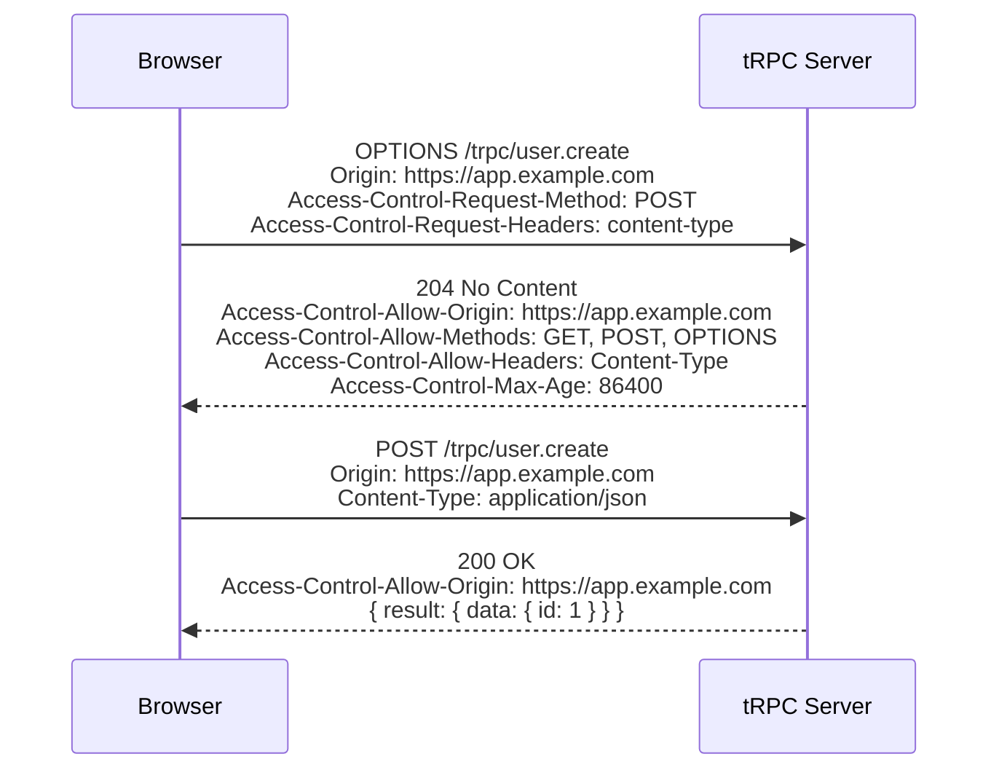

## CORS Configuration in tRPC HTTP Adapters

CORS (Cross-Origin Resource Sharing) controls whether browsers allow web pages from one origin to make requests to a different origin. When tRPC is served via an HTTP adapter, CORS must be configured at the HTTP server layer — tRPC itself does not handle CORS directly.

---

### What CORS Means in This Context

A browser enforces the same-origin policy: scripts on `https://app.example.com` cannot freely fetch from `https://api.example.com`. CORS is the mechanism by which the server at `api.example.com` signals to the browser that such cross-origin requests are permitted.

tRPC HTTP adapters (Express, Fastify, Fetch-based, standalone) all sit on top of HTTP servers. CORS headers must be added either by middleware on that server or by the adapter's response handler.

---

### How Browsers Trigger CORS

There are two request types relevant to tRPC:

**Simple requests** — GET queries with basic headers may go directly without a preflight.

**Preflighted requests** — POST mutations, or requests with custom headers like `Content-Type: application/json` or `x-trpc-source`, trigger an `OPTIONS` preflight request before the actual request. The server must respond correctly to `OPTIONS` or the browser blocks the real request.

tRPC mutations use POST and send `Content-Type: application/json`, so they will always trigger a preflight in cross-origin scenarios.

---

### CORS Headers Reference

| Header | Purpose |
|---|---|
| `Access-Control-Allow-Origin` | Which origins may access the resource |
| `Access-Control-Allow-Methods` | Allowed HTTP methods |
| `Access-Control-Allow-Headers` | Allowed request headers |
| `Access-Control-Allow-Credentials` | Whether cookies/auth headers are permitted |
| `Access-Control-Max-Age` | How long the browser may cache the preflight result (seconds) |
| `Access-Control-Expose-Headers` | Headers the browser may read from the response |

---

### CORS with the Express Adapter

The `cors` npm package is the standard approach with Express.

**Installation**

```bash
npm install cors
npm install --save-dev @types/cors
```

**Basic setup**

```ts
import express from 'express';
import cors from 'cors';
import { createExpressMiddleware } from '@trpc/server/adapters/express';
import { appRouter } from './router';
import { createContext } from './context';

const app = express();

app.use(cors({
  origin: 'https://app.example.com',
  methods: ['GET', 'POST', 'OPTIONS'],
  allowedHeaders: ['Content-Type', 'Authorization'],
  credentials: true,
}));

app.use('/trpc', createExpressMiddleware({
  router: appRouter,
  createContext,
}));

app.listen(3000);
```

**Key Points**
- `cors()` must be applied before the tRPC middleware so the headers are present on all responses, including preflight `OPTIONS` responses.
- Express's `cors` middleware automatically handles `OPTIONS` preflight responses when placed as a global middleware.

---

### Multiple Allowed Origins

A static `origin` string only permits one origin. For multiple origins, use a function:

```ts
const allowedOrigins = [
  'https://app.example.com',
  'https://admin.example.com',
];

app.use(cors({
  origin: (origin, callback) => {
    // Allow requests with no origin (e.g., server-to-server, curl)
    if (!origin) return callback(null, true);

    if (allowedOrigins.includes(origin)) {
      callback(null, true);
    } else {
      callback(new Error(`Origin ${origin} not allowed by CORS`));
    }
  },
  credentials: true,
}));
```

**Key Points**
- Requests with no `Origin` header (server-to-server, Postman, curl) will have `origin` as `undefined`. Decide explicitly whether to allow these.
- Avoid `origin: '*'` in combination with `credentials: true` — browsers reject this combination. When credentials are needed, you must reflect the specific origin.

---

### Reflecting the Request Origin (with Credentials)

When `credentials: true` is required, `Access-Control-Allow-Origin` cannot be `*`. One pattern is to reflect the incoming `Origin` header back after validating it:

```ts
app.use(cors({
  origin: (origin, callback) => {
    if (!origin || allowedOrigins.includes(origin)) {
      callback(null, origin || true);
    } else {
      callback(new Error('Not allowed'));
    }
  },
  credentials: true,
}));
```

This causes Express's `cors` package to set `Access-Control-Allow-Origin` to the exact requesting origin rather than `*`, satisfying the browser's credential check.

---

### CORS with the Fastify Adapter

Fastify uses `@fastify/cors`:

```bash
npm install @fastify/cors
```

```ts
import Fastify from 'fastify';
import cors from '@fastify/cors';
import { fastifyTRPCPlugin } from '@trpc/server/adapters/fastify';
import { appRouter } from './router';
import { createContext } from './context';

const server = Fastify();

await server.register(cors, {
  origin: ['https://app.example.com'],
  methods: ['GET', 'POST', 'OPTIONS'],
  allowedHeaders: ['Content-Type', 'Authorization'],
  credentials: true,
});

await server.register(fastifyTRPCPlugin, {
  prefix: '/trpc',
  trpcOptions: { router: appRouter, createContext },
});

await server.listen({ port: 3000 });
```

**Key Points**
- Plugin registration order matters in Fastify. Register `@fastify/cors` before the tRPC plugin.
- `@fastify/cors` handles preflight `OPTIONS` automatically when registered as a plugin.

---

### CORS with the Fetch Adapter (Edge Runtimes)

On edge runtimes (Cloudflare Workers, Vercel Edge, Deno), there is no middleware layer — you handle the raw `Request` and return a `Response`. CORS headers must be set manually.

```ts
import { fetchRequestHandler } from '@trpc/server/adapters/fetch';
import { appRouter } from './router';

const corsHeaders = {
  'Access-Control-Allow-Origin': 'https://app.example.com',
  'Access-Control-Allow-Methods': 'GET,POST,OPTIONS',
  'Access-Control-Allow-Headers': 'Content-Type, Authorization',
  'Access-Control-Allow-Credentials': 'true',
  'Access-Control-Max-Age': '86400',
};

export default {
  async fetch(request: Request): Promise<Response> {
    // Handle preflight
    if (request.method === 'OPTIONS') {
      return new Response(null, { status: 204, headers: corsHeaders });
    }

    const response = await fetchRequestHandler({
      endpoint: '/trpc',
      req: request,
      router: appRouter,
      createContext: () => ({}),
    });

    // Attach CORS headers to the actual response
    const newHeaders = new Headers(response.headers);
    Object.entries(corsHeaders).forEach(([key, value]) => {
      newHeaders.set(key, value);
    });

    return new Response(response.body, {
      status: response.status,
      headers: newHeaders,
    });
  },
};
```

**Key Points**
- The `OPTIONS` preflight must be intercepted and short-circuited before passing to `fetchRequestHandler`, which does not handle `OPTIONS` internally.
- CORS headers must be explicitly copied onto every response returned by `fetchRequestHandler`.

---

### CORS with the Standalone Adapter

tRPC's standalone adapter (`@trpc/server/adapters/standalone`) uses Node's `http` module. CORS must be handled manually in `createContext` or via a wrapper:

```ts
import { createHTTPServer } from '@trpc/server/adapters/standalone';
import { appRouter } from './router';

const server = createHTTPServer({
  router: appRouter,
  createContext({ req, res }) {
    res.setHeader('Access-Control-Allow-Origin', 'https://app.example.com');
    res.setHeader('Access-Control-Allow-Methods', 'GET,POST,OPTIONS');
    res.setHeader('Access-Control-Allow-Headers', 'Content-Type, Authorization');
    res.setHeader('Access-Control-Allow-Credentials', 'true');

    if (req.method === 'OPTIONS') {
      res.writeHead(204);
      res.end();
      // Returning here does not stop tRPC processing in all versions —
      // behavior may vary depending on adapter version [Unverified]
    }

    return {};
  },
});

server.listen(3000);
```

**Key Points**
- The standalone adapter has limited middleware support. For non-trivial CORS requirements, wrapping with Express or Fastify is generally preferable.
- Intercepting `OPTIONS` in `createContext` is a workaround; its reliability across adapter versions should be tested. [Inference]

---

### Development vs. Production Configuration

Separate concerns between environments to avoid shipping permissive development settings:

```ts
const isDev = process.env.NODE_ENV !== 'production';

const corsOptions: cors.CorsOptions = isDev
  ? {
      origin: true, // Reflect any origin in development
      credentials: true,
    }
  : {
      origin: [
        'https://app.example.com',
        'https://admin.example.com',
      ],
      methods: ['GET', 'POST', 'OPTIONS'],
      allowedHeaders: ['Content-Type', 'Authorization'],
      credentials: true,
      maxAge: 86400,
    };

app.use(cors(corsOptions));
```

---

### The `credentials` Flag and Cookie-Based Auth

When tRPC is used with session cookies or `HttpOnly` cookies for authentication, the client must send requests with `credentials: 'include'`, and the server must respond with `Access-Control-Allow-Credentials: true`.

**Server side**

```ts
app.use(cors({
  origin: 'https://app.example.com', // Must be explicit, not '*'
  credentials: true,
}));
```

**Client side (tRPC + TanStack Query)**

```ts
import { createTRPCProxyClient, httpBatchLink } from '@trpc/client';

const client = createTRPCProxyClient<AppRouter>({
  links: [
    httpBatchLink({
      url: 'https://api.example.com/trpc',
      fetch(url, options) {
        return fetch(url, {
          ...options,
          credentials: 'include', // Send cookies cross-origin
        });
      },
    }),
  ],
});
```

---

### CORS and tRPC Batching

tRPC's `httpBatchLink` sends batched procedure calls as a single HTTP request. From the browser's perspective, this is still a standard HTTP request subject to normal CORS rules — no special CORS configuration is needed for batching specifically. However, batched POST requests still trigger preflight, so `POST` and `Content-Type` must be allowed.

---

### The `x-trpc-source` Header

tRPC clients optionally send an `x-trpc-source` header (e.g., set in custom link headers) for server-side logging or identification. If this header is present on outgoing requests, it must be listed in `Access-Control-Allow-Headers`, or the preflight will fail.

```ts
app.use(cors({
  origin: 'https://app.example.com',
  allowedHeaders: ['Content-Type', 'Authorization', 'x-trpc-source'],
}));
```

---

### Diagrams

**Preflight flow for a tRPC mutation**



---

### Common Errors and Causes

| Error | Likely Cause |
|---|---|
| `No 'Access-Control-Allow-Origin' header` | CORS middleware not applied, or applied after tRPC middleware |
| `Credential flag is 'true' but origin is '*'` | `credentials: true` paired with wildcard origin |
| `Request header not allowed` | Custom header (e.g., `Authorization`, `x-trpc-source`) missing from `allowedHeaders` |
| `Method not allowed` | `POST` or `OPTIONS` missing from `methods` |
| Preflight succeeds but actual request fails | CORS headers not attached to non-`OPTIONS` responses (common in fetch adapter) |

---

### Security Considerations

- **Validate origins server-side.** The `Origin` header is browser-enforced; server-to-server requests can spoof it. CORS is a browser security mechanism, not a server authentication mechanism.
- **Restrict `allowedHeaders`** to only what the client actually sends. Broad wildcard header allowances may expose unintended surfaces. [Inference]
- **Avoid `origin: '*'` in production** when the API handles any authenticated or user-specific data.
- **Set `Access-Control-Max-Age`** to reduce preflight frequency, but keep it low enough to allow configuration changes to propagate.

---

**Conclusion**

CORS in tRPC is entirely a server-layer concern. The adapter type determines the implementation approach: middleware packages for Express and Fastify, manual header management for fetch-based and standalone adapters. The most common sources of misconfiguration are middleware ordering, missing `OPTIONS` handling, and incompatible combinations of `credentials` and wildcard origins.

**Next Steps**
- tRPC with HTTP Adapters — request context and authentication headers
- tRPC with HTTP Adapters — WebSocket adapter and CORS/connection upgrade handling