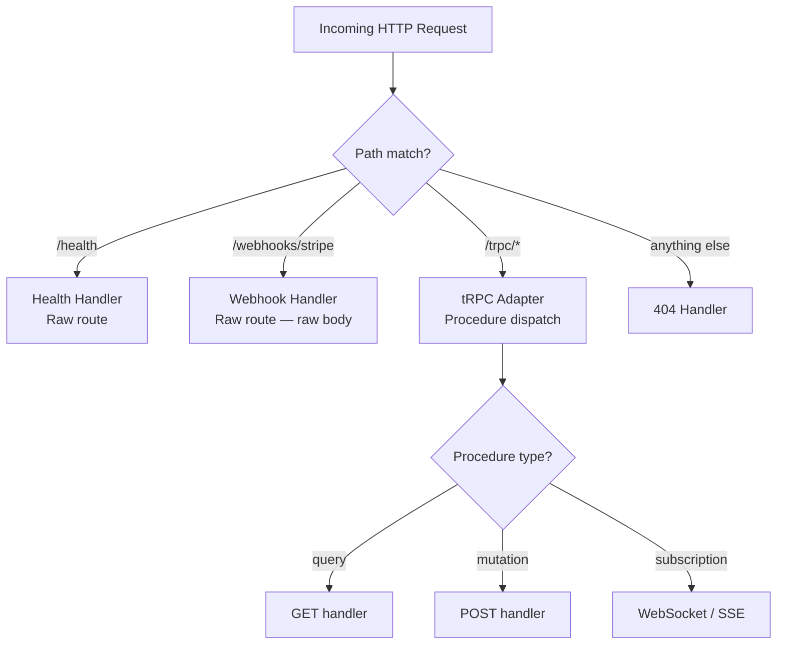

## Handling Raw HTTP Requests Alongside tRPC

tRPC adapters are designed to handle tRPC procedure calls, but real-world servers frequently need to serve non-tRPC routes on the same HTTP server — webhooks, health checks, file uploads, OAuth callbacks, REST endpoints for third-party compatibility, and more. This topic covers how to mount and route raw HTTP requests alongside tRPC across the major adapter types.

---

### Why This Arises

tRPC adapters intercept requests at a given path prefix (e.g., `/trpc`) and handle everything under it. Any route outside that prefix must be handled by the underlying HTTP server or a separate route handler. The challenge is that tRPC adapters vary in how much of the server lifecycle they own — some are pure middleware, others spin up their own server instance.

---

### Approach by Adapter Type

The strategy for coexisting raw routes depends heavily on which adapter is in use.

---

### Express Adapter

Express is the most straightforward case. The tRPC Express adapter is just middleware, mounted at a specific path. Express routes and other middleware registered before or after it coexist naturally.

```ts
import express from 'express';
import { createExpressMiddleware } from '@trpc/server/adapters/express';
import { appRouter } from './router';
import { createContext } from './context';

const app = express();

app.use(express.json());

// Raw route — health check
app.get('/health', (req, res) => {
  res.json({ status: 'ok', timestamp: Date.now() });
});

// Raw route — Stripe webhook (needs raw body, not parsed JSON)
app.post('/webhooks/stripe', express.raw({ type: 'application/json' }), (req, res) => {
  const sig = req.headers['stripe-signature'];
  // Verify and handle webhook...
  res.sendStatus(200);
});

// tRPC — handles everything under /trpc
app.use('/trpc', createExpressMiddleware({
  router: appRouter,
  createContext,
}));

// Raw route — catch-all 404 for non-tRPC routes
app.use((req, res) => {
  res.status(404).json({ error: 'Not found' });
});

app.listen(3000);
```

**Key Points**
- Route registration order matters in Express. Routes defined before `app.use('/trpc', ...)` are matched first.
- Webhook routes that require a raw (unparsed) body must be registered before `express.json()`, or use `express.raw()` scoped to that route specifically, as shown above. Parsing the body before Stripe signature verification will cause verification to fail.
- The tRPC middleware only intercepts requests whose path begins with `/trpc`. All other paths fall through to subsequent handlers.

---

### Fastify Adapter

Fastify uses a plugin model. tRPC is registered as a plugin under a prefix. Raw routes are registered as normal Fastify routes.

```ts
import Fastify from 'fastify';
import { fastifyTRPCPlugin } from '@trpc/server/adapters/fastify';
import { appRouter } from './router';
import { createContext } from './context';

const server = Fastify();

// Raw route — health check
server.get('/health', async (request, reply) => {
  return { status: 'ok', timestamp: Date.now() };
});

// Raw route — file upload
server.post('/upload', async (request, reply) => {
  // Handle multipart upload...
  return { uploaded: true };
});

// tRPC plugin — all procedures under /trpc
await server.register(fastifyTRPCPlugin, {
  prefix: '/trpc',
  trpcOptions: { router: appRouter, createContext },
});

await server.listen({ port: 3000 });
```

**Key Points**
- Fastify routes and tRPC plugin routes do not conflict as long as they use different path prefixes.
- Fastify's `prefix` option in `register()` is the mechanism for namespacing the tRPC plugin. [Inference: behavior may vary with nested plugin scoping]
- For file uploads, `@fastify/multipart` is typically added as a separate plugin before the route handler that needs it.

---

### Fetch Adapter (Edge Runtimes)

On edge runtimes (Cloudflare Workers, Vercel Edge Functions, Deno Deploy), the entry point is a single `fetch` function. All routing must be done manually before delegating to `fetchRequestHandler`.

```ts
import { fetchRequestHandler } from '@trpc/server/adapters/fetch';
import { appRouter } from './router';

export default {
  async fetch(request: Request): Promise<Response> {
    const url = new URL(request.url);

    // Raw route — health check
    if (url.pathname === '/health') {
      return Response.json({ status: 'ok', timestamp: Date.now() });
    }

    // Raw route — webhook
    if (url.pathname === '/webhooks/stripe' && request.method === 'POST') {
      const body = await request.text();
      const sig = request.headers.get('stripe-signature') ?? '';
      // Verify and handle...
      return new Response('OK', { status: 200 });
    }

    // tRPC — delegate all /trpc/* paths
    if (url.pathname.startsWith('/trpc')) {
      return fetchRequestHandler({
        endpoint: '/trpc',
        req: request,
        router: appRouter,
        createContext: () => ({}),
      });
    }

    // Fallback
    return new Response('Not Found', { status: 404 });
  },
};
```

**Key Points**
- The `fetch` handler is the sole entry point. There is no framework router, so pathname matching is done manually.
- The `request` body is a `ReadableStream` and can only be consumed once. For routes that need the raw body (e.g., webhook signature verification), read it before any other consumption. Do not pass the same `request` object to `fetchRequestHandler` after consuming its body.
- `fetchRequestHandler` should only receive requests whose path begins with the configured `endpoint`. Passing unrelated paths may produce unexpected behavior. [Inference]

---

### Standalone Adapter

`createHTTPServer` from `@trpc/server/adapters/standalone` creates a raw Node.js `http.Server`. It owns the entire request lifecycle and does not expose a router. Non-tRPC routes must be handled inside the `createContext` function or by intercepting before the adapter.

**Option A — Intercept with a wrapper server**

Wrap the tRPC handler with a plain Node.js HTTP server that routes manually:

```ts
import http from 'http';
import { createHTTPHandler } from '@trpc/server/adapters/standalone';
import { appRouter } from './router';
import { createContext } from './context';

const trpcHandler = createHTTPHandler({
  router: appRouter,
  createContext,
});

const server = http.createServer((req, res) => {
  const url = new URL(req.url ?? '/', `http://${req.headers.host}`);

  // Raw route — health check
  if (url.pathname === '/health') {
    res.writeHead(200, { 'Content-Type': 'application/json' });
    res.end(JSON.stringify({ status: 'ok' }));
    return;
  }

  // tRPC — delegate /trpc/* paths
  if (url.pathname.startsWith('/trpc')) {
    trpcHandler(req, res);
    return;
  }

  // Fallback
  res.writeHead(404, { 'Content-Type': 'application/json' });
  res.end(JSON.stringify({ error: 'Not found' }));
});

server.listen(3000);
```

**Key Points**
- `createHTTPHandler` returns a `(req, res) => void` function that can be called inside a manually created server. This is distinct from `createHTTPServer`, which creates and owns the server.
- This pattern gives full control over routing without requiring Express or Fastify.
- For anything beyond trivial routing, migrating to the Express adapter is generally preferable. [Inference]

**Option B — Use Express or Fastify instead**

For non-trivial mixed-route requirements, the standalone adapter is not well-suited. Switching to the Express or Fastify adapter is the practical recommendation when raw route handling becomes complex.

---

### Next.js App Router (Route Handler Adapter)

In Next.js with the App Router, tRPC is typically served from a catch-all route handler. Other routes are separate Next.js route handlers that coexist naturally via the file system.

**`app/trpc/[trpc]/route.ts`**

```ts
import { fetchRequestHandler } from '@trpc/server/adapters/fetch';
import { appRouter } from '@/server/router';
import { createContext } from '@/server/context';

const handler = (req: Request) =>
  fetchRequestHandler({
    endpoint: '/trpc',
    req,
    router: appRouter,
    createContext,
  });

export { handler as GET, handler as POST };
```

**`app/webhooks/stripe/route.ts`** (raw route, separate file)

```ts
import { headers } from 'next/headers';

export async function POST(req: Request) {
  const body = await req.text();
  const sig = headers().get('stripe-signature') ?? '';
  // Verify and handle...
  return new Response('OK', { status: 200 });
}
```

**Key Points**
- Next.js routes are isolated by the file system. There is no risk of tRPC intercepting requests meant for other route handlers.
- No manual routing logic is needed; the framework handles dispatch.
- The `app/trpc/[trpc]/route.ts` catch-all pattern captures any path segment under `/trpc/`. Ensure no other route files conflict with that prefix.

---

### Next.js Pages Router

With the Pages Router, tRPC is mounted via an API route with a catch-all slug.

**`pages/api/trpc/[trpc].ts`**

```ts
import { createNextApiHandler } from '@trpc/server/adapters/next';
import { appRouter } from '@/server/router';
import { createContext } from '@/server/context';

export default createNextApiHandler({
  router: appRouter,
  createContext,
});
```

**`pages/api/webhooks/stripe.ts`** (raw route, separate file)

```ts
import type { NextApiRequest, NextApiResponse } from 'next';

export const config = {
  api: { bodyParser: false }, // Required for raw body access
};

export default function handler(req: NextApiRequest, res: NextApiResponse) {
  // Read raw body manually and handle webhook
  res.status(200).end('OK');
}
```

**Key Points**
- `bodyParser: false` must be set via `export const config` for any Pages Router API route that requires access to the raw request body.
- tRPC's Next.js adapter handles its own body parsing internally. The `bodyParser` config applies per-route, not globally.

---

### Shared Patterns Across Adapters

#### Health and Readiness Endpoints

Health checks are the most universal raw route need. They should be:

- Framework-agnostic and lightweight
- Excluded from authentication middleware
- Responsive even if the database is unavailable (liveness vs. readiness distinction)

```ts
// Express example
app.get('/health/live', (_req, res) => res.sendStatus(200));

app.get('/health/ready', async (_req, res) => {
  try {
    await db.query('SELECT 1');
    res.json({ ready: true });
  } catch {
    res.status(503).json({ ready: false });
  }
});
```

#### Webhook Routes and Body Parsing

Webhooks from services like Stripe, GitHub, or Svix require access to the raw (unparsed) request body for HMAC signature verification. Parsed JSON bodies have different byte representations and will fail signature checks.

```ts
// Express — scope raw body parser to webhook route only
app.post(
  '/webhooks/stripe',
  express.raw({ type: 'application/json' }),
  (req, res) => {
    // req.body is a Buffer here
    const sig = req.headers['stripe-signature'];
    // ...
  }
);
```

When `express.json()` is applied globally, it parses the body before the webhook handler sees it. Scoping `express.raw()` to the webhook route avoids this by overriding the body parser for that specific path.

#### Authentication and Middleware Exemptions

Some raw routes (webhooks, public health checks) must bypass authentication middleware applied globally to tRPC routes. With Express, use path-conditional middleware:

```ts
// Apply auth only to /trpc routes
app.use('/trpc', authMiddleware, createExpressMiddleware({ ... }));

// Webhook — no auth applied
app.post('/webhooks/stripe', express.raw({ type: 'application/json' }), webhookHandler);
```

---

### Routing Architecture Diagram



---

### Considerations by Adapter

| Adapter | Raw Route Mechanism | Notes |
|---|---|---|
| Express | `app.get/post/use()` before or after tRPC middleware | Most flexible; natural middleware ordering |
| Fastify | `server.get/post()` alongside plugin registration | Plugin scoping applies |
| Fetch (edge) | Manual `if/switch` on `url.pathname` | No framework router; full manual control |
| Standalone | Wrap `createHTTPHandler` in a custom `http.createServer` | Limited; prefer Express for complex needs |
| Next.js App Router | Separate `route.ts` files | File system routing handles dispatch |
| Next.js Pages Router | Separate `pages/api/*.ts` files | `bodyParser: false` for raw body routes |

---

**Conclusion**

Handling raw HTTP requests alongside tRPC is supported across all adapter types, though the mechanism differs. Express and Fastify provide the most ergonomic path via middleware and plugin composition. Edge runtimes and the standalone adapter require manual routing logic. Next.js handles dispatch through its file system router, making coexistence natural but requiring explicit `bodyParser` configuration for webhook routes.

**Next Steps**
- tRPC with HTTP Adapters — custom middleware and request lifecycle hooks
- tRPC with HTTP Adapters — file uploads alongside tRPC routes