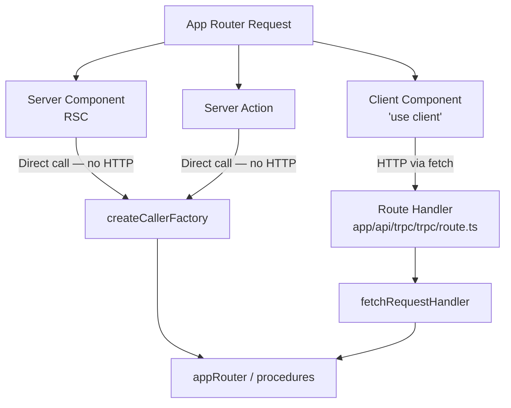

## App Router Integration

The Next.js App Router introduced React Server Components, a new rendering model, and a file-system routing convention that differs substantially from the Pages Router. tRPC's integration with the App Router requires a different mental model: the HTTP adapter handles client-to-server procedure calls, while server components and server actions introduce patterns where tRPC can be called directly without HTTP at all.

---

### How the App Router Changes the Integration Model

In the Pages Router, every data-fetching path went through `getServerSideProps` or a client hook. In the App Router:

- **React Server Components (RSC)** run exclusively on the server and can call tRPC procedures directly, bypassing HTTP.
- **Client Components** marked with `'use client'` behave like Pages Router components and use hooks over HTTP.
- **Server Actions** allow form submissions and mutations to execute on the server, also callable directly.
- **Route Handlers** (`route.ts`) replace API routes and serve as the HTTP endpoint for client-side tRPC calls.

A single application may use all of these patterns simultaneously.



---

### Installation

```bash
npm install @trpc/server @trpc/client @trpc/react-query @tanstack/react-query zod superjson
```

**Key Points**
- `@trpc/next` is not required for the App Router. The fetch adapter (`@trpc/server/adapters/fetch`) is used instead of the Next.js-specific adapter.
- `@trpc/react-query` provides client-side hooks for use in Client Components.
- `superjson` is optional but recommended for handling `Date`, `Map`, `Set`, `BigInt`, and other types that do not survive standard JSON serialization.

---

### Project Structure

```
src/
  server/
    trpc.ts              # initTRPC, base procedures, middleware
    context.ts           # createContext (for HTTP route handler)
    routers/
      post.ts
      user.ts
      _app.ts            # root appRouter + AppRouter type
  trpc/
    server.ts            # createCallerFactory — for RSC and server actions
    client.ts            # createTRPCProxyClient — for non-React client usage
    react.tsx            # createTRPCReact — hooks for Client Components
    query-client.ts      # shared QueryClient factory
    provider.tsx         # TRPCReactProvider — wraps client subtree
  app/
    api/
      trpc/
        [trpc]/
          route.ts       # Route Handler — HTTP endpoint
    layout.tsx           # Root layout — mounts TRPCReactProvider
    page.tsx             # Server Component
    posts/
      [id]/
        page.tsx
```

---

### Server Setup

#### `server/trpc.ts`

```ts
import { initTRPC, TRPCError } from '@trpc/server';
import { cache } from 'react';
import superjson from 'superjson';
import { type Context } from './context';

const t = initTRPC.context<Context>().create({
  transformer: superjson,
});

export const router = t.router;
export const publicProcedure = t.procedure;

export const protectedProcedure = t.procedure.use(({ ctx, next }) => {
  if (!ctx.session?.user) {
    throw new TRPCError({ code: 'UNAUTHORIZED' });
  }
  return next({ ctx: { ...ctx, user: ctx.session.user } });
});
```

#### `server/context.ts`

The context for the HTTP route handler receives a `Request` object (Fetch API), not `NextApiRequest`:

```ts
import { getServerSession } from 'next-auth';
import { authOptions } from '@/lib/auth';
import { prisma } from '@/lib/prisma';
import type { FetchCreateContextFnOptions } from '@trpc/server/adapters/fetch';

export async function createContext({ req }: FetchCreateContextFnOptions) {
  // Headers are available via the Request object
  const session = await getServerSession(authOptions);

  return {
    session,
    db: prisma,
    headers: Object.fromEntries(req.headers),
  };
}

export type Context = Awaited<ReturnType<typeof createContext>>;
```

**Key Points**
- `FetchCreateContextFnOptions` types the argument correctly for the fetch adapter.
- `getServerSession` in the App Router context behaves differently depending on whether it is called from a Route Handler vs. a Server Component. In Server Components, use `next-auth`'s `auth()` helper if using NextAuth v5, or the standard `getServerSession` with the appropriate import. [Inference — behavior depends on auth library version]
- If context is called from a server component directly (not via HTTP), there is no real `req`. The caller pattern uses a separate context factory (see below).

#### `server/routers/_app.ts`

```ts
import { router } from '../trpc';
import { postRouter } from './post';
import { userRouter } from './user';

export const appRouter = router({
  post: postRouter,
  user: userRouter,
});

export type AppRouter = typeof appRouter;
```

---

### Route Handler — HTTP Endpoint

#### `app/api/trpc/[trpc]/route.ts`

```ts
import { fetchRequestHandler } from '@trpc/server/adapters/fetch';
import { appRouter } from '@/server/routers/_app';
import { createContext } from '@/server/context';
import { type NextRequest } from 'next/server';

const handler = (req: NextRequest) =>
  fetchRequestHandler({
    endpoint: '/api/trpc',
    req,
    router: appRouter,
    createContext,
    onError:
      process.env.NODE_ENV === 'development'
        ? ({ path, error }) => {
            console.error(`tRPC error on ${path ?? 'unknown'}:`, error);
          }
        : undefined,
  });

export { handler as GET, handler as POST };
```

**Key Points**
- The filename is `route.ts` inside `app/api/trpc/[trpc]/`. The `[trpc]` segment is a dynamic catch-all that captures the procedure path.
- Both `GET` and `POST` are exported because tRPC queries use GET and mutations use POST by default (when not using `httpBatchLink` with POST-only mode).
- `NextRequest` extends the standard `Request` and is accepted by `fetchRequestHandler`.
- The `endpoint` must match the URL path at which the route handler is mounted: `/api/trpc`.

---

### Client-Side Setup (Client Components)

#### `trpc/query-client.ts` — Shared QueryClient Factory

```ts
import { QueryClient } from '@tanstack/react-query';
import superjson from 'superjson';

export function makeQueryClient() {
  return new QueryClient({
    defaultOptions: {
      queries: {
        staleTime: 30 * 1000,
      },
      dehydrate: {
        serializeData: superjson.serialize,
      },
      hydrate: {
        deserializeData: superjson.deserialize,
      },
    },
  });
}
```

**Key Points**
- The `dehydrate`/`hydrate` serializer configuration is needed in TanStack Query v5 when using `superjson` with the App Router's streaming SSR and prefetch pattern.
- A factory function (rather than a singleton) prevents the `QueryClient` from being shared across server-side requests.

#### `trpc/react.tsx` — React Hooks

```ts
import { createTRPCReact } from '@trpc/react-query';
import type { AppRouter } from '@/server/routers/_app';

export const trpc = createTRPCReact<AppRouter>();
```

#### `trpc/provider.tsx` — Client Provider

```tsx
'use client';

import { useState } from 'react';
import { QueryClient, QueryClientProvider } from '@tanstack/react-query';
import { httpBatchLink } from '@trpc/client';
import superjson from 'superjson';
import { trpc } from './react';
import { makeQueryClient } from './query-client';

let browserQueryClient: QueryClient | undefined;

function getQueryClient() {
  if (typeof window === 'undefined') {
    // Server — always make a new client
    return makeQueryClient();
  }
  // Browser — reuse singleton to preserve cache across navigations
  if (!browserQueryClient) browserQueryClient = makeQueryClient();
  return browserQueryClient;
}

export function TRPCReactProvider({ children }: { children: React.ReactNode }) {
  const queryClient = getQueryClient();

  const [trpcClient] = useState(() =>
    trpc.createClient({
      links: [
        httpBatchLink({
          transformer: superjson,
          url: `${getBaseUrl()}/api/trpc`,
          headers() {
            return {
              'x-trpc-source': 'react',
            };
          },
        }),
      ],
    })
  );

  return (
    <trpc.Provider client={trpcClient} queryClient={queryClient}>
      <QueryClientProvider client={queryClient}>
        {children}
      </QueryClientProvider>
    </trpc.Provider>
  );
}

function getBaseUrl() {
  if (typeof window !== 'undefined') return '';
  if (process.env.VERCEL_URL) return `https://${process.env.VERCEL_URL}`;
  return `http://localhost:${process.env.PORT ?? 3000}`;
}
```

**Key Points**
- `'use client'` is required. Providers that use React state or context cannot be Server Components.
- The browser singleton pattern (`browserQueryClient`) preserves the query cache across client-side navigations. Creating a new `QueryClient` on every render would lose cached data.
- `useState(() => trpc.createClient(...))` initializes the tRPC client once per component lifecycle, preventing recreation on re-renders.

#### `app/layout.tsx` — Root Layout

```tsx
import { TRPCReactProvider } from '@/trpc/provider';

export default function RootLayout({ children }: { children: React.ReactNode }) {
  return (
    <html lang="en">
      <body>
        <TRPCReactProvider>
          {children}
        </TRPCReactProvider>
      </body>
    </html>
  );
}
```

---

### Server Component Pattern — Direct Calls (No HTTP)

#### `trpc/server.ts` — Server-Side Caller

```ts
import { cache } from 'react';
import { createCallerFactory } from '@trpc/server';
import { appRouter } from '@/server/routers/_app';
import { createServerContext } from '@/server/context-server';

const createCaller = createCallerFactory(appRouter);

// cache() memoizes per request — the same context is reused
// across multiple tRPC calls within a single render pass
export const createServerClient = cache(async () => {
  const ctx = await createServerContext();
  return createCaller(ctx);
});
```

`context-server.ts` is a separate context factory for server component calls, where there is no incoming `Request` object:

```ts
import { auth } from '@/lib/auth'; // NextAuth v5 or equivalent
import { prisma } from '@/lib/prisma';

export async function createServerContext() {
  const session = await auth();
  return {
    session,
    db: prisma,
    headers: {},
  };
}
```

#### Using the Caller in a Server Component

```tsx
// app/posts/page.tsx — Server Component (no 'use client')
import { createServerClient } from '@/trpc/server';

export default async function PostsPage() {
  const trpc = await createServerClient();
  const posts = await trpc.post.list({ limit: 20 });

  return (
    <ul>
      {posts.map((post) => (
        <li key={post.id}>{post.title}</li>
      ))}
    </ul>
  );
}
```

**Key Points**
- No HTTP request is made. The procedure runs directly in the same Node.js process, in the same request scope.
- React's `cache()` function deduplications the context creation within a single render pass. Multiple Server Components calling `createServerClient()` in the same request will share one context instance. [Behavior may vary across React versions]
- All procedure middleware (auth checks, input validation) still runs. The caller is not a bypass — it is a different transport.
- Server Components are async by default. `await trpc.post.list(...)` works naturally.

---

### Prefetching in Server Components for Client Component Hydration

When a Client Component renders a `useQuery` hook, it normally shows a loading state before data arrives. To hydrate the cache server-side and eliminate that loading state, prefetch in a Server Component and dehydrate the cache:

#### `trpc/server.ts` — Add HydrationBoundary Helper

```tsx
import {
  dehydrate,
  HydrationBoundary,
  QueryClient,
} from '@tanstack/react-query';
import { createServerClient } from '@/trpc/server';
import { makeQueryClient } from '@/trpc/query-client';
import { PostList } from '@/components/PostList';

export default async function PostsPage() {
  const queryClient = makeQueryClient();
  const trpc = await createServerClient();

  // Prefetch into the server-side QueryClient
  await queryClient.prefetchQuery({
    queryKey: [['post', 'list'], { input: { limit: 20 }, type: 'query' }],
    queryFn: () => trpc.post.list({ limit: 20 }),
  });

  return (
    <HydrationBoundary state={dehydrate(queryClient)}>
      <PostList />
    </HydrationBoundary>
  );
}
```

**Key Points**
- `HydrationBoundary` from TanStack Query v5 transfers the dehydrated server cache to the client. The Client Component's `useQuery` call finds the data pre-populated and skips the loading state.
- The `queryKey` must match exactly what tRPC generates internally. tRPC's key format is `[procedurePath, { input, type }]`. Mismatched keys cause cache misses and the loading state reappears. [Inference — key format may vary across tRPC versions]
- An alternative to manual key construction is using tRPC's `createServerSideHelpers` if available for the App Router in the version in use. [Unverified for all v11 configurations]

---

### Client Component Pattern — Hooks

```tsx
'use client';

import { trpc } from '@/trpc/react';

export function PostList() {
  const { data, isLoading, error } = trpc.post.list.useQuery({ limit: 20 });

  const createPost = trpc.post.create.useMutation({
    onSuccess: async () => {
      await trpc.useUtils().post.list.invalidate();
    },
  });

  if (isLoading) return <p>Loading...</p>;
  if (error) return <p>Error: {error.message}</p>;

  return (
    <>
      <ul>
        {data?.map((post) => (
          <li key={post.id}>{post.title}</li>
        ))}
      </ul>
      <button
        onClick={() =>
          createPost.mutate({ title: 'New Post', content: 'Content here' })
        }
      >
        Create Post
      </button>
    </>
  );
}
```

**Key Points**
- Client Components using tRPC hooks behave identically to Pages Router components. The hooks are provided by `@trpc/react-query` and are transport-agnostic.
- `trpc.useUtils()` provides access to the query cache utilities. Call `.invalidate()` after mutations to refetch stale data.
- Mixing Server Component data (via direct caller) and Client Component data (via hooks) in the same page is valid and common.

---

### Server Actions with tRPC

Server Actions are async functions that run on the server, triggered from Client Components or forms. tRPC can be invoked directly inside them:

```ts
// app/actions/post.ts
'use server';

import { createServerClient } from '@/trpc/server';
import { revalidatePath } from 'next/cache';

export async function createPostAction(formData: FormData) {
  const trpc = await createServerClient();

  await trpc.post.create({
    title: formData.get('title') as string,
    content: formData.get('content') as string,
  });

  revalidatePath('/posts');
}
```

```tsx
// Client Component using the action
'use client';

import { createPostAction } from '@/app/actions/post';

export function CreatePostForm() {
  return (
    <form action={createPostAction}>
      <input name="title" placeholder="Title" />
      <textarea name="content" placeholder="Content" />
      <button type="submit">Create</button>
    </form>
  );
}
```

**Key Points**
- Server Actions are marked with `'use server'`. They run on the server regardless of where they are called.
- tRPC procedures called from Server Actions run directly without HTTP. Auth middleware still applies.
- `revalidatePath` invalidates Next.js's server-side route cache, causing the next navigation to that path to re-render with fresh data.
- Error handling in Server Actions requires either a try/catch inside the action or using the `useFormState` hook (Next.js 14+) to surface errors to the Client Component.

---

### Streaming and Suspense

The App Router supports React Suspense for streaming server-rendered content. Server Components that call tRPC can be wrapped in `<Suspense>` boundaries:

```tsx
import { Suspense } from 'react';
import { PostList } from './PostList';

export default function Page() {
  return (
    <Suspense fallback={<p>Loading posts…</p>}>
      <PostList />
    </Suspense>
  );
}
```

```tsx
// PostList.tsx — Server Component, async
import { createServerClient } from '@/trpc/server';

export async function PostList() {
  const trpc = await createServerClient();
  const posts = await trpc.post.list({ limit: 20 }); // Suspends until resolved

  return (
    <ul>
      {posts.map((post) => <li key={post.id}>{post.title}</li>)}
    </ul>
  );
}
```

**Key Points**
- An async Server Component that `await`s data will suspend the Suspense boundary above it, showing the fallback until the data resolves.
- Multiple sibling async Server Components in different Suspense boundaries can stream in parallel.
- tRPC subscriptions over WebSocket are not supported directly in Server Components — subscriptions require a client-side connection.

---

### Comparing the Two Patterns Side by Side

| Concern | Server Component (Direct) | Client Component (HTTP) |
|---|---|---|
| Transport | None — in-process call | HTTP via `httpBatchLink` |
| Render context | Server only | Client (with optional SSR) |
| Hooks available | No | Yes (`useQuery`, `useMutation`) |
| Reactivity / refetch | No — static per render | Yes — staleTime, polling, invalidation |
| Auth context | Via `createServerContext` | Via `createContext` in route handler |
| When to use | Initial page data, static content | Interactive UI, mutations, live data |

---

### Edge Runtime Compatibility

Route Handlers in the App Router can run on the Edge Runtime by adding:

```ts
export const runtime = 'edge';
```

tRPC's fetch adapter is fully compatible with the Edge Runtime. The server-side caller (`createCallerFactory`) also works on Edge as long as dependencies (e.g., Prisma) are Edge-compatible. Many database clients are not. [Inference — compatibility depends on specific dependency versions and runtime constraints]

---

### Common Mistakes

| Mistake | Effect | Resolution |
|---|---|---|
| Importing server-only modules into Client Components | Build error or runtime leak | Use `server-only` package in server modules; Next.js will throw on invalid imports |
| Using hooks in Server Components | Runtime error | Add `'use client'` or move to a Client Component |
| Missing `'use client'` on provider | Hydration mismatch or crash | Provider must be a Client Component |
| `getBaseUrl()` returning relative URL during SSR | `fetch` fails | Return absolute URL when `window` is undefined |
| Mismatched `transformer` on client and server | Serialization errors | Set `superjson` in both `initTRPC.create()` and `httpBatchLink` |
| Calling `createServerClient()` outside `cache()` | New context per call, session fetched repeatedly | Wrap in React `cache()` to deduplicate per request |
| Sharing a `QueryClient` singleton server-side | Data leaked between users | Use factory function; never share across requests |

---

**Conclusion**

The App Router integration is more layered than the Pages Router equivalent. Client Components follow the familiar hooks-over-HTTP pattern. Server Components and Server Actions call tRPC directly via `createCallerFactory`, bypassing HTTP entirely while still respecting middleware and input validation. The route handler serves as the HTTP boundary for client-side calls. Correctly separating server-only and client-only code, managing the `QueryClient` lifecycle, and understanding when each pattern applies are the core competencies for this integration.

**Next Steps**
- tRPC with Next.js — React Server Components and the `server-only` boundary
- tRPC with Next.js — authentication patterns across Server Components, Client Components, and Route Handlers