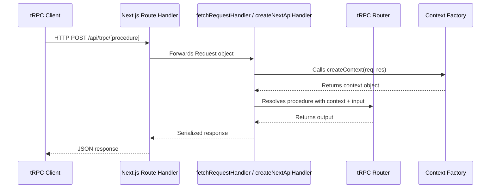

## tRPC with Next.js — API Route Handler Setup

### Overview

In Next.js, tRPC runs as a server-side API endpoint. The route handler acts as a bridge between incoming HTTP requests and your tRPC router, translating HTTP semantics into tRPC procedure calls. Setup differs between the **Pages Router** (`/pages/api/`) and the **App Router** (`/app/api/`).

---

### How the Handler Fits Into the Architecture



---

### Pages Router Setup

#### File Location

```
/pages/api/trpc/[trpc].ts
```

The `[trpc]` dynamic segment captures all procedure paths (e.g., `user.getById`, `post.create`).

#### Installation

```bash
npm install @trpc/server @trpc/client @trpc/react-query @tanstack/react-query
```

#### Creating the Handler

```ts
// pages/api/trpc/[trpc].ts
import { createNextApiHandler } from '@trpc/server/adapters/next';
import { appRouter } from '@/server/routers/_app';
import { createTRPCContext } from '@/server/trpc';

export default createNextApiHandler({
  router: appRouter,
  createContext: createTRPCContext,
  onError:
    process.env.NODE_ENV === 'development'
      ? ({ path, error }) => {
          console.error(`tRPC error on ${path ?? '<no-path>'}:`, error);
        }
      : undefined,
});
```

**Key Points**
- `router` — your root `AppRouter` instance
- `createContext` — factory that builds the per-request context (auth session, db client, etc.)
- `onError` — optional error hook; restricting it to development avoids leaking stack traces in production

---

### App Router Setup

The App Router uses the Web Fetch API (`Request`/`Response`) rather than Node.js `IncomingMessage`/`ServerResponse`. Use `fetchRequestHandler` instead of `createNextApiHandler`.

#### File Location

```
/app/api/trpc/[trpc]/route.ts
```

#### Creating the Handler

```ts
// app/api/trpc/[trpc]/route.ts
import { fetchRequestHandler } from '@trpc/server/adapters/fetch';
import { appRouter } from '@/server/routers/_app';
import { createTRPCContext } from '@/server/trpc';
import type { NextRequest } from 'next/server';

const handler = (req: NextRequest) =>
  fetchRequestHandler({
    endpoint: '/api/trpc',
    req,
    router: appRouter,
    createContext: ({ req }) => createTRPCContext({ req }),
    onError:
      process.env.NODE_ENV === 'development'
        ? ({ path, error }) => {
            console.error(`tRPC error on ${path ?? '<no-path>'}:`, error);
          }
        : undefined,
  });

export { handler as GET, handler as POST };
```

**Key Points**
- Both `GET` and `POST` must be exported — queries use `GET`, mutations use `POST`
- `endpoint` must match the route prefix exactly (e.g., `/api/trpc`)
- `req` here is a `NextRequest`, which is a superset of the standard `Request`

---

### The Context Factory

The context is created fresh on every request. It is the standard place to attach the database client, authenticated session, or any other request-scoped dependency.

#### Pages Router Context

```ts
// server/trpc.ts
import { initTRPC } from '@trpc/server';
import type { CreateNextContextOptions } from '@trpc/server/adapters/next';
import { getServerSession } from 'next-auth';
import { db } from '@/lib/db';

export const createTRPCContext = async (opts: CreateNextContextOptions) => {
  const session = await getServerSession(opts.req, opts.res, authOptions);
  return {
    db,
    session,
    req: opts.req,
    res: opts.res,
  };
};

export type Context = Awaited<ReturnType<typeof createTRPCContext>>;

const t = initTRPC.context<Context>().create();

export const router = t.router;
export const publicProcedure = t.procedure;
```

#### App Router Context

```ts
// server/trpc.ts
import { initTRPC } from '@trpc/server';
import type { FetchCreateContextFnOptions } from '@trpc/server/adapters/fetch';
import { db } from '@/lib/db';

export const createTRPCContext = async (opts: FetchCreateContextFnOptions) => {
  const session = await getSessionFromRequest(opts.req);
  return {
    db,
    session,
    req: opts.req,
  };
};

export type Context = Awaited<ReturnType<typeof createTRPCContext>>;

const t = initTRPC.context<Context>().create();

export const router = t.router;
export const publicProcedure = t.procedure;
```

**Key Points**
- `CreateNextContextOptions` (Pages) gives you `req: IncomingMessage` and `res: ServerResponse`
- `FetchCreateContextFnOptions` (App Router) gives you `req: Request` — no `res` object exists in this model
- Keep the context factory `async` even if it is currently synchronous, to allow adding async dependencies (e.g., session lookups) later without changing the signature

---

### Minimal Root Router

```ts
// server/routers/_app.ts
import { router } from '@/server/trpc';
import { userRouter } from './user';
import { postRouter } from './post';

export const appRouter = router({
  user: userRouter,
  post: postRouter,
});

export type AppRouter = typeof appRouter;
```

`AppRouter` is exported as a **type only** — it is never imported on the client at runtime. This is what enables end-to-end type safety without shipping server code to the browser.

---

### Configuration Options Reference

| Option | Type | Required | Description |
|---|---|---|---|
| `router` | `AnyRouter` | ✅ | The root tRPC router |
| `createContext` | `function` | ✅ | Per-request context factory |
| `onError` | `function` | ❌ | Called when a procedure throws |
| `batching.enabled` | `boolean` | ❌ | Enable/disable request batching (default: `true`) |
| `responseMeta` | `function` | ❌ | Customize HTTP response headers/status codes |

---

### Disabling Batching

By default, tRPC batches multiple procedure calls into a single HTTP request. This can be disabled if it conflicts with middleware or caching strategies.

```ts
// Pages Router
export default createNextApiHandler({
  router: appRouter,
  createContext: createTRPCContext,
  batching: {
    enabled: false,
  },
});
```

```ts
// App Router
const handler = (req: NextRequest) =>
  fetchRequestHandler({
    endpoint: '/api/trpc',
    req,
    router: appRouter,
    createContext: ({ req }) => createTRPCContext({ req }),
    batching: {
      enabled: false,
    },
  });
```

> [Inference] Disabling batching may increase the number of round-trips from the client but can simplify debugging and improve compatibility with per-route caching in the App Router. Actual performance impact will vary by application.

---

### Custom Response Headers with `responseMeta`

`responseMeta` allows setting HTTP cache headers or custom status codes based on the procedure result.

```ts
export default createNextApiHandler({
  router: appRouter,
  createContext: createTRPCContext,
  responseMeta({ ctx, paths, type, errors }) {
    const allPublic = paths?.every((path) => path.startsWith('public.'));
    const allOk = errors.length === 0;
    const isQuery = type === 'query';

    if (allPublic && allOk && isQuery) {
      return {
        headers: {
          'cache-control': 's-maxage=60, stale-while-revalidate=300',
        },
      };
    }
    return {};
  },
});
```

**Key Points**
- `paths` is an array of the procedure paths in the current batch
- `type` is `'query'`, `'mutation'`, or `'subscription'`
- `errors` contains any `TRPCError` instances thrown during the request
- Returning an empty object `{}` applies no custom headers

---

### Common Setup Errors

#### `Cannot find module '@trpc/server/adapters/next'`

Caused by importing the wrong adapter for the router type, or using an outdated version of `@trpc/server` (v9 or below uses a different import path).

```ts
// ✅ Correct for Pages Router
import { createNextApiHandler } from '@trpc/server/adapters/next';

// ✅ Correct for App Router
import { fetchRequestHandler } from '@trpc/server/adapters/fetch';
```

#### `Method Not Allowed` on mutations

Occurs in the App Router when only `GET` is exported. Mutations are sent as `POST` requests — both exports are required.

```ts
// ✅ Both must be exported
export { handler as GET, handler as POST };
```

#### Context type mismatch

Using `CreateNextContextOptions` in an App Router handler (or vice versa) causes a type error and may cause runtime failures. Match the context type to the adapter being used.

---

### Verification

After setup, you can verify the handler is reachable by navigating directly to:

```
http://localhost:3000/api/trpc/[procedureName]
```

For a query procedure with no input, this will return a JSON response. For a procedure that requires input or authentication, it will return a tRPC error object — which still confirms the handler is wired correctly.

**Example** response for a missing input:

```json
{
  "error": {
    "message": "...",
    "code": -32600,
    "data": {
      "code": "BAD_REQUEST",
      "httpStatus": 400,
      "path": "user.getById"
    }
  }
}
```

---

**Next Steps**
- Set up the tRPC client and `TRPCReactProvider` in the Next.js app
- Implement protected procedures using middleware in the context
- Configure `superjson` as a transformer for richer data type support (Date, Map, Set, etc.)