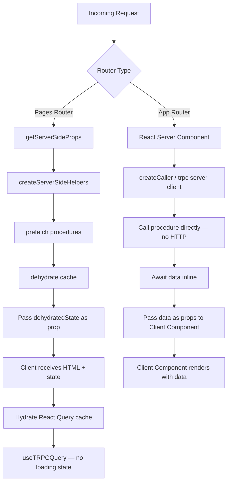

## Server-Side Rendering with tRPC

### Overview

tRPC integrates with Next.js SSR through two distinct patterns depending on the router in use. In the **Pages Router**, a server-side helpers object prefetches data during `getServerSideProps` or `getStaticProps`, dehydrating the query cache for client hydration. In the **App Router**, React Server Components can call tRPC procedures directly via a server-side caller, bypassing HTTP entirely.

Both approaches aim to deliver pre-populated HTML to the client while maintaining full type safety.

---

### How SSR Data Flow Works



---

### Pages Router SSR

#### `createServerSideHelpers`

`createServerSideHelpers` creates a prefetch-capable caller that populates a React Query cache on the server. The cache is then serialized and sent to the client as `dehydratedState`, where it is rehydrated so that `useQuery` hooks return data immediately without a loading phase.

```bash
npm install @trpc/react-query @tanstack/react-query superjson
```

```ts
// utils/ssgHelpers.ts
import { createServerSideHelpers } from '@trpc/react-query/server';
import { appRouter } from '@/server/routers/_app';
import { createTRPCContext } from '@/server/trpc';
import superjson from 'superjson';

export const createSSGHelpers = async () =>
  createServerSideHelpers({
    router: appRouter,
    ctx: await createTRPCContext(),   // context without req/res for static-style calls
    transformer: superjson,
  });
```

**Key Points**
- `transformer` must match the transformer configured in your tRPC router initialization — mismatches cause silent deserialization errors
- The context passed here has no `req`/`res` since the call is server-internal; adjust your `createTRPCContext` to make these optional if needed

---

#### `getServerSideProps` Pattern

```ts
// pages/posts/[id].tsx
import type { GetServerSideProps, InferGetServerSidePropsType } from 'next';
import { createSSGHelpers } from '@/utils/ssgHelpers';
import { trpc } from '@/utils/trpc';
import superjson from 'superjson';

export const getServerSideProps: GetServerSideProps = async (ctx) => {
  const ssg = await createSSGHelpers();
  const id = ctx.params?.id as string;

  // Prefetch populates the server-side React Query cache
  await ssg.post.getById.prefetch({ id });

  return {
    props: {
      trpcState: ssg.dehydrate(),
      id,
    },
  };
};

export default function PostPage({
  id,
}: InferGetServerSidePropsType<typeof getServerSideProps>) {
  // Returns data immediately — no loading state, no additional HTTP request
  const { data } = trpc.post.getById.useQuery({ id });

  return <div>{data?.title}</div>;
}
```

**Key Points**
- `prefetch` fetches and stores the result; `fetch` does the same but also returns the data — use `prefetch` when you only need the client to have it
- `ssg.dehydrate()` serializes the cache; it must be passed as `trpcState` (or the key your `_app.tsx` reads from)
- The client hook still needs to be called with matching input — tRPC uses the procedure path + serialized input as the cache key

---

#### `getStaticProps` Pattern

The same helpers work for `getStaticProps`, enabling statically generated pages with pre-populated tRPC data.

```ts
// pages/posts/[id].tsx
import type { GetStaticPaths, GetStaticProps } from 'next';
import { createSSGHelpers } from '@/utils/ssgHelpers';
import superjson from 'superjson';

export const getStaticPaths: GetStaticPaths = async () => {
  return {
    paths: [],        // define known paths or leave empty for on-demand ISR
    fallback: 'blocking',
  };
};

export const getStaticProps: GetStaticProps = async (ctx) => {
  const ssg = await createSSGHelpers();
  const id = ctx.params?.id as string;

  await ssg.post.getById.prefetch({ id });

  return {
    props: {
      trpcState: ssg.dehydrate(),
      id,
    },
    revalidate: 60,   // ISR: regenerate after 60 seconds
  };
};
```

> [Inference] `getStaticProps` with `revalidate` (ISR) gives you the performance benefits of static generation while keeping data reasonably fresh. The tRPC cache is baked into the static HTML at generation time, so the client receives it without any additional requests on first load.

---

#### Wiring `trpcState` in `_app.tsx`

The `dehydratedState` must be provided to React Query's `Hydrate` (or `HydrationBoundary` in newer versions) component at the app level.

```tsx
// pages/_app.tsx
import type { AppProps } from 'next/app';
import { trpc } from '@/utils/trpc';
import { HydrationBoundary, QueryClient, QueryClientProvider } from '@tanstack/react-query';
import { useState } from 'react';

function MyApp({ Component, pageProps }: AppProps) {
  const [queryClient] = useState(() => new QueryClient());

  return (
    <QueryClientProvider client={queryClient}>
      <HydrationBoundary state={pageProps.trpcState}>
        <Component {...pageProps} />
      </HydrationBoundary>
    </QueryClientProvider>
  );
}

export default trpc.withTRPC(MyApp);
```

**Key Points**
- `HydrationBoundary` (formerly `Hydrate`) rehydrates the serialized cache into the active `QueryClient`
- `trpc.withTRPC` wraps the app with the tRPC provider — it is generated by `createTRPCNext` in your client setup
- If `pageProps.trpcState` is `undefined` (pages that do not prefetch), `HydrationBoundary` is a no-op

---

### App Router SSR

The App Router introduces React Server Components (RSC), which run exclusively on the server. tRPC procedures can be called directly from RSCs using a **server-side caller**, with no HTTP round-trip involved.

#### Creating a Server-Side Caller

```ts
// server/caller.ts
import { createCallerFactory } from '@trpc/server';
import { appRouter } from '@/server/routers/_app';
import { createTRPCContext } from '@/server/trpc';

const createCaller = createCallerFactory(appRouter);

export const createServerCaller = async () => {
  const ctx = await createTRPCContext();
  return createCaller(ctx);
};
```

#### Calling Procedures in a Server Component

```tsx
// app/posts/[id]/page.tsx
import { createServerCaller } from '@/server/caller';

interface Props {
  params: { id: string };
}

export default async function PostPage({ params }: Props) {
  const caller = await createServerCaller();

  // Direct procedure call — no HTTP, full type safety
  const post = await caller.post.getById({ id: params.id });

  return (
    <article>
      <h1>{post.title}</h1>
      <p>{post.body}</p>
    </article>
  );
}
```

**Key Points**
- This is a plain `async` function call — no React Query, no client hooks involved
- Errors thrown by the procedure propagate as normal JavaScript exceptions; Next.js error boundaries apply
- The caller shares the same middleware and validation stack as the HTTP handler — behavior should be consistent, though environment differences may exist [Inference]

---

#### Prefetch + Hydration Pattern in the App Router

When Client Components also need access to the same data (e.g., for mutations or reactive updates), you can combine the RSC caller with React Query's `HydrationBoundary` to prefetch on the server and hydrate on the client.

```tsx
// app/posts/[id]/page.tsx  (Server Component)
import {
  dehydrate,
  HydrationBoundary,
  QueryClient,
} from '@tanstack/react-query';
import { createServerCaller } from '@/server/caller';
import PostClient from './PostClient';

export default async function PostPage({ params }: { params: { id: string } }) {
  const queryClient = new QueryClient();
  const caller = await createServerCaller();

  await queryClient.prefetchQuery({
    queryKey: [['post', 'getById'], { input: { id: params.id }, type: 'query' }],
    queryFn: () => caller.post.getById({ id: params.id }),
  });

  return (
    <HydrationBoundary state={dehydrate(queryClient)}>
      <PostClient id={params.id} />
    </HydrationBoundary>
  );
}
```

```tsx
// app/posts/[id]/PostClient.tsx  (Client Component)
'use client';
import { trpc } from '@/utils/trpc';

export default function PostClient({ id }: { id: string }) {
  const { data } = trpc.post.getById.useQuery({ id });

  return <div>{data?.title}</div>;
}
```

> [Inference] Manually constructing the query key (`[['post', 'getById'], { input, type }]`) is fragile — the key format is an internal tRPC implementation detail and may vary across versions. Prefer the `createServerSideHelpers`-based approach when using the Pages Router, and verify key structure against your installed version of `@trpc/react-query` if using the App Router pattern above.

---

#### Using `trpcServer` Utilities (if available)

Some tRPC + Next.js setups expose a `createTRPCNextLayout` or equivalent helper for the App Router that manages the prefetch/hydration wiring automatically. As of tRPC v11, the recommended pattern for the App Router is the direct caller approach shown above. [Unverified — check the tRPC changelog for your installed version.]

---

### Comparing SSR Approaches

| Concern | Pages Router (`createServerSideHelpers`) | App Router (direct caller) |
|---|---|---|
| Data fetching location | `getServerSideProps` / `getStaticProps` | RSC `async` component body |
| HTTP round-trip | None (server-internal) | None (server-internal) |
| React Query cache hydration | Via `dehydrate` + `HydrationBoundary` | Optional, manual |
| Client hook compatibility | ✅ Seamless — same cache key | Requires manual query key alignment |
| Auth/session access | Via context factory | Via context factory |
| ISR support | ✅ `getStaticProps` + `revalidate` | Via `fetch` cache options in Next.js |
| Streaming / Suspense | ❌ Not supported | ✅ Native with RSC |

---

### Context Factory Considerations for SSR

When called from SSR contexts (no live `req`/`res`), your context factory may need to handle the absence of request objects gracefully.

```ts
// server/trpc.ts
import type { CreateNextContextOptions } from '@trpc/server/adapters/next';

export const createTRPCContext = async (opts?: Partial<CreateNextContextOptions>) => {
  const session = opts?.req
    ? await getServerSession(opts.req, opts.res!, authOptions)
    : null;   // SSG/ISR: no session available

  return {
    db,
    session,
  };
};
```

**Key Points**
- Static generation contexts (`getStaticProps`, ISR) have no authenticated session by nature — treat session-dependent data as unavailable and prefetch only public data
- `getServerSideProps` does have access to cookies and headers, so session retrieval is viable there
- In the App Router, use `cookies()` or `headers()` from `next/headers` inside your context factory instead of relying on a `req` object

```ts
// server/trpc.ts  (App Router context)
import { cookies } from 'next/headers';
import { getServerSession } from 'next-auth';

export const createTRPCContext = async () => {
  const session = await getServerSession(authOptions);
  return {
    db,
    session,
  };
};
```

---

### Error Handling During SSR

Unhandled procedure errors during SSR will propagate to the page level. In `getServerSideProps`, you can intercept them to return a `notFound` or `redirect` response.

```ts
export const getServerSideProps: GetServerSideProps = async (ctx) => {
  const ssg = await createSSGHelpers();

  try {
    await ssg.post.getById.prefetch({ id: ctx.params?.id as string });
  } catch (err) {
    // TRPCError with code NOT_FOUND maps naturally to a 404
    return { notFound: true };
  }

  return {
    props: { trpcState: ssg.dehydrate(), id: ctx.params?.id },
  };
};
```

In RSCs, throwing from a procedure call triggers the nearest `error.tsx` boundary in the App Router.

---

### Caveats and Known Pitfalls

**Transformer consistency** — If `superjson` (or another transformer) is configured in the tRPC router, it must also be passed to `createServerSideHelpers`. Omitting it causes dates and other non-JSON types to be serialized incorrectly. Behavior may vary.

**Stale `dehydratedState` in ISR** — With `getStaticProps` + `revalidate`, the dehydrated state is baked in at build/regeneration time. If the underlying data changes between regenerations, users may briefly see stale data on the client. This is expected ISR behavior, not a tRPC-specific issue.

**Double data fetching** — If a Client Component calls `useQuery` with a key that was not prefetched on the server, it triggers a fresh client-side fetch. This is not an error but may produce a loading flash. Align prefetch keys with hook inputs to prevent it.

**RSC and client hooks are mutually exclusive** — You cannot call `trpc.post.getById.useQuery()` inside an RSC. The hook is client-only. Ensure the `'use client'` directive is present on any component using tRPC hooks.

---

**Next Steps**
- Configure `superjson` as the shared transformer across router, client, and SSG helpers
- Implement protected SSR routes that redirect unauthenticated users based on session in context
- Explore React Query's `prefetchInfiniteQuery` for paginated SSR data