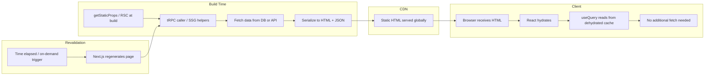
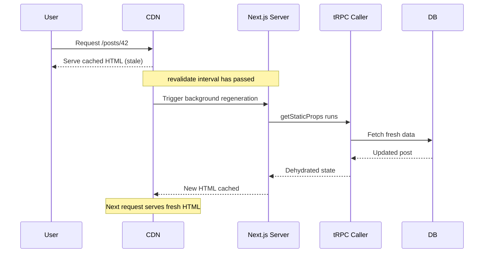

## Static Generation and tRPC

### Overview

Static generation pre-renders pages at build time, producing HTML that can be served from a CDN without per-request server computation. tRPC integrates with static generation through the same `createServerSideHelpers` mechanism used for SSR, but with distinct constraints: there is no authenticated session, no live request object, and data is fixed at the moment of generation until revalidation occurs.

In the App Router, static generation is governed by route segment configuration and React Server Component behavior rather than explicit data-fetching functions.

---

### How Static Generation Differs from SSR



**Key Points**
- tRPC procedures run at build time inside the Next.js build process, not in a running server
- The database or upstream API must be reachable from the build environment
- There is no `req`/`res` — session-based or user-specific data is unavailable by design

---

### Pages Router — `getStaticProps`

#### Basic Setup

```ts
// pages/posts/[id].tsx
import type { GetStaticPaths, GetStaticProps, InferGetStaticPropsType } from 'next';
import { createServerSideHelpers } from '@trpc/react-query/server';
import { appRouter } from '@/server/routers/_app';
import { createTRPCContext } from '@/server/trpc';
import { trpc } from '@/utils/trpc';
import superjson from 'superjson';

export const getStaticPaths: GetStaticPaths = async () => {
  return {
    paths: [],
    fallback: 'blocking',
  };
};

export const getStaticProps: GetStaticProps = async (ctx) => {
  const helpers = createServerSideHelpers({
    router: appRouter,
    ctx: await createTRPCContext(),
    transformer: superjson,
  });

  const id = ctx.params?.id as string;

  await helpers.post.getById.prefetch({ id });

  return {
    props: {
      trpcState: helpers.dehydrate(),
      id,
    },
    revalidate: 60,
  };
};

export default function PostPage({
  id,
}: InferGetStaticPropsType<typeof getStaticProps>) {
  const { data } = trpc.post.getById.useQuery({ id });

  return (
    <article>
      <h1>{data?.title}</h1>
      <p>{data?.body}</p>
    </article>
  );
}
```

**Key Points**
- `revalidate` enables ISR — the page regenerates in the background after the specified number of seconds
- `fallback: 'blocking'` causes Next.js to SSR the page on first request for unknown paths, then cache it statically — `'true'` serves a shell immediately and fills in data client-side, `false` returns 404 for unknown paths
- The `id` prop is passed separately because the dehydrated tRPC state does not expose the input directly to page components

---

### Context Factory for Static Contexts

Static generation has no live request, so the context factory must not depend on `req` or `res`. A common pattern is to make request-scoped fields optional.

```ts
// server/trpc.ts
import { initTRPC } from '@trpc/server';
import type { CreateNextContextOptions } from '@trpc/server/adapters/next';
import { db } from '@/lib/db';

type ContextOptions = Partial<CreateNextContextOptions>;

export const createTRPCContext = async (opts?: ContextOptions) => {
  return {
    db,
    // No session in static context — explicitly null
    session: null,
    req: opts?.req ?? null,
    res: opts?.res ?? null,
  };
};

export type Context = Awaited<ReturnType<typeof createTRPCContext>>;
```

Any procedure that checks `ctx.session` in middleware must handle `null` gracefully — protected procedures should not be called during static generation. Calling a protected procedure at build time will throw, failing the build if the error is not caught. Behavior may vary depending on how middleware is structured.

---

### Prefetching Multiple Procedures

`getStaticProps` can prefetch several procedures in parallel. All results are merged into a single dehydrated state.

```ts
export const getStaticProps: GetStaticProps = async (ctx) => {
  const helpers = createServerSideHelpers({
    router: appRouter,
    ctx: await createTRPCContext(),
    transformer: superjson,
  });

  const id = ctx.params?.id as string;

  // Run in parallel — independent procedures
  await Promise.all([
    helpers.post.getById.prefetch({ id }),
    helpers.post.getRelated.prefetch({ id, limit: 5 }),
    helpers.author.getByPostId.prefetch({ postId: id }),
  ]);

  return {
    props: {
      trpcState: helpers.dehydrate(),
      id,
    },
    revalidate: 120,
  };
};
```

> [Inference] Running prefetches in parallel with `Promise.all` reduces build time for pages with multiple data dependencies, provided the underlying data sources can handle concurrent queries. Sequential calls are safer when procedures have dependencies on each other's results.

---

### `getStaticPaths` with tRPC

`getStaticPaths` defines which dynamic paths are pre-rendered at build time. You can call a tRPC procedure directly here using a plain server caller rather than the SSG helpers, since no cache hydration is needed.

```ts
// pages/posts/[id].tsx
import { createCallerFactory } from '@trpc/server';
import { appRouter } from '@/server/routers/_app';
import { createTRPCContext } from '@/server/trpc';

export const getStaticPaths: GetStaticPaths = async () => {
  const createCaller = createCallerFactory(appRouter);
  const caller = createCaller(await createTRPCContext());

  // Fetch all post IDs to pre-render
  const posts = await caller.post.listIds();

  return {
    paths: posts.map((id) => ({ params: { id } })),
    fallback: 'blocking',
  };
};
```

**Key Points**
- Using a direct caller here avoids the overhead of the SSG helpers — no cache to dehydrate, just a plain procedure call
- `createCallerFactory` is the v11 API; earlier versions use `appRouter.createCaller(ctx)` directly
- For large datasets, consider returning only a subset of paths and relying on `fallback: 'blocking'` to handle the rest on demand

---

### Incremental Static Regeneration (ISR)

ISR regenerates static pages in the background after a `revalidate` interval expires. From tRPC's perspective, ISR regeneration is identical to the initial static generation — `getStaticProps` runs again, helpers prefetch fresh data, and a new dehydrated state is produced.



**Key Points**
- The user who triggers regeneration still receives the stale page — the next visitor gets the updated version
- `revalidate: false` disables ISR entirely, making the page permanently static until the next full build
- Setting `revalidate: 1` approximates near-real-time updates but increases server load — use with awareness of your data source's capacity

---

### On-Demand Revalidation

Next.js supports triggering revalidation programmatically via `res.revalidate()` (Pages Router) or `revalidatePath`/`revalidateTag` (App Router), which can be called from a tRPC mutation.

#### Pages Router — Revalidation Endpoint

```ts
// pages/api/revalidate.ts
import type { NextApiRequest, NextApiResponse } from 'next';

export default async function handler(req: NextApiRequest, res: NextApiResponse) {
  if (req.query.secret !== process.env.REVALIDATION_SECRET) {
    return res.status(401).json({ message: 'Invalid token' });
  }

  const path = req.query.path as string;

  try {
    await res.revalidate(path);
    return res.json({ revalidated: true });
  } catch {
    return res.status(500).json({ message: 'Revalidation failed' });
  }
}
```

#### App Router — `revalidatePath` Inside a tRPC Mutation

```ts
// server/routers/post.ts
import { revalidatePath } from 'next/cache';
import { protectedProcedure, router } from '@/server/trpc';
import { z } from 'zod';

export const postRouter = router({
  update: protectedProcedure
    .input(z.object({ id: z.string(), title: z.string(), body: z.string() }))
    .mutation(async ({ ctx, input }) => {
      const post = await ctx.db.post.update({
        where: { id: input.id },
        data: { title: input.title, body: input.body },
      });

      // Invalidate the static page for this post
      revalidatePath(`/posts/${input.id}`);

      return post;
    }),
});
```

> [Inference] `revalidatePath` and `revalidateTag` are Next.js App Router APIs and may not behave as expected if called outside of an App Router context (e.g., from a Pages Router API route). Verify compatibility with your Next.js version.

---

### App Router Static Generation

In the App Router, static generation is the default behavior for routes that do not use dynamic data sources. React Server Components fetch data at build time automatically unless dynamic behavior is detected.

#### Default Static Behavior

```tsx
// app/posts/[id]/page.tsx  (statically generated by default)
import { createCallerFactory } from '@trpc/server';
import { appRouter } from '@/server/routers/_app';
import { createTRPCContext } from '@/server/trpc';

const createCaller = createCallerFactory(appRouter);

export default async function PostPage({ params }: { params: { id: string } }) {
  const caller = createCaller(await createTRPCContext());
  const post = await caller.post.getById({ id: params.id });

  return (
    <article>
      <h1>{post.title}</h1>
      <p>{post.body}</p>
    </article>
  );
}
```

#### `generateStaticParams`

The App Router equivalent of `getStaticPaths`:

```ts
// app/posts/[id]/page.tsx
import { createCallerFactory } from '@trpc/server';
import { appRouter } from '@/server/routers/_app';
import { createTRPCContext } from '@/server/trpc';

const createCaller = createCallerFactory(appRouter);

export async function generateStaticParams() {
  const caller = createCaller(await createTRPCContext());
  const ids = await caller.post.listIds();

  return ids.map((id) => ({ id }));
}
```

#### Forcing Static Behavior

If Next.js detects dynamic APIs (e.g., `cookies()`, `headers()`), it opts the route out of static generation. Use route segment config to override this.

```ts
// app/posts/[id]/page.tsx
export const dynamic = 'force-static';
export const revalidate = 60;
```

> [Inference] Using `force-static` while your tRPC context factory calls `cookies()` or `headers()` may cause those calls to return empty values at build time. Audit your context factory for dynamic API usage before forcing static behavior.

---

### Revalidation Intervals — App Router

```ts
// Revalidate every 5 minutes
export const revalidate = 300;

// Never revalidate (permanently static)
export const revalidate = false;

// Always revalidate (equivalent to SSR)
export const dynamic = 'force-dynamic';
```

These exports go at the top of the route file (page, layout, or route handler) and apply to the entire segment.

---

### Handling Missing or Invalid Paths

When a statically generated path does not exist or the procedure returns no data, return `notFound: true` to render the 404 page.

```ts
// Pages Router
export const getStaticProps: GetStaticProps = async (ctx) => {
  const helpers = createServerSideHelpers({
    router: appRouter,
    ctx: await createTRPCContext(),
    transformer: superjson,
  });

  const id = ctx.params?.id as string;

  try {
    await helpers.post.getById.prefetch({ id });
  } catch {
    return { notFound: true };
  }

  return {
    props: { trpcState: helpers.dehydrate(), id },
    revalidate: 60,
  };
};
```

```tsx
// App Router
import { notFound } from 'next/navigation';

export default async function PostPage({ params }: { params: { id: string } }) {
  const caller = createCaller(await createTRPCContext());

  let post;
  try {
    post = await caller.post.getById({ id: params.id });
  } catch {
    notFound();
  }

  return <article>{post?.title}</article>;
}
```

---

### Static Generation Constraints Summary

| Constraint | Detail |
|---|---|
| No authenticated session | Context has no `req`/cookies — call public procedures only |
| Build environment connectivity | DB / upstream API must be reachable during `next build` |
| No per-user data | Generated HTML is shared across all users |
| Stale data window | Data reflects the state at generation time, not request time |
| Protected procedures | Calling them at build time will throw unless guarded explicitly |
| Transformer alignment | `superjson` (or other) must match across router and helpers |

---

### Distinguishing Public vs. Protected Procedures in Static Contexts

A common pattern is to split procedures by access level and only allow static generation to call public ones.

```ts
// server/trpc.ts
const t = initTRPC.context<Context>().create({ transformer: superjson });

export const publicProcedure = t.procedure;

export const protectedProcedure = t.procedure.use(({ ctx, next }) => {
  if (!ctx.session) {
    throw new TRPCError({ code: 'UNAUTHORIZED' });
  }
  return next({ ctx: { ...ctx, session: ctx.session } });
});
```

**Key Points**
- `publicProcedure` is safe to call from `getStaticProps` or RSCs in static mode
- `protectedProcedure` will throw `UNAUTHORIZED` during static generation because `ctx.session` is always `null` in that context — catch this or avoid calling it

---

**Next Steps**
- Set up `superjson` as a shared transformer across the router, client utility, and SSG helpers
- Implement `revalidateTag` for fine-grained cache invalidation across related static pages
- Explore combining static generation with client-side `useQuery` for hybrid rendering (static shell, dynamic updates)