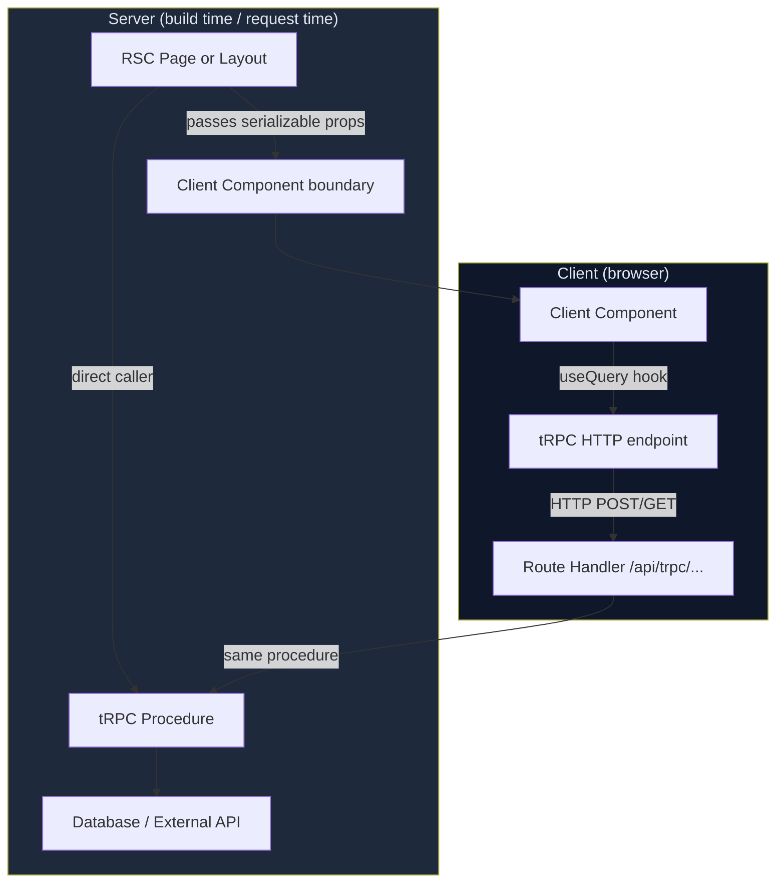

## Using tRPC with Next.js Server Components

### Overview

React Server Components (RSC) run exclusively on the server and never ship their code to the browser. They can call tRPC procedures directly using a server-side caller, bypassing the HTTP layer entirely. This differs from the client hook pattern — there is no `useQuery`, no React Query cache involved by default, and no network round-trip. The result is simpler data fetching for server-rendered content, at the cost of losing client-side reactivity for that data.

Understanding where the boundary between Server and Client Components lies is central to using tRPC correctly in the App Router.

---

### Server vs. Client Component Boundary



**Key Points**
- RSCs call procedures via a direct in-process caller — no HTTP involved
- Client Components use the standard tRPC React Query hooks, which do make HTTP requests
- Props crossing the RSC → Client Component boundary must be serializable — tRPC return types that include `Date`, `Map`, `Set`, etc. require `superjson` or manual conversion

---

### Setting Up the Server-Side Caller

The caller is created by `createCallerFactory`, introduced in tRPC v11. It takes a context and exposes the full router API as plain async functions.

```ts
// server/caller.ts
import 'server-only';
import { createCallerFactory } from '@trpc/server';
import { appRouter } from '@/server/routers/_app';
import { createTRPCContext } from '@/server/trpc';

const createCaller = createCallerFactory(appRouter);

export const createServerCaller = async () => {
  const ctx = await createTRPCContext();
  return createCaller(ctx);
};
```

The `server-only` package causes a build error if this module is accidentally imported in a Client Component, preventing server-side secrets or database clients from leaking to the browser.

```bash
npm install server-only
```

---

### Context Factory for Server Components

In RSCs, request data is accessed via Next.js server APIs (`cookies()`, `headers()`) rather than a `req` object.

```ts
// server/trpc.ts
import 'server-only';
import { initTRPC, TRPCError } from '@trpc/server';
import { cookies, headers } from 'next/headers';
import { getServerSession } from 'next-auth';
import { authOptions } from '@/lib/auth';
import { db } from '@/lib/db';
import superjson from 'superjson';

export const createTRPCContext = async () => {
  const cookieStore = cookies();
  const headersList = headers();

  const session = await getServerSession(authOptions);

  return {
    db,
    session,
    cookies: cookieStore,
    headers: headersList,
  };
};

export type Context = Awaited<ReturnType<typeof createTRPCContext>>;

const t = initTRPC.context<Context>().create({
  transformer: superjson,
});

export const router = t.router;
export const publicProcedure = t.procedure;
export const protectedProcedure = t.procedure.use(({ ctx, next }) => {
  if (!ctx.session) throw new TRPCError({ code: 'UNAUTHORIZED' });
  return next({ ctx: { ...ctx, session: ctx.session } });
});
```

**Key Points**
- `cookies()` and `headers()` are Next.js dynamic APIs — calling them opts the route out of static generation unless `force-static` is set
- `getServerSession` works correctly in RSC context without a `req` object when configured via `authOptions`
- The context is created fresh per request — there is no shared mutable state between requests [Inference]

---

### Calling Procedures in a Server Component

#### Basic Fetch

```tsx
// app/posts/page.tsx
import { createServerCaller } from '@/server/caller';

export default async function PostsPage() {
  const caller = await createServerCaller();
  const posts = await caller.post.list({ limit: 10 });

  return (
    <ul>
      {posts.map((post) => (
        <li key={post.id}>{post.title}</li>
      ))}
    </ul>
  );
}
```

The `async`/`await` pattern is native to RSCs. No hooks, no providers, no loading state management — the component suspends until the data is ready.

#### Protected Procedure

```tsx
// app/dashboard/page.tsx
import { createServerCaller } from '@/server/caller';
import { redirect } from 'next/navigation';
import { TRPCError } from '@trpc/server';

export default async function DashboardPage() {
  const caller = await createServerCaller();

  let stats;
  try {
    stats = await caller.dashboard.getStats();
  } catch (err) {
    if (err instanceof TRPCError && err.code === 'UNAUTHORIZED') {
      redirect('/login');
    }
    throw err;   // re-throw unexpected errors to the error boundary
  }

  return <DashboardStats data={stats} />;
}
```

**Key Points**
- `TRPCError` is a plain class — `instanceof` checks work correctly in the RSC context
- Re-throwing non-auth errors lets Next.js error boundaries handle them
- `redirect()` from `next/navigation` throws internally in Next.js and must not be caught by a generic `catch` — use targeted error code checks before calling it

---

### Parallel Data Fetching

Sequential `await` calls in RSCs create a waterfall. Use `Promise.all` to fetch independent data concurrently.

```tsx
// app/posts/[id]/page.tsx
import { createServerCaller } from '@/server/caller';
import { notFound } from 'next/navigation';

interface Props {
  params: { id: string };
}

export default async function PostPage({ params }: Props) {
  const caller = await createServerCaller();

  // Parallel — neither depends on the other's result
  const [post, relatedPosts, author] = await Promise.all([
    caller.post.getById({ id: params.id }),
    caller.post.getRelated({ id: params.id, limit: 5 }),
    caller.author.getByPostId({ postId: params.id }),
  ]).catch(() => {
    notFound();
    return [] as never;
  });

  return (
    <article>
      <h1>{post.title}</h1>
      <AuthorCard author={author} />
      <PostBody body={post.body} />
      <RelatedPosts posts={relatedPosts} />
    </article>
  );
}
```

> [Inference] Each call in `Promise.all` creates a separate database query through the procedure. If your procedure chain involves shared middleware (e.g., permission checks), that middleware runs independently for each call. Batching behavior at the database level depends on your ORM or query layer, not tRPC.

---

### Streaming with Suspense

RSCs support streaming — wrapping slow data-fetching components in `<Suspense>` allows fast content to reach the browser immediately while slower sections stream in.

```tsx
// app/posts/[id]/page.tsx
import { Suspense } from 'react';
import PostBody from './PostBody';
import Comments from './Comments';       // slow — many DB reads
import PostSkeleton from './PostSkeleton';
import CommentsSkeleton from './CommentsSkeleton';

export default async function PostPage({ params }: { params: { id: string } }) {
  return (
    <article>
      {/* Fast — renders and streams immediately */}
      <Suspense fallback={<PostSkeleton />}>
        <PostBody id={params.id} />
      </Suspense>

      {/* Slow — streams in later without blocking PostBody */}
      <Suspense fallback={<CommentsSkeleton />}>
        <Comments postId={params.id} />
      </Suspense>
    </article>
  );
}
```

```tsx
// app/posts/[id]/Comments.tsx
import { createServerCaller } from '@/server/caller';

export default async function Comments({ postId }: { postId: string }) {
  const caller = await createServerCaller();
  const comments = await caller.comment.listByPost({ postId });

  return (
    <ul>
      {comments.map((c) => (
        <li key={c.id}>{c.body}</li>
      ))}
    </ul>
  );
}
```

**Key Points**
- Each `<Suspense>` boundary is an independent streaming chunk — slow components do not block fast ones
- The caller is instantiated per-component, meaning `createTRPCContext` (and therefore `getServerSession`) runs multiple times — consider caching the context with React's `cache()` if session fetching is expensive

---

### Caching the Context with React `cache()`

`cache()` deduplicates calls to the wrapped function within a single request render. This prevents redundant session lookups when multiple RSCs instantiate the caller.

```ts
// server/caller.ts
import 'server-only';
import { cache } from 'react';
import { createCallerFactory } from '@trpc/server';
import { appRouter } from '@/server/routers/_app';
import { createTRPCContext } from '@/server/trpc';

const createCaller = createCallerFactory(appRouter);

// createTRPCContext runs at most once per request, regardless of how many
// RSCs call createServerCaller
export const createServerCaller = cache(async () => {
  const ctx = await createTRPCContext();
  return createCaller(ctx);
});
```

> [Inference] React `cache()` is scoped to the React render tree for the current request. It is distinct from `unstable_cache` (Next.js data cache) and does not persist across requests. The deduplication guarantee is within a single server render pass.

---

### Passing RSC Data to Client Components

Data fetched in an RSC can be passed to Client Components as props, but only if it is serializable. tRPC return values that include complex types require attention.

#### Serializable Props — Works Directly

```tsx
// app/posts/[id]/page.tsx  (Server Component)
import { createServerCaller } from '@/server/caller';
import PostActions from './PostActions';   // 'use client'

export default async function PostPage({ params }: { params: { id: string } }) {
  const caller = await createServerCaller();
  const post = await caller.post.getById({ id: params.id });

  // post.createdAt is a Date — must be serialized before passing
  return (
    <PostActions
      postId={post.id}
      title={post.title}
      createdAt={post.createdAt.toISOString()}   // serialize Date to string
    />
  );
}
```

```tsx
// app/posts/[id]/PostActions.tsx
'use client';

interface Props {
  postId: string;
  title: string;
  createdAt: string;
}

export default function PostActions({ postId, title, createdAt }: Props) {
  // Client Component — can use hooks, handle interactions
  const utils = trpc.useUtils();

  const deletePost = trpc.post.delete.useMutation({
    onSuccess: () => utils.post.list.invalidate(),
  });

  return (
    <div>
      <h1>{title}</h1>
      <time>{createdAt}</time>
      <button onClick={() => deletePost.mutate({ id: postId })}>Delete</button>
    </div>
  );
}
```

**Key Points**
- `Date`, `Map`, `Set`, `BigInt`, and `undefined` are not serializable across the RSC boundary without conversion
- Next.js serializes RSC → Client props using its own serialization layer — it will warn or throw on non-serializable values
- If your tRPC router uses `superjson` as a transformer, that only applies within tRPC's own serialization pipeline, not to RSC prop passing

---

### Combining RSC Fetch with Client-Side Hydration

When a Client Component needs both pre-rendered data (for immediate display) and the ability to refetch or mutate, use `HydrationBoundary` to bridge them.

```tsx
// app/posts/page.tsx  (Server Component)
import { dehydrate, HydrationBoundary, QueryClient } from '@tanstack/react-query';
import { createServerCaller } from '@/server/caller';
import PostList from './PostList';

export default async function PostsPage() {
  const queryClient = new QueryClient();
  const caller = await createServerCaller();

  await queryClient.prefetchQuery({
    queryKey: [['post', 'list'], { input: { limit: 10 }, type: 'query' }],
    queryFn: () => caller.post.list({ limit: 10 }),
  });

  return (
    <HydrationBoundary state={dehydrate(queryClient)}>
      <PostList />
    </HydrationBoundary>
  );
}
```

```tsx
// app/posts/PostList.tsx
'use client';
import { trpc } from '@/utils/trpc';

export default function PostList() {
  // Reads from hydrated cache — no loading state on first render
  const { data } = trpc.post.list.useQuery({ limit: 10 });

  return (
    <ul>
      {data?.map((post) => (
        <li key={post.id}>{post.title}</li>
      ))}
    </ul>
  );
}
```

> [Inference] The query key format (`[['post', 'list'], { input, type }]`) is an internal tRPC implementation detail and may differ between `@trpc/react-query` versions. Validate against your installed version if this pattern produces cache misses.

---

### What You Cannot Do in Server Components

| Action | Available in RSC | Alternative |
|---|---|---|
| Call `trpc.post.list.useQuery()` | ❌ Hooks are client-only | Use direct caller |
| Use `useState` / `useEffect` | ❌ | Move to a `'use client'` component |
| Access `window` / browser APIs | ❌ | Client Component |
| Subscribe to real-time updates | ❌ | Client Component with subscription |
| Use React Query's `invalidate` | ❌ | Call `revalidatePath` (server action) |
| Import client-only modules | ❌ Build error with `server-only` guard | Keep imports server-side |

---

### Server Actions as an Alternative to Mutations

For form submissions and simple mutations from Server Components, Next.js Server Actions can call tRPC procedures directly without requiring a Client Component.

```tsx
// app/posts/new/page.tsx
import { createServerCaller } from '@/server/caller';
import { redirect } from 'next/navigation';

export default function NewPostPage() {
  async function createPost(formData: FormData) {
    'use server';
    const caller = await createServerCaller();

    const post = await caller.post.create({
      title: formData.get('title') as string,
      body: formData.get('body') as string,
    });

    redirect(`/posts/${post.id}`);
  }

  return (
    <form action={createPost}>
      <input name="title" placeholder="Title" />
      <textarea name="body" placeholder="Body" />
      <button type="submit">Publish</button>
    </form>
  );
}
```

**Key Points**
- `'use server'` marks the function as a Server Action — it runs on the server regardless of where it is defined
- The full tRPC middleware chain (validation, auth, error handling) still runs — this is not a bypass
- Server Actions do not return data to the client in the same way mutations do; use `redirect`, `revalidatePath`, or state passed via `useFormState` for feedback

---

### Common Errors

#### `Error: Hooks can only be called inside of the body of a function component`

A tRPC hook (`useQuery`, `useMutation`, etc.) was called in a Server Component. Move the component to a separate file with `'use client'` at the top.

#### `Error: Objects are not valid as a React child`

A non-serializable value (e.g., a raw `Date`) was returned from an RSC and rendered directly. Convert to a string with `.toISOString()` or `.toLocaleDateString()` before rendering.

#### `Error: This module cannot be imported from a Client Component module`

The `server-only` guard in `server/caller.ts` fired because a Client Component imported it. Move the data-fetching logic to an RSC and pass the result as props.

---

**Next Steps**
- Implement server actions with tRPC for form-based mutations without client JavaScript
- Configure React `cache()` across all shared server utilities to minimize redundant context creation
- Explore combining streaming RSCs with optimistic updates in Client Components for responsive UIs