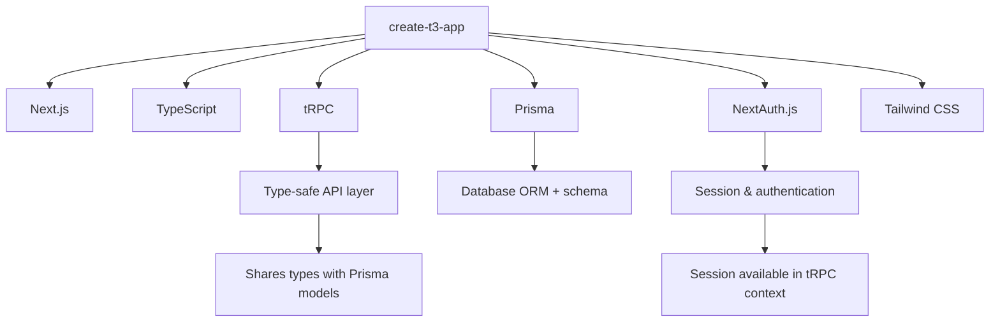
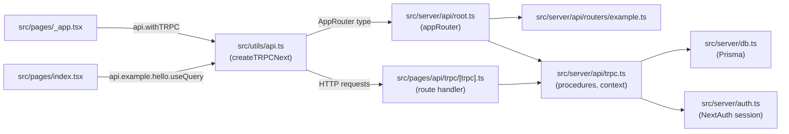

## create-t3-app as a Reference Setup

### Overview

`create-t3-app` is a CLI scaffolding tool that generates a full-stack Next.js application with tRPC pre-configured alongside TypeScript, Tailwind CSS, Prisma, and NextAuth.js (now Auth.js). It is maintained by the T3 community and represents one of the most widely referenced real-world tRPC integration patterns. Studying its generated output is a reliable way to understand how all tRPC pieces connect in production-grade code.

This topic walks through the generated structure, explaining every tRPC-related file, the decisions made, and why they exist.

---

### The T3 Stack



Each package is optional during scaffolding — you can omit Prisma, NextAuth, or Tailwind. tRPC and TypeScript are always included.

---

### Scaffolding a New Project

```bash
npm create t3-app@latest
# or
pnpm create t3-app@latest
# or
yarn create t3-app
```

The CLI prompts for:
- Project name
- TypeScript (always yes)
- Tailwind CSS
- tRPC
- Prisma
- NextAuth.js
- App Router or Pages Router

> [Inference] As of late 2024, `create-t3-app` supports both the Pages Router and App Router. The generated tRPC wiring differs between them. The Pages Router output is more established and battle-tested; the App Router output reflects newer patterns that are still evolving.

---

### Generated Project Structure (Pages Router)

```
.
├── prisma/
│   └── schema.prisma
├── public/
├── src/
│   ├── env.js                        # Type-safe environment variables
│   ├── pages/
│   │   ├── _app.tsx                  # tRPC provider wiring
│   │   ├── index.tsx                 # Example page using tRPC hook
│   │   └── api/
│   │       ├── auth/
│   │       │   └── [...nextauth].ts  # NextAuth route handler
│   │       └── trpc/
│   │           └── [trpc].ts         # tRPC route handler
│   ├── server/
│   │   ├── auth.ts                   # NextAuth config + session helper
│   │   ├── db.ts                     # Prisma client singleton
│   │   └── api/
│   │       ├── root.ts               # Root router (appRouter)
│   │       ├── trpc.ts               # initTRPC, context, procedures
│   │       └── routers/
│   │           └── example.ts        # Example router
│   └── utils/
│       └── api.ts                    # tRPC client + React hooks
├── .env
├── .env.example
└── next.config.js
```

---

### File-by-File Breakdown

#### `src/server/api/trpc.ts`

This is the most important file — it initializes tRPC, defines the context, and exports reusable procedure builders.

```ts
// src/server/api/trpc.ts
import { initTRPC, TRPCError } from "@trpc/server";
import { type CreateNextContextOptions } from "@trpc/server/adapters/next";
import { type Session, getServerAuthSession } from "@/server/auth";
import { db } from "@/server/db";
import superjson from "superjson";
import { ZodError } from "zod";

/**
 * Context shape available to all procedures.
 * Created fresh on every request.
 */
interface CreateContextOptions {
  session: Session | null;
}

const createInnerTRPCContext = (opts: CreateContextOptions) => {
  return {
    session: opts.session,
    db,
  };
};

export const createTRPCContext = async (opts: CreateNextContextOptions) => {
  const { req, res } = opts;
  const session = await getServerAuthSession({ req, res });

  return createInnerTRPCContext({ session });
};

/**
 * tRPC initialization.
 * Transformer and error formatter are set once here.
 */
const t = initTRPC.context<typeof createTRPCContext>().create({
  transformer: superjson,
  errorFormatter({ shape, error }) {
    return {
      ...shape,
      data: {
        ...shape.data,
        zodError:
          error.cause instanceof ZodError ? error.cause.flatten() : null,
      },
    };
  },
});

/**
 * Reusable router and procedure builders.
 */
export const createTRPCRouter = t.router;
export const createCallerFactory = t.createCallerFactory;

export const publicProcedure = t.procedure;

/** Reusable middleware: enforces authentication. */
const enforceUserIsAuthed = t.middleware(({ ctx, next }) => {
  if (!ctx.session?.user) {
    throw new TRPCError({ code: "UNAUTHORIZED" });
  }
  return next({
    ctx: {
      // Narrows the type — session.user is non-null after this middleware
      session: { ...ctx.session, user: ctx.session.user },
    },
  });
});

export const protectedProcedure = t.procedure.use(enforceUserIsAuthed);
```

**Key Points**
- `createInnerTRPCContext` separates context creation from the Next.js adapter — this allows the same context shape to be used in tests or SSG helpers without a real `req`/`res`
- `superjson` is the transformer — it must be referenced consistently in the client utility and SSG helpers
- `errorFormatter` extracts Zod validation errors into a structured `zodError` field, making client-side form error handling straightforward
- `createCallerFactory` is exported for use in Server Components and server-side helpers

---

#### `src/server/api/root.ts`

The root router aggregates all sub-routers. The `AppRouter` type is the single export that flows to the client.

```ts
// src/server/api/root.ts
import { createCallerFactory, createTRPCRouter } from "@/server/api/trpc";
import { exampleRouter } from "@/server/api/routers/example";

export const appRouter = createTRPCRouter({
  example: exampleRouter,
});

export type AppRouter = typeof appRouter;

/**
 * Server-side caller — used in Server Components and getServerSideProps.
 * Never imported on the client.
 */
export const createCaller = createCallerFactory(appRouter);
```

**Key Points**
- `AppRouter` is a type export only — it is never bundled into client code
- `createCaller` is placed here rather than in a separate file so that the router and its caller are always in sync

---

#### `src/pages/api/trpc/[trpc].ts`

The HTTP route handler. This is the single entry point for all tRPC client requests.

```ts
// src/pages/api/trpc/[trpc].ts
import { createNextApiHandler } from "@trpc/server/adapters/next";
import { env } from "@/env";
import { createTRPCContext } from "@/server/api/trpc";
import { appRouter } from "@/server/api/root";

export default createNextApiHandler({
  router: appRouter,
  createContext: createTRPCContext,
  onError:
    env.NODE_ENV === "development"
      ? ({ path, error }) => {
          console.error(
            `❌ tRPC failed on ${path ?? "<no-path>"}: ${error.message}`
          );
        }
      : undefined,
});
```

**Key Points**
- `onError` is gated to `development` only — stack traces and internal error messages are not exposed in production
- `env.NODE_ENV` comes from `src/env.js`, which validates environment variables at startup using Zod

---

#### `src/utils/api.ts`

The client-side tRPC utility. Exports the typed hooks used in React components.

```ts
// src/utils/api.ts
import { httpBatchLink, loggerLink } from "@trpc/client";
import { createTRPCNext } from "@trpc/next";
import { type AppRouter } from "@/server/api/root";
import superjson from "superjson";

const getBaseUrl = () => {
  if (typeof window !== "undefined") return "";                // browser: relative URL
  if (process.env.VERCEL_URL) return `https://${process.env.VERCEL_URL}`;  // Vercel
  return `http://localhost:${process.env.PORT ?? 3000}`;      // local dev
};

export const api = createTRPCNext<AppRouter>({
  config() {
    return {
      transformer: superjson,
      links: [
        loggerLink({
          enabled: (opts) =>
            process.env.NODE_ENV === "development" ||
            (opts.direction === "down" && opts.result instanceof Error),
        }),
        httpBatchLink({
          url: `${getBaseUrl()}/api/trpc`,
        }),
      ],
    };
  },
  ssr: false,
});
```

**Key Points**
- `getBaseUrl` handles three environments: browser (relative), Vercel deployment (absolute from env var), and local dev — this pattern avoids hardcoding URLs
- `loggerLink` logs all requests in development and all errors in any environment — it is placed before `httpBatchLink` in the chain so logging occurs before the request is sent
- `ssr: false` disables automatic SSR via `createTRPCNext` — data fetching on the server is handled explicitly via `createServerSideHelpers` or the direct caller, giving more control
- `transformer: superjson` must match the transformer in `trpc.ts`

---

#### `src/pages/_app.tsx`

Wraps the entire application with tRPC and React Query providers.

```tsx
// src/pages/_app.tsx
import { type AppType } from "next/app";
import { type Session } from "next-auth";
import { SessionProvider } from "next-auth/react";
import { api } from "@/utils/api";
import "@/styles/globals.css";

const MyApp: AppType<{ session: Session | null }> = ({
  Component,
  pageProps: { session, ...pageProps },
}) => {
  return (
    <SessionProvider session={session}>
      <Component {...pageProps} />
    </SessionProvider>
  );
};

export default api.withTRPC(MyApp);
```

**Key Points**
- `api.withTRPC` is a HOC generated by `createTRPCNext` — it wraps the app with `QueryClientProvider` and the tRPC provider internally, so they do not need to be added manually
- `SessionProvider` is from NextAuth — it makes the session available to client components via `useSession`
- The `session` prop is extracted from `pageProps` and passed to `SessionProvider` separately to avoid passing it down as a generic prop

---

#### `src/server/api/routers/example.ts`

A minimal example router demonstrating both public and protected procedures.

```ts
// src/server/api/routers/example.ts
import { z } from "zod";
import {
  createTRPCRouter,
  publicProcedure,
  protectedProcedure,
} from "@/server/api/trpc";

export const exampleRouter = createTRPCRouter({
  hello: publicProcedure
    .input(z.object({ text: z.string() }))
    .query(({ input }) => {
      return {
        greeting: `Hello ${input.text}`,
      };
    }),

  getSecretMessage: protectedProcedure.query(() => {
    return "you can now see this secret message!";
  }),
});
```

**Key Points**
- `publicProcedure` requires no authentication — callable by anyone
- `protectedProcedure` enforces authentication via the `enforceUserIsAuthed` middleware defined in `trpc.ts` — if `ctx.session` is null, a `UNAUTHORIZED` TRPCError is thrown before the resolver runs
- The router is registered in `root.ts` under the `example` key, making it accessible as `api.example.hello` and `api.example.getSecretMessage` on the client

---

#### `src/server/db.ts`

Prisma client singleton. Prevents multiple instances during hot reload in development.

```ts
// src/server/db.ts
import { PrismaClient } from "@prisma/client";
import { env } from "@/env";

const globalForPrisma = globalThis as unknown as {
  prisma: PrismaClient | undefined;
};

export const db =
  globalForPrisma.prisma ??
  new PrismaClient({
    log:
      env.NODE_ENV === "development" ? ["query", "error", "warn"] : ["error"],
  });

if (env.NODE_ENV !== "production") globalForPrisma.prisma = db;
```

**Key Points**
- Without the singleton pattern, Next.js hot reload creates a new `PrismaClient` on every module re-evaluation in development, exhausting the database connection pool quickly
- `globalThis` persists between hot reloads in Node.js — assigning the client there prevents re-instantiation
- Query logging is enabled in development only

---

#### `src/env.js`

T3 uses `@t3-oss/env-nextjs` to validate environment variables at startup using Zod. If a required variable is missing or malformed, the build or server start fails immediately with a clear error.

```js
// src/env.js
import { createEnv } from "@t3-oss/env-nextjs";
import { z } from "zod";

export const env = createEnv({
  server: {
    DATABASE_URL: z.string().url(),
    NODE_ENV: z.enum(["development", "test", "production"]).default("development"),
    NEXTAUTH_SECRET:
      process.env.NODE_ENV === "production"
        ? z.string()
        : z.string().optional(),
    NEXTAUTH_URL: z.preprocess(
          (str) => process.env.VERCEL_URL ?? str,
          process.env.VERCEL ? z.string() : z.string().url()
        ),
  },
  client: {
    // NEXT_PUBLIC_* variables go here
  },
  runtimeEnv: {
    DATABASE_URL: process.env.DATABASE_URL,
    NODE_ENV: process.env.NODE_ENV,
    NEXTAUTH_SECRET: process.env.NEXTAUTH_SECRET,
    NEXTAUTH_URL: process.env.NEXTAUTH_URL,
  },
  skipValidation: !!process.env.SKIP_ENV_VALIDATION,
});
```

**Key Points**
- Environment variable access through `env.DATABASE_URL` is fully type-safe — no `string | undefined` — because Zod has validated it at startup
- `client` variables must be prefixed with `NEXT_PUBLIC_` — the schema enforces this
- `skipValidation` allows CI environments (e.g., Docker build steps that don't have real credentials) to bypass validation

---

### How the T3 Setup Connects End to End



---

### Using the Generated Code in a Component

```tsx
// src/pages/index.tsx
import { api } from "@/utils/api";

export default function Home() {
  const hello = api.example.hello.useQuery({ text: "world" });

  return (
    <main>
      {hello.data ? (
        <p>{hello.data.greeting}</p>
      ) : (
        <p>Loading...</p>
      )}
    </main>
  );
}
```

The `api` object is the single import for all tRPC interactions on the client — no configuration, no provider setup needed at the component level.

---

### Key Design Decisions in T3 Worth Adopting

| Decision | Rationale |
|---|---|
| `createInnerTRPCContext` separation | Enables testing context logic without a real HTTP request |
| `superjson` as default transformer | Handles `Date`, `Map`, `Set`, `BigInt` transparently |
| Zod error flattening in `errorFormatter` | Surfaces field-level validation errors to forms without extra client logic |
| `ssr: false` in `createTRPCNext` | SSR data fetching is done explicitly, not implicitly — prevents accidental double-fetching |
| `globalForPrisma` singleton | Prevents connection pool exhaustion during development hot reload |
| `env.js` with Zod validation | Converts runtime env var errors into startup errors — easier to diagnose |
| `onError` gated to development | Avoids leaking stack traces and internal messages in production |
| `server-only` module pattern | Prevents server code from being imported into client bundles |

---

### Differences from a Manual Setup

| Aspect | Manual Setup | T3 Generated |
|---|---|---|
| Context separation | Often single `createTRPCContext` | Split into `createInnerTRPCContext` + `createTRPCContext` |
| Environment variables | Raw `process.env` access | Validated via `@t3-oss/env-nextjs` |
| Zod error formatting | Usually omitted initially | Built into `errorFormatter` from the start |
| Prisma singleton | Often forgotten | Included by default |
| Logger link | Rarely added early | Included in the link chain from the start |
| Auth integration | Added later | Wired into context from day one |

---

### Adding a New Router

The standard T3 workflow for adding a new domain:

```ts
// src/server/api/routers/post.ts
import { z } from "zod";
import { createTRPCRouter, protectedProcedure, publicProcedure } from "@/server/api/trpc";

export const postRouter = createTRPCRouter({
  list: publicProcedure
    .input(z.object({ limit: z.number().min(1).max(100).default(10) }))
    .query(async ({ ctx, input }) => {
      return ctx.db.post.findMany({ take: input.limit });
    }),

  create: protectedProcedure
    .input(z.object({ title: z.string().min(1), body: z.string() }))
    .mutation(async ({ ctx, input }) => {
      return ctx.db.post.create({
        data: {
          ...input,
          authorId: ctx.session.user.id,
        },
      });
    }),
});
```

```ts
// src/server/api/root.ts  — register the new router
import { postRouter } from "@/server/api/routers/post";

export const appRouter = createTRPCRouter({
  example: exampleRouter,
  post: postRouter,       // added here
});
```

The new router is immediately available on the client as `api.post.list.useQuery()` and `api.post.create.useMutation()` with full type inference.

---

**Next Steps**
- Replace the example router with domain-specific routers (users, posts, etc.)
- Add Zod schemas to a shared `src/schemas/` directory for reuse across procedures and forms
- Configure `superjson` replacers for custom serialization of domain types