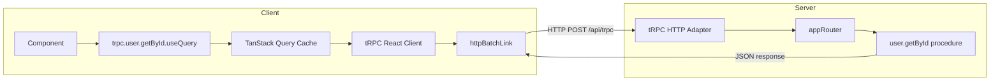

## Creating the tRPC Client

### Overview

The tRPC client is the counterpart to the server router. It consumes the exported `AppRouter` type from the server to produce a fully type-safe caller — no code generation required. The client never imports server implementation code; it only imports the *type*.

Two primary client packages exist depending on your environment:

| Package | Use Case |
|---|---|
| `@trpc/client` | Vanilla JS / Node.js / framework-agnostic |
| `@trpc/react-query` | React applications (wraps TanStack Query) |

---

### Prerequisites

- A tRPC server with an exported `AppRouter` type
- `@trpc/server` already set up (the type source)
- Node.js project with TypeScript configured

---

### Installation

**Vanilla client:**
```bash
npm install @trpc/client @trpc/server
```

**React client (additionally requires TanStack Query):**
```bash
npm install @trpc/client @trpc/server @trpc/react-query @tanstack/react-query
```

> `@trpc/server` is installed on the client side solely for its TypeScript types. No server code runs in the browser.

---

### The AppRouter Type Import

The foundation of client-side type safety is importing only the *type* of your router:

```typescript
// server/router.ts
export type AppRouter = typeof appRouter;
```

```typescript
// client/trpc.ts
import type { AppRouter } from '../server/router';
```

Using `import type` is required. Importing the value would pull server-only code (and its dependencies) into the client bundle.

---

### Links

Before creating a client, you need at least one **link**. Links are middleware-like units that define how requests are sent. They are composable and ordered.

#### `httpLink`

Sends each procedure call as a separate HTTP request.

```typescript
import { httpLink } from '@trpc/client';

httpLink({
  url: 'http://localhost:3000/api/trpc',
});
```

#### `httpBatchLink`

Batches multiple procedure calls made within the same event loop tick into a single HTTP request. This is the most commonly used link for browser clients.

```typescript
import { httpBatchLink } from '@trpc/client';

httpBatchLink({
  url: 'http://localhost:3000/api/trpc',
});
```

**Key Points**
- Batching reduces round-trips when multiple queries fire simultaneously (e.g., on page load)
- The server must support batching — the tRPC adapter enables it by default
- Batching behavior depends on request timing and may vary across environments [Inference]

#### Adding Headers

Both links accept a `headers` option, useful for auth tokens:

```typescript
httpBatchLink({
  url: 'http://localhost:3000/api/trpc',
  headers() {
    return {
      authorization: `Bearer ${getToken()}`,
    };
  },
});
```

The `headers` function is called per request, so it reads the token at call time rather than at initialization.

---

### Vanilla Client — `createTRPCClient`

For non-React environments or when you want direct procedural calls:

```typescript
// client/trpc.ts
import { createTRPCClient, httpBatchLink } from '@trpc/client';
import type { AppRouter } from '../server/router';

const client = createTRPCClient<AppRouter>({
  links: [
    httpBatchLink({
      url: 'http://localhost:3000/api/trpc',
    }),
  ],
});

export default client;
```

**Usage:**

```typescript
import client from './trpc';

// Query
const user = await client.user.getById.query({ id: '1' });

// Mutation
const newPost = await client.post.create.mutate({ title: 'Hello tRPC' });
```

The returned `client` mirrors the shape of your `AppRouter`. Calling a non-existent procedure or passing the wrong input type is a compile-time error.

> **Note:** In tRPC v10, this function was named `createTRPCProxyClient`. In v11, it was renamed to `createTRPCClient`. Confirm the correct export name against your installed version.

---

### React Client — `createTRPCReact`

For React applications, `createTRPCReact` produces a hook-based API that integrates with TanStack Query:

```typescript
// utils/trpc.ts
import { createTRPCReact } from '@trpc/react-query';
import type { AppRouter } from '../server/router';

export const trpc = createTRPCReact<AppRouter>();
```

This call returns a `trpc` object containing typed hooks (`.useQuery`, `.useMutation`, `.useSubscription`) namespaced by your router structure.

---

### Providing the React Client

`createTRPCReact` requires two React context providers — one for tRPC and one for TanStack Query:

```typescript
// App.tsx
import { useState } from 'react';
import { QueryClient, QueryClientProvider } from '@tanstack/react-query';
import { httpBatchLink } from '@trpc/client';
import { trpc } from './utils/trpc';

export function App() {
  const [queryClient] = useState(() => new QueryClient());
  const [trpcClient] = useState(() =>
    trpc.createClient({
      links: [
        httpBatchLink({
          url: 'http://localhost:3000/api/trpc',
        }),
      ],
    })
  );

  return (
    <trpc.Provider client={trpcClient} queryClient={queryClient}>
      <QueryClientProvider client={queryClient}>
        {/* your app */}
      </QueryClientProvider>
    </trpc.Provider>
  );
}
```

**Key Points**
- Both clients are initialized inside `useState` with an initializer function. This avoids re-creating them on every render.
- `trpc.Provider` and `QueryClientProvider` must receive the *same* `QueryClient` instance — they share it.
- The provider wrapping order shown above is the documented convention; swapping the providers should still work [Inference] but is not the standard pattern.

---

### Using Hooks in Components

Once the providers are in place, hooks are available anywhere in the tree:

```typescript
// components/UserProfile.tsx
import { trpc } from '../utils/trpc';

export function UserProfile({ userId }: { userId: string }) {
  const userQuery = trpc.user.getById.useQuery({ id: userId });

  if (userQuery.isLoading) return <p>Loading...</p>;
  if (userQuery.error) return <p>Error: {userQuery.error.message}</p>;

  return <p>{userQuery.data.name}</p>;
}
```

**Output** (on success): renders the user's name fetched from the tRPC procedure.

The `data` property is fully typed — `userQuery.data` reflects the exact return type of `user.getById` on the server.

---

### Architecture Diagram



---

### Type Inference Utilities

tRPC exports helpers to extract input and output types from your router — useful for typing function parameters without duplicating schemas:

```typescript
import type { inferRouterInputs, inferRouterOutputs } from '@trpc/server';
import type { AppRouter } from '../server/router';

type RouterInput = inferRouterInputs<AppRouter>;
type RouterOutput = inferRouterOutputs<AppRouter>;

// Extract specific types
type GetUserInput = RouterInput['user']['getById'];
type GetUserOutput = RouterOutput['user']['getById'];
```

---

### Common Mistakes

**Importing the value instead of the type:**
```typescript
// Wrong — pulls in server code
import { appRouter } from '../server/router';

// Correct
import type { AppRouter } from '../server/router';
```

**Re-creating clients on every render:**
```typescript
// Wrong — new client created on each render
const trpcClient = trpc.createClient({ ... });

// Correct — stabilized with useState initializer
const [trpcClient] = useState(() => trpc.createClient({ ... }));
```

**Mismatched QueryClient instances between providers:**
```typescript
// Wrong — two separate QueryClient instances
<trpc.Provider client={trpcClient} queryClient={new QueryClient()}>
  <QueryClientProvider client={new QueryClient()}>

// Correct — same instance passed to both
const [queryClient] = useState(() => new QueryClient());
<trpc.Provider client={trpcClient} queryClient={queryClient}>
  <QueryClientProvider client={queryClient}>
```

---

**Next Steps:** Configuring HTTP links in depth — `httpLink` vs `httpBatchLink`, custom fetch, and link chaining.

