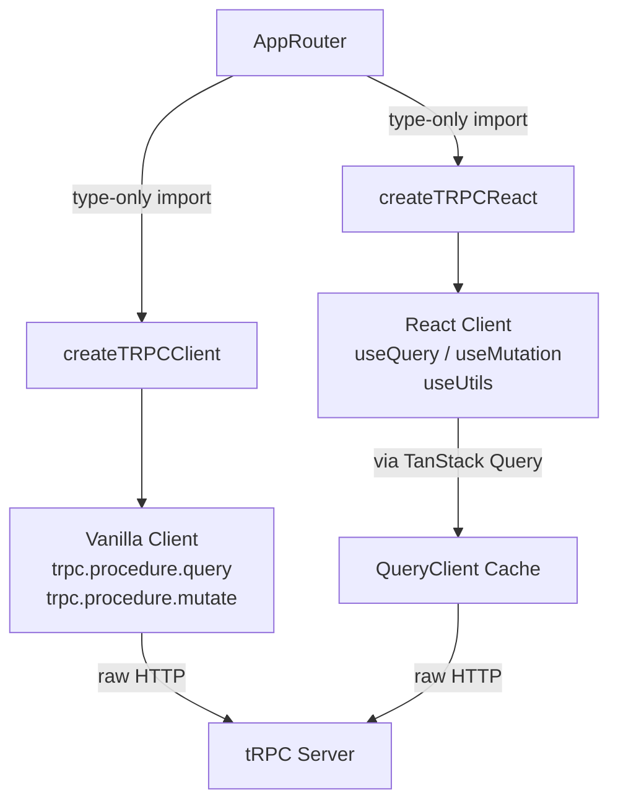

## Vanilla Client vs React Client

tRPC ships two distinct client packages for different runtime contexts. Understanding which to use — and why — shapes how you structure data fetching across your application.

---

### Overview

| | Vanilla Client | React Client |
|---|---|---|
| Package | `@trpc/client` | `@trpc/react-query` |
| Runtime | Any JS environment | React only |
| API style | `async`/`await` | Hooks (`useQuery`, `useMutation`) |
| Caching | None (manual) | TanStack Query |
| Reactivity | None | Automatic re-renders |
| Use case | Scripts, servers, non-React UI | React components |

---

### The Vanilla Client

The vanilla client (`createTRPCClient`) is a low-level, framework-agnostic client. It exposes tRPC procedures as plain async functions with no dependency on React or any state management library.

#### Setup

```ts
// src/lib/trpc.ts
import { createTRPCClient, httpBatchLink } from '@trpc/client';
import type { AppRouter } from '../server/router';

export const trpc = createTRPCClient<AppRouter>({
  links: [
    httpBatchLink({
      url: 'http://localhost:3000/api/trpc',
    }),
  ],
});
```

#### Usage

```ts
// Any .ts file — no React required
async function loadUser(id: string) {
  const user = await trpc.user.getById.query({ id });
  console.log(user);
}

async function createPost(title: string) {
  const post = await trpc.post.create.mutate({ title });
  return post;
}
```

**Key Points**
- Calls return `Promise` — you handle loading, error, and success states yourself.
- No built-in caching. Two calls to the same procedure make two network requests.
- Works in Node.js scripts, Cloudflare Workers, non-React frontends (Vue, Svelte used without their tRPC adapters), or utility/helper modules.
- Type safety is fully preserved — the return type is inferred from the router definition.

---

### The React Client

The React client (`createTRPCReact`) wraps the vanilla client with TanStack Query (formerly React Query). Each procedure becomes a hook factory. Queries gain automatic caching, background refetching, deduplication, and reactive re-rendering.

#### Setup

The React client requires two providers: a tRPC provider and a TanStack Query client.

```ts
// src/lib/trpc.ts
import { createTRPCReact } from '@trpc/react-query';
import type { AppRouter } from '../server/router';

export const trpc = createTRPCReact<AppRouter>();
```

```tsx
// src/main.tsx (or _app.tsx in Next.js)
import { QueryClient, QueryClientProvider } from '@tanstack/react-query';
import { httpBatchLink } from '@trpc/client';
import { trpc } from './lib/trpc';

const queryClient = new QueryClient();

const trpcClient = trpc.createClient({
  links: [
    httpBatchLink({
      url: 'http://localhost:3000/api/trpc',
    }),
  ],
});

export function App() {
  return (
    <trpc.Provider client={trpcClient} queryClient={queryClient}>
      <QueryClientProvider client={queryClient}>
        <YourApp />
      </QueryClientProvider>
    </trpc.Provider>
  );
}
```

#### Usage — Queries

```tsx
function UserProfile({ id }: { id: string }) {
  const { data, isLoading, error } = trpc.user.getById.useQuery({ id });

  if (isLoading) return <p>Loading...</p>;
  if (error) return <p>Error: {error.message}</p>;

  return <h1>{data.name}</h1>;
}
```

#### Usage — Mutations

```tsx
function CreatePostForm() {
  const createPost = trpc.post.create.useMutation();

  return (
    <button
      onClick={() => createPost.mutate({ title: 'Hello tRPC' })}
      disabled={createPost.isLoading}
    >
      {createPost.isLoading ? 'Saving...' : 'Create Post'}
    </button>
  );
}
```

#### Usage — Invalidation after Mutation

```tsx
function CreatePostForm() {
  const utils = trpc.useUtils();
  const createPost = trpc.post.create.useMutation({
    onSuccess: () => {
      // Refetch the post list after a successful mutation
      utils.post.list.invalidate();
    },
  });

  return (
    <button onClick={() => createPost.mutate({ title: 'New Post' })}>
      Create
    </button>
  );
}
```

**Key Points**
- `useQuery` maps directly to a tRPC query procedure.
- `useMutation` maps to a tRPC mutation procedure.
- `useUtils()` exposes the TanStack Query cache — use it for manual invalidation, prefetching, and optimistic updates.
- All hooks are fully typed based on the router definition.
- Behavior of caching, deduplication, and background refetching is governed by TanStack Query's defaults and may vary based on configuration. [Inference: default `staleTime` is `0`, meaning queries are considered stale immediately, but behavior depends on the version of TanStack Query and any custom `QueryClient` configuration.]

---

### Architectural Relationship



---

### Comparison: When to Use Each

#### Use the vanilla client when:

- You are in a non-React environment (Node.js script, CLI, service worker).
- You need to call tRPC from outside a component — e.g., in a route loader, server action, or middleware.
- You want full manual control over fetching logic with no abstraction overhead.
- You are building with a non-React framework and no tRPC adapter exists for it.

#### Use the React client when:

- You are building React UI and want loading/error/success states managed automatically.
- You want data caching and deduplication across components.
- You need background refetching, polling, or optimistic updates.
- You want to integrate with TanStack Query's ecosystem (devtools, `prefetchQuery`, `setQueryData`, etc.).

---

### Using Both in the Same Project

This is a valid and common pattern. The vanilla client is used outside React; the React client is used inside components.

```ts
// src/lib/trpc.ts — vanilla client for use outside React
export const trpcClient = createTRPCClient<AppRouter>({ ... });

// src/lib/trpcReact.ts — React client for use in components
export const trpc = createTRPCReact<AppRouter>();
```

**Example** — calling the vanilla client inside a Next.js `loader` or server utility:

```ts
// app/actions.ts (Next.js Server Action)
import { trpcClient } from '@/lib/trpc';

export async function getUserAction(id: string) {
  return await trpcClient.user.getById.query({ id });
}
```

[Inference: In Next.js App Router, calling the vanilla tRPC client in a Server Action or Route Handler is a reasonable pattern, though whether this is preferable to calling your service layer directly depends on your architecture. Behavior may vary.]

---

### Key Differences Summary

**Vanilla client**
- Direct `async`/`await` API
- No caching layer
- Framework-agnostic
- Manual state management
- Suitable for server-side or non-React usage

**React client**
- Hook-based API (`useQuery`, `useMutation`)
- TanStack Query caching and reactivity
- React-only
- Declarative loading/error/success state
- Requires `trpc.Provider` and `QueryClientProvider` in the component tree

---

**Next Steps**

The next logical topic is configuring **Links** — the `httpBatchLink`, `httpLink`, and `splitLink` — which both clients share as the underlying transport layer.