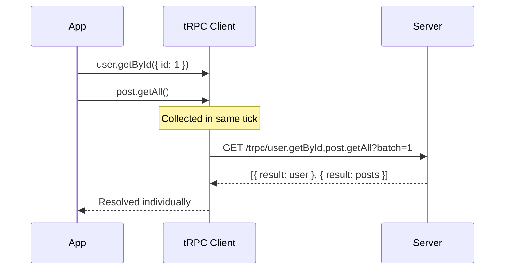

## HTTP Batch Link Setup in tRPC

### Overview

The HTTP batch link is a transport layer in tRPC that combines multiple procedure calls into a single HTTP request. Instead of sending one request per procedure, the client collects calls made within the same JavaScript event loop tick and dispatches them together as a batched request. This reduces network overhead when multiple queries or mutations are triggered simultaneously.

tRPC provides this via `@trpc/client`'s `httpBatchLink`.

---

### Installation

Ensure the client package is installed:

```bash
npm install @trpc/client @trpc/server
```

`httpBatchLink` is exported directly from `@trpc/client` — no separate package is required.

---

### Basic Setup

```typescript
import { createTRPCClient, httpBatchLink } from '@trpc/client';
import type { AppRouter } from '../server/router';

const client = createTRPCClient<AppRouter>({
  links: [
    httpBatchLink({
      url: 'http://localhost:3000/api/trpc',
    }),
  ],
});
```

**Key Points**
- `url` points to your tRPC HTTP endpoint.
- `links` is an array — tRPC uses a link chain, and `httpBatchLink` typically sits at the end as the terminating link.
- The type parameter `<AppRouter>` carries the server's type information to the client.

---

### How Batching Works

When multiple procedure calls are made synchronously (within the same tick), tRPC collects them and sends a single HTTP request:

```
GET /api/trpc/user.getById,post.getAll?batch=1&input=...
```

The server receives the batch, processes each procedure independently, and returns a JSON array of results — one entry per procedure call.



---

### Configuration Options

#### `url`

```typescript
httpBatchLink({
  url: 'https://api.example.com/trpc',
})
```

Required. The base URL of your tRPC router endpoint.

---

#### `headers`

Attach headers to every request — commonly used for authentication:

```typescript
httpBatchLink({
  url: '/api/trpc',
  headers() {
    return {
      Authorization: `Bearer ${getToken()}`,
    };
  },
})
```

`headers` accepts either a plain object or a function (sync or async) that returns an object. Using a function allows dynamic header values resolved at request time.

---

#### `fetch`

Override the underlying `fetch` implementation:

```typescript
import fetch from 'node-fetch';

httpBatchLink({
  url: '/api/trpc',
  fetch(url, options) {
    return fetch(url, {
      ...options,
      credentials: 'include',
    });
  },
})
```

Useful for:
- Adding `credentials: 'include'` for cookie-based auth
- Using a custom fetch polyfill in non-browser environments
- Injecting request interceptors

---

#### `maxURLLength`

Controls the threshold at which batched GET requests are split or converted to POST:

```typescript
httpBatchLink({
  url: '/api/trpc',
  maxURLLength: 2083,
})
```

**Key Points**
- Default behavior sends batched queries as GET requests with input serialized into the query string.
- If the URL would exceed `maxURLLength`, tRPC [Inference: based on documented behavior] splits the batch or falls back to POST.
- `2083` is a commonly used safe limit for Internet Explorer compatibility; modern browsers support longer URLs.

---

#### `transformer`

If you use a data transformer (e.g., `superjson`) on the server, specify it here so the client can serialize/deserialize correctly:

```typescript
import superjson from 'superjson';

httpBatchLink({
  url: '/api/trpc',
  transformer: superjson,
})
```

The transformer must match whatever is configured on the server-side router. Mismatches will cause deserialization errors at runtime.

---

### With `@trpc/react-query`

When using tRPC with React Query, the link is passed to `createTRPCReact`'s provider, not directly to `createTRPCClient`:

```typescript
import { trpc } from './trpc';
import { QueryClient, QueryClientProvider } from '@tanstack/react-query';
import { httpBatchLink } from '@trpc/client';

const queryClient = new QueryClient();

const trpcClient = trpc.createClient({
  links: [
    httpBatchLink({
      url: '/api/trpc',
      headers() {
        return {
          Authorization: `Bearer ${localStorage.getItem('token')}`,
        };
      },
    }),
  ],
});

function App() {
  return (
    <trpc.Provider client={trpcClient} queryClient={queryClient}>
      <QueryClientProvider client={queryClient}>
        <YourApp />
      </QueryClientProvider>
    </trpc.Provider>
  );
}
```

---

### Disabling Batching Per-Request

tRPC allows opting out of batching for individual calls using the `@trpc/client` escape hatch. However, `httpBatchLink` itself does not expose a per-call disable option natively.

To selectively disable batching, use a **split link** with `splitLink` (or `httpLink` for non-batched calls):

```typescript
import { createTRPCClient, httpBatchLink, httpLink, splitLink } from '@trpc/client';

const client = createTRPCClient<AppRouter>({
  links: [
    splitLink({
      condition(op) {
        return op.context.skipBatch === true;
      },
      true: httpLink({ url: '/api/trpc' }),
      false: httpBatchLink({ url: '/api/trpc' }),
    }),
  ],
});
```

Calls can then set context to bypass batching:

```typescript
client.someProc.query(input, {
  trpc: { context: { skipBatch: true } },
});
```

---

### Batching Behavior — Important Caveats

> [Inference] The following describes behavior consistent with tRPC's documented design. Actual runtime behavior may vary depending on version, environment, and server configuration.

- Batching only groups calls made within the **same synchronous tick**. Calls deferred by `setTimeout`, `await`, or other async boundaries will not be batched together.
- Server-side, each procedure in the batch is executed independently. Batching is a transport optimization only — it does not create a shared transaction or shared context between procedures.
- Error handling per procedure is independent. One failing procedure in a batch does not automatically reject the others.

---

### Common Mistakes

| Mistake | Effect |
|---|---|
| Mismatched transformer on client vs server | Silent deserialization errors or runtime exceptions |
| Using `httpBatchLink` without a terminating position in the link chain | Requests may not be sent |
| Pointing `url` at the wrong endpoint path | 404 errors; check your adapter's mount path |
| Expecting batching across async boundaries | Calls separated by `await` will not batch |

---

### Next Steps

- **Split Link** — Route calls conditionally between `httpBatchLink` and `httpLink`
- **WebSocket Link** — Replace or supplement HTTP batching with `wsLink` for subscriptions
- **Transformers** — Configure `superjson` or custom serializers for richer data types
- **Middleware / Headers** — Propagate auth tokens and request metadata through the link layer