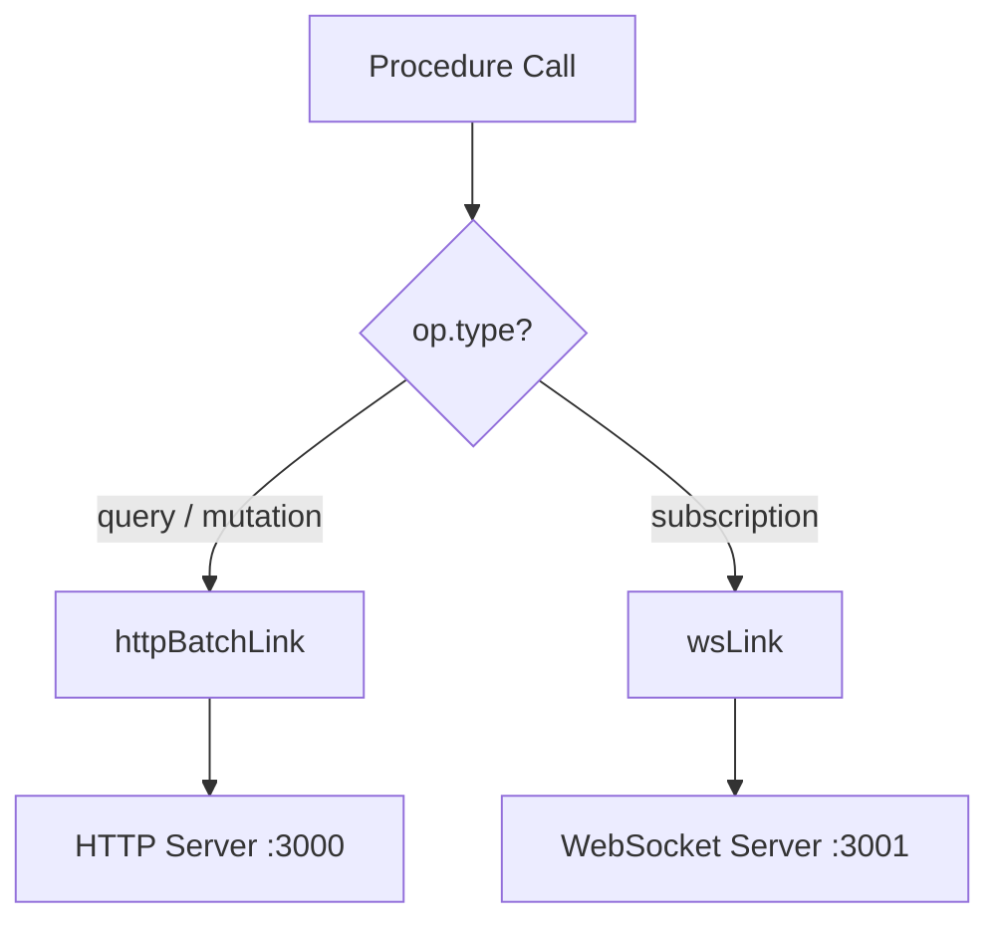
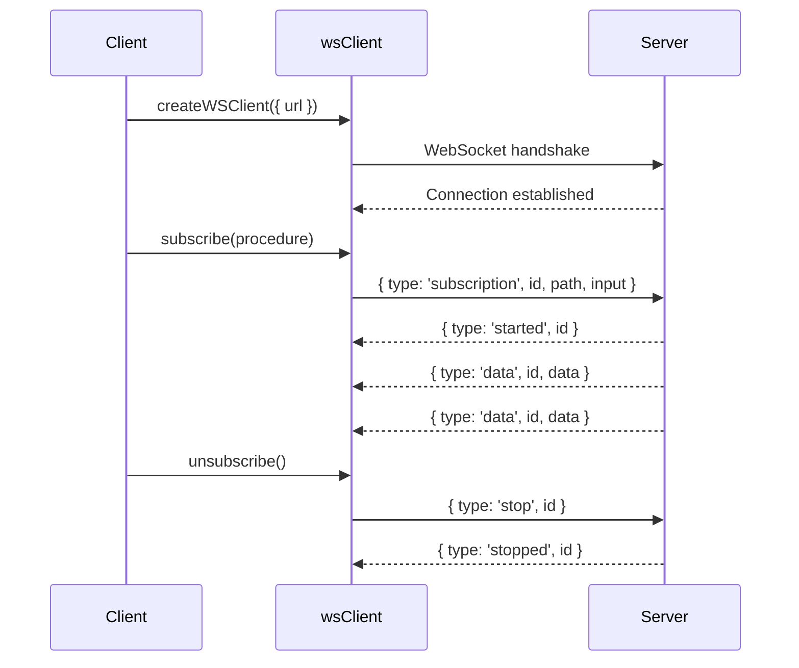

## WebSocket Link Setup

### Overview

tRPC's WebSocket link (`wsLink`) replaces or supplements the HTTP batch link with a persistent WebSocket connection. While `httpBatchLink` is request-response over HTTP, `wsLink` maintains an open connection and is the required transport for **subscriptions**. It can also handle queries and mutations, routing all procedure calls over the socket instead of HTTP.

The WebSocket link is provided by `@trpc/client`.

---

### Installation

```bash
npm install @trpc/client @trpc/server ws
npm install --save-dev @types/ws
```

`ws` is required on the server side. The browser uses its native `WebSocket` API. In Node.js client environments, a `WebSocket` polyfill may be needed.

---

### Server-Side Prerequisite

A WebSocket-capable tRPC server must be running before the client link is useful. A minimal example using the standalone adapter:

```typescript
import { createHTTPServer } from '@trpc/server/adapters/standalone';
import { applyWSSHandler } from '@trpc/server/adapters/ws';
import { WebSocketServer } from 'ws';
import { appRouter } from './router';
import { createContext } from './context';

const wss = new WebSocketServer({ port: 3001 });

applyWSSHandler({
  wss,
  router: appRouter,
  createContext,
});

console.log('WebSocket server listening on ws://localhost:3001');
```

The HTTP and WebSocket servers can run on separate ports, or on the same port using an HTTP upgrade handler.

---

### Basic Client Setup

```typescript
import { createTRPCClient, wsLink, createWSClient } from '@trpc/client';
import type { AppRouter } from '../server/router';

const wsClient = createWSClient({
  url: 'ws://localhost:3001',
});

const client = createTRPCClient<AppRouter>({
  links: [
    wsLink({
      client: wsClient,
    }),
  ],
});
```

**Key Points**
- `createWSClient` manages the underlying WebSocket connection, including reconnection logic.
- `wsLink` is the tRPC link that routes procedure calls through the `wsClient`.
- The `wsClient` instance is separate from the tRPC client — this allows sharing one socket across multiple tRPC client instances if needed.

---

### `createWSClient` Options

#### `url`

```typescript
createWSClient({
  url: 'ws://localhost:3001',
})
```

Required. Accepts `ws://` or `wss://` (TLS). Can also be a function returning a string or a `Promise<string>`, which is useful for dynamically resolving the URL or injecting auth tokens into the URL:

```typescript
createWSClient({
  url: async () => {
    const token = await getAuthToken();
    return `wss://api.example.com/trpc?token=${token}`;
  },
})
```

> [Inference] Embedding tokens in the URL is a common pattern for WebSocket auth since WebSocket handshakes do not support custom headers in browser environments. Security implications depend on your infrastructure.

---

#### `onOpen`

```typescript
createWSClient({
  url: 'ws://localhost:3001',
  onOpen() {
    console.log('WebSocket connection opened');
  },
})
```

Called when the connection is established.

---

#### `onClose`

```typescript
createWSClient({
  url: 'ws://localhost:3001',
  onClose(cause) {
    console.log('WebSocket closed', cause);
  },
})
```

Called when the connection closes. `cause` may contain the close event details.

---

#### `retryDelayMs`

Controls reconnection backoff:

```typescript
createWSClient({
  url: 'ws://localhost:3001',
  retryDelayMs(attemptIndex) {
    return Math.min(1000 * 2 ** attemptIndex, 30000);
  },
})
```

The function receives the attempt index (0-based) and returns a delay in milliseconds. [Inference] The default behavior reconnects automatically; the exact default delay strategy may vary by tRPC version.

---

### Subscriptions

Subscriptions are the primary use case for `wsLink`. The server must define a subscription procedure:

```typescript
// server/router.ts
import { observable } from '@trpc/server/observable';

export const appRouter = router({
  onMessage: publicProcedure.subscription(() => {
    return observable<{ text: string }>((emit) => {
      const handler = (data: { text: string }) => emit.next(data);
      eventEmitter.on('message', handler);
      return () => eventEmitter.off('message', handler);
    });
  }),
});
```

On the client:

```typescript
const subscription = client.onMessage.subscribe(undefined, {
  onData(data) {
    console.log('Received:', data.text);
  },
  onError(err) {
    console.error('Subscription error:', err);
  },
  onComplete() {
    console.log('Subscription ended');
  },
});

// Unsubscribe when done
subscription.unsubscribe();
```

---

### Split Link — HTTP for Queries/Mutations, WS for Subscriptions

A common production pattern uses `splitLink` to send queries and mutations over HTTP (batched) while routing subscriptions over WebSocket:

```typescript
import {
  createTRPCClient,
  httpBatchLink,
  wsLink,
  createWSClient,
  splitLink,
} from '@trpc/client';
import type { AppRouter } from '../server/router';

const wsClient = createWSClient({
  url: 'ws://localhost:3001',
});

const client = createTRPCClient<AppRouter>({
  links: [
    splitLink({
      condition(op) {
        return op.type === 'subscription';
      },
      true: wsLink({ client: wsClient }),
      false: httpBatchLink({ url: 'http://localhost:3000/api/trpc' }),
    }),
  ],
});
```

**Key Points**
- `op.type` will be `'query'`, `'mutation'`, or `'subscription'`.
- This pattern avoids opening a WebSocket connection unless a subscription is actually used [Inference: lazy connection behavior depends on tRPC version and wsClient implementation].
- Queries and mutations benefit from HTTP batching; subscriptions require the persistent socket.



---

### With `@trpc/react-query`

```typescript
import { trpc } from './trpc';
import { QueryClient, QueryClientProvider } from '@tanstack/react-query';
import { httpBatchLink, wsLink, createWSClient, splitLink } from '@trpc/client';

const queryClient = new QueryClient();

const wsClient = createWSClient({
  url: process.env.NEXT_PUBLIC_WS_URL ?? 'ws://localhost:3001',
});

const trpcClient = trpc.createClient({
  links: [
    splitLink({
      condition(op) {
        return op.type === 'subscription';
      },
      true: wsLink({ client: wsClient }),
      false: httpBatchLink({
        url: process.env.NEXT_PUBLIC_TRPC_URL ?? 'http://localhost:3000/api/trpc',
      }),
    }),
  ],
});

function App() {
  return (
    <trpc.Provider client={trpcClient} queryClient={queryClient}>
      <QueryClientProvider client={queryClient}>
        <YourApp />
      </QueryClientProvider>
    </trpc.Provider>
  );
}
```

Using a subscription in a component:

```typescript
function MessageFeed() {
  trpc.onMessage.useSubscription(undefined, {
    onData(data) {
      console.log(data.text);
    },
  });

  return <div>Listening...</div>;
}
```

---

### Connection Lifecycle



---

### Transformer Configuration

If using a transformer like `superjson`, configure it on both the `wsLink` and the server:

```typescript
import superjson from 'superjson';

wsLink({
  client: wsClient,
  transformer: superjson,
})
```

The transformer must be consistent across all links and the server router. Mismatches cause silent deserialization failures.

---

### Common Mistakes

| Mistake | Effect |
|---|---|
| Using `wsLink` without a WS-capable server | Connection refused or immediate close |
| Forgetting to call `unsubscribe()` | Memory leak; server continues emitting |
| Mismatched transformer between `wsLink` and server | Deserialization errors at runtime |
| Embedding secrets in URL without TLS (`ws://`) | Credentials exposed in plaintext |
| Expecting `httpBatchLink` to handle subscriptions | Subscriptions silently fail or are unsupported |

---

### Behavioral Caveats

> [Inference] The following describes behavior consistent with tRPC's documented design. Actual runtime behavior may vary by version and environment.

- Reconnection is handled automatically by `createWSClient`, but in-flight subscriptions may need to be re-established after a reconnect depending on server and client state.
- In server-side rendering (SSR) environments, WebSocket connections cannot be established during the server render pass. Use `httpBatchLink` for SSR and reserve `wsLink` for client-side only.
- The WebSocket protocol does not natively support request headers after the initial handshake. Auth typically must be passed via URL params, subprotocol headers during the handshake, or an initial message exchange.

---

### Next Steps

- **Subscriptions** — Define server-side observable procedures and manage subscription state
- **splitLink** — Fine-grained routing across multiple links
- **Transformers** — Configure `superjson` for richer data types over WS
- **Authentication over WebSocket** — Token strategies for secure socket connections