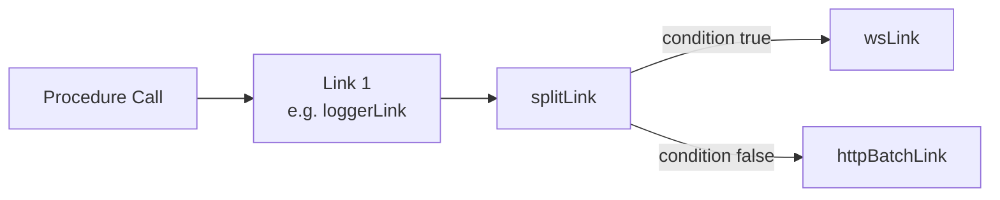
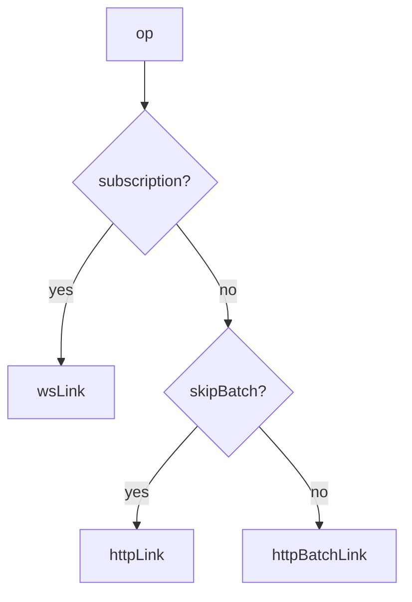

## Splitting Links Conditionally

### Overview

tRPC's link system is a middleware chain — each procedure call passes through links in order until a **terminating link** sends it over the network. `splitLink` inserts a conditional branch into that chain, routing each operation to one of two sub-chains based on a predicate function evaluated at call time.

This enables patterns such as routing subscriptions to WebSocket while queries and mutations go over HTTP, or bypassing batching for specific procedures.

---

### How the Link Chain Works

Before examining `splitLink` in isolation, it helps to understand where it sits:



Links earlier in the array wrap later ones. `splitLink` is not itself a terminating link — it delegates to whichever branch matches the condition, and that branch terminates the call.

---

### Basic Usage

```typescript
import {
  createTRPCClient,
  splitLink,
  httpBatchLink,
  httpLink,
} from '@trpc/client';
import type { AppRouter } from '../server/router';

const client = createTRPCClient<AppRouter>({
  links: [
    splitLink({
      condition(op) {
        return op.context.skipBatch === true;
      },
      true: httpLink({ url: '/api/trpc' }),
      false: httpBatchLink({ url: '/api/trpc' }),
    }),
  ],
});
```

**Key Points**
- `condition` receives the operation object `op` and must return a boolean.
- `true` is the link (or link array) used when the condition returns `true`.
- `false` is the link (or link array) used when the condition returns `false`.
- Both branches must be valid terminating links or sub-chains that terminate.

---

### The Operation Object

The `condition` function receives an `Operation` with the following shape:

```typescript
type Operation = {
  id: number;           // Unique ID for this call
  type: 'query' | 'mutation' | 'subscription';
  path: string;         // e.g. 'user.getById'
  input: unknown;       // The input passed to the procedure
  context: Record<string, unknown>; // Per-call context set by the caller
  signal: AbortSignal | null;
};
```

Any of these fields can be used as routing criteria.

---

### Common Patterns

#### Subscriptions over WebSocket, Everything Else over HTTP

The most widely used pattern:

```typescript
import { createWSClient, splitLink, wsLink, httpBatchLink } from '@trpc/client';

const wsClient = createWSClient({ url: 'ws://localhost:3001' });

const client = createTRPCClient<AppRouter>({
  links: [
    splitLink({
      condition(op) {
        return op.type === 'subscription';
      },
      true: wsLink({ client: wsClient }),
      false: httpBatchLink({ url: 'http://localhost:3000/api/trpc' }),
    }),
  ],
});
```

---

#### Bypass Batching for Specific Calls

Route a single call outside the batch:

```typescript
splitLink({
  condition(op) {
    return op.context.skipBatch === true;
  },
  true: httpLink({ url: '/api/trpc' }),
  false: httpBatchLink({ url: '/api/trpc' }),
})
```

At the call site, pass context to trigger the condition:

```typescript
// React Query variant
const result = trpc.heavyReport.useQuery(input, {
  trpc: { context: { skipBatch: true } },
});

// Vanilla client variant
const result = await client.heavyReport.query(input, {
  context: { skipBatch: true },
});
```

---

#### Route by Path Prefix

Send calls under a specific router namespace to a different endpoint:

```typescript
splitLink({
  condition(op) {
    return op.path.startsWith('admin.');
  },
  true: httpBatchLink({
    url: 'https://admin-api.example.com/trpc',
    headers() {
      return { 'X-Admin-Key': getAdminToken() };
    },
  }),
  false: httpBatchLink({
    url: 'https://api.example.com/trpc',
  }),
})
```

---

#### Route by Operation Type — Mutations to a Separate Endpoint

```typescript
splitLink({
  condition(op) {
    return op.type === 'mutation';
  },
  true: httpLink({ url: '/api/trpc/write' }),
  false: httpBatchLink({ url: '/api/trpc/read' }),
})
```

> [Inference] This pattern could support read/write separation at the infrastructure level (e.g., read replicas). Whether this is meaningful depends entirely on your backend architecture.

---

### Chaining Multiple Splits

`splitLink` branches are themselves full link chains. You can nest splits or compose them sequentially:

```typescript
const wsClient = createWSClient({ url: 'ws://localhost:3001' });

const client = createTRPCClient<AppRouter>({
  links: [
    splitLink({
      condition(op) {
        return op.type === 'subscription';
      },
      true: wsLink({ client: wsClient }),
      false: splitLink({
        condition(op) {
          return op.context.skipBatch === true;
        },
        true: httpLink({ url: '/api/trpc' }),
        false: httpBatchLink({ url: '/api/trpc' }),
      }),
    }),
  ],
});
```



---

### Combining with Non-Terminating Links

Non-terminating links such as `loggerLink` can wrap the entire split:

```typescript
import { loggerLink } from '@trpc/client';

const client = createTRPCClient<AppRouter>({
  links: [
    loggerLink(),
    splitLink({
      condition(op) {
        return op.type === 'subscription';
      },
      true: wsLink({ client: wsClient }),
      false: httpBatchLink({ url: '/api/trpc' }),
    }),
  ],
});
```

`loggerLink` runs before the split, so it sees all operations regardless of which branch they take.

---

### Setting Context at the Call Site

Context is the primary mechanism for passing per-call metadata into the condition function. It is set differently depending on whether you use the vanilla client or React Query:

**Vanilla client:**

```typescript
client.someProc.query(input, {
  context: { skipBatch: true },
});
```

**React Query (`useQuery`):**

```typescript
trpc.someProc.useQuery(input, {
  trpc: { context: { skipBatch: true } },
});
```

**Key Points**
- Context is not sent to the server. It is a client-side routing mechanism only.
- Any serializable or non-serializable value can be stored in context — it is not transmitted over the wire.

---

### Behavioral Caveats

> [Inference] The following describes behavior consistent with tRPC's documented design. Actual runtime behavior may vary by version and environment.

- `condition` is evaluated once per operation at dispatch time, not reactively. Changing context after a call is initiated does not reroute it.
- If the `true` or `false` branch is not a valid terminating link, the operation will hang or error — tRPC does not validate branch completeness at setup time.
- Nesting splits deeply increases cognitive overhead. Prefer flat routing tables for more than two conditions [Inference: no official guidance on nesting depth limits exists].

---

### Common Mistakes

| Mistake | Effect |
|---|---|
| Providing a non-terminating link as a branch | Operation never resolves |
| Using `op.context` without setting it at the call site | Condition always evaluates to `false` |
| Forgetting that context is client-only | Attempting to read it server-side returns nothing |
| Placing `splitLink` after the terminating link | Unreachable; call already resolved |
| Nesting splits without a catch-all `false` branch | Some operations may hit an invalid terminal |

---

### Next Steps

- **Custom Links** — Build non-terminating links for logging, retry, or auth injection
- **loggerLink** — Inspect operations and responses flowing through the chain
- **Context Propagation** — Pass metadata through the link chain to headers or transformers
- **wsLink + httpBatchLink** — The canonical split for subscription-capable clients