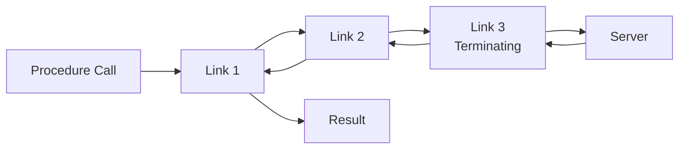
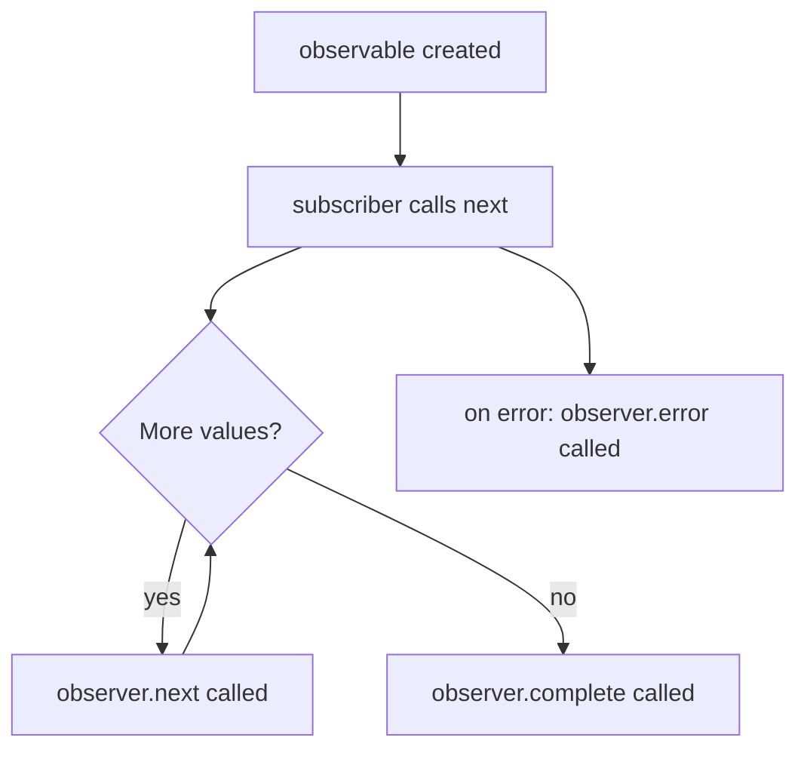

## Links and How They Work

### Overview

In tRPC, a **link** is a function that intercepts a procedure call, optionally transforms it, and either passes it to the next link in the chain or terminates it by sending a network request. Links are the composable middleware layer between your application code and the transport layer.

Every tRPC client has a `links` array. When a procedure is called, tRPC passes the operation through each link in order. The last link in the chain must be a **terminating link** — one that actually sends the request and returns a response.

---

### Mental Model

Links are conceptually similar to middleware in Express or Next.js, or operators in RxJS. Each link receives an operation, can act on it, and either forwards it or resolves it directly.



The request flows forward through the chain; the response flows back through the same chain in reverse. Each link can act on both the outgoing operation and the incoming result.

---

### Anatomy of a Link

A link is a function that conforms to this signature:

```typescript
type TRPCLink<TRouter extends AnyRouter> = (
  opts: { op: Operation }
) => Observable<TRPCResponse, TRPCClientError<TRouter>>;
```

In practice, tRPC provides a factory function `TRPCClientRuntime` context and wraps this via a helper. When you write a custom link, you use the `link` factory:

```typescript
import { TRPCLink } from '@trpc/client';
import { observable } from '@trpc/server/observable';
import type { AppRouter } from '../server/router';

const myLink: TRPCLink<AppRouter> = () => {
  // Setup code runs once at client initialization
  return ({ next, op }) => {
    // This runs for every operation
    return observable((observer) => {
      console.log('Outgoing:', op.type, op.path);

      const subscription = next(op).subscribe({
        next(result) {
          console.log('Incoming:', result);
          observer.next(result);
        },
        error(err) {
          observer.error(err);
        },
        complete() {
          observer.complete();
        },
      });

      return subscription;
    });
  };
};
```

**Key Points**
- The outer function runs **once** when the client is created — use it for one-time setup.
- The inner function runs **once per operation** — use it for per-call logic.
- `next(op)` forwards the operation to the next link and returns an `Observable`.
- Subscribing to that observable and re-emitting through `observer` is what threads the result back through the chain.

---

### The Operation Object

Every link receives an `Operation` describing the call:

```typescript
type Operation = {
  id: number;                              // Unique per-call ID
  type: 'query' | 'mutation' | 'subscription';
  path: string;                            // e.g. 'user.getById'
  input: unknown;                          // Caller-provided input
  context: Record<string, unknown>;        // Per-call metadata (client-side only)
  signal: AbortSignal | null;              // Abort signal if provided
};
```

Any link in the chain can read or modify `op` before passing it to `next`.

---

### Two Categories of Links

#### Terminating Links

A terminating link does **not** call `next`. It sends the operation over the network and resolves the observable itself. There must be exactly one terminating link, and it must be the last entry in the `links` array.

Built-in terminating links:

| Link | Transport |
|---|---|
| `httpLink` | Single HTTP request per call |
| `httpBatchLink` | Batches calls into one HTTP request |
| `wsLink` | Sends over a persistent WebSocket |

#### Non-Terminating Links

A non-terminating link calls `next(op)` to forward the operation. It can act before forwarding (on the request), after forwarding (on the response), or both. It must never be placed last in the chain without a terminating link following it.

Built-in non-terminating links:

| Link | Purpose |
|---|---|
| `loggerLink` | Logs operations and results to the console |
| `splitLink` | Branches to one of two sub-chains based on a condition |

---

### Observable-Based Design

tRPC links use a lightweight observable implementation (`@trpc/server/observable`) rather than promises. This is necessary because subscriptions emit **multiple values over time**, whereas promises resolve once.



For queries and mutations, the observable emits exactly one value then completes. For subscriptions, it emits many values until unsubscribed or the server closes the stream. Links do not need to handle these cases differently — the observable contract is uniform.

---

### Execution Order

Given this client setup:

```typescript
const client = createTRPCClient<AppRouter>({
  links: [
    linkA,
    linkB,
    httpBatchLink({ url: '/api/trpc' }), // terminating
  ],
});
```

The execution order is:

```
→ linkA (outgoing)
  → linkB (outgoing)
    → httpBatchLink → [network] → server
    ← httpBatchLink (response)
  ← linkB (incoming)
← linkA (incoming)
```

Each link wraps the next. Outgoing logic before `next(op)` runs top-to-bottom; incoming logic in the `.subscribe` handlers runs bottom-to-top.

---

### Modifying an Operation in Flight

A link can mutate `op` before forwarding it:

```typescript
const addVersionLink: TRPCLink<AppRouter> = () => {
  return ({ next, op }) => {
    return next({
      ...op,
      context: {
        ...op.context,
        clientVersion: '1.4.2',
      },
    });
  };
};
```

> [Inference] Context modifications are visible to subsequent links in the chain. Whether a downstream link (e.g. `httpBatchLink`) uses that context depends on its implementation. Context is never sent to the server automatically — a link must explicitly read it and inject it into headers or the request body.

---

### Modifying a Response in Flight

A link can intercept and transform results before they reach the caller:

```typescript
const transformResultLink: TRPCLink<AppRouter> = () => {
  return ({ next, op }) => {
    return observable((observer) => {
      return next(op).subscribe({
        next(result) {
          // Unwrap or transform result here
          observer.next(result);
        },
        error(err) {
          observer.error(err);
        },
        complete() {
          observer.complete();
        },
      });
    });
  };
};
```

---

### Short-Circuiting — Resolving Without `next`

A link can resolve an operation without forwarding it at all:

```typescript
const cacheLink: TRPCLink<AppRouter> = () => {
  const cache = new Map<string, unknown>();

  return ({ next, op }) => {
    return observable((observer) => {
      if (op.type === 'query' && cache.has(op.path)) {
        observer.next({ result: { data: cache.get(op.path) } } as any);
        observer.complete();
        return;
      }

      return next(op).subscribe({
        next(result) {
          cache.set(op.path, (result as any).result.data);
          observer.next(result);
        },
        error: observer.error.bind(observer),
        complete: observer.complete.bind(observer),
      });
    });
  };
};
```

> [Inference] The shape of the result object passed to `observer.next` must match what tRPC expects downstream. Incorrectly shaped objects may cause runtime errors. Behavior is not guaranteed and may vary by tRPC version.

---

### Cleanup and Unsubscription

The function returned from the `observable` callback is a teardown. It runs when the subscriber unsubscribes — for example, when a React component unmounts or an AbortSignal fires:

```typescript
return observable((observer) => {
  const subscription = next(op).subscribe({ /* ... */ });

  // Teardown
  return () => {
    subscription.unsubscribe();
  };
});
```

Failing to return teardown logic from a link that wraps a subscription can cause resource leaks.

---

### Placement Rules

| Position | Requirement |
|---|---|
| Last in `links` array | Must be a terminating link |
| Any position before last | Must call `next(op)` eventually |
| `splitLink` branches | Each branch must itself terminate |
| Multiple terminating links | Not supported — only the last one is reachable |

---

### Common Mistakes

| Mistake | Effect |
|---|---|
| No terminating link | Operations hang indefinitely |
| Terminating link not last | Links after it are unreachable |
| Forgetting to subscribe to `next(op)` | Operation is forwarded but result is never received |
| Not returning teardown in observable | Subscriptions leak on unmount or abort |
| Calling `next` in a terminating link | Causes an error or unexpected behavior |

---

### Next Steps

- **Custom Links** — Build production-grade links for retry, auth token refresh, or error normalization
- **loggerLink** — Examine the built-in non-terminating link as a reference implementation
- **splitLink** — Conditional routing as a specialized non-terminating link
- **Observables** — Deeper understanding of the reactive primitive tRPC links are built on