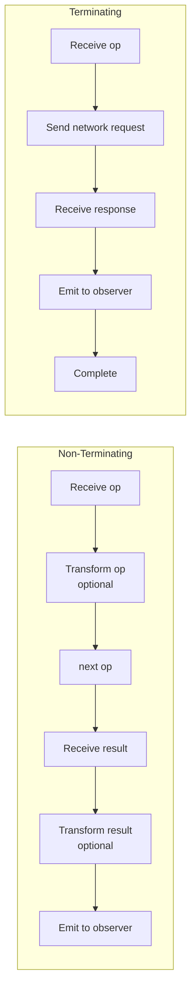
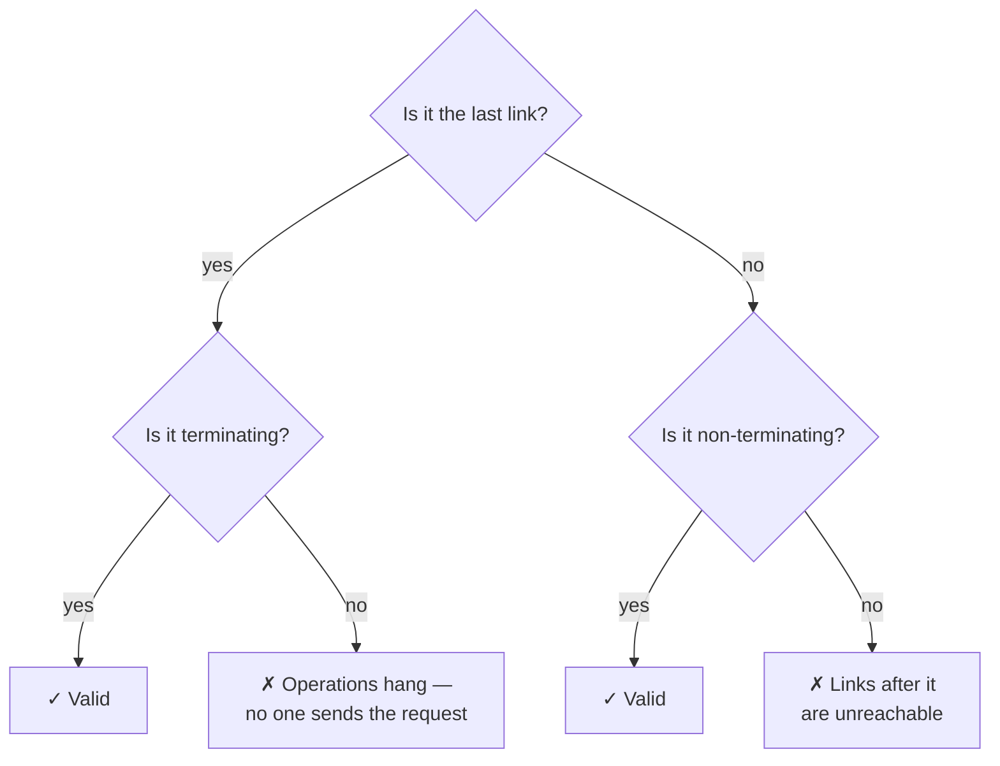

## Terminating vs Non-Terminating Links

### Overview

Every link in a tRPC client falls into one of two categories based on a single criterion: whether it calls `next(op)` to forward the operation to the next link, or resolves the operation itself. This distinction determines where a link may appear in the chain and what responsibilities it carries.

---

### The Core Distinction

| | Terminating | Non-Terminating |
|---|---|---|
| Calls `next(op)` | No | Yes |
| Sends network request | Yes | No |
| Position in chain | Must be last | Any position before last |
| Emits response | Itself | Delegates to downstream |
| Examples | `httpBatchLink`, `wsLink`, `httpLink` | `loggerLink`, `splitLink`, custom middleware |

---

### Terminating Links

A terminating link is the final link in the chain. It receives the operation, sends it over the network (or otherwise resolves it), and emits the result directly into the observable it returns. It never calls `next`.

#### Canonical Structure

```typescript
import { TRPCLink } from '@trpc/client';
import { observable } from '@trpc/server/observable';
import type { AppRouter } from '../server/router';

const myTerminatingLink: TRPCLink<AppRouter> = () => {
  return ({ op }) => {
    // No `next` parameter used
    return observable((observer) => {
      fetch(`/api/trpc/${op.path}`, {
        method: op.type === 'query' ? 'GET' : 'POST',
        body: JSON.stringify(op.input),
      })
        .then((res) => res.json())
        .then((data) => {
          observer.next({ result: { data } } as any);
          observer.complete();
        })
        .catch((err) => {
          observer.error(err);
        });
    });
  };
};
```

**Key Points**
- The observable is responsible for emitting exactly one value (queries/mutations) or many values (subscriptions) and then completing or erroring.
- No reference to `next` exists. The link is the end of the chain.
- Teardown logic (e.g. aborting the fetch) should be returned from the observable callback.

#### Built-In Terminating Links

```typescript
import { httpLink, httpBatchLink, wsLink } from '@trpc/client';
```

| Link | Behavior |
|---|---|
| `httpLink` | One HTTP request per operation |
| `httpBatchLink` | Collects same-tick operations into one HTTP request |
| `wsLink` | Sends operations over a persistent WebSocket connection |

---

### Non-Terminating Links

A non-terminating link receives the operation, optionally transforms it, calls `next(op)` to forward it, and optionally acts on the result before returning it to the previous link. It is middleware in the classical sense.

#### Canonical Structure

```typescript
import { TRPCLink } from '@trpc/client';
import { observable } from '@trpc/server/observable';
import type { AppRouter } from '../server/router';

const myNonTerminatingLink: TRPCLink<AppRouter> = () => {
  return ({ next, op }) => {
    return observable((observer) => {
      // Act on the outgoing operation
      console.log('→', op.type, op.path);

      const subscription = next(op).subscribe({
        next(result) {
          // Act on the incoming result
          console.log('←', result);
          observer.next(result);
        },
        error(err) {
          observer.error(err);
        },
        complete() {
          observer.complete();
        },
      });

      // Teardown
      return () => subscription.unsubscribe();
    });
  };
};
```

**Key Points**
- `next(op)` must be called, and its observable must be subscribed to — otherwise the operation is forwarded but the result is never received.
- The teardown must unsubscribe from `next(op)`'s subscription to avoid leaks.
- Outgoing logic runs before `next(op)`; incoming logic runs inside the `.subscribe` handlers.

#### Built-In Non-Terminating Links

| Link | Behavior |
|---|---|
| `loggerLink` | Logs operations and results; forwards unchanged |
| `splitLink` | Branches to one of two sub-chains; each branch terminates |

---

### Side-by-Side Comparison



---

### Intercepting at Different Points

Non-terminating links can act at three distinct points in the operation lifecycle:

#### Before Forwarding — Outgoing

```typescript
return ({ next, op }) => {
  return observable((observer) => {
    // Runs before the request is sent
    const modifiedOp = {
      ...op,
      context: { ...op.context, timestamp: Date.now() },
    };

    return next(modifiedOp).subscribe({
      next: observer.next.bind(observer),
      error: observer.error.bind(observer),
      complete: observer.complete.bind(observer),
    });
  });
};
```

#### After Forwarding — Incoming

```typescript
return ({ next, op }) => {
  return observable((observer) => {
    return next(op).subscribe({
      next(result) {
        // Runs after the response arrives
        trackAnalytics(op.path, result);
        observer.next(result);
      },
      error: observer.error.bind(observer),
      complete: observer.complete.bind(observer),
    });
  });
};
```

#### Both — Wrapping

```typescript
return ({ next, op }) => {
  return observable((observer) => {
    const start = performance.now();

    return next(op).subscribe({
      next(result) {
        const duration = performance.now() - start;
        console.log(`${op.path} completed in ${duration.toFixed(1)}ms`);
        observer.next(result);
      },
      error(err) {
        const duration = performance.now() - start;
        console.error(`${op.path} failed after ${duration.toFixed(1)}ms`, err);
        observer.error(err);
      },
      complete: observer.complete.bind(observer),
    });
  });
};
```

---

### Short-Circuiting in a Non-Terminating Link

A non-terminating link can resolve an operation without calling `next` — effectively behaving as a terminating link for that operation. This is used for caching, mocking, or blocking:

```typescript
return ({ next, op }) => {
  return observable((observer) => {
    if (op.context.useMock) {
      observer.next({ result: { data: { mocked: true } } } as any);
      observer.complete();
      return;
    }

    return next(op).subscribe({
      next: observer.next.bind(observer),
      error: observer.error.bind(observer),
      complete: observer.complete.bind(observer),
    });
  });
};
```

> [Inference] The result object shape passed to `observer.next` must match what tRPC expects. Incorrectly shaped objects may cause downstream errors. Behavior is not guaranteed and may vary by tRPC version.

---

### Chain Validity Rules



**Rules:**
- The last link in `links` must be terminating.
- All links before the last must call `next(op)` at some point.
- `splitLink` branches are sub-chains — each branch must independently satisfy these rules.

---

### Placement Examples

```typescript
// ✓ Valid
links: [
  loggerLink(),          // non-terminating
  myAuthLink(),          // non-terminating
  httpBatchLink({ url }) // terminating — last
]

// ✗ Invalid — terminating link is not last
links: [
  httpBatchLink({ url }), // terminating
  loggerLink(),           // unreachable
]

// ✗ Invalid — no terminating link
links: [
  loggerLink(),   // non-terminating
  myAuthLink(),   // non-terminating
  // nothing sends the request
]

// ✓ Valid — splitLink branches both terminate
links: [
  loggerLink(),
  splitLink({
    condition: (op) => op.type === 'subscription',
    true: wsLink({ client: wsClient }),       // terminating
    false: httpBatchLink({ url }),            // terminating
  }),
]
```

---

### Behavioral Caveats

> [Inference] The following describes behavior consistent with tRPC's documented design. Actual runtime behavior may vary by version and environment.

- If a non-terminating link fails to subscribe to `next(op)`, the operation is forwarded but its result is silently dropped — no error is thrown at setup time.
- If teardown is not returned from the observable callback, unsubscription (e.g. component unmount, AbortSignal) will not cancel the underlying request, causing potential memory leaks.
- `splitLink` is non-terminating from the chain's perspective but delegates termination to its branches. Each branch must be a valid terminating link or a valid sub-chain ending in one.

---

### Common Mistakes

| Mistake | Effect |
|---|---|
| Non-terminating link placed last | Operations are forwarded to nothing; hang indefinitely |
| Terminating link placed before last | Subsequent links are unreachable |
| Not subscribing to `next(op)` result | Response is silently lost |
| Not returning teardown from observable | Subscriptions and fetch requests leak on unmount |
| Calling `next` inside a terminating link | Likely runtime error or undefined behavior |
| Emitting wrong result shape in short-circuit | Downstream deserialization errors |

---

### Next Steps

- **Custom Links** — Implement retry logic, token refresh, or error normalization as non-terminating links
- **loggerLink** — Study the built-in non-terminating link as a reference
- **splitLink** — Conditional branching as a specialized non-terminating link
- **Observables** — Understand the reactive primitive underlying all link communication