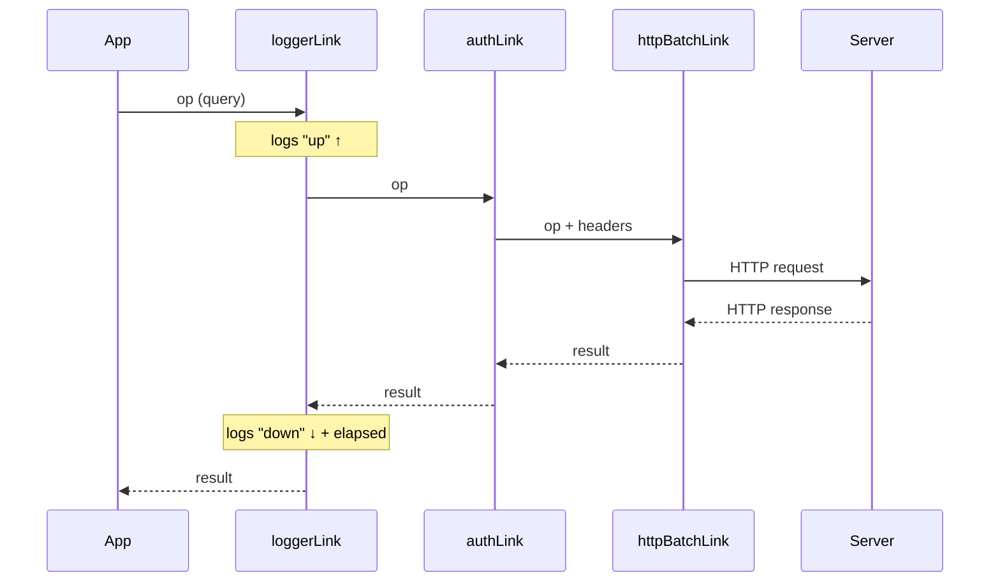

## loggerLink

### Overview

`loggerLink` is a built-in non-terminating link that logs outgoing operations and incoming results to the console. It is placed in the `links` array before the terminating link and passes every operation through unchanged — its only effect is observational. It is primarily a development and debugging tool.

---

### Installation

`loggerLink` is exported from `@trpc/client` — no additional package is required:

```typescript
import { loggerLink } from '@trpc/client';
```

---

### Basic Setup

```typescript
import { createTRPCClient, loggerLink, httpBatchLink } from '@trpc/client';
import type { AppRouter } from '../server/router';

const client = createTRPCClient<AppRouter>({
  links: [
    loggerLink(),
    httpBatchLink({ url: '/api/trpc' }),
  ],
});
```

With no configuration, `loggerLink` uses its built-in console logger and logs all operations in all environments.

---

### What It Logs

For every operation, `loggerLink` produces two log entries:

**On dispatch (outgoing):**
- Direction indicator
- Operation type (`query`, `mutation`, `subscription`)
- Procedure path
- Input

**On result (incoming):**
- Direction indicator
- Operation type and path
- Elapsed time
- Result data or error

**Example** (approximate console output — exact format may vary by version):

```
<< query user.getById #1 {id: 1}
>> query user.getById #1 +42ms {id: 1, name: "Alice"}
```

> [Inference] The exact log format, symbols, and fields depend on the tRPC version in use. The above is representative, not guaranteed.

---

### Configuration Options

`loggerLink` accepts an optional configuration object.

#### `logger`

Override the default console output with a custom logging function:

```typescript
loggerLink({
  logger(opts) {
    console.log(opts);
  },
})
```

The `opts` object passed to `logger` has this shape:

```typescript
type LoggerLinkOptions = {
  direction: 'up' | 'down';    // 'up' = outgoing, 'down' = incoming
  type: 'query' | 'mutation' | 'subscription';
  path: string;
  id: number;
  input: unknown;               // present on direction 'up'
  result?: unknown;             // present on direction 'down'
  elapsedMs?: number;           // present on direction 'down'
  context: Record<string, unknown>;
};
```

> [Inference] The exact shape of `opts` may differ slightly between tRPC versions. Treat field names as representative rather than guaranteed.

---

#### `enabled`

Control whether logging is active. Accepts a boolean or a function that receives the log opts and returns a boolean:

```typescript
// Disable entirely in production
loggerLink({
  enabled: () => process.env.NODE_ENV === 'development',
})
```

```typescript
// Only log errors
loggerLink({
  enabled(opts) {
    return opts.direction === 'down' && opts.result instanceof Error;
  },
})
```

```typescript
// Only log a specific procedure
loggerLink({
  enabled(opts) {
    return opts.path === 'user.getById';
  },
})
```

**Key Points**
- When `enabled` returns `false` for an operation, the link still forwards it — it simply skips logging.
- The `enabled` function receives the same `opts` object as `logger`, so all fields are available for filtering.

---

#### `colorMode`

Controls ANSI color output:

```typescript
loggerLink({
  colorMode: 'ansi', // default in Node.js environments
})

loggerLink({
  colorMode: 'css',  // for browser DevTools console
})

loggerLink({
  colorMode: 'none', // no color
})
```

> [Inference] Color rendering depends on the environment's console implementation. Browser DevTools typically require `'css'`; Node.js terminals typically use `'ansi'`. Behavior may vary.

---

### Placement in the Link Chain

`loggerLink` must be placed **before** the terminating link. Placing it first gives it visibility over all operations:

```typescript
links: [
  loggerLink(),               // sees everything
  myAuthLink(),               // non-terminating
  httpBatchLink({ url }),     // terminating
]
```

Because non-terminating link logic runs outward-in on the way down and inward-out on the way back up, a `loggerLink` at position 0 logs the operation first on the way out and last on the way back in — after all other links have processed the result.



---

### Custom Logger Examples

#### Structured JSON Logging

```typescript
loggerLink({
  logger(opts) {
    const entry = {
      timestamp: new Date().toISOString(),
      direction: opts.direction,
      type: opts.type,
      path: opts.path,
      id: opts.id,
      ...(opts.direction === 'down' && {
        elapsedMs: opts.elapsedMs,
        ok: !(opts.result instanceof Error),
      }),
    };
    console.log(JSON.stringify(entry));
  },
})
```

#### Log Errors Only

```typescript
loggerLink({
  enabled(opts) {
    return opts.direction === 'down' && opts.result instanceof Error;
  },
  logger(opts) {
    console.error(`[tRPC error] ${opts.path}`, opts.result);
  },
})
```

#### Forward to External Observability Service

```typescript
loggerLink({
  logger(opts) {
    if (opts.direction === 'down' && opts.elapsedMs !== undefined) {
      telemetry.record({
        name: 'trpc.request',
        path: opts.path,
        type: opts.type,
        durationMs: opts.elapsedMs,
        error: opts.result instanceof Error ? opts.result.message : null,
      });
    }
  },
})
```

> [Inference] Integration with external services depends on the service's SDK and your application's environment. The above illustrates the pattern, not a specific integration.

---

### Disabling in Production

A common pattern is to enable `loggerLink` only in development:

```typescript
import { createTRPCClient, loggerLink, httpBatchLink } from '@trpc/client';

const client = createTRPCClient<AppRouter>({
  links: [
    loggerLink({
      enabled(opts) {
        return (
          process.env.NODE_ENV === 'development' ||
          (opts.direction === 'down' && opts.result instanceof Error)
        );
      },
    }),
    httpBatchLink({ url: '/api/trpc' }),
  ],
});
```

This keeps the link in the chain at all times — avoiding conditional array construction — while suppressing output in production except for errors.

---

### Behavioral Caveats

> [Inference] The following describes behavior consistent with tRPC's documented design. Actual runtime behavior may vary by version and environment.

- `loggerLink` does not modify `op` or the result in any way. It is purely observational.
- The `enabled` function is evaluated per log event (once on the way up, once on the way down). The two evaluations are independent — you can log outgoing but suppress incoming, or vice versa.
- In SSR environments, console output from `loggerLink` appears in the server process stdout, not the browser DevTools.
- Elapsed time (`elapsedMs`) measures the time between the outgoing log and the incoming log within the link itself — not total server processing time or network round-trip time in isolation.

---

### Common Mistakes

| Mistake | Effect |
|---|---|
| Placing `loggerLink` after the terminating link | Unreachable; logs nothing |
| Expecting `elapsedMs` on the outgoing (`'up'`) event | Field is only present on `'down'` |
| Using `colorMode: 'ansi'` in a browser | Escape codes appear as raw text in DevTools |
| Logging sensitive input data in production | Auth tokens, PII, or credentials appear in logs |
| Constructing `links` conditionally to omit `loggerLink` | Adds complexity; use `enabled` instead |

---

### Next Steps

- **Custom Links** — Build links that go beyond observation, such as retry or token refresh
- **splitLink** — Combine with `loggerLink` to observe only certain operation types
- **Error Handling in Links** — Intercept and normalize errors in the link chain
- **Observability** — Forward tRPC telemetry to tools like Datadog, Sentry, or OpenTelemetry