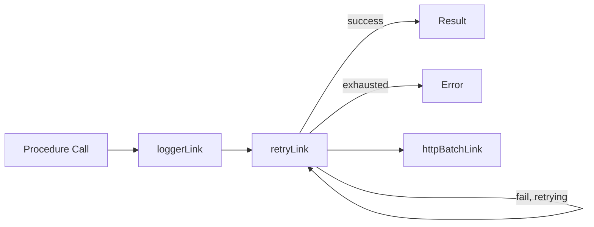
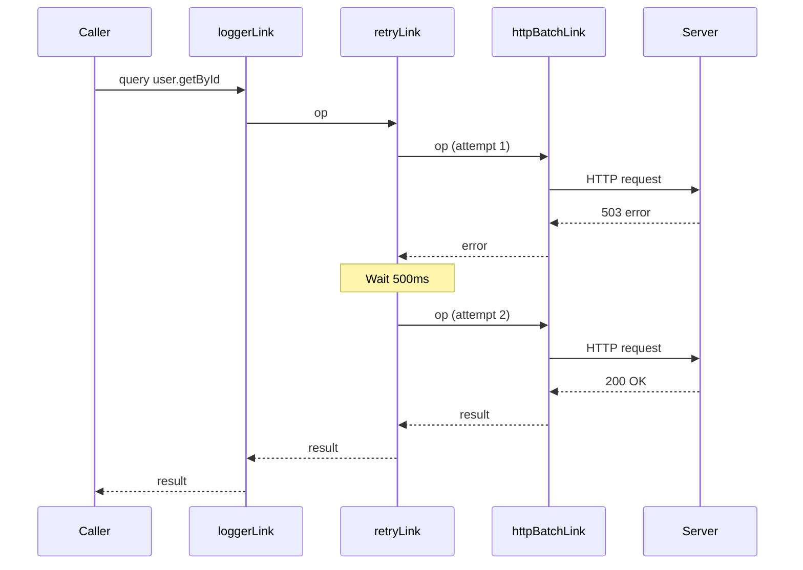

## retryLink

### Overview

`retryLink` is a non-terminating link that automatically retries failed operations before propagating the error to the caller. Rather than surfacing a network failure or transient server error immediately, it re-dispatches the operation through the rest of the link chain a configurable number of times, with optional delay between attempts.

As of the time this was written, tRPC does not ship a built-in `retryLink`. Retry behavior is implemented as a **custom link**. This topic covers how to build one correctly.

> [Unverified] Third-party packages may exist that provide a pre-built retry link for tRPC. The implementations below are custom and provided for instructional purposes. Verify against current tRPC documentation for any official additions.

---

### Why Retry at the Link Layer

Retrying at the link layer — rather than at the call site or inside a React Query `retry` option — centralizes the behavior across all procedures without modifying individual call sites. It also operates below the React Query layer, meaning retries happen transparently before React Query ever sees a failure.



---

### Basic Custom Retry Link

```typescript
import { TRPCLink } from '@trpc/client';
import { observable } from '@trpc/server/observable';
import type { AppRouter } from '../server/router';

export const retryLink = (maxAttempts = 3): TRPCLink<AppRouter> => {
  return () => {
    return ({ next, op }) => {
      return observable((observer) => {
        let attempts = 0;
        let cancelled = false;
        let currentSubscription: { unsubscribe: () => void } | null = null;

        function attempt() {
          if (cancelled) return;

          attempts++;

          currentSubscription = next(op).subscribe({
            next(result) {
              observer.next(result);
            },
            error(err) {
              if (!cancelled && attempts < maxAttempts) {
                attempt();
              } else {
                observer.error(err);
              }
            },
            complete() {
              observer.complete();
            },
          });
        }

        attempt();

        return () => {
          cancelled = true;
          currentSubscription?.unsubscribe();
        };
      });
    };
  };
};
```

**Key Points**
- `attempts` tracks how many times the operation has been tried.
- On error, if attempts remain, `attempt()` is called recursively.
- `cancelled` guards against retrying after the caller has unsubscribed.
- The teardown unsubscribes the current in-flight subscription.

> [Inference] This implementation retries immediately with no delay. Rapid retries against a degraded server may worsen the situation. A delay strategy is recommended for production use.

---

### With Delay Between Attempts

```typescript
export const retryLink = (opts: {
  maxAttempts?: number;
  delayMs?: (attemptIndex: number) => number;
}): TRPCLink<AppRouter> => {
  const { maxAttempts = 3, delayMs = () => 0 } = opts;

  return () => {
    return ({ next, op }) => {
      return observable((observer) => {
        let attempts = 0;
        let cancelled = false;
        let currentSubscription: { unsubscribe: () => void } | null = null;
        let retryTimeout: ReturnType<typeof setTimeout> | null = null;

        function attempt() {
          if (cancelled) return;

          attempts++;

          currentSubscription = next(op).subscribe({
            next(result) {
              observer.next(result);
            },
            error(err) {
              if (!cancelled && attempts < maxAttempts) {
                const delay = delayMs(attempts - 1);
                retryTimeout = setTimeout(attempt, delay);
              } else {
                observer.error(err);
              }
            },
            complete() {
              observer.complete();
            },
          });
        }

        attempt();

        return () => {
          cancelled = true;
          currentSubscription?.unsubscribe();
          if (retryTimeout) clearTimeout(retryTimeout);
        };
      });
    };
  };
};
```

**Usage:**

```typescript
retryLink({
  maxAttempts: 4,
  delayMs(attemptIndex) {
    // Exponential backoff: 500ms, 1000ms, 2000ms
    return Math.min(500 * 2 ** attemptIndex, 10_000);
  },
})
```

---

### Exponential Backoff with Jitter

Pure exponential backoff causes synchronized retries when many clients fail simultaneously. Adding jitter spreads the load:

```typescript
function exponentialBackoffWithJitter(attemptIndex: number): number {
  const base = Math.min(500 * 2 ** attemptIndex, 30_000);
  const jitter = Math.random() * base * 0.3; // ±30% jitter
  return base + jitter;
}

retryLink({
  maxAttempts: 4,
  delayMs: exponentialBackoffWithJitter,
})
```

---

### Selective Retry by Operation Type or Error

Retrying mutations unconditionally is dangerous — a mutation that partially succeeded on the server may be applied twice. Selective retry by operation type or error code mitigates this:

```typescript
export const retryLink = (opts: {
  maxAttempts?: number;
  delayMs?: (attemptIndex: number) => number;
  shouldRetry?: (err: unknown, op: Operation) => boolean;
}): TRPCLink<AppRouter> => {
  const {
    maxAttempts = 3,
    delayMs = () => 0,
    shouldRetry = (_err, op) => op.type === 'query',
  } = opts;

  return () => {
    return ({ next, op }) => {
      return observable((observer) => {
        let attempts = 0;
        let cancelled = false;
        let currentSubscription: { unsubscribe: () => void } | null = null;
        let retryTimeout: ReturnType<typeof setTimeout> | null = null;

        function attempt() {
          if (cancelled) return;
          attempts++;

          currentSubscription = next(op).subscribe({
            next: observer.next.bind(observer),
            error(err) {
              const canRetry =
                !cancelled &&
                attempts < maxAttempts &&
                shouldRetry(err, op);

              if (canRetry) {
                retryTimeout = setTimeout(attempt, delayMs(attempts - 1));
              } else {
                observer.error(err);
              }
            },
            complete: observer.complete.bind(observer),
          });
        }

        attempt();

        return () => {
          cancelled = true;
          currentSubscription?.unsubscribe();
          if (retryTimeout) clearTimeout(retryTimeout);
        };
      });
    };
  };
};
```

**Usage:**

```typescript
retryLink({
  maxAttempts: 3,
  delayMs: (i) => 500 * 2 ** i,
  shouldRetry(err, op) {
    // Only retry queries, and only on network errors or 503
    if (op.type !== 'query') return false;
    if (err instanceof TRPCClientError) {
      return err.data?.httpStatus === 503 || err.message === 'Failed to fetch';
    }
    return false;
  },
})
```

---

### Inspecting tRPC Errors

To make `shouldRetry` decisions based on server-returned error codes, use `TRPCClientError`:

```typescript
import { TRPCClientError } from '@trpc/client';

function shouldRetry(err: unknown): boolean {
  if (err instanceof TRPCClientError) {
    const httpStatus = err.data?.httpStatus;
    // Retry on 429 (rate limit) or 503 (unavailable)
    return httpStatus === 429 || httpStatus === 503;
  }
  // Retry generic network failures
  if (err instanceof TypeError && err.message === 'Failed to fetch') {
    return true;
  }
  return false;
}
```

> [Inference] `err.data?.httpStatus` reflects the HTTP status code mapped through tRPC's error handling. Availability and field names may vary by tRPC version.

---

### Full Setup Example

```typescript
import { createTRPCClient, loggerLink, httpBatchLink } from '@trpc/client';
import type { AppRouter } from '../server/router';
import { retryLink } from './links/retryLink';

const client = createTRPCClient<AppRouter>({
  links: [
    loggerLink({
      enabled: () => process.env.NODE_ENV === 'development',
    }),
    retryLink({
      maxAttempts: 3,
      delayMs: (i) => Math.min(500 * 2 ** i, 10_000),
      shouldRetry: (err, op) => op.type === 'query',
    }),
    httpBatchLink({ url: '/api/trpc' }),
  ],
});
```



---

### Interaction with React Query Retry

React Query has its own `retry` option that operates at a higher level — after the tRPC link chain has fully resolved or rejected. If both are active, a failed query may be retried by `retryLink` first, then retried again by React Query if all link-level attempts are exhausted.

```typescript
// React Query retry disabled — rely on retryLink only
const queryClient = new QueryClient({
  defaultOptions: {
    queries: {
      retry: false,
    },
  },
});
```

> [Inference] Whether to use link-level retry, React Query retry, or both depends on your application's needs. Running both without coordination may result in more total attempts than intended. Behavior is not guaranteed and may vary.

---

### Behavioral Caveats

> [Inference] The following describes behavior consistent with the patterns above. Actual runtime behavior depends on implementation details and may vary.

- Retrying mutations carries risk of duplicate side effects if the server processed the request before the error was returned to the client.
- Subscriptions are not typically retried via this mechanism — reconnection is handled by `createWSClient` at the WebSocket level.
- If `cancelled` is not checked before each retry, an unmounted component or aborted request may still trigger retries after teardown.
- Retry attempts consume additional quota on rate-limited APIs. Respect `Retry-After` headers where possible.

---

### Common Mistakes

| Mistake | Effect |
|---|---|
| Retrying mutations unconditionally | Duplicate side effects on the server |
| Not guarding with `cancelled` flag | Retries fire after unsubscription |
| Not clearing `setTimeout` in teardown | Delayed retry fires after unmount |
| No `maxAttempts` ceiling | Infinite retry loop on persistent failure |
| Retrying on 4xx errors | Client errors will not resolve on retry |
| Stacking with React Query retry unconfigured | Total attempts multiply unexpectedly |

---

### Next Steps

- **Custom Links** — Generalize the retry pattern into auth token refresh or circuit breaker links
- **TRPCClientError** — Inspect error codes and HTTP status for retry decision logic
- **loggerLink** — Observe retry attempts in the console during development
- **splitLink** — Apply retry only to specific operation types by routing through a split