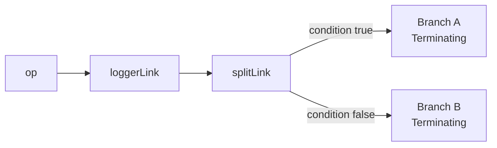
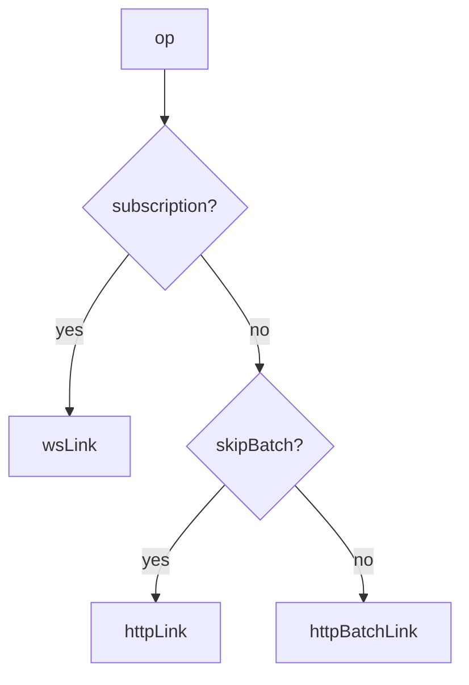
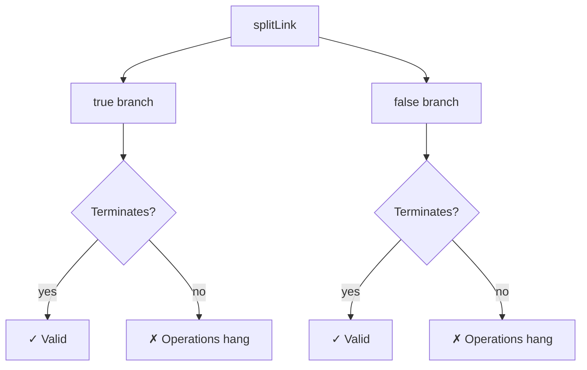

## splitLink

### Overview

`splitLink` is a built-in non-terminating link that conditionally routes an operation to one of two sub-chains based on a predicate function. It does not send any network request itself — it evaluates a condition against the operation and delegates to whichever branch matches.

`splitLink` is the primary mechanism for mixing transports (e.g. HTTP and WebSocket), selectively bypassing batching, or applying different configurations to different procedure types.

---

### Installation

`splitLink` is exported from `@trpc/client` — no additional package is required:

```typescript
import { splitLink } from '@trpc/client';
```

---

### Basic Structure

```typescript
splitLink({
  condition(op) {
    return /* boolean */;
  },
  true: /* link or link array — used when condition returns true */,
  false: /* link or link array — used when condition returns false */,
})
```

**Key Points**
- `condition` receives the full `Operation` object and must return a synchronous boolean.
- `true` and `false` are each a single link or an array of links forming an independent sub-chain.
- Each branch must terminate — either with a built-in terminating link or a valid sub-chain ending in one.
- `splitLink` itself is non-terminating from the perspective of the parent chain.

---

### The Operation Object

The predicate receives the same `Operation` available to all links:

```typescript
type Operation = {
  id: number;
  type: 'query' | 'mutation' | 'subscription';
  path: string;
  input: unknown;
  context: Record<string, unknown>;
  signal: AbortSignal | null;
};
```

Any field can be used as a routing criterion.

---

### How splitLink Fits in the Chain



Links before `splitLink` see all operations. After the split, each branch operates independently. Results from both branches flow back through the same upstream links in reverse.

---

### Common Patterns

#### Subscriptions over WebSocket, Queries and Mutations over HTTP

```typescript
import {
  createTRPCClient,
  splitLink,
  wsLink,
  httpBatchLink,
  createWSClient,
} from '@trpc/client';
import type { AppRouter } from '../server/router';

const wsClient = createWSClient({ url: 'ws://localhost:3001' });

const client = createTRPCClient<AppRouter>({
  links: [
    splitLink({
      condition(op) {
        return op.type === 'subscription';
      },
      true: wsLink({ client: wsClient }),
      false: httpBatchLink({ url: 'http://localhost:3000/api/trpc' }),
    }),
  ],
});
```

---

#### Bypass Batching for Specific Calls

```typescript
splitLink({
  condition(op) {
    return op.context.skipBatch === true;
  },
  true: httpLink({ url: '/api/trpc' }),
  false: httpBatchLink({ url: '/api/trpc' }),
})
```

At the call site:

```typescript
// Vanilla client
client.heavyReport.query(input, {
  context: { skipBatch: true },
});

// React Query
trpc.heavyReport.useQuery(input, {
  trpc: { context: { skipBatch: true } },
});
```

---

#### Route by Path Prefix

```typescript
splitLink({
  condition(op) {
    return op.path.startsWith('admin.');
  },
  true: httpBatchLink({
    url: 'https://admin-api.example.com/trpc',
    headers: () => ({ 'X-Admin-Key': getAdminToken() }),
  }),
  false: httpBatchLink({
    url: 'https://api.example.com/trpc',
  }),
})
```

---

#### Route Mutations Separately

```typescript
splitLink({
  condition(op) {
    return op.type === 'mutation';
  },
  true: httpLink({ url: '/api/trpc/write' }),
  false: httpBatchLink({ url: '/api/trpc/read' }),
})
```

> [Inference] Separating read and write endpoints at the link layer could support infrastructure-level read/write splitting. Whether this is meaningful depends entirely on server and database architecture.

---

### Branches as Link Arrays

Each branch can be a full sub-chain — an array of links rather than a single link:

```typescript
import { loggerLink, retryLink } from './links';

splitLink({
  condition(op) {
    return op.type === 'subscription';
  },
  true: [
    loggerLink({ enabled: () => true }),
    wsLink({ client: wsClient }),
  ],
  false: [
    retryLink({ maxAttempts: 3 }),
    httpBatchLink({ url: '/api/trpc' }),
  ],
})
```

**Key Points**
- Each branch array is an independent sub-chain.
- The last link in each branch array must be terminating.
- Non-terminating links within a branch only affect operations routed to that branch.

---

### Nesting splitLink

Splits can be nested for more than two routing outcomes:

```typescript
const wsClient = createWSClient({ url: 'ws://localhost:3001' });

const client = createTRPCClient<AppRouter>({
  links: [
    splitLink({
      condition(op) {
        return op.type === 'subscription';
      },
      true: wsLink({ client: wsClient }),
      false: splitLink({
        condition(op) {
          return op.context.skipBatch === true;
        },
        true: httpLink({ url: '/api/trpc' }),
        false: httpBatchLink({ url: '/api/trpc' }),
      }),
    }),
  ],
});
```



> [Inference] Deep nesting increases cognitive overhead. Prefer shallow splits where possible; consider a custom routing link if more than two levels of nesting are needed.

---

### Combining with Non-Terminating Links

Non-terminating links placed before `splitLink` apply to all operations regardless of branch:

```typescript
const client = createTRPCClient<AppRouter>({
  links: [
    loggerLink(),                    // applies to all ops
    retryLink({ maxAttempts: 3 }),   // applies to all ops
    splitLink({
      condition(op) => op.type === 'subscription',
      true: wsLink({ client: wsClient }),
      false: httpBatchLink({ url: '/api/trpc' }),
    }),
  ],
});
```

Links placed inside a branch apply only to operations routed to that branch:

```typescript
splitLink({
  condition(op) {
    return op.type === 'subscription';
  },
  true: [
    mySubscriptionOnlyLink(), // only subscription ops
    wsLink({ client: wsClient }),
  ],
  false: httpBatchLink({ url: '/api/trpc' }),
})
```

---

### Setting Context at the Call Site

Context is the standard mechanism for passing per-call routing signals into `condition`:

```typescript
// Vanilla client
client.someProc.query(input, {
  context: { myFlag: true },
});

// React Query
trpc.someProc.useQuery(input, {
  trpc: { context: { myFlag: true } },
});
```

**Key Points**
- Context is a client-side construct. It is never transmitted to the server.
- Context is evaluated once at dispatch time. It cannot be changed after a call is initiated.
- Any value — boolean, string, object — can be stored in context.

---

### Validity Rules



- Both branches must terminate independently.
- `splitLink` itself must not be the last link in the parent `links` array unless both its branches terminate — which they must by rule.
- A branch that is a link array must have its last element be a terminating link.

---

### Behavioral Caveats

> [Inference] The following describes behavior consistent with tRPC's documented design. Actual runtime behavior may vary by version and environment.

- `condition` is synchronous. Async predicates are not supported — async routing decisions must be resolved before the condition is evaluated, for example by reading from context that was set asynchronously upstream.
- `condition` is evaluated once per operation at dispatch time. It does not re-evaluate if context or state changes after dispatch.
- Both branches are initialized when the client is created, not lazily when first matched. A `wsLink` branch will create its `wsClient` eagerly even if no subscriptions are ever made — unless `createWSClient` itself defers the connection. [Inference: actual connection timing depends on `createWSClient` implementation and tRPC version.]
- Errors thrown inside `condition` will propagate as uncaught exceptions. Guard against unexpected values if context shape is not guaranteed.

---

### Common Mistakes

| Mistake | Effect |
|---|---|
| Non-terminating link as the sole entry in a branch | Operations routed to that branch hang |
| Async logic inside `condition` | Not supported; condition must return a boolean synchronously |
| Expecting `condition` to re-evaluate reactively | Evaluated once at dispatch; rerenders do not re-route in-flight ops |
| Reading server-only context in `condition` | Context is client-side only; server data is not available here |
| Deeply nested splits without a catch-all | Edge-case operations may reach a non-terminating state |
| Placing `splitLink` after the terminating link | Unreachable |

---

### Next Steps

- **Custom Links** — Build a multi-way router link for more than two branches
- **wsLink** — Configure the WebSocket branch of a subscription split
- **retryLink** — Compose retry behavior into one or both branches
- **Context Propagation** — Pass routing signals through the link chain cleanly