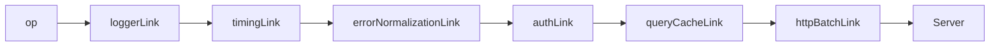

## Custom Link Creation

### Overview

A custom link is a user-defined function that conforms to tRPC's link interface. It participates in the link chain like any built-in link — receiving operations, optionally transforming them, forwarding them via `next`, and acting on results. Custom links are the correct place to implement cross-cutting concerns: authentication, retry, logging, caching, error normalization, circuit breaking, and request tracing.

---

### Link Signature

Every link conforms to this type:

```typescript
type TRPCLink<TRouter extends AnyRouter> =
  (opts: TRPCClientRuntime) => (
    params: { op: Operation; next: NextLink }
  ) => Observable<TRPCResponse, TRPCClientError<TRouter>>;
```

In practice this is a three-level function:

```
Level 1 — Factory:    (runtime) => ...       runs once at client creation
Level 2 — Per-link:   ({ op, next }) => ...  runs once per operation
Level 3 — Observable: (observer) => ...      runs when subscribed
```

---

### Minimal Custom Link

```typescript
import { TRPCLink } from '@trpc/client';
import { observable } from '@trpc/server/observable';
import type { AppRouter } from '../server/router';

export const noopLink: TRPCLink<AppRouter> = () => {
  // Level 1 — factory, runs once
  return ({ next, op }) => {
    // Level 2 — per operation
    return observable((observer) => {
      // Level 3 — observable body
      const subscription = next(op).subscribe({
        next: observer.next.bind(observer),
        error: observer.error.bind(observer),
        complete: observer.complete.bind(observer),
      });

      return () => subscription.unsubscribe();
    });
  };
};
```

This link passes every operation through unchanged. It is the baseline from which all custom links are built.

---

### The Three Levels in Detail

#### Level 1 — Factory

```typescript
export const myLink: TRPCLink<AppRouter> = (runtime) => {
  // One-time initialization
  // runtime contains the transformer and other internals
  const cache = new Map<string, unknown>();

  return ({ next, op }) => { /* ... */ };
};
```

Use the factory level for:
- Initializing shared state (caches, counters, timers)
- Reading configuration closed over from the outer scope
- Setting up connections or singletons

The `runtime` argument provides access to the transformer configured on the client. It is rarely needed directly in custom links.

---

#### Level 2 — Per Operation

```typescript
return ({ next, op }) => {
  // Runs for every procedure call
  // op: the Operation object
  // next: function to forward op to the next link
  return observable(/* ... */);
};
```

Use this level to:
- Inspect `op.type`, `op.path`, `op.input`, `op.context`
- Decide whether to forward, short-circuit, or modify the operation
- Construct per-call state (attempt counters, timestamps)

---

#### Level 3 — Observable Body

```typescript
return observable((observer) => {
  // Runs when the observable is subscribed to
  // observer.next(result)    — emit a result
  // observer.error(err)      — emit an error (terminal)
  // observer.complete()      — signal completion (terminal)

  // Return teardown
  return () => { /* cleanup */ };
});
```

Use this level to:
- Subscribe to `next(op)` and thread results through
- Emit results directly (short-circuiting)
- Register teardown logic for cleanup on unsubscription

---

### Patterns

#### Outgoing Transformation — Mutating the Operation

```typescript
export const addContextLink: TRPCLink<AppRouter> = () => {
  return ({ next, op }) => {
    return observable((observer) => {
      const modifiedOp = {
        ...op,
        context: {
          ...op.context,
          requestId: crypto.randomUUID(),
          clientVersion: '2.1.0',
        },
      };

      return next(modifiedOp).subscribe({
        next: observer.next.bind(observer),
        error: observer.error.bind(observer),
        complete: observer.complete.bind(observer),
      });
    });
  };
};
```

---

#### Incoming Transformation — Acting on the Result

```typescript
export const resultTransformLink: TRPCLink<AppRouter> = () => {
  return ({ next, op }) => {
    return observable((observer) => {
      return next(op).subscribe({
        next(result) {
          // Inspect or transform result before passing upstream
          if (process.env.NODE_ENV === 'development') {
            console.debug(`[${op.path}] result:`, result);
          }
          observer.next(result);
        },
        error: observer.error.bind(observer),
        complete: observer.complete.bind(observer),
      });
    });
  };
};
```

---

#### Auth Token Injection

A common production pattern — reads a token and injects it into context for a downstream link (e.g. a custom terminating link or `httpBatchLink`'s `headers` option) to consume:

```typescript
export const authLink: TRPCLink<AppRouter> = () => {
  return ({ next, op }) => {
    return observable((observer) => {
      const token = localStorage.getItem('auth_token');

      const modifiedOp = {
        ...op,
        context: {
          ...op.context,
          headers: {
            ...(op.context.headers as Record<string, string> ?? {}),
            ...(token ? { Authorization: `Bearer ${token}` } : {}),
          },
        },
      };

      return next(modifiedOp).subscribe({
        next: observer.next.bind(observer),
        error: observer.error.bind(observer),
        complete: observer.complete.bind(observer),
      });
    });
  };
};
```

> [Inference] For `httpBatchLink` to pick up headers from context, you must read `op.context.headers` inside `httpBatchLink`'s `headers` function. The link itself does not automatically forward context to HTTP headers. Behavior depends on implementation.

Alternatively, set the token directly in `httpBatchLink`'s `headers` callback without a custom link:

```typescript
httpBatchLink({
  url: '/api/trpc',
  headers() {
    const token = localStorage.getItem('auth_token');
    return token ? { Authorization: `Bearer ${token}` } : {};
  },
})
```

---

#### Error Normalization

Intercept errors and normalize them before they reach the caller:

```typescript
import { TRPCClientError } from '@trpc/client';

export const errorNormalizationLink: TRPCLink<AppRouter> = () => {
  return ({ next, op }) => {
    return observable((observer) => {
      return next(op).subscribe({
        next: observer.next.bind(observer),
        error(err) {
          if (err instanceof TRPCClientError) {
            const httpStatus = err.data?.httpStatus;

            if (httpStatus === 401) {
              // Redirect to login or clear credentials
              localStorage.removeItem('auth_token');
              window.location.href = '/login';
              return;
            }

            if (httpStatus === 429) {
              // Augment error with a user-facing message
              console.warn(`[${op.path}] Rate limited. Try again later.`);
            }
          }

          observer.error(err);
        },
        complete: observer.complete.bind(observer),
      });
    });
  };
};
```

---

#### Timing and Telemetry

```typescript
export const timingLink: TRPCLink<AppRouter> = () => {
  return ({ next, op }) => {
    return observable((observer) => {
      const start = performance.now();

      return next(op).subscribe({
        next(result) {
          const duration = performance.now() - start;
          telemetry.histogram('trpc.duration', duration, {
            path: op.path,
            type: op.type,
          });
          observer.next(result);
        },
        error(err) {
          const duration = performance.now() - start;
          telemetry.increment('trpc.error', {
            path: op.path,
            type: op.type,
          });
          observer.error(err);
        },
        complete: observer.complete.bind(observer),
      });
    });
  };
};
```

---

#### Short-Circuit — Cache or Mock

Resolve an operation without forwarding it:

```typescript
export const queryCacheLink: TRPCLink<AppRouter> = () => {
  const cache = new Map<string, { data: unknown; cachedAt: number }>();
  const TTL_MS = 30_000;

  return ({ next, op }) => {
    return observable((observer) => {
      if (op.type !== 'query') {
        return next(op).subscribe({
          next: observer.next.bind(observer),
          error: observer.error.bind(observer),
          complete: observer.complete.bind(observer),
        });
      }

      const cacheKey = `${op.path}:${JSON.stringify(op.input)}`;
      const cached = cache.get(cacheKey);

      if (cached && Date.now() - cached.cachedAt < TTL_MS) {
        observer.next({ result: { data: cached.data } } as any);
        observer.complete();
        return;
      }

      return next(op).subscribe({
        next(result) {
          const data = (result as any)?.result?.data;
          if (data !== undefined) {
            cache.set(cacheKey, { data, cachedAt: Date.now() });
          }
          observer.next(result);
        },
        error: observer.error.bind(observer),
        complete: observer.complete.bind(observer),
      });
    });
  };
};
```

> [Inference] The shape of the object passed to `observer.next` when short-circuiting must match tRPC's internal result format. The `as any` cast is a pragmatic workaround; the exact shape may vary by tRPC version and is not part of the public API contract.

---

#### Generic Link — Avoid Router-Specific Typing

Binding a link to a specific `AppRouter` type limits reusability. Use `AnyRouter` for shared or library links:

```typescript
import { TRPCLink, AnyRouter } from '@trpc/client';
import { observable } from '@trpc/server/observable';

export const timingLink = <TRouter extends AnyRouter>(): TRPCLink<TRouter> => {
  return () => {
    return ({ next, op }) => {
      return observable((observer) => {
        const start = performance.now();

        return next(op).subscribe({
          next(result) {
            console.log(`${op.path} +${(performance.now() - start).toFixed(1)}ms`);
            observer.next(result);
          },
          error: observer.error.bind(observer),
          complete: observer.complete.bind(observer),
        });
      });
    };
  };
};
```

---

### Composing Multiple Custom Links

```typescript
import { createTRPCClient, loggerLink, httpBatchLink } from '@trpc/client';

const client = createTRPCClient<AppRouter>({
  links: [
    loggerLink({ enabled: () => process.env.NODE_ENV === 'development' }),
    timingLink(),
    errorNormalizationLink(),
    authLink(),
    queryCacheLink(),
    httpBatchLink({ url: '/api/trpc' }),
  ],
});
```

Execution order on the way out (top → bottom), on the way back (bottom → top):



---

### Teardown Checklist

Every observable body should return a teardown function. Teardown runs when the caller unsubscribes — component unmount, AbortSignal, or explicit cancellation.

```typescript
return observable((observer) => {
  const subscription = next(op).subscribe({ /* ... */ });

  // Always return teardown
  return () => {
    subscription.unsubscribe();
    // Cancel timers, abort fetches, clear state
  };
});
```

| Resource | Teardown action |
|---|---|
| `next(op)` subscription | `subscription.unsubscribe()` |
| `setTimeout` | `clearTimeout(handle)` |
| `setInterval` | `clearInterval(handle)` |
| `AbortController` | `controller.abort()` |
| Event listeners | `emitter.off(event, handler)` |

---

### Behavioral Caveats

> [Inference] The following describes behavior consistent with tRPC's documented design. Actual runtime behavior may vary by version and environment.

- The observable body runs when subscribed, not when the link is traversed. In most cases these coincide, but the distinction matters for lazy evaluation.
- Throwing synchronously inside the observable body may produce an uncaught exception rather than routing to `observer.error`. Wrap risky logic in try/catch and call `observer.error` explicitly.
- Short-circuiting with a manually constructed result object relies on tRPC's internal result shape, which is not part of the public API and may change between versions.
- Custom links written for one `AppRouter` type cannot be used with a different router without adjustment unless written with `AnyRouter`.

---

### Common Mistakes

| Mistake | Effect |
|---|---|
| Not subscribing to `next(op)` | Operation forwarded; result silently dropped |
| Not returning teardown | Subscriptions and timers leak on unmount |
| Calling `observer.complete` before `observer.next` | Result is lost |
| Calling `observer.next` after `observer.error` | Undefined behavior; terminal events should be final |
| Throwing synchronously in observable body | Uncaught exception instead of routed error |
| Mutating `op` directly instead of spreading | May affect other links sharing the same reference |
| Hardcoding `AppRouter` when reusability is needed | Link cannot be shared across projects |

---

### Next Steps

- **retryLink** — Apply the custom link pattern to automatic retry with backoff
- **splitLink** — Route operations to different custom link sub-chains
- **Observables** — Deeper understanding of the reactive primitive custom links depend on
- **TRPCClientError** — Inspect and act on structured error data within error handlers