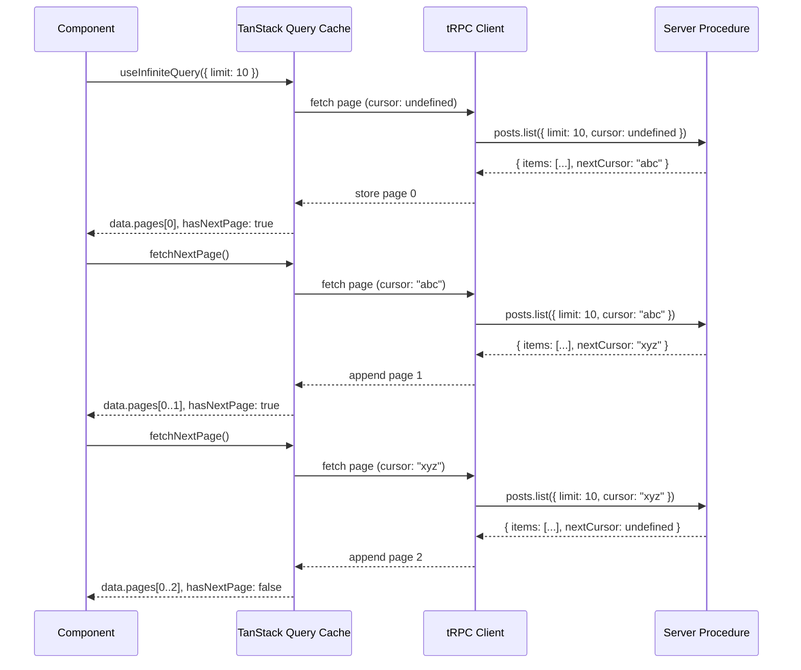

## `useInfiniteQuery` for Paginated Data

### Overview

tRPC integrates with TanStack Query's `useInfiniteQuery` to provide type-safe infinite/paginated data fetching. The integration surfaces through the `.useInfiniteQuery()` method on a tRPC procedure caller, wrapping TanStack Query's `useInfiniteQuery` while preserving end-to-end type inference across cursor parameters, page results, and error shapes.

---

### How the Integration Works

tRPC's React Query integration generates a `.useInfiniteQuery()` method for any procedure that accepts an input with a cursor-like field. Under the hood, it calls TanStack Query's `useInfiniteQuery`, forwarding tRPC's typed fetcher as the `queryFn`.

**Key Points**

- The procedure must accept `cursor` (or a cursor-equivalent field) in its input.
- tRPC passes the cursor automatically from `pageParam` into the procedure's input on each page fetch.
- Return types, cursor types, and error types are all inferred — no manual typing needed at the call site.

---

### Procedure Definition

The router-side procedure must accept a `cursor` input and return both the page data and a `nextCursor` (or equivalent) that the client will use to fetch the next page.

```ts
// server/routers/posts.ts
import { z } from 'zod';
import { router, publicProcedure } from '../trpc';

export const postsRouter = router({
  list: publicProcedure
    .input(
      z.object({
        limit: z.number().min(1).max(100).default(10),
        cursor: z.string().nullish(), // cursor is a string ID or null/undefined
      })
    )
    .query(async ({ input }) => {
      const { limit, cursor } = input;

      const items = await db.post.findMany({
        take: limit + 1, // fetch one extra to detect if next page exists
        cursor: cursor ? { id: cursor } : undefined,
        orderBy: { createdAt: 'desc' },
      });

      let nextCursor: string | undefined = undefined;
      if (items.length > limit) {
        const nextItem = items.pop(); // remove the extra item
        nextCursor = nextItem!.id;
      }

      return {
        items,
        nextCursor,
      };
    }),
});
```

**Key Points**

- `cursor: z.string().nullish()` allows the first page to have no cursor (`undefined` or `null`).
- The `take: limit + 1` pattern is a common way to determine if a next page exists without a separate `COUNT` query.
- `nextCursor` being `undefined` signals the last page.

---

### Client-Side Usage

```tsx
// components/PostList.tsx
import { trpc } from '../utils/trpc';

export function PostList() {
  const {
    data,
    fetchNextPage,
    hasNextPage,
    isFetchingNextPage,
    isLoading,
    isError,
  } = trpc.posts.list.useInfiniteQuery(
    { limit: 10 },
    {
      getNextPageParam: (lastPage) => lastPage.nextCursor,
    }
  );

  if (isLoading) return <p>Loading…</p>;
  if (isError) return <p>Error loading posts.</p>;

  return (
    <div>
      {data.pages.map((page) =>
        page.items.map((post) => (
          <div key={post.id}>
            <h2>{post.title}</h2>
            <p>{post.body}</p>
          </div>
        ))
      )}

      <button
        onClick={() => fetchNextPage()}
        disabled={!hasNextPage || isFetchingNextPage}
      >
        {isFetchingNextPage ? 'Loading more…' : hasNextPage ? 'Load More' : 'No more posts'}
      </button>
    </div>
  );
}
```

**Key Points**

- `getNextPageParam` is **required**. It receives the last page's response and returns the cursor to use for the next fetch, or `undefined` / `null` to signal no more pages.
- The static input (`{ limit: 10 }`) is merged with the cursor automatically by tRPC on each page fetch. You do not pass `cursor` in the static input.
- `data.pages` is an array of each page's full response — you must flatten them yourself to render a single list.

---

### Data Shape

`useInfiniteQuery` returns a `data` object structured as:

```
data
├── pages: TOutput[]         ← array of each page's full procedure result
└── pageParams: unknown[]    ← array of cursors used (managed internally)
```

To get a flat list of all items across pages:

```ts
const allItems = data?.pages.flatMap((page) => page.items) ?? [];
```

---

### `getNextPageParam` and `getPreviousPageParam`

```ts
trpc.posts.list.useInfiniteQuery(
  { limit: 10 },
  {
    // Required for forward pagination
    getNextPageParam: (lastPage, allPages) => lastPage.nextCursor ?? undefined,

    // Optional: for bidirectional pagination
    getPreviousPageParam: (firstPage, allPages) => firstPage.prevCursor ?? undefined,
  }
);
```

**Key Points**

- Returning `undefined` (not `null`) from `getNextPageParam` causes `hasNextPage` to be `false`. [Inference: Based on TanStack Query's documented behavior; confirm against the version you are using.]
- `allPages` is available as the second argument if cursor logic depends on accumulated page history.

---

### `initialCursor` Option

tRPC's `.useInfiniteQuery()` accepts an `initialCursor` option (in addition to standard TanStack Query options) to start pagination at a specific point rather than the beginning:

```ts
trpc.posts.list.useInfiniteQuery(
  { limit: 10 },
  {
    getNextPageParam: (lastPage) => lastPage.nextCursor,
    initialCursor: 'some-known-post-id', // start from a specific cursor
  }
);
```

This is useful for restoring scroll position or deep-linking to a specific page.

---

### Bidirectional Pagination

For feeds or timelines where users can load in both directions:

```ts
// server: procedure returns both nextCursor and prevCursor
return {
  items,
  nextCursor,   // string | undefined
  prevCursor,   // string | undefined
};

// client
trpc.posts.list.useInfiniteQuery(
  { limit: 10 },
  {
    getNextPageParam: (lastPage) => lastPage.nextCursor,
    getPreviousPageParam: (firstPage) => firstPage.prevCursor,
  }
);

// trigger backward fetch
const { fetchPreviousPage, hasPreviousPage } = ...; // destructured from the hook
```

**Key Points**

- `fetchPreviousPage()` prepends a new page to `data.pages[0]`, not appending to the end.
- Bidirectional pagination requires the server to compute both cursors and is substantially more complex to implement correctly. [Inference]

---

### Scroll-Based / Intersection Observer Pattern

A common pattern is triggering `fetchNextPage` automatically when a sentinel element enters the viewport:

```tsx
import { useEffect, useRef } from 'react';

function PostList() {
  const sentinelRef = useRef<HTMLDivElement>(null);

  const { data, fetchNextPage, hasNextPage, isFetchingNextPage } =
    trpc.posts.list.useInfiniteQuery(
      { limit: 10 },
      { getNextPageParam: (page) => page.nextCursor }
    );

  useEffect(() => {
    const observer = new IntersectionObserver(
      (entries) => {
        if (entries[0].isIntersecting && hasNextPage && !isFetchingNextPage) {
          fetchNextPage();
        }
      },
      { threshold: 1.0 }
    );

    if (sentinelRef.current) observer.observe(sentinelRef.current);
    return () => observer.disconnect();
  }, [hasNextPage, isFetchingNextPage, fetchNextPage]);

  return (
    <div>
      {data?.pages.flatMap((p) => p.items).map((post) => (
        <div key={post.id}>{post.title}</div>
      ))}
      <div ref={sentinelRef} style={{ height: 1 }} />
      {isFetchingNextPage && <p>Loading more…</p>}
    </div>
  );
}
```

---

### Query Key Behavior

tRPC generates the query key from the procedure path and the **static** input (without the cursor). This means:

- All pages of `posts.list` with `{ limit: 10 }` share one cache entry.
- Changing the static input (e.g., a filter) creates a new cache entry and resets pagination.

```ts
// These are DIFFERENT cache entries — pagination resets on filter change
trpc.posts.list.useInfiniteQuery({ limit: 10, status: 'published' }, ...);
trpc.posts.list.useInfiniteQuery({ limit: 10, status: 'draft' }, ...);
```

---

### Prefetching Infinite Queries

For SSR or prefetching on the server, use `prefetchInfiniteQuery` via the tRPC server-side helpers:

```ts
// pages/index.tsx (Next.js example)
export async function getStaticProps() {
  const helpers = createServerSideHelpers({ router: appRouter, ctx: {} });

  await helpers.posts.list.prefetchInfiniteQuery({ limit: 10 });

  return {
    props: {
      trpcState: helpers.dehydrate(),
    },
  };
}
```

The dehydrated state is then rehydrated on the client, allowing the first page to render without a loading state.

---

### Behavior of `select` with Infinite Queries

The `select` option transforms `data` before it reaches your component. With infinite queries, `select` receives the full `{ pages, pageParams }` object:

```ts
trpc.posts.list.useInfiniteQuery(
  { limit: 10 },
  {
    getNextPageParam: (page) => page.nextCursor,
    select: (data) => ({
      ...data,
      // Pre-flatten pages for convenience
      allItems: data.pages.flatMap((p) => p.items),
    }),
  }
);
```

[Inference: The `select` transformation runs on every render where data is accessed; memoizing the selector function may reduce unnecessary recalculations. Behavior may vary across TanStack Query versions.]

---

### Flow Diagram



---

### Common Pitfalls

|Pitfall|Description|
|---|---|
|Passing `cursor` in static input|tRPC manages cursor via `pageParam` internally. Passing it in the static input causes type errors or unexpected behavior.|
|Returning `null` instead of `undefined` from `getNextPageParam`|TanStack Query v5 treats `null` differently from `undefined` for `hasNextPage`. Prefer `undefined` to signal end of pages. [Inference — verify against your version.]|
|Not accounting for the `+1` fetch pattern|If the server does not over-fetch by one, there is no reliable way to detect if a next page exists without an extra count query.|
|Assuming `data` is defined before loading|`data` is `undefined` on the first render before any fetch completes. Guard with optional chaining.|
|Mutating `data.pages` directly|TanStack Query's cache is immutable. Direct mutations will not trigger re-renders. Use `setQueryData` with a new object if manual cache updates are needed.|

---

### Relationship to `useQuery`

|Feature|`useQuery`|`useInfiniteQuery`|
|---|---|---|
|Data shape|`TOutput`|`{ pages: TOutput[], pageParams: unknown[] }`|
|Cursor management|Manual|Automatic via `pageParam`|
|`fetchNextPage`|Not available|Available|
|`hasNextPage`|Not available|Derived from `getNextPageParam`|
|Cache key|Path + full input|Path + static input (no cursor)|
|Prefetch helper|`prefetchQuery`|`prefetchInfiniteQuery`|

