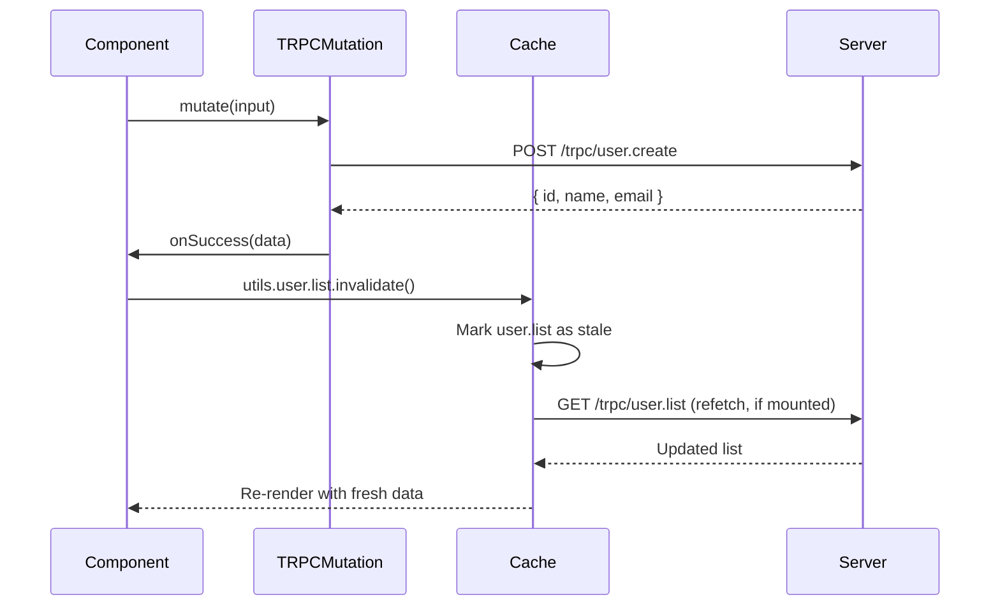

## Query Invalidation and Refetching

After a mutation, the client cache may no longer reflect server state. tRPC provides a set of cache utilities — accessed via `trpc.useUtils()` — that let you invalidate, refetch, and directly manipulate cached query data. These utilities wrap TanStack Query's `QueryClient` methods with the same type-safe, procedure-scoped API you use for hooks.

---

### Accessing the Utils Object

```ts
const utils = trpc.useUtils();
```

`useUtils()` returns a nested object mirroring your router structure. Every query procedure on your router has a corresponding set of cache methods available under the same path.

[Inference] `useUtils()` is the current recommended API as of tRPC v11. Older codebases may use `trpc.useContext()`, which [Inference] is the same underlying object under a different name. Verify against your installed version.

---

### invalidate — Mark Queries as Stale

`invalidate()` marks one or more cached queries as stale. If the query is currently mounted, [Inference] TanStack Query will trigger a background refetch. If it is not mounted, it will refetch the next time it mounts.

#### Invalidate All Queries for a Procedure

```ts
await utils.user.list.invalidate();
```

#### Invalidate by Exact Input

```ts
await utils.user.getById.invalidate({ id: '1' });
```

Only the cache entry matching `{ id: '1' }` is marked stale. Other `getById` entries are unaffected.

#### Invalidate an Entire Router Subtree

```ts
// Invalidates ALL procedures under the `user` router
await utils.user.invalidate();
```

#### Invalidate Everything

```ts
await utils.invalidate();
```

[Inference] This marks every cached tRPC query as stale. Use with caution in large applications, as it may trigger many simultaneous refetches.

---

### How invalidate Differs from refetch

These two concepts are often confused:

| | `invalidate` | `refetch` |
|---|---|---|
| What it does | Marks cache as stale | Immediately triggers a network request |
| Refetches if mounted | Yes — in the background | Yes — immediately |
| Refetches if unmounted | On next mount | No |
| Respects `enabled: false` | Yes — skips refetch | [Inference] May still refetch; behavior varies |
| Typical use | After mutations | Manual user-triggered refresh |

---

### refetch — Immediately Trigger a Network Request

`refetch()` is available directly from the `useQuery` hook return value:

```tsx
const { data, refetch, isFetching } = trpc.user.list.useQuery();

return (
  <button onClick={() => refetch()} disabled={isFetching}>
    {isFetching ? 'Refreshing...' : 'Refresh'}
  </button>
);
```

It is also available via `utils`:

```ts
await utils.user.list.refetch();
await utils.user.getById.refetch({ id: '1' });
```

**Key Points:**
- `refetch()` from the hook return value refetches that specific hook instance
- `utils.refetch()` [Inference] targets the cache entry and may affect all mounted hooks sharing that query key
- Both return a promise that resolves when the fetch completes

---

### Typical Pattern: Invalidate After Mutation

The most common use of invalidation is inside `onSuccess` of a mutation:

```tsx
const utils = trpc.useUtils();

const createUser = trpc.user.create.useMutation({
  onSuccess: async () => {
    await utils.user.list.invalidate();
  },
});
```

```tsx
const deleteUser = trpc.user.delete.useMutation({
  onSuccess: async (data) => {
    // Invalidate the list and the specific deleted entry
    await utils.user.list.invalidate();
    await utils.user.getById.invalidate({ id: data.id });
  },
});
```

---

### Invalidation Filters

`invalidate()` accepts an optional filter object as a second argument, passed through to TanStack Query's `invalidateQueries`. [Inference] Supported filter options may vary by TanStack Query version; consult TanStack Query docs for current filter support.

```ts
// Invalidate only queries that are currently active (mounted)
await utils.user.list.invalidate(undefined, {
  refetchType: 'active',
});

// Invalidate without triggering an immediate refetch
await utils.user.list.invalidate(undefined, {
  refetchType: 'none',
});

// Invalidate all, including inactive cached entries
await utils.user.list.invalidate(undefined, {
  refetchType: 'all',
});
```

| `refetchType` | Behavior |
|---|---|
| `'active'` | Only refetches currently mounted queries |
| `'inactive'` | Only marks unmounted queries stale |
| `'all'` | Marks all stale and refetches mounted ones |
| `'none'` | Marks stale but triggers no refetch |

---

### cancel — Abort In-Flight Requests

Before performing optimistic updates, you should cancel any in-flight queries to prevent them from overwriting your optimistic cache changes:

```ts
const utils = trpc.useUtils();

const updateUser = trpc.user.update.useMutation({
  onMutate: async (input) => {
    // Abort any ongoing fetches for this query
    await utils.user.getById.cancel({ id: input.id });

    const previous = utils.user.getById.getData({ id: input.id });

    utils.user.getById.setData({ id: input.id }, (old) => ({
      ...old!,
      name: input.name,
    }));

    return { previous };
  },

  onError: (err, input, context) => {
    if (context?.previous) {
      utils.user.getById.setData({ id: input.id }, context.previous);
    }
  },

  onSettled: async (data, err, input) => {
    await utils.user.getById.invalidate({ id: input.id });
  },
});
```

[Inference] `cancel()` signals TanStack Query to abort the pending fetch. Whether the underlying HTTP request is actually aborted depends on your tRPC link configuration and whether it supports `AbortSignal`. Behavior is not guaranteed across all setups.

---

### getData and setData — Direct Cache Manipulation

#### getData — Read the Current Cache

```ts
const users = utils.user.list.getData();
// Returns the cached data or undefined if not cached

const user = utils.user.getById.getData({ id: '1' });
```

#### setData — Write Directly to the Cache

```ts
// Replace the entire cached list
utils.user.list.setData(undefined, [
  { id: '1', name: 'Jane Doe' },
  { id: '2', name: 'John Smith' },
]);

// Update with a function (receives current cached value)
utils.user.list.setData(undefined, (old = []) => [
  ...old,
  { id: '3', name: 'New User' },
]);

// Update a specific entry
utils.user.getById.setData({ id: '1' }, (old) => ({
  ...old!,
  name: 'Updated Name',
}));
```

**Key Points:**
- `setData` is synchronous and does not trigger a network request
- The first argument is the input (query key selector); use `undefined` for procedures with no input
- Changes made with `setData` will be overwritten the next time the query fetches unless you also call `invalidate` with `refetchType: 'none'` or manage timing carefully [Inference]

---

### prefetchQuery — Fetch Before Rendering

You can prefetch a query into the cache before a component mounts — useful for hover states, route transitions, or server-side rendering:

```ts
// On hover — prefetch before navigation
const handleMouseEnter = async (userId: string) => {
  await utils.user.getById.prefetchQuery({ id: userId });
};
```

```tsx
<div onMouseEnter={() => handleMouseEnter('1')}>
  <Link href="/users/1">View Profile</Link>
</div>
```

[Inference] If the data is already in cache and not stale, `prefetchQuery` will not issue a new request. Behavior depends on `staleTime` configuration.

---

### ensureData — Fetch Only if Not Cached

```ts
// Returns cached data if fresh, otherwise fetches
const user = await utils.user.getById.ensureData({ id: '1' });
```

| Method | Fetches if cached? | Fetches if stale? |
|---|---|---|
| `prefetchQuery` | No | Yes |
| `ensureData` | No | Yes |
| `refetch` | Yes | Yes |
| `invalidate` | No (marks stale only) | Triggers refetch if mounted |

---

### Illustrative Flow: Mutation → Invalidation → Refetch



---

### Utils Method Reference

| Method | Purpose |
|---|---|
| `invalidate(input?, filters?)` | Mark query stale; refetch if mounted |
| `refetch(input?, filters?)` | Immediately trigger a network request |
| `cancel(input?)` | Abort in-flight fetch for this query |
| `getData(input?)` | Read current cache value synchronously |
| `setData(input, updater)` | Write to cache synchronously |
| `prefetchQuery(input?)` | Fetch into cache if not already fresh |
| `ensureData(input?)` | Return cached data or fetch if missing/stale |
| `setInfiniteData(input, updater)` | Write to infinite query cache |
| `prefetchInfiniteQuery(input?)` | Prefetch for infinite queries |

---

**Conclusion:**
tRPC's `useUtils()` provides a type-safe interface over TanStack Query's `QueryClient`, scoped to your router's procedure paths. The most common pattern is invalidating related queries after a mutation so mounted components refetch and reflect server state. For more precise control, `setData` enables synchronous cache writes, `cancel` supports optimistic update safety, and `prefetchQuery` enables proactive data loading. All underlying cache behavior is governed by TanStack Query; consult its documentation when behavior is unexpected or version-dependent.