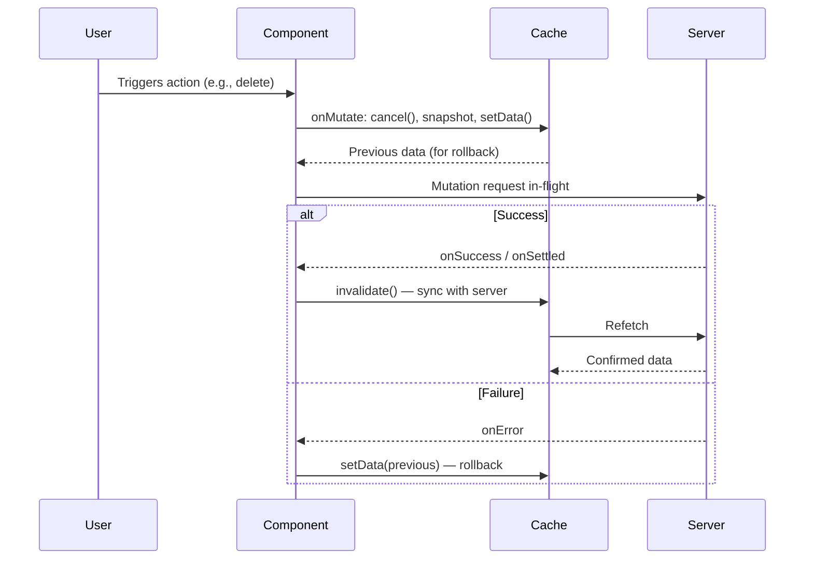

## Optimistic Updates

Optimistic updates are a UX pattern where the client immediately applies an anticipated result to the local cache — before the server confirms the operation — then reconciles with the actual server response when it arrives. If the mutation fails, the cache is rolled back to its previous state. tRPC supports this pattern through the `onMutate`, `onError`, and `onSettled` callbacks in combination with `useUtils()` cache methods.

---

### Why Optimistic Updates

Without optimistic updates, the sequence is:

1. User triggers action
2. UI shows a loading state
3. Server responds
4. UI updates

With optimistic updates, step 2 is replaced with an immediate UI change, making interactions feel instantaneous. The tradeoff is added complexity: you must handle rollback correctly when mutations fail.

---

### The Three-Callback Pattern

Optimistic updates in TanStack Query — and by extension tRPC — rely on three callbacks working together:

| Callback | Role |
|---|---|
| `onMutate` | Cancel in-flight fetches, snapshot current cache, apply optimistic change |
| `onError` | Roll back to snapshot if mutation fails |
| `onSettled` | Invalidate to sync with server, regardless of outcome |

This pattern is a TanStack Query convention. tRPC [Inference] passes these callbacks through to TanStack Query's `useMutation` without modification; behavior is governed by TanStack Query internals.

---

### Illustrative Flow



---

### Full Example: Optimistic Delete

```tsx
import { trpc } from '../utils/trpc';

function UserList() {
  const utils = trpc.useUtils();
  const { data: users = [] } = trpc.user.list.useQuery();

  const deleteUser = trpc.user.delete.useMutation({

    // Step 1: Before the request is sent
    onMutate: async ({ id }) => {
      // Cancel any in-flight fetches that could overwrite our optimistic change
      await utils.user.list.cancel();

      // Snapshot the current cache value
      const previousUsers = utils.user.list.getData();

      // Optimistically remove the user from the list
      utils.user.list.setData(undefined, (old = []) =>
        old.filter(user => user.id !== id)
      );

      // Return context object for use in onError
      return { previousUsers };
    },

    // Step 2a: If the mutation fails, roll back
    onError: (err, variables, context) => {
      if (context?.previousUsers) {
        utils.user.list.setData(undefined, context.previousUsers);
      }
    },

    // Step 2b: Always sync with the server after settling
    onSettled: async () => {
      await utils.user.list.invalidate();
    },
  });

  return (
    <ul>
      {users.map(user => (
        <li key={user.id}>
          {user.name}
          <button onClick={() => deleteUser.mutate({ id: user.id })}>
            Delete
          </button>
        </li>
      ))}
    </ul>
  );
}
```

**Key Points:**
- `cancel()` must be awaited before `getData()` and `setData()` — without it, an in-flight refetch may land after your optimistic write and overwrite it
- The snapshot (`previousUsers`) is returned from `onMutate` and received as `context` in `onError` and `onSettled`
- `onSettled` invalidates regardless of success or failure, ensuring the cache eventually reflects true server state

---

### Full Example: Optimistic Add

```tsx
const utils = trpc.useUtils();

const createUser = trpc.user.create.useMutation({
  onMutate: async (newUser) => {
    await utils.user.list.cancel();

    const previousUsers = utils.user.list.getData();

    // Insert a temporary entry with a placeholder id
    utils.user.list.setData(undefined, (old = []) => [
      ...old,
      { id: 'temp-' + Date.now(), ...newUser },
    ]);

    return { previousUsers };
  },

  onError: (err, newUser, context) => {
    if (context?.previousUsers) {
      utils.user.list.setData(undefined, context.previousUsers);
    }
  },

  onSettled: async () => {
    // Replace temp entry with real server-assigned data
    await utils.user.list.invalidate();
  },
});
```

**Key Points:**
- The temporary `id` (e.g. `'temp-' + Date.now()`) is a placeholder — it will be replaced when `invalidate()` triggers a refetch after `onSettled`
- Do not use the temporary id for any subsequent operations; it is not a real server id [Inference]

---

### Full Example: Optimistic Update (Edit)

```tsx
const utils = trpc.useUtils();

const updateUser = trpc.user.update.useMutation({
  onMutate: async ({ id, name }) => {
    // Cancel both the list and the specific detail query
    await utils.user.list.cancel();
    await utils.user.getById.cancel({ id });

    const previousList = utils.user.list.getData();
    const previousUser = utils.user.getById.getData({ id });

    // Update the list entry
    utils.user.list.setData(undefined, (old = []) =>
      old.map(user => user.id === id ? { ...user, name } : user)
    );

    // Update the detail entry
    utils.user.getById.setData({ id }, (old) =>
      old ? { ...old, name } : old
    );

    return { previousList, previousUser };
  },

  onError: (err, { id }, context) => {
    if (context?.previousList) {
      utils.user.list.setData(undefined, context.previousList);
    }
    if (context?.previousUser) {
      utils.user.getById.setData({ id }, context.previousUser);
    }
  },

  onSettled: async (data, err, { id }) => {
    await utils.user.list.invalidate();
    await utils.user.getById.invalidate({ id });
  },
});
```

**Key Points:**
- When a mutation affects multiple cached queries, each must be individually cancelled, snapshotted, and rolled back
- Each cache entry has its own independent snapshot stored in the returned context object

---

### Context Object Shape and Typing

TypeScript [Inference] infers the context type from the return type of `onMutate`. If `onMutate` is async, the context type is the resolved value of the returned promise.

```ts
// Explicitly typed for clarity
type MutationContext = {
  previousUsers: { id: string; name: string }[] | undefined;
};

const deleteUser = trpc.user.delete.useMutation
  // TData, TError, TVariables, TContext
  { deleted: boolean },
  unknown,
  { id: string },
  MutationContext
>({
  onMutate: async ({ id }): Promise<MutationContext> => {
    await utils.user.list.cancel();
    const previousUsers = utils.user.list.getData();
    utils.user.list.setData(undefined, old => (old ?? []).filter(u => u.id !== id));
    return { previousUsers };
  },
  onError: (err, vars, context) => {
    // `context` is typed as MutationContext here
    if (context?.previousUsers) {
      utils.user.list.setData(undefined, context.previousUsers);
    }
  },
  onSettled: async () => {
    await utils.user.list.invalidate();
  },
});
```

In practice, explicit generic annotation is often unnecessary because TypeScript infers the context type automatically from `onMutate`'s return type. [Inference] Inference accuracy may vary depending on TypeScript version and project configuration.

---

### Common Mistakes

#### Forgetting to await cancel()

```ts
// ❌ Not awaited — in-flight fetch may overwrite optimistic data
onMutate: async ({ id }) => {
  utils.user.list.cancel();       // Missing await
  const prev = utils.user.list.getData();
  utils.user.list.setData(undefined, old => old?.filter(u => u.id !== id));
  return { prev };
},

// ✅ Correct
onMutate: async ({ id }) => {
  await utils.user.list.cancel(); // Awaited
  const prev = utils.user.list.getData();
  utils.user.list.setData(undefined, old => old?.filter(u => u.id !== id));
  return { prev };
},
```

#### Rolling Back in onSuccess Instead of onError

```ts
// ❌ Rollback belongs in onError, not onSuccess
onSuccess: (data, variables, context) => {
  utils.user.list.setData(undefined, context.previousUsers); // Overwrites good data
},

// ✅ Correct placement
onError: (err, variables, context) => {
  utils.user.list.setData(undefined, context.previousUsers);
},
```

#### Skipping onSettled Invalidation

```ts
// ❌ Cache may permanently show optimistic data if invalidation is skipped
onMutate: async ({ id }) => { /* ... */ },
onError: (err, vars, ctx) => { /* rollback */ },
// No onSettled — cache is never synced with server after success

// ✅ Always invalidate in onSettled
onSettled: async () => {
  await utils.user.list.invalidate();
},
```

---

### When to Use Optimistic Updates

Optimistic updates add meaningful complexity. They are most appropriate when:

- The mutation has a high expected success rate
- The latency between action and confirmation is perceptible to users
- The optimistic result is deterministic enough to predict accurately (e.g., a delete, a toggle, a rename)

They are less appropriate when:

- The server applies non-deterministic transformations to input (e.g., slug generation, conflict resolution)
- Failure is common or expected
- The UI change is low-stakes enough that a loading spinner is acceptable

---

**Conclusion:**
Optimistic updates in tRPC follow a consistent three-callback pattern: `onMutate` to snapshot and speculatively update the cache, `onError` to roll back on failure, and `onSettled` to invalidate and sync with the server. The pattern requires careful sequencing — particularly awaiting `cancel()` before writing to the cache — and scales to multiple affected queries by maintaining independent snapshots per cache entry. All underlying behavior is governed by TanStack Query; results may vary and the TanStack Query documentation should be consulted for authoritative details on callback timing and cache mechanics.