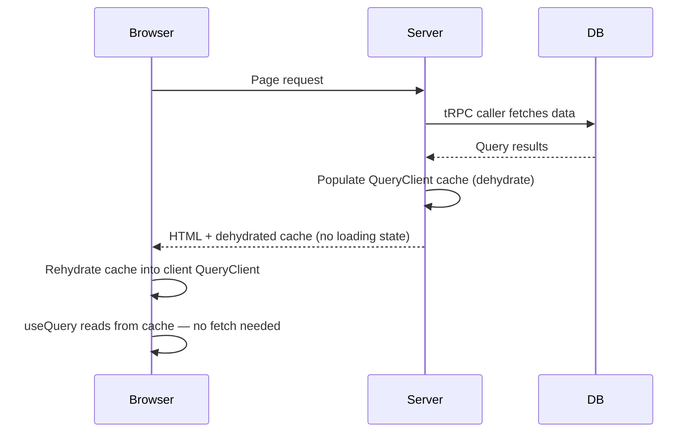

## Prefetching on the Server

Server-side prefetching lets you fetch tRPC query data during server rendering and embed it in the page so the client cache is already populated on first render. This eliminates loading states for data that is known at request time. tRPC supports this through a server-side caller combined with TanStack Query's `dehydrate` / `HydrationBoundary` mechanism.

---

### Core Concept

The flow has two stages:

1. **Server** — fetch data using a tRPC server-side caller, write it into a `QueryClient` cache, then serialize (dehydrate) that cache into the HTML response
2. **Client** — receive the dehydrated cache, rehydrate it into the client `QueryClient`, and populate `useQuery` hooks with already-fetched data



---

### Approaches by Framework

tRPC server-side prefetching is most commonly used with:

- **Next.js App Router** — using `createServerSideHelpers` or `createCallerFactory` with `prefetchQuery`
- **Next.js Pages Router** — using `createServerSideHelpers` inside `getServerSideProps` or `getStaticProps`

The underlying mechanism is the same in both cases. The examples below cover both.

---

### Required Packages

```bash
npm install @trpc/server @trpc/react-query @tanstack/react-query server-only
```

`server-only` is a Next.js convention package that causes a build error if a server module is accidentally imported on the client. [Inference] It has no runtime behavior; it is a build-time guard only.

---

### App Router: createServerSideHelpers

`createServerSideHelpers` creates a server-side caller whose results are automatically written into a `QueryClient` under the same cache keys that client-side `useQuery` hooks will look up.

#### Setup

```ts
// utils/trpc-server.ts
import { createServerSideHelpers } from '@trpc/react-query/server';
import { appRouter } from '../server/router';
import { createContext } from '../server/context';
import superjson from 'superjson';

export async function getServerHelpers() {
  return createServerSideHelpers({
    router: appRouter,
    ctx: await createContext(),   // Same context factory as your API handler
    transformer: superjson,       // Must match transformer used in tRPC client setup
  });
}
```

**Key Points:**
- `createContext()` runs server-side — it has access to cookies, headers, and session data appropriate for server rendering
- The `transformer` must match what your tRPC client is configured to use; a mismatch [Inference] may cause serialization errors or silent data corruption

#### Page Component (App Router)

```tsx
// app/users/[id]/page.tsx
import { HydrationBoundary, dehydrate, QueryClient } from '@tanstack/react-query';
import { getServerHelpers } from '../../../utils/trpc-server';
import { UserProfile } from './UserProfile';

export default async function UserPage({ params }: { params: { id: string } }) {
  const helpers = await getServerHelpers();

  // Prefetch — writes result into helpers' internal QueryClient
  await helpers.user.getById.prefetch({ id: params.id });

  return (
    <HydrationBoundary state={dehydrate(helpers.queryClient)}>
      <UserProfile userId={params.id} />
    </HydrationBoundary>
  );
}
```

#### Client Component

```tsx
// app/users/[id]/UserProfile.tsx
'use client';

import { trpc } from '../../../utils/trpc';

export function UserProfile({ userId }: { userId: string }) {
  // Data is already in cache — no loading state on first render
  const { data } = trpc.user.getById.useQuery({ id: userId });

  return (
    <div>
      <h2>{data?.name}</h2>
      <p>{data?.email}</p>
    </div>
  );
}
```

**Key Points:**
- `useQuery` on the client uses the same cache key as `helpers.user.getById.prefetch` — [Inference] tRPC derives this key from the procedure path and input, so they match automatically provided the input is identical
- `data` may still be `undefined` before hydration completes on the client; defensive access with `?.` is appropriate
- `HydrationBoundary` must wrap the component tree that contains the `useQuery` hooks that should receive the prefetched data

---

### App Router: Prefetching Multiple Queries

Prefetch calls can be parallelized with `Promise.all` to avoid sequential waterfall fetches:

```tsx
export default async function DashboardPage() {
  const helpers = await getServerHelpers();

  // Parallel prefetch — does not wait for each sequentially
  await Promise.all([
    helpers.user.list.prefetch(),
    helpers.post.list.prefetch({ limit: 10 }),
    helpers.analytics.summary.prefetch(),
  ]);

  return (
    <HydrationBoundary state={dehydrate(helpers.queryClient)}>
      <Dashboard />
    </HydrationBoundary>
  );
}
```

**Key Points:**
- Sequential prefetching (`await` each call one at a time) introduces unnecessary latency when queries are independent
- `Promise.all` [Inference] runs the underlying fetches concurrently, bounded by server resource limits and database connection availability

---

### Pages Router: getServerSideProps

```tsx
// pages/users/[id].tsx
import {
  createServerSideHelpers,
} from '@trpc/react-query/server';
import { appRouter } from '../../server/router';
import { createContext } from '../../server/context';
import superjson from 'superjson';
import {
  dehydrate,
  HydrationBoundary,
  QueryClient,
} from '@tanstack/react-query';
import { trpc } from '../../utils/trpc';

export async function getServerSideProps(context: GetServerSidePropsContext) {
  const helpers = createServerSideHelpers({
    router: appRouter,
    ctx: await createContext(context),
    transformer: superjson,
  });

  const id = context.params?.id as string;
  await helpers.user.getById.prefetch({ id });

  return {
    props: {
      trpcState: helpers.dehydrate(),
      id,
    },
  };
}

export default function UserPage({ id }: { id: string }) {
  const { data } = trpc.user.getById.useQuery({ id });

  return <div>{data?.name}</div>;
}
```

**Key Points:**
- In the Pages Router, `helpers.dehydrate()` is used instead of the standalone `dehydrate(helpers.queryClient)` — [Inference] both produce the same serialized cache state; prefer the API that your tRPC version documents
- The dehydrated state is passed as a prop (`trpcState`) and consumed by the `TRPCProvider` / `QueryClientProvider` setup in `_app.tsx`

#### _app.tsx Integration (Pages Router)

```tsx
// pages/_app.tsx
import { useState } from 'react';
import { QueryClient, QueryClientProvider, HydrationBoundary } from '@tanstack/react-query';
import { trpc } from '../utils/trpc';
import superjson from 'superjson';

function MyApp({ Component, pageProps }: AppProps) {
  const [queryClient] = useState(() => new QueryClient());
  const [trpcClient] = useState(() =>
    trpc.createClient({
      transformer: superjson,
      links: [ /* your links */ ],
    })
  );

  return (
    <trpc.Provider client={trpcClient} queryClient={queryClient}>
      <QueryClientProvider client={queryClient}>
        <HydrationBoundary state={pageProps.trpcState}>
          <Component {...pageProps} />
        </HydrationBoundary>
      </QueryClientProvider>
    </trpc.Provider>
  );
}
```

---

### prefetch vs fetch on the Server

`createServerSideHelpers` exposes two methods per procedure:

| Method | Returns | Writes to cache |
|---|---|---|
| `helpers.<procedure>.prefetch(input)` | `void` | Yes |
| `helpers.<procedure>.fetch(input)` | `TData` | No |

```ts
// Use prefetch when you want the cache populated for client hydration
await helpers.user.getById.prefetch({ id });

// Use fetch when you need the data directly on the server (e.g., for metadata)
const user = await helpers.user.getById.fetch({ id });

export async function generateMetadata({ params }) {
  const helpers = await getServerHelpers();
  const user = await helpers.user.getById.fetch({ id: params.id });
  return { title: user.name };
}
```

---

### Prefetch with getStaticProps

For statically generated pages, prefetching works identically — replace `getServerSideProps` with `getStaticProps`:

```ts
export async function getStaticProps(context: GetStaticPropsContext) {
  const helpers = createServerSideHelpers({
    router: appRouter,
    ctx: await createContext(),   // No request context available in static generation
    transformer: superjson,
  });

  const id = context.params?.id as string;
  await helpers.user.getById.prefetch({ id });

  return {
    props: { trpcState: helpers.dehydrate(), id },
    revalidate: 60, // ISR: revalidate every 60 seconds
  };
}
```

**Key Points:**
- `createContext()` in static generation has no access to request-specific data (cookies, headers, session) — [Inference] any context that depends on per-request data will be unavailable and may produce incorrect or empty results
- ISR revalidation regenerates the static page on the server; the prefetched cache is refreshed at that point

---

### superjson and Transformer Consistency

tRPC uses a `transformer` to serialize data passing between server and client. The same transformer must be used in:

- The tRPC server router setup
- `createServerSideHelpers`
- The tRPC React client (`trpc.createClient`)

```ts
// If you use superjson in your router:
import superjson from 'superjson';

export const t = initTRPC.create({ transformer: superjson });

// Then createServerSideHelpers must also use superjson:
createServerSideHelpers({ transformer: superjson, /* ... */ });

// And your client:
trpc.createClient({ transformer: superjson, /* ... */ });
```

[Inference] A mismatch between transformers across these three locations may result in runtime errors or data that silently fails to deserialize correctly. This behavior is not guaranteed to produce visible errors in all cases.

---

### What Prefetching Does Not Do

- It does not replace client-side `useQuery` — the hook still runs on the client, but reads from the already-populated cache instead of issuing a network request
- It does not keep data permanently fresh — the prefetched data is subject to normal `staleTime` rules; [Inference] if `staleTime` is `0` (the TanStack Query default), a background refetch may occur immediately after hydration
- It does not automatically prefetch nested or related queries — each query to be hydrated must be explicitly prefetched

#### Preventing Immediate Refetch After Hydration

If you want prefetched data to be treated as fresh for a period after hydration, set `staleTime` on the client `QueryClient`:

```ts
const queryClient = new QueryClient({
  defaultOptions: {
    queries: {
      staleTime: 1000 * 60, // 1 minute — prefetched data stays fresh
    },
  },
});
```

[Inference] Without a non-zero `staleTime`, TanStack Query may trigger an immediate background refetch on mount even when data was just hydrated. Behavior may vary by TanStack Query version.

---

### Summary of Server Prefetching APIs

| API | Context | Purpose |
|---|---|---|
| `createServerSideHelpers` | Server only | Creates a server caller + internal QueryClient |
| `helpers.<procedure>.prefetch(input)` | Server only | Fetches and writes to internal cache |
| `helpers.<procedure>.fetch(input)` | Server only | Fetches and returns data without caching |
| `helpers.dehydrate()` | Server only | Serializes internal QueryClient (Pages Router) |
| `dehydrate(helpers.queryClient)` | Server only | Serializes internal QueryClient (App Router) |
| `HydrationBoundary` | Client | Rehydrates dehydrated state into client QueryClient |

---

**Conclusion:**
Server-side prefetching in tRPC eliminates first-render loading states by populating TanStack Query's cache before the client receives the page. The pattern centers on `createServerSideHelpers`, which provides a type-safe server caller that writes results into a `QueryClient` under the same cache keys that client `useQuery` hooks will read. The dehydrated cache is then passed to the client via `HydrationBoundary`. Transformer consistency across server and client configuration is required for correct serialization. All hydration and stale-time behavior is governed by TanStack Query internals; consult its documentation for authoritative behavior details.