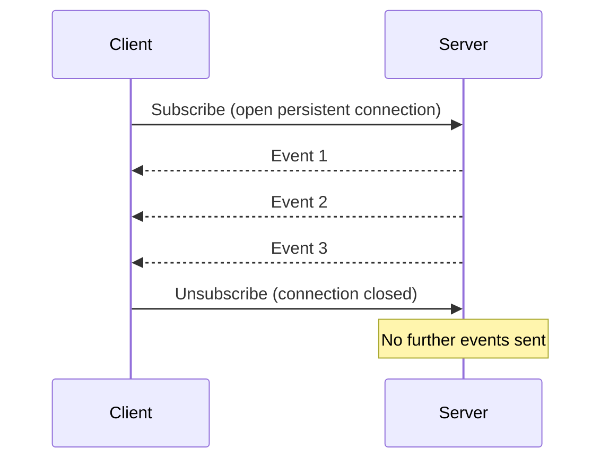
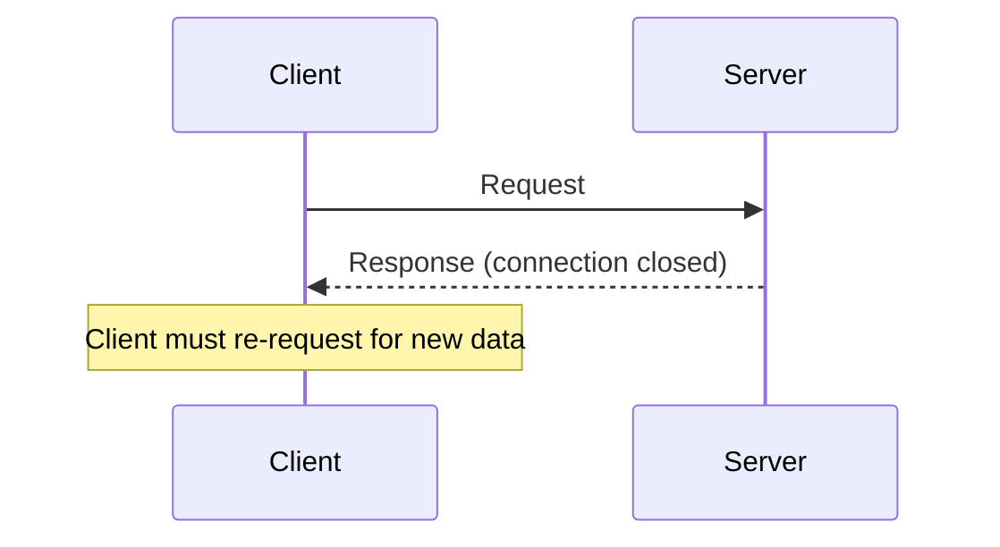

## When to Use Subscriptions

tRPC subscriptions enable persistent, server-initiated communication over a long-lived connection. Unlike queries and mutations — which follow a request/response model where the client always initiates — subscriptions allow the server to push data to the client as events occur. Understanding when subscriptions are the right tool, and when they are not, is as important as knowing how to implement them.

---

### How tRPC Subscriptions Work

tRPC subscriptions are built on server-sent events (SSE) or WebSockets, depending on your transport configuration. The client opens a persistent connection to a subscription procedure; the server emits values over time; the client receives each emitted value via a callback or reactive hook.



Compare this to a query:



---

### Transport Requirements

Subscriptions require a transport that supports persistent connections. tRPC supports two:

| Transport | Package | Notes |
|---|---|---|
| WebSockets | `@trpc/client` (`wsLink`) | Bidirectional; requires a WebSocket server |
| Server-Sent Events (SSE) | `@trpc/client` (`sseLink`, `httpSubscriptionLink`) | Unidirectional server→client; works over standard HTTP |

[Inference] SSE is simpler to deploy in environments that support standard HTTP (e.g., serverless functions with streaming), while WebSockets require a persistent server process. The choice of transport affects infrastructure requirements, not the subscription API surface itself. Verify current transport availability against your installed tRPC version.

Standard `httpLink` and `httpBatchLink` do not support subscriptions. [Inference] Attempting to use a subscription procedure over these links will result in a runtime error.

---

### When Subscriptions Are Appropriate

#### Real-Time Collaborative Features

When multiple users interact with shared state and each user must see others' changes immediately:

- Collaborative document editing
- Shared whiteboards
- Multi-user presence indicators ("Jane is typing...")
- Live cursors

```ts
// Example: subscribe to presence events in a shared document
docRouter.onPresenceChange.useSubscription(
  { docId },
  {
    onData: (presence) => updatePresenceMap(presence),
  }
);
```

A polling approach here would either introduce visible lag (long intervals) or place excessive load on the server (short intervals).

#### Live Data Feeds

When data changes frequently and the client must reflect changes with minimal delay:

- Financial market prices or order books
- Live sports scores
- Real-time sensor or IoT readings
- Live auction bid updates

For these cases, the latency introduced by polling — even at one-second intervals — may be unacceptable, and the volume of unchanged responses from polling wastes bandwidth.

#### Server-Initiated Notifications

When the server needs to push a notification without the client asking:

- Toast notifications triggered by background job completion
- Alert when another user assigns a task to you
- System status degradation warnings

These events are inherently unpredictable in timing. Polling requires the client to ask repeatedly on the chance that an event has occurred; subscriptions deliver the event precisely when it happens.

#### Long-Running Operation Progress

When a server-side operation takes significant time and the client needs incremental updates:

- File upload or processing progress
- AI/LLM response streaming (token-by-token output)
- Build pipeline stage completion events
- Batch import status

```ts
// Example: stream progress of a long-running job
jobRouter.onProgress.useSubscription(
  { jobId },
  {
    onData: (progress) => setProgress(progress.percent),
    onComplete: () => setDone(true),
  }
);
```

#### Chat and Messaging

Any feature where messages from other users must appear in real time without a user action:

- Direct messaging
- Group chat rooms
- Support ticket threads
- Comment threads on live content

---

### When Subscriptions Are Not Appropriate

#### Infrequently Changing Data

If data changes once per hour or less, the overhead of maintaining a persistent connection outweighs the benefit. Standard `useQuery` with an appropriate `refetchInterval` is simpler and sufficient:

```ts
// Polling every 5 minutes is appropriate for slowly-changing data
trpc.dashboard.stats.useQuery(undefined, {
  refetchInterval: 1000 * 60 * 5,
});
```

#### Data Needed Only at Page Load

If the client only needs fresh data when a page mounts — not continuously — a query or server-side prefetch is the correct tool. A subscription that immediately unsubscribes after receiving one value is unnecessary complexity.

#### Request/Response Interactions

Mutations by definition are fire-and-return operations. Wrapping a one-time action in a subscription adds complexity without benefit. If you need the result of a mutation, use `mutateAsync`.

#### Environments That Do Not Support Persistent Connections

Some deployment environments [Inference] cannot support long-lived connections:

- Serverless functions with short execution time limits (e.g., Vercel Edge Functions, AWS Lambda) may terminate the connection before meaningful data is exchanged
- CDN-terminated HTTP/1.1 connections may not support SSE
- Some corporate proxies and firewalls strip or terminate WebSocket upgrades

[Speculation] SSE over HTTP/2 may be more resilient than WebSockets in some proxy environments, but behavior varies by infrastructure. Verify compatibility with your deployment target before committing to a subscription-based architecture.

#### When Polling Is Acceptable

Polling is underused as a solution. It is simpler to implement, requires no persistent connection, and works in all deployment environments. Consider polling when:

- Acceptable latency is greater than ~5 seconds
- The number of concurrent users is small
- Deployment environment does not support persistent connections
- The team does not have operational experience managing WebSocket servers

---

### Subscriptions vs. Polling — Decision Comparison

| Factor | Subscription | Polling |
|---|---|---|
| Latency | Near-zero (push) | Bounded by interval |
| Server load (quiet periods) | Low — connection is idle | Higher — requests still sent |
| Server load (busy periods) | Proportional to events | Fixed by interval |
| Infrastructure complexity | Higher — persistent server | Lower — stateless HTTP |
| Serverless compatibility | Poor to limited | Full |
| Implementation complexity | Higher | Lower |
| Appropriate update frequency | Continuous / unpredictable | Infrequent / predictable |

---

### Subscriptions vs. Optimistic Updates

Subscriptions and optimistic updates address different problems and are not alternatives to each other:

- **Optimistic updates** make the UI feel fast for the *current user's own actions* by speculatively applying changes before the server confirms them
- **Subscriptions** deliver *other users' actions* (or server-side events) to the current user in real time

In a collaborative application, you may use both: optimistic updates for local responsiveness, and subscriptions to receive remote changes.

---

### Connection Lifecycle Considerations

Subscriptions introduce lifecycle concerns that queries and mutations do not have:

#### Connection Drops and Reconnection

Network interruptions will close the connection. [Inference] tRPC's WebSocket link includes reconnection logic, but events emitted during a disconnection window may be missed unless the server implements event replay or the client re-fetches state on reconnect. This is an application-level concern that tRPC does not handle automatically.

#### Cleanup on Unmount

tRPC's `useSubscription` hook [Inference] closes the subscription when the component unmounts. If a subscription must outlive a component, the connection must be managed at a higher level (e.g., a context provider or global state store).

#### Server Resource Management

Each active subscription holds a connection on the server. At scale, a large number of concurrent subscriptions places load on the server regardless of how much data is being sent. [Inference] This is in contrast to queries, where serverless scaling handles concurrent requests naturally.

---

### Summary: Use Subscriptions When

- Events are unpredictable in timing and must be delivered with minimal latency
- The server needs to push data without a client request
- Polling would require an interval short enough to generate excessive traffic
- The deployment environment supports persistent connections
- The use case is inherently real-time: chat, collaboration, live feeds, streaming output

### Summary: Avoid Subscriptions When

- Data changes infrequently and polling latency is acceptable
- The interaction is a one-time request/response
- The deployment environment does not support persistent connections (serverless, short-lived functions)
- The added operational complexity is not justified by the real-time requirement

---

**Conclusion:**
tRPC subscriptions are the right tool when the server must push data to the client continuously or in response to unpredictable events — real-time collaboration, live feeds, notifications, and streaming output are the primary use cases. They are not a general replacement for queries: the infrastructure requirements, connection lifecycle complexity, and serverless incompatibility make them a deliberate architectural choice rather than a default. When the required update latency is greater than a few seconds, or when the deployment environment does not support persistent connections, polling via `refetchInterval` is simpler and sufficient. Transport and reconnection behavior in tRPC may vary by configuration and version; verify current support against the tRPC documentation for your setup.