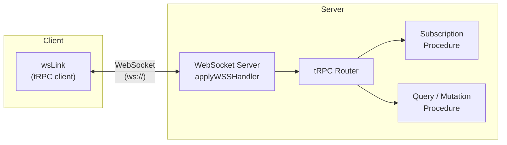

## Setting Up the WebSocket Server

tRPC's WebSocket support requires a dedicated WebSocket server running alongside — or instead of — your HTTP server. The WebSocket server handles subscription procedures over persistent connections while HTTP procedures (queries and mutations) can continue to be served over standard HTTP. This topic covers the server-side setup required to enable WebSocket transport in tRPC.

---

### How the WebSocket Transport Works

tRPC uses its own protocol over WebSockets. The client sends procedure calls as JSON messages over the connection; the server routes them to the appropriate procedure and streams responses back. Subscriptions stay open and emit multiple responses; queries and mutations [Inference] resolve in a single response and close their logical stream, but may share the same physical WebSocket connection.



---

### Required Packages

```bash
npm install @trpc/server ws
npm install --save-dev @types/ws
```

`ws` is the Node.js WebSocket library tRPC uses for its WebSocket server implementation. [Inference] Other WebSocket libraries are not directly supported by `applyWSSHandler`; `ws` is a required peer dependency for this transport.

---

### Defining a Subscription Procedure

Before setting up the server, the router needs at least one subscription procedure. tRPC subscriptions use async generators or `observable` from `@trpc/server/observable`.

#### Using an Async Generator (tRPC v11+)

```ts
// server/router.ts
import { z } from 'zod';
import { publicProcedure, router } from './trpc';

export const appRouter = router({
  onMessage: publicProcedure
    .input(z.object({ roomId: z.string() }))
    .subscription(async function* ({ input, signal }) {
      // Yield values over time
      // signal is an AbortSignal — check it to detect client disconnect
      while (!signal?.aborted) {
        const message = await waitForNextMessage(input.roomId, signal);
        yield message;
      }
    }),
});

export type AppRouter = typeof appRouter;
```

#### Using observable (tRPC v10)

```ts
import { observable } from '@trpc/server/observable';

export const appRouter = router({
  onMessage: publicProcedure
    .input(z.object({ roomId: z.string() }))
    .subscription(({ input }) => {
      return observable<{ text: string; userId: string }>((emit) => {
        const handler = (message: { text: string; userId: string }) => {
          emit.next(message);
        };

        messageEmitter.on(`room:${input.roomId}`, handler);

        // Cleanup when client unsubscribes
        return () => {
          messageEmitter.off(`room:${input.roomId}`, handler);
        };
      });
    }),
});
```

**Key Points:**
- The cleanup function returned from `observable` is called when the client unsubscribes or the connection drops — always clean up event listeners here to avoid memory leaks
- Async generators (v11+) use `signal?.aborted` for the same purpose; [Inference] the signal is aborted when the client disconnects or unsubscribes

---

### applyWSSHandler

`applyWSSHandler` is tRPC's function that attaches your router to a `ws.WebSocketServer` instance. It handles the tRPC-over-WebSocket protocol, routing incoming messages to the correct procedures.

```ts
import { applyWSSHandler } from '@trpc/server/adapters/ws';
import { WebSocketServer } from 'ws';
import { appRouter } from './router';
import { createContext } from './context';

const wss = new WebSocketServer({ port: 3001 });

const handler = applyWSSHandler({
  wss,
  router: appRouter,
  createContext,
  // Optional: keep connections alive with ping/pong
  keepAlive: {
    enabled: true,
    pingMs: 30_000,   // Send ping every 30 seconds
    pongWaitMs: 5_000, // Wait 5 seconds for pong before closing
  },
});

wss.on('listening', () => {
  console.log('WebSocket server listening on ws://localhost:3001');
});

// Graceful shutdown
process.on('SIGTERM', () => {
  handler.broadcastReconnectNotification();
  wss.close();
});
```

**Key Points:**
- `createContext` receives the WebSocket upgrade request — it can read cookies and headers from the HTTP upgrade handshake for authentication [Inference]
- `keepAlive` uses WebSocket ping/pong frames to detect stale connections; without it, dropped connections [Inference] may not be detected until the next write attempt
- `broadcastReconnectNotification()` signals all connected clients to reconnect — useful before a planned server restart so clients re-establish connections gracefully

---

### Context for WebSocket Procedures

The `createContext` function for WebSocket procedures receives a different request object than the HTTP context factory. The upgrade request is an `http.IncomingMessage`:

```ts
// server/context.ts
import type { CreateWSSContextFnOptions } from '@trpc/server/adapters/ws';
import type { CreateNextContextOptions } from '@trpc/server/adapters/next';

// WebSocket context
export async function createWSSContext({ req, res }: CreateWSSContextFnOptions) {
  // req is http.IncomingMessage from the WebSocket upgrade
  const token = req.headers['authorization']?.replace('Bearer ', '');
  const user = token ? await verifyToken(token) : null;

  return { user };
}

// HTTP context (for queries/mutations over HTTP)
export async function createHTTPContext({ req, res }: CreateNextContextOptions) {
  const token = req.headers['authorization']?.replace('Bearer ', '');
  const user = token ? await verifyToken(token) : null;

  return { user };
}
```

**Key Points:**
- Cookie-based authentication may require additional handling for WebSocket upgrade requests — standard `cookie` parsing libraries can parse `req.headers.cookie` directly [Inference]
- The context is created once per connection, not once per message or subscription call; all procedures on a single connection share the same context object [Inference]

---

### Running HTTP and WebSocket Servers Together

A common pattern is to run the HTTP server (for queries and mutations) and the WebSocket server on separate ports, or on the same port using an HTTP server upgrade:

#### Separate Ports

```ts
// server/index.ts
import { createHTTPServer } from '@trpc/server/adapters/standalone';
import { WebSocketServer } from 'ws';
import { applyWSSHandler } from '@trpc/server/adapters/ws';
import { appRouter } from './router';
import { createHTTPContext, createWSSContext } from './context';

// HTTP server on port 3000
const httpServer = createHTTPServer({
  router: appRouter,
  createContext: createHTTPContext,
});
httpServer.listen(3000);

// WebSocket server on port 3001
const wss = new WebSocketServer({ port: 3001 });
applyWSSHandler({
  wss,
  router: appRouter,
  createContext: createWSSContext,
});
```

#### Same Port via HTTP Upgrade

```ts
import http from 'http';
import { WebSocketServer } from 'ws';
import { applyWSSHandler } from '@trpc/server/adapters/ws';
import express from 'express';
import { createExpressMiddleware } from '@trpc/server/adapters/express';
import { appRouter } from './router';
import { createContext } from './context';

const app = express();

app.use('/trpc', createExpressMiddleware({ router: appRouter, createContext }));

const server = http.createServer(app);

// Attach WebSocket server to the same HTTP server
const wss = new WebSocketServer({ server });

applyWSSHandler({ wss, router: appRouter, createContext });

server.listen(3000, () => {
  console.log('HTTP + WebSocket server on port 3000');
});
```

**Key Points:**
- When sharing a port, HTTP requests go to the Express middleware and WebSocket upgrades go to `wss` — Node.js routes them based on the `Upgrade` header [Inference]
- Sharing a port simplifies firewall and load balancer configuration but requires the HTTP server instance to be created manually (not via `createHTTPServer`)

---

### Next.js Integration

Next.js's default server does not expose a WebSocket upgrade mechanism directly. The common approach is a custom server:

```ts
// server.ts (custom Next.js server)
import { createServer } from 'http';
import { parse } from 'url';
import next from 'next';
import { WebSocketServer } from 'ws';
import { applyWSSHandler } from '@trpc/server/adapters/ws';
import { appRouter } from './server/router';
import { createContext } from './server/context';

const dev = process.env.NODE_ENV !== 'production';
const app = next({ dev });
const handle = app.getRequestHandler();

app.prepare().then(() => {
  const server = createServer((req, res) => {
    const parsedUrl = parse(req.url!, true);
    handle(req, res, parsedUrl);
  });

  const wss = new WebSocketServer({ server });

  applyWSSHandler({
    wss,
    router: appRouter,
    createContext,
  });

  server.listen(3000, () => {
    console.log('> Ready on http://localhost:3000');
  });
});
```

```json
// package.json — use custom server instead of next start
{
  "scripts": {
    "dev": "ts-node server.ts",
    "build": "next build && tsc --project tsconfig.server.json",
    "start": "node dist/server.js"
  }
}
```

**Key Points:**
- Using a custom Next.js server disables some Next.js optimizations and [Inference] is incompatible with Vercel's serverless deployment model — the app must be deployed on a platform that supports persistent Node.js processes (e.g., a VPS, Railway, Render, or a containerized environment)
- This is a significant architectural constraint; evaluate whether SSE (via `httpSubscriptionLink`) may be more appropriate for your deployment target before committing to WebSockets in Next.js

---

### applyWSSHandler Options Reference

| Option | Type | Required | Purpose |
|---|---|---|---|
| `wss` | `WebSocketServer` | Yes | The `ws` server instance to attach to |
| `router` | `AnyRouter` | Yes | Your tRPC router |
| `createContext` | `Function` | No | Context factory; receives upgrade request |
| `keepAlive.enabled` | `boolean` | No | Enable ping/pong keep-alive |
| `keepAlive.pingMs` | `number` | No | Interval between pings (ms) |
| `keepAlive.pongWaitMs` | `number` | No | Timeout waiting for pong before disconnect (ms) |
| `onError` | `Function` | No | Called when a procedure throws |
| `batching.enabled` | `boolean` | No | [Inference] Enable message batching over the connection |

---

### Graceful Shutdown Pattern

```ts
const handler = applyWSSHandler({ wss, router: appRouter, createContext });

function shutdown() {
  console.log('Shutting down WebSocket server...');

  // Notify clients to reconnect (they will attempt to re-establish)
  handler.broadcastReconnectNotification();

  wss.close(() => {
    console.log('WebSocket server closed');
    process.exit(0);
  });
}

process.on('SIGTERM', shutdown);
process.on('SIGINT', shutdown);
```

[Inference] `broadcastReconnectNotification()` sends a tRPC-level signal to all connected clients. Whether the client actually reconnects depends on the client-side `wsLink` reconnection configuration. Behavior is not guaranteed across all client setups.

---

### Common Issues

#### Subscriptions Not Receiving Events

- Verify the client is using `wsLink`, not `httpLink` or `httpBatchLink` — subscriptions over HTTP links will not work
- Verify the WebSocket server is running and reachable at the configured URL
- Check that `createContext` is not throwing, as a context error [Inference] will close the connection before any procedures run

#### Memory Leaks in Subscriptions

- Ensure event listener cleanup is implemented in the `observable` return function or via `signal` in async generators
- Verify that `messageEmitter` (or equivalent) does not accumulate listeners indefinitely when clients disconnect without cleanup

#### Connection Drops in Production

- Enable `keepAlive` to detect and close stale connections
- [Inference] Load balancers and reverse proxies (e.g., Nginx, AWS ALB) may have their own WebSocket timeout settings that close idle connections regardless of application-level keep-alive; configure these at the infrastructure level as well

---

**Conclusion:**
Setting up a tRPC WebSocket server requires `ws`, a `WebSocketServer` instance, and `applyWSSHandler` to bind the router to the transport. The WebSocket server can run on a separate port or share a port with the HTTP server via the HTTP upgrade mechanism. Context creation, cleanup, and graceful shutdown are the primary operational concerns. In Next.js, WebSocket support requires a custom server, which restricts deployment to persistent-process environments. For serverless or edge deployments, SSE via `httpSubscriptionLink` is [Inference] a more viable alternative; evaluate both transports against your infrastructure constraints before implementation.