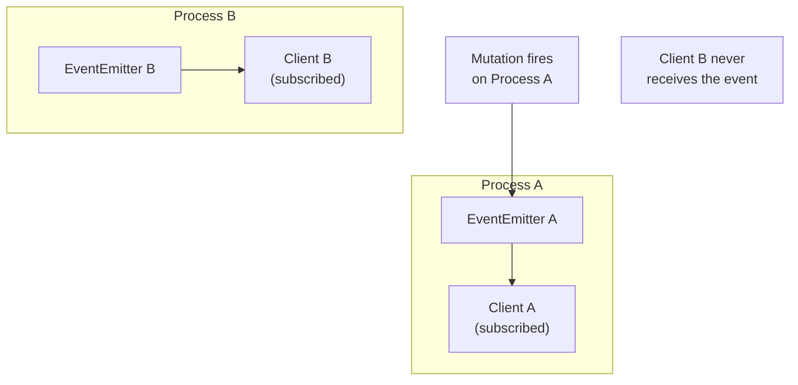

## Defining Subscription Procedures

A subscription procedure is a tRPC procedure that emits multiple values over time rather than returning a single response. The server holds the connection open and pushes data to the client as events occur. tRPC v11 introduced async generator support as the primary authoring model, while tRPC v10 used the `observable` API. Both are covered here.

---

### Procedure Chain Comparison

| Procedure Type | Terminal Method | Returns |
|---|---|---|
| Query | `.query(handler)` | Single value |
| Mutation | `.mutation(handler)` | Single value |
| Subscription | `.subscription(handler)` | Stream of values over time |

The input, middleware, and context chain is identical across all three types — `.subscription()` is simply a different terminal that signals a streaming response.

---

### Async Generator Model (tRPC v11+)

The async generator model is the current recommended approach for defining subscriptions. The handler is an async generator function that `yield`s values over time. The generator runs for the lifetime of the subscription.

#### Minimal Example

```ts
import { publicProcedure, router } from './trpc';

export const appRouter = router({
  countdown: publicProcedure
    .subscription(async function* () {
      for (let i = 10; i >= 0; i--) {
        yield { count: i };
        await new Promise(resolve => setTimeout(resolve, 1_000));
      }
    }),
});
```

The client receives one `{ count: number }` value per second, ten times, then the subscription completes naturally when the generator returns.

---

### Input Validation

Subscription procedures accept `.input()` exactly like queries and mutations:

```ts
import { z } from 'zod';

export const appRouter = router({
  onRoomMessage: publicProcedure
    .input(z.object({
      roomId: z.string().uuid(),
    }))
    .subscription(async function* ({ input }) {
      // input.roomId is typed as string
      for await (const message of subscribeToRoom(input.roomId)) {
        yield message;
      }
    }),
});
```

**Key Points:**
- Input is validated at subscription start — if validation fails, the connection is rejected before the generator runs
- Input is fixed for the lifetime of the subscription; the client cannot change it without unsubscribing and resubscribing [Inference]

---

### Detecting Client Disconnect with AbortSignal

The `signal` property on the handler argument is an `AbortSignal` that is aborted when the client disconnects or unsubscribes. Without checking `signal`, a generator that loops indefinitely will continue running on the server after the client has gone.

```ts
export const appRouter = router({
  onStockPrice: publicProcedure
    .input(z.object({ ticker: z.string() }))
    .subscription(async function* ({ input, signal }) {
      while (!signal?.aborted) {
        const price = await fetchLatestPrice(input.ticker);
        yield { ticker: input.ticker, price };

        // Wait before next poll — also pass signal so the wait
        // can be interrupted when the client disconnects
        await sleep(2_000, signal);
      }
    }),
});

// Utility: a sleep that aborts early when signal fires
function sleep(ms: number, signal?: AbortSignal): Promise<void> {
  return new Promise((resolve, reject) => {
    const timeout = setTimeout(resolve, ms);
    signal?.addEventListener('abort', () => {
      clearTimeout(timeout);
      reject(new DOMException('Aborted', 'AbortError'));
    });
  });
}
```

**Key Points:**
- `signal` may be `undefined` in some configurations — always use optional chaining (`signal?.aborted`) [Inference]
- Passing `signal` into underlying async operations (fetch, database watchers) allows the entire call chain to cancel cleanly
- [Inference] If `signal` is not checked, the generator continues consuming server resources after client disconnect until the server process restarts or the connection is force-closed at the transport level

---

### Yielding from External Event Sources

Most real subscriptions do not poll — they react to external events. The generator must bridge event-emitter or callback-based systems into an async iterable.

#### Using an AsyncIterable from an Event Emitter

```ts
import { EventEmitter } from 'events';

const ee = new EventEmitter();

// Helper: convert an EventEmitter event into an async iterable
async function* fromEvent<T>(
  emitter: EventEmitter,
  event: string,
  signal?: AbortSignal,
): AsyncGenerator<T> {
  const queue: T[] = [];
  let resolve: (() => void) | null = null;

  const handler = (value: T) => {
    queue.push(value);
    resolve?.();
    resolve = null;
  };

  emitter.on(event, handler);

  try {
    while (!signal?.aborted) {
      if (queue.length > 0) {
        yield queue.shift()!;
      } else {
        await new Promise<void>((res) => { resolve = res; });
      }
    }
  } finally {
    emitter.off(event, handler);
  }
}

export const appRouter = router({
  onNewOrder: publicProcedure
    .subscription(async function* ({ signal }) {
      yield* fromEvent<{ orderId: string; total: number }>(
        ee,
        'order:created',
        signal,
      );
    }),
});

// Elsewhere in your app — emitting an event triggers all subscribers
ee.emit('order:created', { orderId: 'abc', total: 49.99 });
```

**Key Points:**
- The `finally` block in `fromEvent` ensures the listener is removed regardless of how the generator exits — normal completion, client disconnect, or thrown error
- The queue pattern handles bursts where events arrive faster than the client can consume them [Inference] — events are buffered in memory; unbounded queues may cause memory pressure under high event rates

---

### Using observable (tRPC v10)

In tRPC v10, subscriptions are defined using `observable` from `@trpc/server/observable`. The observable model uses a callback-based `emit` object rather than `yield`.

```ts
import { observable } from '@trpc/server/observable';
import { z } from 'zod';
import { EventEmitter } from 'events';

const ee = new EventEmitter();

export const appRouter = router({
  onMessage: publicProcedure
    .input(z.object({ roomId: z.string() }))
    .subscription(({ input }) => {
      return observable<{ userId: string; text: string }>((emit) => {
        const handler = (msg: { userId: string; text: string }) => {
          emit.next(msg);    // Push a value to the client
        };

        ee.on(`room:${input.roomId}`, handler);

        // Return cleanup function
        return () => {
          ee.off(`room:${input.roomId}`, handler);
        };
      });
    }),
});
```

**Key Points:**
- `emit.next(value)` pushes a value to the client
- `emit.error(err)` terminates the subscription with an error
- `emit.complete()` terminates the subscription normally
- The function returned from the `observable` callback is the cleanup/teardown — it runs when the client unsubscribes or disconnects

#### observable vs Async Generator

| Aspect | `observable` (v10) | Async generator (v11+) |
|---|---|---|
| Authoring style | Callback / push | `yield` / pull |
| Cleanup | Returned function | `finally` block |
| Disconnect detection | Implicit (cleanup called) | `signal?.aborted` |
| TypeScript inference | Explicit generic required | Inferred from `yield` type |
| Compatibility | v10 and v11 | v11+ only |

[Inference] tRPC v11 maintains backward compatibility with `observable`-based subscriptions; existing v10 code does not need to be rewritten immediately. Verify against your installed version.

---

### Context and Middleware in Subscriptions

Subscriptions participate in the full middleware chain. Authentication and authorization middleware applies identically:

```ts
const protectedProcedure = publicProcedure.use(({ ctx, next }) => {
  if (!ctx.user) {
    throw new TRPCError({ code: 'UNAUTHORIZED' });
  }
  return next({ ctx: { ...ctx, user: ctx.user } });
});

export const appRouter = router({
  onPrivateNotification: protectedProcedure
    .subscription(async function* ({ ctx, signal }) {
      // ctx.user is typed as non-nullable here
      while (!signal?.aborted) {
        const notification = await waitForNotification(ctx.user.id, signal);
        yield notification;
      }
    }),
});
```

**Key Points:**
- A `TRPCError` thrown from middleware before `next()` rejects the subscription before the generator runs
- [Inference] Middleware runs once per subscription start, not once per emitted value — context is established at connection time and remains fixed for the lifetime of the subscription

---

### Error Handling in Subscriptions

#### Throwing from the Generator

Throwing inside the generator terminates the subscription and sends an error to the client:

```ts
.subscription(async function* ({ input, signal }) {
  const stream = await openStream(input.id);

  if (!stream) {
    throw new TRPCError({
      code: 'NOT_FOUND',
      message: `Stream ${input.id} not found`,
    });
  }

  for await (const chunk of stream) {
    yield chunk;
  }
}),
```

#### Handling Errors from External Sources

Errors from underlying async operations should be caught and either re-thrown as `TRPCError` or handled gracefully:

```ts
.subscription(async function* ({ input, signal }) {
  try {
    for await (const event of subscribeToExternalService(input.id, signal)) {
      yield event;
    }
  } catch (err) {
    if (err instanceof ExternalServiceError) {
      throw new TRPCError({
        code: 'INTERNAL_SERVER_ERROR',
        message: 'External service failed',
        cause: err,
      });
    }
    throw err; // Re-throw unexpected errors
  }
}),
```

---

### Typing Emitted Values

The TypeScript type of values emitted by the subscription is inferred from the `yield` type in async generators, or from the generic parameter of `observable`:

```ts
// Async generator — type inferred from yield
.subscription(async function* () {
  yield { count: 1 };         // Inferred: { count: number }
  yield { count: 2 };
})

// observable — explicit generic
return observable<{ count: number }>((emit) => {
  emit.next({ count: 1 });
});
```

On the client, `data` in `useSubscription` is typed as the emitted value type — no manual annotation is needed in either model [Inference].

---

### Subscription Completion

A subscription ends in one of three ways:

| Cause | Async generator | observable |
|---|---|---|
| Server finishes normally | Generator function returns | `emit.complete()` |
| Server encounters error | Generator throws | `emit.error(err)` |
| Client disconnects | `signal` is aborted; `finally` runs | Cleanup function is called |

```ts
// Natural completion — generator returns after finite work
.subscription(async function* () {
  for (let i = 0; i < 5; i++) {
    yield { index: i };
    await sleep(1_000);
  }
  // Generator returns here — subscription ends normally
})
```

---

### Practical Example: Chat Room Messages

```ts
// server/routers/chat.ts
import { z } from 'zod';
import { EventEmitter } from 'events';
import { protectedProcedure, router } from '../trpc';

const ee = new EventEmitter();
ee.setMaxListeners(100); // Raise limit for many concurrent subscribers

interface Message {
  id: string;
  roomId: string;
  userId: string;
  text: string;
  createdAt: Date;
}

export const chatRouter = router({
  sendMessage: protectedProcedure
    .input(z.object({
      roomId: z.string(),
      text: z.string().min(1).max(2000),
    }))
    .mutation(async ({ input, ctx }) => {
      const message: Message = {
        id: crypto.randomUUID(),
        roomId: input.roomId,
        userId: ctx.user.id,
        text: input.text,
        createdAt: new Date(),
      };

      await db.messages.insert(message);

      // Emit to all subscribers of this room
      ee.emit(`room:${input.roomId}`, message);

      return message;
    }),

  onMessage: protectedProcedure
    .input(z.object({ roomId: z.string() }))
    .subscription(async function* ({ input, signal }) {
      const queue: Message[] = [];
      let notify: (() => void) | null = null;

      const handler = (msg: Message) => {
        queue.push(msg);
        notify?.();
        notify = null;
      };

      ee.on(`room:${input.roomId}`, handler);

      try {
        while (!signal?.aborted) {
          if (queue.length > 0) {
            yield queue.shift()!;
          } else {
            await new Promise<void>((resolve) => {
              notify = resolve;
            });
          }
        }
      } finally {
        ee.off(`room:${input.roomId}`, handler);
      }
    }),
});
```

**Key Points:**
- `sendMessage` is a mutation — it writes to the database and emits an event
- `onMessage` is a subscription — it listens for that event and yields each message to the client
- `ee.setMaxListeners(100)` raises Node.js's default listener warning threshold; set this to a value appropriate for your expected concurrent subscriber count [Inference]
- The queue-and-notify pattern decouples emission speed from consumption speed; in production, consider a bounded queue size to limit memory usage under load [Inference]

---

### Scaling Considerations

The `EventEmitter` pattern works within a single server process. In a multi-process or multi-instance deployment, events emitted on one process are not visible to subscribers on another:



For multi-instance deployments, a shared pub/sub layer is required:

- **Redis Pub/Sub** — a common choice; each process subscribes to Redis channels and emits locally received events to its own `EventEmitter`
- **Database change streams** — some databases (PostgreSQL LISTEN/NOTIFY, MongoDB change streams) support native pub/sub [Inference]

[Speculation] tRPC does not provide built-in multi-instance pub/sub; this is an infrastructure concern that must be addressed at the application level. Implementation patterns vary and are outside tRPC's scope.

---

### Summary: Subscription Procedure Checklist

- Define with `.subscription(handler)` as the terminal method
- Validate input with `.input(schema)` — same as queries and mutations
- Use async generators (v11+) or `observable` (v10) as the handler model
- Check `signal?.aborted` in loops to detect client disconnect
- Always clean up external listeners — in `finally` for generators, in the returned function for `observable`
- Throw `TRPCError` for expected error conditions
- Use a shared pub/sub layer (e.g., Redis) when deploying across multiple server instances

---

**Conclusion:**
Subscription procedures in tRPC follow the same input, middleware, and context chain as queries and mutations, with `.subscription()` as the terminal method. The async generator model (v11+) expresses streaming logic naturally with `yield`, `signal`, and `finally`. The `observable` model (v10) uses a callback-based push API with an explicit cleanup return. In both models, correct cleanup on client disconnect is the most critical operational concern — uncleaned listeners accumulate and cause memory leaks under load. Multi-instance deployments require an external pub/sub layer, as tRPC's event model is process-local.