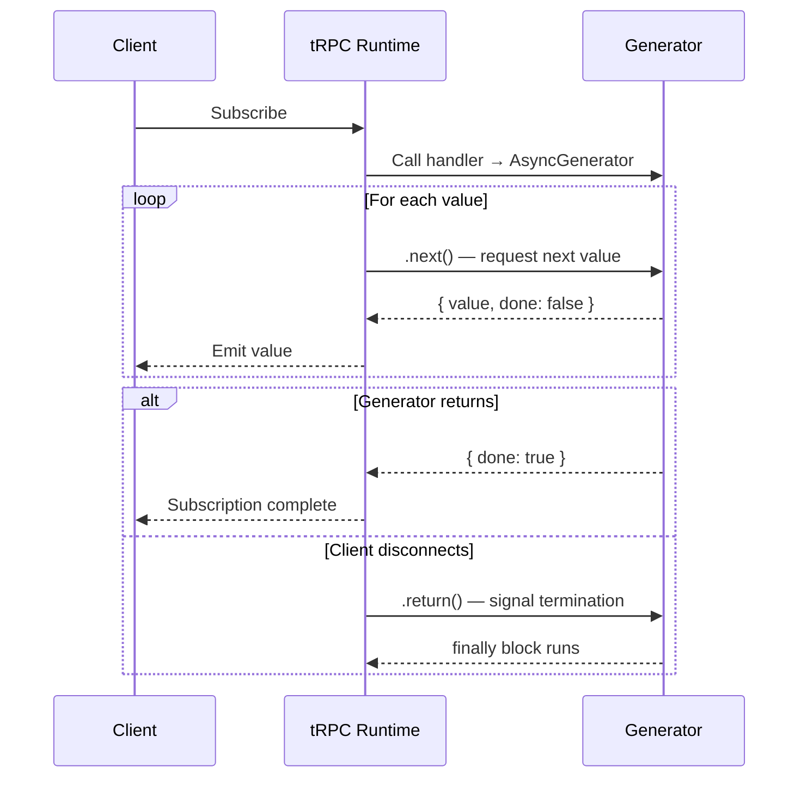

## Async Generators for Subscriptions

Async generators are the primary model for defining tRPC subscriptions in v11+. They allow subscription logic to be expressed as ordinary sequential code using `yield`, `await`, and `try/finally` — without callbacks, observable wrappers, or manual cleanup registration. Understanding async generators at the language level is prerequisite to using them correctly in tRPC subscriptions.

---

### Async Generator Fundamentals

An async generator is a function declared with `async function*`. It can `await` promises and `yield` values. Each `yield` suspends the function and produces a value; execution resumes when the consumer requests the next value.

```ts
async function* count() {
  yield 1;
  await new Promise(resolve => setTimeout(resolve, 1_000));
  yield 2;
  await new Promise(resolve => setTimeout(resolve, 1_000));
  yield 3;
  // Function returns — generator is done
}

// Consuming with for-await-of
for await (const value of count()) {
  console.log(value); // 1, then 2, then 3 (one per second)
}
```

An async generator function returns an `AsyncGenerator<T>`, which implements the `AsyncIterable<T>` protocol. tRPC [Inference] consumes the iterable returned by the subscription handler internally, pulling values as they are yielded and sending them to the client.

---

### How tRPC Consumes the Generator

When a client subscribes, tRPC:

1. Calls the subscription handler, which returns an `AsyncGenerator`
2. Iterates the generator with an internal `for await...of` loop
3. Sends each yielded value to the client as a subscription event
4. Stops iterating when the generator returns, throws, or the client disconnects



[Inference] tRPC calls `.return()` on the generator when the client disconnects, which causes the generator to jump to its `finally` block if one exists. This is standard AsyncGenerator protocol behavior, not tRPC-specific.

---

### The signal Parameter

The subscription handler receives a `signal` property — an `AbortSignal` that is aborted when the client disconnects or unsubscribes. It is the primary mechanism for breaking out of infinite loops in generators.

```ts
.subscription(async function* ({ input, signal }) {
  while (!signal?.aborted) {
    const data = await fetchLatest(input.id);
    yield data;
    await sleep(5_000, signal);
  }
})
```

**Key Points:**

- `signal` may be `undefined` in some configurations — always guard with `signal?.aborted` [Inference]
- Checking `signal?.aborted` at the top of a loop prevents one extra iteration after disconnect
- `signal` should be forwarded to any underlying async operations that accept it, so they can cancel promptly rather than waiting to complete before the loop condition is checked

---

### Patterns for Yielding Values

#### Pattern 1: Polling Loop

Repeatedly fetch and yield at a fixed interval. Appropriate when there is no push mechanism available from the data source:

```ts
.subscription(async function* ({ input, signal }) {
  while (!signal?.aborted) {
    const result = await db.query.findFirst({
      where: eq(schema.jobs.id, input.jobId),
    });

    yield result;

    if (result.status === 'completed' || result.status === 'failed') {
      return; // Natural completion — stop polling
    }

    await sleep(2_000, signal);
  }
})
```

#### Pattern 2: Delegating to an External AsyncIterable

If your data source already provides an `AsyncIterable` (e.g., a database change stream, a Readable stream, a Redis subscriber), delegate directly with `yield*`:

```ts
.subscription(async function* ({ input, signal }) {
  const stream = openChangeStream(input.collectionId, { signal });
  yield* stream; // Delegate — yields every value from stream
})
```

`yield*` delegates the entire iteration to another iterable. The generator completes when the delegated iterable completes. [Inference] If the delegated iterable does not respect `signal`, cancellation may be delayed until the external source produces its next value or closes naturally.

#### Pattern 3: Queue-Based Event Bridge

When the data source is event-emitter-based (not iterable), bridge it into the generator using a queue:

```ts
import { EventEmitter } from 'events';

const ee = new EventEmitter();

async function* fromEmitter<T>(
  emitter: EventEmitter,
  event: string,
  signal?: AbortSignal,
): AsyncGenerator<T> {
  const queue: T[] = [];
  let wakeUp: (() => void) | null = null;

  const onEvent = (value: T) => {
    queue.push(value);
    wakeUp?.();
    wakeUp = null;
  };

  const onAbort = () => {
    wakeUp?.();
    wakeUp = null;
  };

  emitter.on(event, onEvent);
  signal?.addEventListener('abort', onAbort);

  try {
    while (!signal?.aborted) {
      if (queue.length > 0) {
        yield queue.shift()!;
      } else {
        await new Promise<void>((resolve) => {
          wakeUp = resolve;
        });
      }
    }
  } finally {
    emitter.off(event, onEvent);
    signal?.removeEventListener('abort', onAbort);
  }
}

// Usage in subscription
.subscription(async function* ({ input, signal }) {
  yield* fromEmitter<OrderEvent>(ee, `order:${input.orderId}`, signal);
})
```

**Key Points:**

- The `onAbort` listener wakes the sleeping `Promise` when the signal fires, allowing the `while (!signal?.aborted)` condition to be checked promptly
- The `finally` block removes both the event listener and the abort listener, preventing leaks regardless of how the generator exits
- The queue handles bursts — events that arrive while the generator is processing a previous yield are buffered rather than dropped [Inference]

#### Pattern 4: Merging Multiple Sources

Yield from multiple event sources interleaved:

```ts
async function* merge<T>(
  sources: AsyncIterable<T>[],
  signal?: AbortSignal,
): AsyncGenerator<T> {
  const queue: T[] = [];
  let pending = sources.length;
  let wakeUp: (() => void) | null = null;

  // Drain each source into the shared queue concurrently
  for (const source of sources) {
    (async () => {
      for await (const value of source) {
        if (signal?.aborted) break;
        queue.push(value);
        wakeUp?.();
        wakeUp = null;
      }
      pending--;
      wakeUp?.();
      wakeUp = null;
    })();
  }

  while (!signal?.aborted && (queue.length > 0 || pending > 0)) {
    if (queue.length > 0) {
      yield queue.shift()!;
    } else {
      await new Promise<void>((resolve) => { wakeUp = resolve; });
    }
  }
}

.subscription(async function* ({ input, signal }) {
  yield* merge(
    [
      fromEmitter(ee, `order:${input.orderId}`, signal),
      fromEmitter(ee, `payment:${input.orderId}`, signal),
    ],
    signal,
  );
})
```

[Inference] The merge pattern above is a simplified illustration. Production merge implementations should handle errors from individual sources independently to avoid one failing source terminating all others. Behavior of concurrent async IIFE loops inside a generator may vary in edge cases; test thoroughly.

---

### Cleanup with try/finally

The `finally` block of an async generator runs in all exit scenarios: normal return, thrown error, or `.return()` called by the consumer (including tRPC's disconnect handling). It is the correct place for resource cleanup:

```ts
.subscription(async function* ({ input, signal }) {
  const connection = await openDatabaseConnection(input.id);

  try {
    for await (const row of connection.watch()) {
      yield row;
    }
  } finally {
    // Runs on: normal completion, error, client disconnect
    await connection.close();
  }
})
```

**Key Points:**

- `finally` runs even if the generator is abandoned mid-execution via `.return()`
- Async operations are permitted inside `finally` — `await connection.close()` is valid
- Do not `yield` inside `finally` — [Inference] yielding from a `finally` block that was triggered by `.return()` may produce unexpected behavior and is not a supported pattern

---

### Error Propagation

Errors thrown inside the generator propagate to the client as tRPC errors:

```ts
.subscription(async function* ({ input, signal }) {
  const resource = await acquireResource(input.id);

  if (!resource) {
    throw new TRPCError({
      code: 'NOT_FOUND',
      message: `Resource ${input.id} not found`,
    });
  }

  try {
    while (!signal?.aborted) {
      yield await resource.poll();
    }
  } catch (err) {
    if (err instanceof ResourceExpiredError) {
      throw new TRPCError({
        code: 'PRECONDITION_FAILED',
        message: 'Resource expired during subscription',
        cause: err,
      });
    }
    throw err; // Re-throw unknown errors
  } finally {
    await resource.release();
  }
})
```

**Key Points:**

- Wrap domain-specific errors in `TRPCError` to produce structured client-visible error shapes
- Re-throw unknown errors — swallowing them silently makes debugging difficult
- `finally` runs after the `catch` block, so `resource.release()` is called regardless of whether the error was handled [Inference]

---

### Yield Type Inference

TypeScript infers the subscription's emitted type from the `yield` expression. No explicit generic annotation is needed in standard cases:

```ts
// TypeScript infers emitted type as { id: string; price: number }
.subscription(async function* () {
  yield { id: 'AAPL', price: 192.5 };
  yield { id: 'GOOG', price: 175.3 };
})
```

If multiple yield types are present, TypeScript infers the union:

```ts
// Inferred as { type: 'tick'; value: number } | { type: 'done' }
.subscription(async function* () {
  yield { type: 'tick' as const, value: 42 };
  yield { type: 'done' as const };
})
```

On the client, `data` in `useSubscription` is typed as the inferred union — no manual annotation required. [Inference] Complex union types may require explicit typing in some cases; if the client-side type does not match expectations, adding an explicit return type annotation to the generator can resolve the discrepancy.

---

### Controlling Emission Rate

Generators naturally backpressure: the next value is not fetched until `yield` returns, which does not happen until tRPC has sent the previous value. [Inference] This means a slow client or transport cannot be overwhelmed by a fast generator in the same way a push-based system can. However, if values are buffered in a queue (Pattern 3), the queue itself has no inherent backpressure — large queues may still cause memory pressure.

```ts
// Rate-limited emission: wait at least 100ms between yields
.subscription(async function* ({ signal }) {
  for await (const event of eventSource) {
    yield event;
    await sleep(100, signal); // Throttle emission rate
  }
})
```

---

### Finite vs Infinite Subscriptions

Subscriptions can be finite (generator returns after bounded work) or infinite (generator loops until disconnect):

#### Finite

```ts
// Streams exactly 10 values, then completes
.subscription(async function* () {
  for (let i = 0; i < 10; i++) {
    yield { index: i };
    await sleep(500);
  }
  // return here — client receives a completion signal
})
```

#### Infinite (disconnect-terminated)

```ts
// Runs until client disconnects
.subscription(async function* ({ signal }) {
  while (!signal?.aborted) {
    yield await getNextEvent(signal);
  }
})
```

[Inference] When a finite subscription completes (generator returns), tRPC sends a completion event to the client. The client-side `useSubscription` hook's `onComplete` callback fires if provided. Verify this behavior against your tRPC version's client documentation.

---

### Full Example: Job Progress Streaming

```ts
// server/routers/jobs.ts
import { z } from 'zod';
import { protectedProcedure, router } from '../trpc';
import { TRPCError } from '@trpc/server';

type ProgressEvent =
  | { type: 'progress'; percent: number; message: string }
  | { type: 'complete'; result: string }
  | { type: 'error'; message: string };

export const jobsRouter = router({
  streamProgress: protectedProcedure
    .input(z.object({ jobId: z.string().uuid() }))
    .subscription(async function* ({ input, ctx, signal }): AsyncGenerator<ProgressEvent> {
      const job = await db.jobs.findById(input.jobId);

      if (!job) {
        throw new TRPCError({ code: 'NOT_FOUND', message: 'Job not found' });
      }

      if (job.ownerId !== ctx.user.id) {
        throw new TRPCError({ code: 'FORBIDDEN' });
      }

      try {
        while (!signal?.aborted) {
          const status = await db.jobs.getStatus(input.jobId);

          if (status.state === 'running') {
            yield {
              type: 'progress',
              percent: status.percent,
              message: status.currentStep,
            };
            await sleep(1_000, signal);
            continue;
          }

          if (status.state === 'completed') {
            yield { type: 'complete', result: status.result };
            return; // Finite — natural completion
          }

          if (status.state === 'failed') {
            yield { type: 'error', message: status.errorMessage };
            return;
          }

          // Job is queued — wait before polling again
          await sleep(2_000, signal);
        }
      } finally {
        // Log or clean up — runs on disconnect or completion
        await db.jobs.recordStreamEnd(input.jobId);
      }
    }),
});
```

---

### Common Mistakes

#### Missing signal Check in Loop

```ts
// ❌ Loop runs indefinitely on server after client disconnects
while (true) {
  yield await getData();
}

// ✅ Loop exits when client disconnects
while (!signal?.aborted) {
  yield await getData();
}
```

#### Missing finally for Cleanup

```ts
// ❌ Listener leaks if client disconnects mid-subscription
.subscription(async function* ({ signal }) {
  ee.on('event', handler);
  while (!signal?.aborted) {
    // ...
  }
  ee.off('event', handler); // Never reached on disconnect
})

// ✅ finally guarantees cleanup
.subscription(async function* ({ signal }) {
  ee.on('event', handler);
  try {
    while (!signal?.aborted) {
      // ...
    }
  } finally {
    ee.off('event', handler); // Always runs
  }
})
```

#### Not Forwarding signal to Awaited Operations

```ts
// ❌ sleep completes its full duration even after disconnect
await sleep(30_000);

// ✅ sleep aborts immediately when signal fires
await sleep(30_000, signal);
```

#### Yielding Inside finally

```ts
// ❌ Do not yield in finally — undefined behavior when triggered by .return()
} finally {
  yield { type: 'cleanup' }; // Avoid this
}
```

---

### Async Generator vs observable — When to Use Which

|Consideration|Async generator|observable|
|---|---|---|
|tRPC version|v11+|v10 and v11|
|Code style|Sequential, `await`/`yield`|Callback/push|
|Cleanup location|`finally` block|Returned function|
|Disconnect handling|`signal?.aborted` + `finally`|Cleanup function called|
|External iterables|`yield*` delegation|Manual bridging|
|Backpressure|Natural (pull-based)|None (push-based)|
|Preferred for new code|Yes (v11+)|Only if on v10 or migrating|

---

**Conclusion:** Async generators express tRPC subscription logic as sequential, readable code that `yield`s values, `await`s async operations, and uses `try/finally` for cleanup. The three critical practices are: checking `signal?.aborted` in loops to detect client disconnect, forwarding `signal` to underlying async operations so they cancel promptly, and placing resource cleanup in `finally` blocks so it runs regardless of exit cause. Event-emitter sources require a queue-based bridge to be consumable as an async iterable. All generator protocol behavior — including `.return()` triggering `finally` on disconnect — is standard JavaScript; tRPC delegates to this protocol rather than implementing its own cleanup mechanism.

