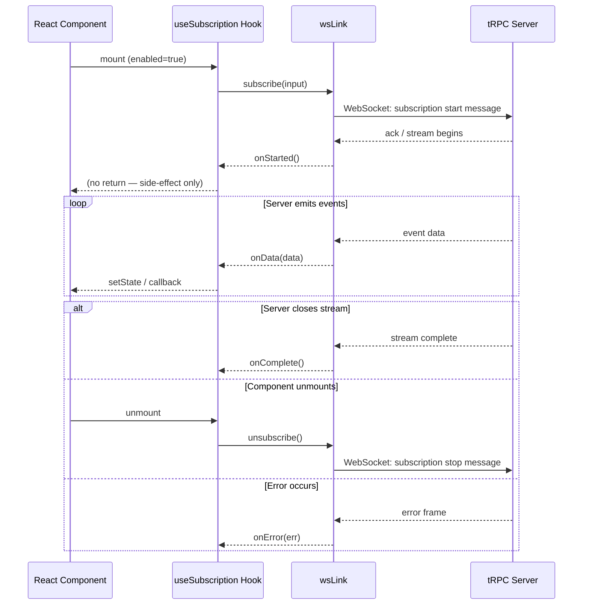

## Client-side Subscription Consumption

### Overview

Once a tRPC server exposes a subscription procedure (backed by an async generator or observable), the client side must initiate, manage, and react to the stream of events that procedure emits. Client-side consumption covers how to call a subscription, handle incoming data, manage lifecycle (start, stop, error, complete), and integrate cleanly with UI frameworks — primarily React via `@trpc/react-query`.

---

### The Subscription Transport Layer

tRPC subscriptions require a stateful, bidirectional transport. The standard choice is `@trpc/client`'s built-in `wsLink` (WebSocket link), though `httpSubscriptionLink` (SSE) is also available in tRPC v11+.

**Key Points**
- `wsLink` keeps a persistent WebSocket connection open.
- `httpSubscriptionLink` uses HTTP Server-Sent Events (SSE) — unidirectional, server-to-client only.
- The link you configure on the client determines which transport carries subscription calls.
- Non-subscription procedures (`query`, `mutation`) can share the same client or use a separate `httpBatchLink` via `splitLink`.

#### Configuring `wsLink`

```ts
// trpc-client.ts
import { createTRPCClient, splitLink, wsLink, httpBatchLink } from '@trpc/client';
import { createWSClient } from '@trpc/client';
import type { AppRouter } from '../server/router';

const wsClient = createWSClient({
  url: 'ws://localhost:3001',
});

export const trpc = createTRPCClient<AppRouter>({
  links: [
    splitLink({
      // Route subscriptions over WebSocket
      condition: (op) => op.type === 'subscription',
      true: wsLink({ client: wsClient }),
      // Route queries and mutations over HTTP
      false: httpBatchLink({ url: 'http://localhost:3001/trpc' }),
    }),
  ],
});
```

**Key Points**
- `createWSClient` manages the raw WebSocket connection (reconnection, message framing).
- `splitLink` is essential when mixing HTTP and WebSocket transports.
- [Inference] Placing all traffic on `wsLink` is possible but may be wasteful for simple queries that don't need a persistent connection.

---

### Vanilla Client: `trpc.subscription()`

Before React integration, understanding the raw `.subscribe()` API clarifies what higher-level hooks abstract away.

```ts
// vanilla subscription call
const subscription = trpc.onNewMessage.subscribe(
  { chatId: 'room-42' }, // input
  {
    onData(data) {
      console.log('New message:', data);
    },
    onError(err) {
      console.error('Subscription error:', err);
    },
    onComplete() {
      console.log('Subscription ended by server');
    },
  }
);

// Later — unsubscribe to stop receiving events
subscription.unsubscribe();
```

**Key Points**
- `.subscribe(input, handlers)` returns an object with an `unsubscribe()` method.
- `onData` is called for each emitted value.
- `onError` fires on transport or server-side errors.
- `onComplete` fires when the server closes the stream (the async generator returns).
- Calling `unsubscribe()` sends a stop signal to the server and tears down the listener.

---

### React Integration: `useSubscription`

`@trpc/react-query` exposes `trpc.<procedure>.useSubscription()` which wraps the vanilla subscription in a React hook with stable lifecycle management.

#### Basic Usage

```tsx
// ChatRoom.tsx
import { trpc } from '../trpc-client';
import { useState } from 'react';

function ChatRoom({ chatId }: { chatId: string }) {
  const [messages, setMessages] = useState<string[]>([]);

  trpc.onNewMessage.useSubscription(
    { chatId },
    {
      onData(data) {
        setMessages((prev) => [...prev, data.text]);
      },
      onError(err) {
        console.error('Subscription error:', err);
      },
    }
  );

  return (
    <ul>
      {messages.map((msg, i) => (
        <li key={i}>{msg}</li>
      ))}
    </ul>
  );
}
```

**Key Points**
- The subscription starts when the component mounts and stops when it unmounts.
- Input changes (e.g., `chatId` changes) cause the subscription to restart with the new input — [Inference] this is the expected behavior based on how React hooks track dependencies, but the exact restart behavior may vary across tRPC versions.
- No return value is needed; cleanup is automatic via the hook's effect teardown.

#### Hook Signature

```ts
trpc.<procedure>.useSubscription(
  input: TInput,
  opts?: {
    enabled?: boolean;
    onData: (data: TOutput) => void;
    onError?: (err: TRPCClientError) => void;
    onComplete?: () => void;
    onStarted?: () => void;
  }
)
```

| Option | Type | Description |
|---|---|---|
| `enabled` | `boolean` | If `false`, subscription does not start. Defaults to `true`. |
| `onData` | `(data) => void` | Called for each emitted event. Required. |
| `onError` | `(err) => void` | Called on transport or server error. |
| `onComplete` | `() => void` | Called when the server closes the stream. |
| `onStarted` | `() => void` | Called when the subscription is acknowledged as started. |

---

### Conditional Subscriptions

Use `enabled` to defer starting a subscription until prerequisites are met.

```tsx
function LiveFeed({ userId }: { userId: string | null }) {
  trpc.liveUpdates.useSubscription(
    { userId: userId ?? '' },
    {
      enabled: userId !== null,
      onData(event) {
        console.log('Event:', event);
      },
    }
  );
}
```

**Key Points**
- When `enabled` flips from `false` to `true`, the subscription starts.
- When `enabled` flips back to `false`, the subscription stops.
- [Inference] This pattern is useful for authenticated subscriptions where a session token or user ID must be available first.

---

### Managing Accumulated State

`useSubscription` does not maintain a history of received data — it only delivers each event as it arrives. State accumulation is the caller's responsibility.

```tsx
function NotificationFeed() {
  const [notifications, setNotifications] = useState<Notification[]>([]);

  trpc.notifications.useSubscription(undefined, {
    onData(notification) {
      setNotifications((prev) => [notification, ...prev].slice(0, 50)); // keep last 50
    },
  });

  return (
    <div>
      {notifications.map((n) => (
        <div key={n.id}>{n.message}</div>
      ))}
    </div>
  );
}
```

**Key Points**
- Functional updates (`prev => ...`) are safe in concurrent React renders.
- Capping accumulated state (`.slice(0, N)`) avoids unbounded memory growth in long-running subscriptions.

---

### Error Handling and Reconnection

#### Client-Level Reconnection (`createWSClient`)

```ts
const wsClient = createWSClient({
  url: 'ws://localhost:3001',
  retryDelayMs: (attemptIndex) => Math.min(1000 * 2 ** attemptIndex, 30_000),
  onOpen() {
    console.log('WebSocket connected');
  },
  onClose(cause) {
    console.warn('WebSocket closed:', cause);
  },
});
```

**Key Points**
- `retryDelayMs` accepts a function that receives the retry attempt index, enabling exponential backoff.
- [Inference] On reconnect, active subscriptions are re-initiated automatically by `wsLink`, because the link layer tracks open subscriptions — but confirmation of this behavior should be verified against the specific tRPC version in use.
- `onOpen` / `onClose` hooks are useful for showing connection status in the UI.

#### Per-Subscription Error Handling

```tsx
trpc.liveUpdates.useSubscription(
  { channel: 'main' },
  {
    onData(data) { /* handle data */ },
    onError(err) {
      if (err.data?.code === 'UNAUTHORIZED') {
        // redirect to login
      } else {
        // show toast or fallback UI
      }
    },
  }
);
```

**Key Points**
- `err` is a `TRPCClientError`, which carries `.data` (server-set metadata) and `.message`.
- Server-thrown `TRPCError` instances propagate to `onError` with their code and message intact.

---

### Subscription Lifecycle Diagram



---

### Combining Subscriptions with Queries

A common pattern: fetch initial state with a query, then keep it live with a subscription.

```tsx
function LiveLeaderboard() {
  const { data: initial } = trpc.leaderboard.getSnapshot.useQuery();
  const [entries, setEntries] = useState(initial ?? []);

  // Sync initial data when query resolves
  useEffect(() => {
    if (initial) setEntries(initial);
  }, [initial]);

  trpc.leaderboard.onUpdate.useSubscription(undefined, {
    onData(update) {
      setEntries((prev) =>
        prev.map((e) => (e.id === update.id ? { ...e, ...update } : e))
      );
    },
  });

  return (
    <ol>
      {entries.map((e) => (
        <li key={e.id}>{e.name}: {e.score}</li>
      ))}
    </ol>
  );
}
```

**Key Points**
- The query provides the initial snapshot; the subscription applies deltas on top.
- This pattern avoids sending the full dataset on every update.
- [Inference] Race conditions between the query response and early subscription events are possible — depending on timing, an update event may arrive before `initial` resolves. Defensive merging logic or server-side sequencing may be needed.

---

### `httpSubscriptionLink` (SSE) — Alternative Transport

tRPC v11+ offers SSE-based subscriptions as an alternative to WebSockets.

```ts
import { createTRPCClient, splitLink, httpSubscriptionLink, httpBatchLink } from '@trpc/client';

export const trpc = createTRPCClient<AppRouter>({
  links: [
    splitLink({
      condition: (op) => op.type === 'subscription',
      true: httpSubscriptionLink({ url: 'http://localhost:3001/trpc' }),
      false: httpBatchLink({ url: 'http://localhost:3001/trpc' }),
    }),
  ],
});
```

**Key Points**
- SSE is unidirectional (server → client), making it unsuitable if the subscription needs client-to-server messaging beyond the initial input.
- SSE works over standard HTTP/2, which may simplify deployment compared to raw WebSockets.
- The `useSubscription` hook API is the same regardless of whether `wsLink` or `httpSubscriptionLink` is used.
- [Inference] SSE may have better compatibility in environments that restrict WebSocket traffic (e.g., some reverse proxies), but this depends on infrastructure configuration.

---

### Common Pitfalls

| Pitfall | Description | Mitigation |
|---|---|---|
| Missing `splitLink` | Sending subscription ops over `httpBatchLink` silently fails | Always use `splitLink` to route by `op.type === 'subscription'` |
| Unbounded state growth | Appending every event without a cap | Use `.slice()` or a fixed-size buffer |
| Stale closures in `onData` | `onData` captures an old value of state | Use functional state updates (`prev => ...`) |
| Subscribing before auth | Subscribing before a token is available causes auth errors | Use `enabled` option tied to session state |
| No `onError` handler | Errors silently disappear | Always provide `onError` for diagnostics |
| Input object identity | Passing an inline object literal as input recreates it on every render, potentially causing subscription restarts | Memoize input with `useMemo` |

---

### Input Memoization

Inline object literals as subscription inputs can cause unnecessary restarts because a new object reference is created on every render.

```tsx
// ❌ May restart subscription on every render
trpc.onNewMessage.useSubscription({ chatId: 'room-42' }, { onData });

// ✅ Stable reference
const input = useMemo(() => ({ chatId: 'room-42' }), []);
trpc.onNewMessage.useSubscription(input, { onData });
```

[Inference] Whether tRPC performs deep equality or reference equality on the input to decide whether to restart is not guaranteed and may vary by version. Memoizing input is a safe habit regardless.

---

**Conclusion**

Client-side subscription consumption in tRPC follows a clear pattern: configure a WebSocket (or SSE) link, use `useSubscription` in React components to attach data and lifecycle handlers, and manage accumulated state manually. The hook handles teardown on unmount, and `enabled` provides conditional control. Common failure modes — stale closures, unbounded state, missing error handlers — are straightforward to address once the underlying lifecycle is understood. The same API surface works across both `wsLink` and `httpSubscriptionLink`, making transport changes minimally disruptive.

**Next Steps**
- Subscription input validation and authentication middleware on the server
- Handling subscription backpressure and slow consumers
- Testing subscriptions with `@trpc/server`'s `createCaller` and mock transports