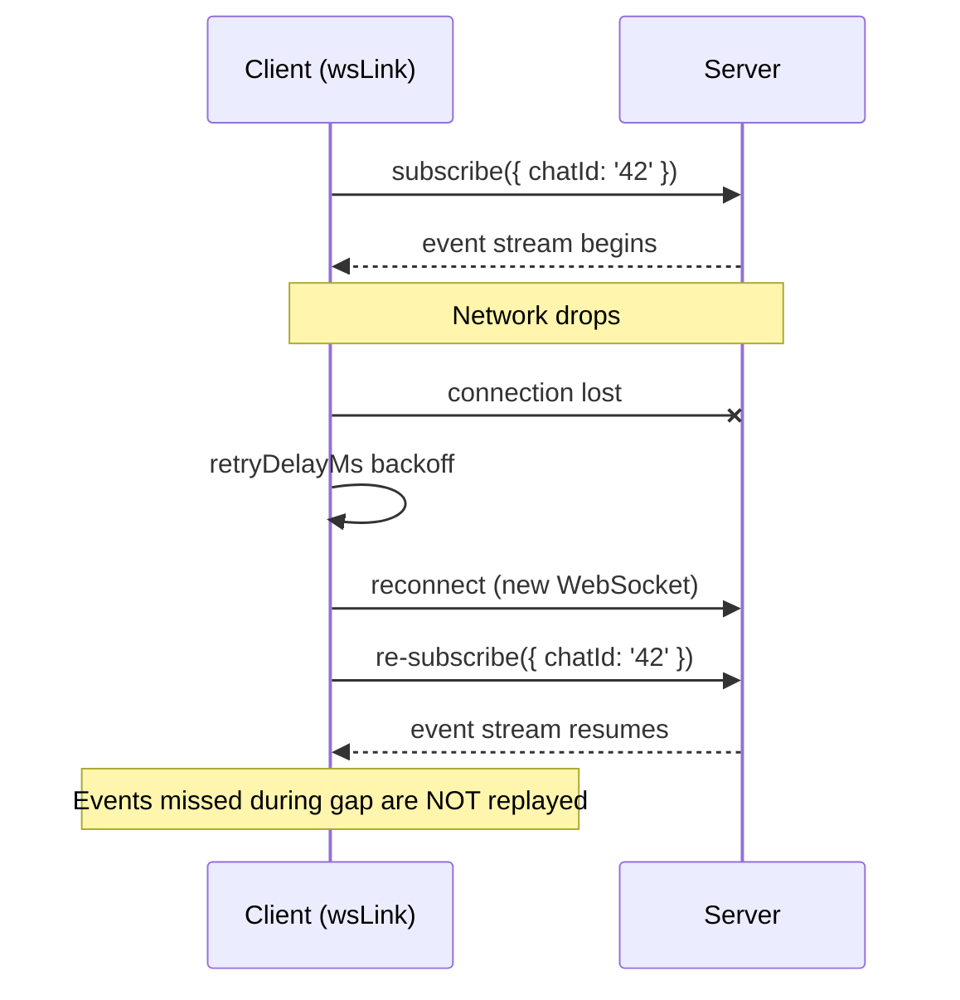
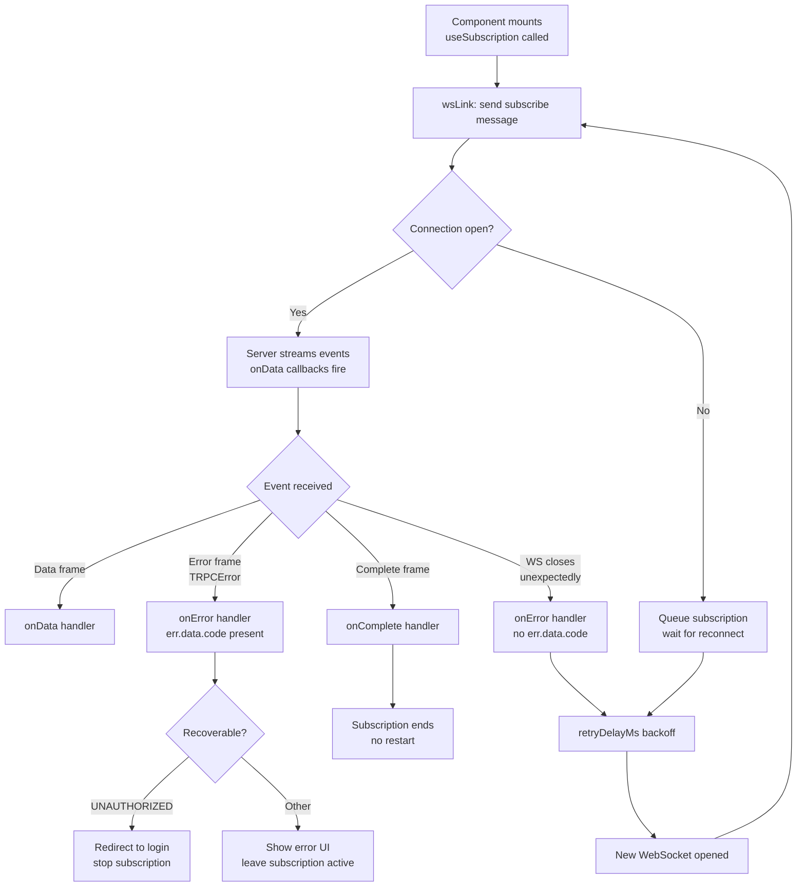

## Reconnection and Error Handling in Subscriptions

### Overview

WebSocket connections are inherently unstable — networks drop, servers restart, clients sleep. tRPC's subscription layer must therefore handle not just happy-path event delivery but also disconnects, transport errors, server-thrown errors, and the re-establishment of subscriptions after reconnect. This topic covers the full error and reconnection surface: from `createWSClient` retry configuration down to per-subscription error recovery patterns.

---

### Error Categories

Before handling errors, it helps to distinguish where they originate.

| Category | Origin | Surface |
|---|---|---|
| **Transport error** | WebSocket closed, network lost | `onClose` on `wsClient`, `onError` on subscription |
| **Server procedure error** | `TRPCError` thrown inside the subscription generator | `onError` on subscription |
| **Input validation error** | Zod or other validator rejects input | `onError` on subscription (immediately on subscribe) |
| **Authentication error** | Middleware throws `UNAUTHORIZED` | `onError` on subscription |
| **Client-side logic error** | Error thrown inside `onData` handler | Uncaught — does not propagate back to tRPC |

**Key Points**
- Transport errors and procedure errors arrive through the same `onError` callback but carry different shapes.
- Errors thrown inside your own `onData` handler are not caught by tRPC — [Inference] they will surface as unhandled exceptions in the browser console unless you wrap `onData` in try/catch.
- Input validation errors fire immediately, before any events are received.

---

### `createWSClient` Reconnection Configuration

`createWSClient` manages the WebSocket lifecycle. It handles reconnection automatically when the connection drops.

```ts
import { createWSClient } from '@trpc/client';

const wsClient = createWSClient({
  url: 'ws://localhost:3001',

  // Called to compute delay before each reconnect attempt
  retryDelayMs: (attemptIndex) => {
    // Exponential backoff, capped at 30 seconds
    return Math.min(1000 * 2 ** attemptIndex, 30_000);
  },

  onOpen() {
    console.log('[ws] Connected');
  },

  onClose(cause) {
    // cause: { type: 'error' | 'closed', wsEvent: CloseEvent | Event }
    console.warn('[ws] Disconnected:', cause);
  },
});
```

#### `retryDelayMs` Values

| `attemptIndex` | `Math.min(1000 * 2^n, 30000)` |
|---|---|
| 0 (first retry) | 1 000 ms |
| 1 | 2 000 ms |
| 2 | 4 000 ms |
| 3 | 8 000 ms |
| 4 | 16 000 ms |
| 5+ | 30 000 ms (cap) |

**Key Points**
- Exponential backoff reduces server pressure during mass reconnects (e.g., after a server restart).
- A constant delay (`() => 2000`) is simpler but may cause thundering herd problems with many clients.
- [Inference] `retryDelayMs` applies only to transport-level reconnects, not to re-subscribing after a server-side procedure error — those are handled separately.

---

### Subscription Behavior on Reconnect

When `wsLink` detects that the WebSocket has reconnected, it re-sends all active subscription start messages to the server.



**Key Points**
- Subscriptions are automatically re-initiated after reconnect — you do not need to manually resubscribe.
- **Events emitted during the disconnection gap are not replayed** unless the server implements explicit replay logic (e.g., cursor-based catch-up).
- [Inference] If your application cannot tolerate missed events, you should implement a server-side mechanism (e.g., event log with a `lastEventId`) and pass the last received ID as subscription input on reconnect.

---

### Detecting and Surfacing Connection State

`createWSClient` does not expose a reactive connection state directly, but `onOpen` and `onClose` can drive local state in React.

```tsx
// useWsStatus.ts
import { useEffect, useState } from 'react';
import { wsClient } from '../trpc-client'; // your shared wsClient instance

type WsStatus = 'connecting' | 'open' | 'closed';

export function useWsStatus(): WsStatus {
  const [status, setStatus] = useState<WsStatus>('connecting');

  useEffect(() => {
    // wsClient exposes getConnection() — [Unverified: API may differ by version]
    const ws = wsClient.getConnection();

    const handleOpen = () => setStatus('open');
    const handleClose = () => setStatus('closed');

    ws?.addEventListener('open', handleOpen);
    ws?.addEventListener('close', handleClose);

    return () => {
      ws?.removeEventListener('open', handleOpen);
      ws?.removeEventListener('close', handleClose);
    };
  }, []);

  return status;
}
```

> [Unverified] The `wsClient.getConnection()` method exists in some tRPC versions but its API is not part of a stable public contract. Verify against your installed version. Behavior is not guaranteed.

**Alternative: callbacks at creation time**

```ts
// Pass setters into createWSClient — this is the more stable approach
let setStatus: (s: WsStatus) => void = () => {};

export function useWsStatus() {
  const [status, setStatusState] = useState<WsStatus>('connecting');
  useEffect(() => { setStatus = setStatusState; }, []);
  return status;
}

const wsClient = createWSClient({
  url: 'ws://localhost:3001',
  onOpen: () => setStatus('open'),
  onClose: () => setStatus('closed'),
});
```

**Key Points**
- Surfacing connection state lets you show a "Reconnecting…" banner, disable send buttons, or trigger a data re-fetch on reconnect.
- [Inference] The callback-based approach is more portable across tRPC versions than accessing internal connection objects.

---

### Per-Subscription `onError` Handling

Each subscription call accepts an `onError` handler. The error received is a `TRPCClientError`.

```tsx
trpc.liveOrders.useSubscription(
  { storeId },
  {
    onData(order) {
      dispatch({ type: 'ORDER_RECEIVED', order });
    },

    onError(err) {
      // err: TRPCClientError<AppRouter>

      const code = err.data?.code; // e.g. 'UNAUTHORIZED', 'FORBIDDEN', 'INTERNAL_SERVER_ERROR'

      if (code === 'UNAUTHORIZED') {
        redirectToLogin();
        return;
      }

      if (code === 'FORBIDDEN') {
        showToast('You do not have access to this feed.');
        return;
      }

      // Generic fallback
      console.error('[subscription] Unhandled error:', err.message);
      showToast('Live updates interrupted. Reconnecting…');
    },
  }
);
```

#### `TRPCClientError` Shape

```ts
interface TRPCClientError<TRouter> {
  message: string;
  data?: {
    code: TRPC_ERROR_CODE_KEY;   // 'UNAUTHORIZED' | 'NOT_FOUND' | etc.
    httpStatus: number;
    path?: string;
    stack?: string;             // only in development
  };
  shape?: DefaultErrorShape;
}
```

**Key Points**
- `err.data?.code` mirrors the `TRPCError` code thrown on the server.
- `err.data` may be `undefined` for pure transport errors (e.g., WebSocket closed unexpectedly) — always guard with `?.`.
- `err.data?.stack` is stripped in production by default; [Inference] this is controlled by the `errorFormatter` in your tRPC router configuration.

---

### Distinguishing Transport Errors from Procedure Errors

Because both arrive in `onError`, you may need to differentiate them:

```ts
onError(err) {
  if (err.data?.code) {
    // Server threw a TRPCError — procedure-level error
    handleProcedureError(err.data.code);
  } else {
    // No code present — likely a transport/connection error
    handleTransportError(err);
  }
}
```

[Inference] This heuristic works because tRPC always populates `err.data.code` for server-thrown `TRPCError` instances. Pure transport failures (WebSocket drops) arrive as generic errors without a tRPC code. This is not formally guaranteed and may vary across versions.

---

### `onComplete` — Server-Initiated Stream End

`onComplete` fires when the server ends the subscription cleanly (the async generator returns, not throws).

```tsx
trpc.exportProgress.useSubscription(
  { jobId },
  {
    onData(progress) {
      setPercent(progress.percent);
    },
    onComplete() {
      // Server signalled the job is done
      setPercent(100);
      showToast('Export complete!');
    },
    onError(err) {
      showToast(`Export failed: ${err.message}`);
    },
  }
);
```

**Key Points**
- `onComplete` is distinct from `onError` — a clean server-side `return` triggers `onComplete`, while a `throw` triggers `onError`.
- After `onComplete`, no further `onData` calls will arrive for that subscription instance.
- [Inference] The subscription is not automatically restarted after `onComplete` — if you want to restart, you would need to toggle `enabled` or remount the component.

---

### Implementing Cursor-Based Catch-Up After Reconnect

To recover missed events, pass the last received event ID as input on every subscription. The server uses it to replay missed events.

#### Client

```tsx
function LiveFeed({ channelId }: { channelId: string }) {
  const lastIdRef = useRef<string | null>(null);
  const [events, setEvents] = useState<Event[]>([]);

  const input = useMemo(
    () => ({ channelId, afterId: lastIdRef.current }),
    // Re-memoize only when channelId changes; lastIdRef is a ref, not state
    [channelId]
  );

  trpc.channelEvents.useSubscription(input, {
    onData(event) {
      lastIdRef.current = event.id;
      setEvents((prev) => [...prev, event]);
    },
    onError(err) {
      console.error('Feed error:', err);
    },
  });

  return <EventList events={events} />;
}
```

> [Inference] Because `lastIdRef` is a ref (not state), changing it does not trigger a re-render or re-subscribe. This means the `afterId` passed on reconnect will only be the value at the time the subscription was initiated, not necessarily the latest. A more robust approach re-subscribes with the current `lastId` by lifting it into state and using `enabled` toggling — at the cost of a deliberate restart.

#### Server (sketch)

```ts
// server/router.ts
onNewEvent: publicProcedure
  .input(z.object({ channelId: z.string(), afterId: z.string().nullable() }))
  .subscription(async function* ({ input }) {
    // Replay missed events first
    if (input.afterId) {
      const missed = await db.events.getMissedSince(input.channelId, input.afterId);
      for (const event of missed) {
        yield event;
      }
    }
    // Then stream live events
    for await (const event of eventEmitter.on(`channel:${input.channelId}`)) {
      yield event;
    }
  }),
```

---

### Error and Reconnection Flow Diagram



---

### Wrapping `onData` Defensively

Errors thrown inside `onData` are not caught by tRPC. If your handler can throw, wrap it:

```tsx
trpc.priceUpdates.useSubscription(
  { symbols },
  {
    onData(update) {
      try {
        const parsed = parseUpdate(update); // may throw
        dispatch({ type: 'PRICE_UPDATE', payload: parsed });
      } catch (err) {
        console.error('[onData] Handler error:', err);
        // Do not rethrow — allows subscription to continue
      }
    },
  }
);
```

**Key Points**
- A throw inside `onData` [Inference] propagates as an unhandled promise rejection or synchronous exception, depending on whether `onData` is async. The subscription will not automatically stop, but the application state may become inconsistent.
- Swallowing the error locally (logging it) preserves the subscription stream.
- If the error is unrecoverable, explicitly stop the subscription by toggling `enabled` to `false`.

---

### Stopping a Subscription Programmatically on Error

```tsx
function LivePositions({ userId }: { userId: string }) {
  const [fatalError, setFatalError] = useState<string | null>(null);

  trpc.positionUpdates.useSubscription(
    { userId },
    {
      enabled: fatalError === null,
      onData(pos) {
        updateMap(pos);
      },
      onError(err) {
        if (err.data?.code === 'FORBIDDEN') {
          setFatalError('Access denied to position feed.');
          // Setting fatalError triggers re-render,
          // enabled becomes false, subscription stops
        }
      },
    }
  );

  if (fatalError) return <ErrorBanner message={fatalError} />;
  return <Map />;
}
```

**Key Points**
- Setting `enabled: false` via state is the canonical way to stop a subscription in response to an error.
- [Inference] The subscription teardown happens during the next render cycle after the state update, not synchronously inside `onError`.

---

### Summary Table

| Scenario | Where it surfaces | Recommended handling |
|---|---|---|
| Network drop / WS close | `onClose` on wsClient + `onError` (no code) | Automatic reconnect via `retryDelayMs`; show reconnecting UI |
| Server throws `TRPCError` | `onError` with `err.data.code` | Branch on code; stop subscription for fatal errors |
| Input validation failure | `onError` immediately after subscribe | Fix input; use `enabled` to guard until input is valid |
| Auth failure | `onError` with `UNAUTHORIZED` code | Redirect to login; stop subscription |
| Server ends stream cleanly | `onComplete` | Update UI to reflect completion; do not expect further data |
| Error inside `onData` | Unhandled exception | Wrap handler in try/catch; log and recover locally |
| Missed events after reconnect | Silent data gap | Implement cursor-based catch-up with `afterId` input |

---

**Conclusion**

Robust subscription error handling requires operating at two levels: the transport level (`createWSClient` reconnection, backoff, connection state) and the procedure level (per-subscription `onError`, `onComplete`, and defensive `onData` wrapping). tRPC handles reconnection and re-subscription automatically, but gap recovery and fatal-error stopping are the application's responsibility. Combining `enabled`-based control, `err.data.code` branching, and cursor-based replay covers the majority of production reliability requirements.

**Next Steps**
- Authentication and context propagation in subscriptions
- Server-side subscription backpressure and slow consumer handling
- Testing subscription error paths with mock WebSocket transports