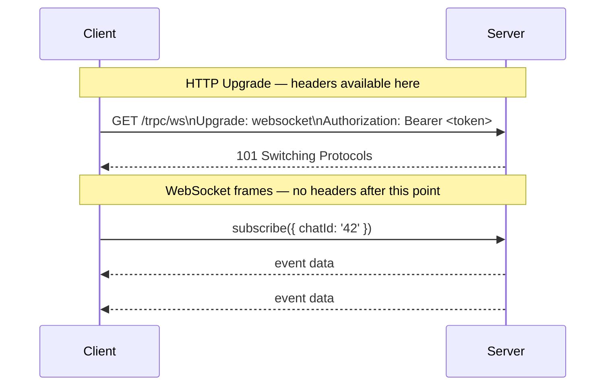
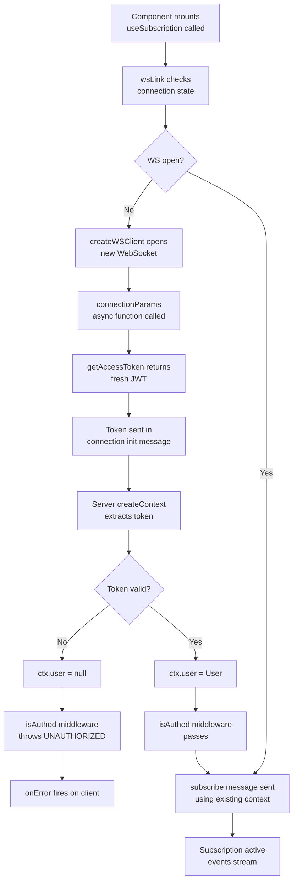

## Passing Auth Tokens from Client to Server

### Overview

tRPC subscriptions run over WebSocket or SSE transports, neither of which supports arbitrary HTTP headers on every message the way a standard REST request does. This creates a distinct authentication challenge: the token must reach the server context at the right point in the connection lifecycle, and the server must validate it before any subscription procedure executes. This topic covers every viable mechanism — WebSocket connection headers, connection params, HTTP cookie-based auth, and context extraction — along with their tradeoffs.

---

### Why Subscription Auth Differs from Query/Mutation Auth

For queries and mutations over `httpBatchLink`, auth is straightforward: attach a `Bearer` token in the `Authorization` header on every HTTP request.

```ts
httpBatchLink({
  url: '/trpc',
  headers() {
    return { Authorization: `Bearer ${getToken()}` };
  },
})
```

WebSocket connections do not work this way:

- The **HTTP Upgrade handshake** (the initial request that opens the WebSocket) can carry headers — but only that one request.
- Once upgraded, subsequent WebSocket messages are frames, not HTTP requests, so per-message headers do not exist.
- SSE is a persistent HTTP response — the initial request carries headers, but there is no mechanism to re-authenticate mid-stream.



**Key Points**
- The upgrade handshake is the only moment standard HTTP headers are available for WebSocket auth.
- Tokens that expire mid-connection require an alternative refresh mechanism.
- Cookies are a special case — they are sent automatically on both the upgrade request and (for SSE) each HTTP request.

---

### Mechanism 1: Connection Params (`connectionParams`)

`createWSClient` supports a `connectionParams` option. These params are sent as a structured message immediately after the WebSocket opens, before any subscription requests. tRPC's server-side WebSocket handler receives them and can make them available in context.

#### Client

```ts
import { createWSClient, wsLink } from '@trpc/client';

const wsClient = createWSClient({
  url: 'ws://localhost:3001',

  connectionParams: async () => {
    // Called each time a new connection is established (including reconnects)
    const token = await getAccessToken(); // your token retrieval logic
    return { token };
  },
});
```

**Key Points**
- `connectionParams` is a function (sync or async), so it can fetch a fresh token on each connection attempt, including reconnects.
- The return value must be a plain object of strings (or serializable values — [Inference] tRPC serializes this as JSON in the connection init message).
- This is the most common and idiomatic approach for WebSocket auth in tRPC v11+.

#### Server — Extracting `connectionParams` in Context

```ts
// server/context.ts
import { CreateWSSContextFnOptions } from '@trpc/server/adapters/ws';
import { verifyToken } from './auth';

export async function createContext({ req, res, info }: CreateWSSContextFnOptions) {
  // info.connectionParams contains what the client sent
  const token = info?.connectionParams?.token;

  if (!token || typeof token !== 'string') {
    return { user: null };
  }

  try {
    const user = await verifyToken(token);
    return { user };
  } catch {
    return { user: null };
  }
}

export type Context = Awaited<ReturnType<typeof createContext>>;
```

**Key Points**
- `info.connectionParams` is available on the `CreateWSSContextFnOptions` parameter.
- Context is created **once per WebSocket connection**, not per subscription call. All subscriptions on that connection share the same context.
- [Inference] If the token expires while the connection is open, the context will hold a stale user unless you implement mid-connection token refresh (see below).
- Return `{ user: null }` rather than throwing from `createContext` — let individual procedures enforce auth via middleware.

---

### Mechanism 2: Auth Header on the Upgrade Request

The WebSocket upgrade request is a standard HTTP GET with an `Upgrade` header. Custom headers can be attached at this point.

> [Unverified] Browser `WebSocket` constructor does not support custom headers — this is a browser API limitation. Custom headers on the upgrade request are only possible in Node.js (using `ws` library options) or in environments that support them (e.g., React Native with a custom WebSocket implementation).

#### Node.js / React Native Client

```ts
// Node.js only — not available in browsers
const wsClient = createWSClient({
  url: 'ws://localhost:3001',
  WebSocket: (url) =>
    new WebSocket(url, {
      headers: { Authorization: `Bearer ${getToken()}` },
    } as any),
});
```

#### Server — Extracting from Upgrade Request

```ts
export async function createContext({ req }: CreateWSSContextFnOptions) {
  const authHeader = req.headers['authorization'];
  const token = authHeader?.replace('Bearer ', '');

  if (!token) return { user: null };

  const user = await verifyToken(token);
  return { user };
}
```

**Key Points**
- `req` in `CreateWSSContextFnOptions` is the raw Node.js `IncomingMessage` from the upgrade handshake.
- Standard `req.headers` access works here.
- [Inference] This approach is suitable for server-to-server WebSocket connections or mobile apps with custom WebSocket implementations, but not for standard browser clients.

---

### Mechanism 3: Cookie-Based Auth

Cookies are sent automatically by browsers on the WebSocket upgrade request and on every SSE request, provided the cookie's `SameSite` and `Domain` attributes permit it. This makes cookies the most transparent auth mechanism for browser clients.

#### Client Setup

No client-side code is required. The browser attaches cookies automatically.

```ts
// No special auth configuration needed on wsLink or httpSubscriptionLink
// The browser sends cookies automatically on the upgrade/SSE request
const wsClient = createWSClient({
  url: 'ws://localhost:3001',
  // credentials are handled by the browser
});
```

For `httpSubscriptionLink`, ensure `credentials: 'include'` if cross-origin:

```ts
httpSubscriptionLink({
  url: 'http://api.example.com/trpc',
  // [Inference] fetch options may be passable depending on tRPC version
  // Verify against your tRPC version's httpSubscriptionLink API
})
```

#### Server — Extracting Cookie

```ts
import { parse as parseCookies } from 'cookie';
import { verifySessionCookie } from './auth';

export async function createContext({ req }: CreateWSSContextFnOptions) {
  const cookieHeader = req.headers['cookie'] ?? '';
  const cookies = parseCookies(cookieHeader);
  const sessionToken = cookies['session'];

  if (!sessionToken) return { user: null };

  const user = await verifySessionCookie(sessionToken);
  return { user };
}
```

**Key Points**
- Cookie auth requires the server to set a `HttpOnly; Secure; SameSite=Strict` (or `Lax`) cookie during the login flow.
- This is the most secure option for browser clients: the token is never accessible to JavaScript, eliminating XSS-based token theft.
- [Inference] `SameSite=Strict` may block cookies on cross-origin WebSocket upgrades. `SameSite=Lax` is often needed for cross-subdomain setups.
- CSRF risk is lower for WebSocket upgrades than for form-based requests, but consider CSRF tokens for mutation flows.

---

### Enforcing Auth in Procedures via Middleware

Regardless of the extraction mechanism, context should be validated in a reusable middleware rather than in each procedure.

```ts
// server/trpc.ts
import { initTRPC, TRPCError } from '@trpc/server';
import type { Context } from './context';

const t = initTRPC.context<Context>().create();

export const router = t.router;
export const publicProcedure = t.procedure;

// Middleware that enforces a logged-in user
const isAuthed = t.middleware(({ ctx, next }) => {
  if (!ctx.user) {
    throw new TRPCError({ code: 'UNAUTHORIZED', message: 'Not authenticated' });
  }
  return next({
    ctx: { user: ctx.user }, // narrows ctx.user from User | null to User
  });
});

export const protectedProcedure = t.procedure.use(isAuthed);
```

```ts
// server/router.ts
export const appRouter = router({
  onNewMessage: protectedProcedure
    .input(z.object({ chatId: z.string() }))
    .subscription(async function* ({ ctx, input }) {
      // ctx.user is non-null here — guaranteed by isAuthed middleware
      for await (const msg of messageEmitter.on(`chat:${input.chatId}`)) {
        yield msg;
      }
    }),
});
```

**Key Points**
- `protectedProcedure` can be reused across queries, mutations, and subscriptions.
- Throwing `UNAUTHORIZED` from middleware causes the subscription to never start — `onError` fires on the client immediately.
- The narrowed context type (`ctx.user` as `User`, not `User | null`) removes null checks inside procedure implementations.

---

### Token Refresh Mid-Connection

Because context is created once per connection, an expiring JWT presents a problem: the token in context may become invalid while the WebSocket is still open.

#### Option A: Force Reconnect on Token Refresh

```ts
import { createWSClient } from '@trpc/client';
import { onTokenRefresh } from './auth';

const wsClient = createWSClient({
  url: 'ws://localhost:3001',
  connectionParams: async () => ({
    token: await getAccessToken(),
  }),
});

// When a new token is issued, close the connection
// wsLink will reconnect and call connectionParams again with the new token
onTokenRefresh(() => {
  wsClient.close(); // [Inference] method name may vary by version — verify
});
```

> [Unverified] `wsClient.close()` or an equivalent method to programmatically close the connection may exist on the `createWSClient` return value, but the exact API is not confirmed across all tRPC versions. Check your installed version's type definitions.

#### Option B: Token in Subscription Input

Pass the token as part of the subscription's input. This re-validates on every new subscription call.

```ts
// Client
trpc.onNewMessage.useSubscription(
  { chatId, token: getToken() },
  { onData }
);
```

```ts
// Server procedure
onNewMessage: publicProcedure
  .input(z.object({ chatId: z.string(), token: z.string() }))
  .subscription(async function* ({ input }) {
    const user = await verifyToken(input.token); // throws if invalid
    if (!user) throw new TRPCError({ code: 'UNAUTHORIZED' });
    // ...
  }),
```

> [Inference] This approach leaks the token into tRPC input logs and traces. Use it only if per-subscription validation is genuinely needed and you have control over what gets logged. Cookie or `connectionParams` auth are preferable for most cases.

---

### Mechanism Comparison

| Mechanism | Browser support | Token in JS memory | Reconnect refresh | Cross-origin |
|---|---|---|---|---|
| `connectionParams` | Yes (via tRPC) | Yes | Yes (async function) | Yes |
| Upgrade header | Node.js / RN only | Yes | Manual | Yes |
| Cookie (`HttpOnly`) | Yes | No (secure) | Automatic | Requires CORS + credentials |
| Input param | Yes | Yes | Per-subscription | Yes |

---

### Full Working Example

```ts
// client/trpc.ts
import { createTRPCClient, splitLink, wsLink, httpBatchLink } from '@trpc/client';
import { createWSClient } from '@trpc/client';
import type { AppRouter } from '../server/router';
import { getAccessToken } from './auth';

const wsClient = createWSClient({
  url: process.env.NEXT_PUBLIC_WS_URL!,
  connectionParams: async () => ({
    token: await getAccessToken(),
  }),
  retryDelayMs: (i) => Math.min(1000 * 2 ** i, 30_000),
  onClose(cause) {
    console.warn('[ws] closed', cause);
  },
});

export const trpc = createTRPCClient<AppRouter>({
  links: [
    splitLink({
      condition: (op) => op.type === 'subscription',
      true: wsLink({ client: wsClient }),
      false: httpBatchLink({
        url: process.env.NEXT_PUBLIC_API_URL!,
        headers: async () => ({
          Authorization: `Bearer ${await getAccessToken()}`,
        }),
      }),
    }),
  ],
});
```

```ts
// server/context.ts
import type { CreateWSSContextFnOptions } from '@trpc/server/adapters/ws';
import type { CreateNextContextOptions } from '@trpc/server/adapters/next';
import { verifyToken } from './auth';

// Shared context builder — works for both HTTP and WS adapters
export async function createContext(
  opts: CreateWSSContextFnOptions | CreateNextContextOptions
) {
  const token =
    'info' in opts
      ? (opts.info?.connectionParams?.token as string | undefined) // WS path
      : opts.req.headers.authorization?.replace('Bearer ', '');    // HTTP path

  if (!token) return { user: null };

  try {
    const user = await verifyToken(token);
    return { user };
  } catch {
    return { user: null };
  }
}
```

**Key Points**
- A single `createContext` function can serve both HTTP and WebSocket adapters by branching on whether `info` exists in `opts`.
- This avoids duplicating validation logic across adapters.
- [Inference] The `'info' in opts` check is a structural discriminant — it works as long as the HTTP adapter options type does not include an `info` property, which is expected but not formally guaranteed across tRPC versions.

---

### Auth Flow Diagram



---

**Conclusion**

The canonical approach for browser-based tRPC subscription auth is `connectionParams` with an async token getter — it is transport-agnostic within tRPC, refreshes on reconnect automatically, and integrates cleanly with a shared `createContext` function. Cookie-based auth is preferable when `HttpOnly` cookie security is a priority. Server-side enforcement should always live in a reusable `protectedProcedure` middleware, not inline per procedure. The key constraint to design around is that context is created once per connection, making reconnect-triggered token refresh the primary mechanism for handling expiry.

**Next Steps**
- Role-based access control in subscription middleware
- Per-event authorization (filtering emitted events by user permissions)
- Handling token expiry and forced re-authentication mid-session