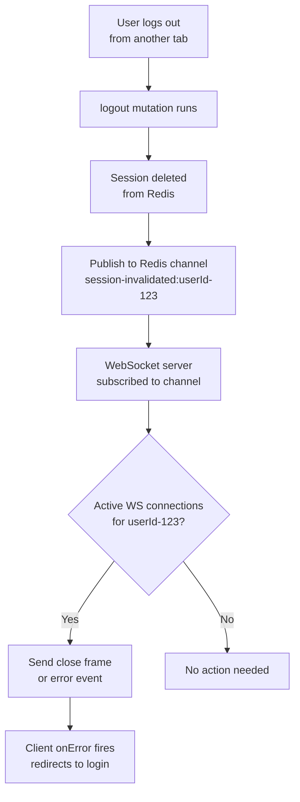
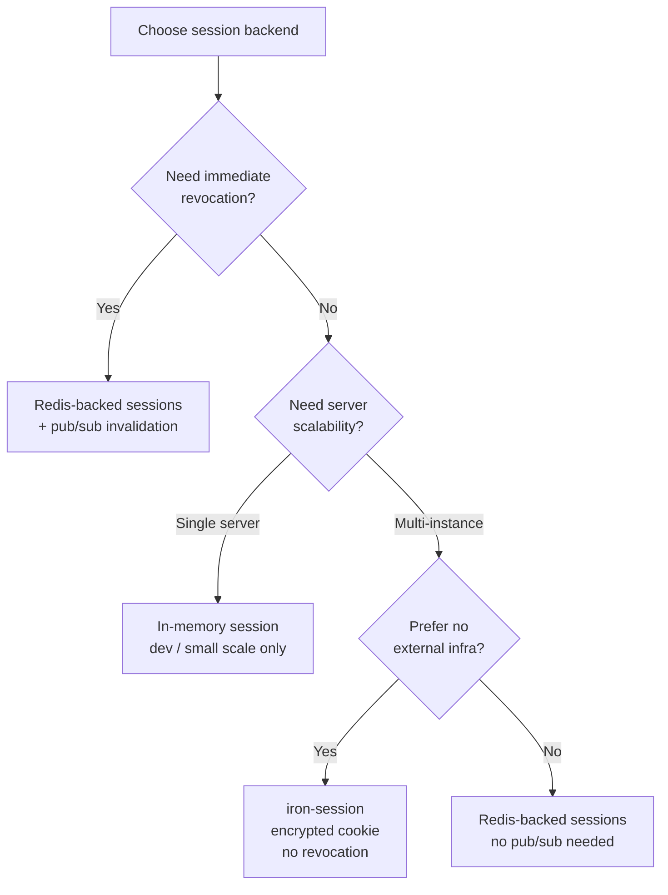

## Session-based Authentication Pattern

### Overview

Session-based authentication differs from JWT-based auth in a fundamental way: the server is stateful. Instead of a self-contained token the client presents on every request, the client holds an opaque session ID (typically in a cookie), and the server maintains the authoritative session record — user identity, roles, expiry, and any other session data — in a backing store. In tRPC, this affects context creation, middleware design, WebSocket lifecycle, and how session invalidation propagates to active subscriptions.

---

### How Sessions Work at the Transport Level

```mermaid
sequenceDiagram
    participant B as Browser
    participant S as tRPC Server
    participant DB as Session Store

    B->>S: POST /auth/login (credentials)
    S->>DB: create session record
    DB-->>S: sessionId = "abc123"
    S-->>B: Set-Cookie: sid=abc123; HttpOnly; Secure; SameSite=Lax

    Note over B,S: All subsequent requests (HTTP + WS upgrade)

    B->>S: GET /trpc/ws (Upgrade)\nCookie: sid=abc123
    S->>DB: lookup session "abc123"
    DB-->>S: { userId, roles, expiresAt }
    S-->>B: 101 Switching Protocols
    Note over S: createContext runs — session attached to ctx
```

**Key Points**
- The session ID never exposes user data directly — it is an opaque pointer into the server's session store.
- `HttpOnly` prevents JavaScript from reading the cookie, removing the XSS token-theft vector present in localStorage-stored JWTs.
- `SameSite=Lax` allows the cookie on top-level navigations and same-origin requests while blocking cross-site POSTs.
- [Inference] `SameSite=Strict` may block cookies on WebSocket upgrades initiated from a different origin (e.g., a subdomain). `Lax` is the more practical default for most deployments.

---

### Session Store Options

The session store is the authoritative source of truth. Common choices:

| Store | Library | Tradeoffs |
|---|---|---|
| Redis | `ioredis`, `connect-redis` | Fast, TTL support, horizontal scale |
| PostgreSQL | `connect-pg-simple` | No extra infra; slower than Redis |
| In-memory | `express-session` default | Dev only — lost on restart, no multi-instance support |
| Encrypted cookie | `iron-session` | No server state; cookie size limit; revocation requires rotation |

**Key Points**
- Redis is the standard production choice for session storage: O(1) lookups by key, native TTL, and pub/sub for session invalidation signals.
- `iron-session` (encrypted cookie) is stateless like JWT but preserves the opaque-token UX. [Inference] It does not support immediate server-side revocation — invalidation only takes effect when the cookie expires.
- Choose a store that supports atomic updates if session data is mutated (e.g., incrementing a request count).

---

### Setting Up `iron-session` (Stateless Cookie Sessions)

`iron-session` is a lightweight option that encrypts session data into the cookie itself — no external store required.

#### Installation

```bash
npm install iron-session
```

#### Session Type Declaration

```ts
// lib/session.ts
import { SessionOptions } from 'iron-session';

export interface SessionData {
  userId: string;
  roles: string[];
  isLoggedIn: boolean;
}

export const sessionOptions: SessionOptions = {
  password: process.env.SESSION_SECRET!, // min 32 characters
  cookieName: 'app_session',
  cookieOptions: {
    httpOnly: true,
    secure: process.env.NODE_ENV === 'production',
    sameSite: 'lax',
    maxAge: 60 * 60 * 24 * 7, // 7 days in seconds
  },
};
```

**Key Points**
- `SESSION_SECRET` must be at least 32 characters and kept out of source control.
- `secure: true` in production restricts the cookie to HTTPS connections only.
- `maxAge` sets the cookie lifetime; the server does not need to expire it explicitly.

---

### Setting Up `express-session` with Redis (Stateful Sessions)

```bash
npm install express-session connect-redis ioredis
npm install --save-dev @types/express-session
```

```ts
// lib/session-store.ts
import session from 'express-session';
import connectRedis from 'connect-redis';
import Redis from 'ioredis';

const RedisStore = connectRedis(session);
const redis = new Redis(process.env.REDIS_URL!);

export const sessionMiddleware = session({
  store: new RedisStore({ client: redis }),
  secret: process.env.SESSION_SECRET!,
  name: 'app_sid',
  resave: false,
  saveUninitialized: false,
  cookie: {
    httpOnly: true,
    secure: process.env.NODE_ENV === 'production',
    sameSite: 'lax',
    maxAge: 1000 * 60 * 60 * 24 * 7, // 7 days in ms
  },
});
```

**Key Points**
- `resave: false` avoids writing the session back to the store if it was not modified.
- `saveUninitialized: false` does not persist empty sessions — important for GDPR compliance.
- `name` overrides the default `connect.sid` cookie name, which is a fingerprinting signal best avoided.

---

### `createContext` for Session Auth

#### With `iron-session` (Next.js / Edge-compatible)

```ts
// server/context.ts
import { getIronSession } from 'iron-session';
import { sessionOptions, type SessionData } from '../lib/session';
import type { CreateNextContextOptions } from '@trpc/server/adapters/next';
import type { CreateWSSContextFnOptions } from '@trpc/server/adapters/ws';
import { db } from '../lib/db';

type ContextOpts = CreateNextContextOptions | CreateWSSContextFnOptions;

export async function createContext(opts: ContextOpts) {
  const req = opts.req as any;
  const res = 'res' in opts ? (opts.res as any) : undefined;

  const session = await getIronSession<SessionData>(req, res, sessionOptions);

  if (!session.isLoggedIn || !session.userId) {
    return { user: null, session: null };
  }

  // Optionally hydrate full user from DB for roles, preferences, etc.
  const user = await db.users.findById(session.userId);
  return { user, session };
}

export type Context = Awaited<ReturnType<typeof createContext>>;
```

#### With `express-session`

```ts
// server/context.ts
import type { CreateWSSContextFnOptions } from '@trpc/server/adapters/ws';
import type { Request } from 'express';

export async function createContext({ req }: CreateWSSContextFnOptions) {
  // express-session attaches session to req.session
  const expressReq = req as unknown as Request;
  const sessionUser = expressReq.session?.user ?? null;

  if (!sessionUser) return { user: null };

  return { user: sessionUser };
}
```

**Key Points**
- For WebSocket connections, `createContext` runs once during the upgrade handshake — the session is resolved at that point and cached in `ctx` for the lifetime of the connection.
- [Inference] If the session is invalidated server-side (e.g., logout from another tab) while the WebSocket is open, `ctx.user` will not update automatically. Handling this requires active session polling or a pub/sub invalidation signal (covered below).
- Hydrating the full user from the database on each connection is optional but provides up-to-date role data at connection time.

---

### Protected Procedure Middleware

```ts
// server/trpc.ts
import { initTRPC, TRPCError } from '@trpc/server';
import type { Context } from './context';

const t = initTRPC.context<Context>().create();

export const router = t.router;
export const publicProcedure = t.procedure;

const isAuthed = t.middleware(({ ctx, next }) => {
  if (!ctx.user) {
    throw new TRPCError({
      code: 'UNAUTHORIZED',
      message: 'You must be logged in.',
    });
  }
  return next({ ctx: { user: ctx.user } }); // narrows user from User | null to User
});

const hasRole = (role: string) =>
  t.middleware(({ ctx, next }) => {
    if (!ctx.user) {
      throw new TRPCError({ code: 'UNAUTHORIZED' });
    }
    if (!ctx.user.roles.includes(role)) {
      throw new TRPCError({
        code: 'FORBIDDEN',
        message: `Role '${role}' required.`,
      });
    }
    return next({ ctx: { user: ctx.user } });
  });

export const protectedProcedure = t.procedure.use(isAuthed);
export const adminProcedure = t.procedure.use(hasRole('admin'));
```

**Key Points**
- `hasRole` is a middleware factory — it returns a configured middleware for a specific role string.
- Role checking at the middleware level means the procedure body can assume the role is satisfied.
- [Inference] Composing `isAuthed` and `hasRole` as separate middleware is cleaner than combining them, because `isAuthed` can be reused independently.

---

### Login and Logout Procedures

Session creation and destruction are mutations, not subscription concerns — but they must be correct for the rest of the pattern to work.

```ts
// server/router/auth.ts
import { z } from 'zod';
import { router, publicProcedure } from '../trpc';
import { getIronSession } from 'iron-session';
import { sessionOptions } from '../../lib/session';
import { verifyPassword } from '../../lib/auth';
import { db } from '../../lib/db';

export const authRouter = router({
  login: publicProcedure
    .input(z.object({
      email: z.string().email(),
      password: z.string().min(8),
    }))
    .mutation(async ({ input, ctx }) => {
      const user = await db.users.findByEmail(input.email);

      if (!user || !(await verifyPassword(input.password, user.passwordHash))) {
        throw new TRPCError({
          code: 'UNAUTHORIZED',
          message: 'Invalid credentials.',
        });
      }

      // Attach session data — iron-session encrypts and sets cookie
      const session = await getIronSession(ctx.req, ctx.res, sessionOptions);
      session.userId = user.id;
      session.roles = user.roles;
      session.isLoggedIn = true;
      await session.save();

      return { userId: user.id };
    }),

  logout: protectedProcedure
    .mutation(async ({ ctx }) => {
      const session = await getIronSession(ctx.req, ctx.res, sessionOptions);
      session.destroy();
      return { success: true };
    }),
});
```

**Key Points**
- `session.save()` writes the encrypted session data to the `Set-Cookie` response header.
- `session.destroy()` clears the cookie on the client side.
- For Redis-backed sessions, `destroy()` also deletes the server-side record — immediate revocation.
- For `iron-session`, `destroy()` only clears the cookie — the encrypted data was never stored server-side, so there is nothing to invalidate remotely.
- Throwing `UNAUTHORIZED` with a vague message (`'Invalid credentials.'`) avoids revealing whether the email or password was wrong.

---

### Session Invalidation for Active WebSocket Connections

This is the primary challenge of session auth with persistent connections. The WebSocket's `ctx` is frozen at connection time — a server-side logout or session expiry does not propagate automatically.

#### Pattern: Redis Pub/Sub Invalidation



#### Server Implementation

```ts
// lib/invalidation.ts
import Redis from 'ioredis';

const pub = new Redis(process.env.REDIS_URL!);
const sub = new Redis(process.env.REDIS_URL!);

// Map of userId -> Set of active WebSocket connections
const activeConnections = new Map<string, Set<WebSocket>>();

export function registerConnection(userId: string, ws: WebSocket) {
  if (!activeConnections.has(userId)) {
    activeConnections.set(userId, new Set());
  }
  activeConnections.get(userId)!.add(ws);
}

export function deregisterConnection(userId: string, ws: WebSocket) {
  activeConnections.get(userId)?.delete(ws);
}

export async function publishInvalidation(userId: string) {
  await pub.publish('session-invalidated', userId);
}

// Subscribe once at startup
sub.subscribe('session-invalidated');
sub.on('message', (_channel, userId) => {
  const connections = activeConnections.get(userId);
  if (!connections) return;

  for (const ws of connections) {
    // Send a custom close code; client can detect and redirect
    ws.close(4001, 'Session invalidated');
  }
});
```

```ts
// Integrate in createContext (WS adapter)
export async function createContext({ req, res, info }: CreateWSSContextFnOptions) {
  // ... session extraction ...
  const user = await resolveSession(req);

  // Register this connection for invalidation tracking
  if (user) {
    const ws = info?.socket; // [Inference] exact property may vary by adapter version
    if (ws) registerConnection(user.id, ws as unknown as WebSocket);
  }

  return { user };
}
```

> [Inference] The exact way to access the raw WebSocket from `CreateWSSContextFnOptions` depends on the tRPC WS adapter version. The `info.socket` path is illustrative — verify against your version's type definitions.

**Key Points**
- Using two Redis clients (`pub` and `sub`) is required because a client in subscribe mode cannot issue other commands.
- Close code `4001` is in the user-defined range (4000–4999) — the client can detect it specifically and redirect to login rather than treating it as a connection error.
- [Inference] This pattern adds operational complexity (Redis dependency, connection tracking) that is only justified when immediate session revocation across active connections is a hard requirement.

---

### Client-Side: Detecting Session Invalidation

```ts
const wsClient = createWSClient({
  url: 'ws://localhost:3001',
  onClose(cause) {
    // cause.wsEvent is the CloseEvent
    const closeEvent = cause?.wsEvent as CloseEvent | undefined;

    if (closeEvent?.code === 4001) {
      // Server explicitly invalidated this session
      window.location.href = '/login?reason=session_expired';
      return;
    }

    // Other close reasons — normal reconnect behavior applies
  },

  retryDelayMs: (i) => Math.min(1000 * 2 ** i, 30_000),
});
```

**Key Points**
- WebSocket close codes in the 4000–4999 range are application-defined and will not trigger automatic reconnection if you check them explicitly.
- [Inference] tRPC's `wsLink` may attempt to reconnect regardless of close code unless the `onClose` handler or a custom reconnect condition explicitly prevents it. Check your version's behavior and use a flag to suppress reconnection after a `4001`.

---

### Periodic Session Validation (Polling Fallback)

If pub/sub infrastructure is unavailable, periodic session revalidation is a simpler fallback.

```tsx
// hooks/useSessionGuard.ts
import { useEffect } from 'react';
import { trpc } from '../trpc-client';

export function useSessionGuard() {
  const validate = trpc.auth.validateSession.useQuery(undefined, {
    refetchInterval: 60_000, // check every 60 seconds
    retry: false,
  });

  useEffect(() => {
    if (validate.error?.data?.code === 'UNAUTHORIZED') {
      window.location.href = '/login?reason=session_expired';
    }
  }, [validate.error]);
}
```

```ts
// server router
validateSession: protectedProcedure.query(({ ctx }) => {
  return { userId: ctx.user.id, roles: ctx.user.roles };
}),
```

**Key Points**
- Polling introduces up to `refetchInterval` ms of lag between invalidation and client detection — acceptable for many applications.
- The subscription's WebSocket connection is not affected by this query; they are independent.
- [Inference] Combining polling with the subscription's `onError` for `UNAUTHORIZED` codes provides reasonable coverage without pub/sub infrastructure.

---

### Summary: Session Auth Decision Points



---

### Full Pattern Summary

| Concern | Approach |
|---|---|
| Cookie type | `HttpOnly; Secure; SameSite=Lax` |
| Session store | Redis (prod), iron-session (simpler deploys) |
| Context creation | Once per WS connection — extract + validate session |
| Auth enforcement | `protectedProcedure` middleware with narrowed context type |
| Role enforcement | `hasRole(role)` middleware factory |
| Session invalidation | Redis pub/sub → WS close(4001) → client redirect |
| Fallback invalidation | Periodic `validateSession` query polling |
| Token on client | Never in JS memory — cookie only |

---

**Conclusion**

Session-based auth in tRPC centers on `createContext`: reading the session cookie on the upgrade handshake, resolving the session record, and attaching the user to `ctx` for the connection's lifetime. The pattern is straightforward for queries and mutations. The complication unique to subscriptions is that `ctx` is frozen at connection time — logout or session expiry elsewhere does not automatically propagate. Redis pub/sub invalidation with a custom close code is the robust solution; periodic polling is the simpler fallback. All enforcement belongs in reusable middleware (`protectedProcedure`, `hasRole`) — never inline in procedure bodies.

**Next Steps**
- Role-based filtering of subscription events per subscriber
- Multi-tenant session isolation in tRPC context
- Refresh token rotation patterns for hybrid session/JWT architectures