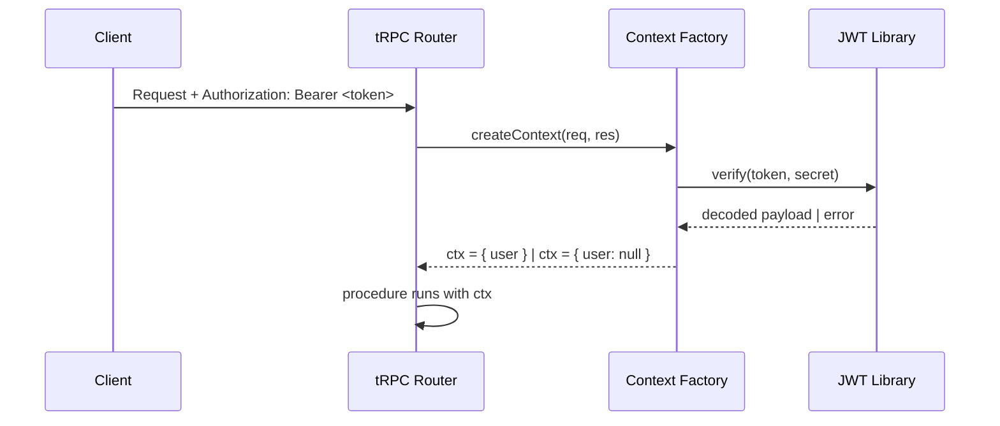

## JWT-based Authentication Pattern

### Overview

JWT (JSON Web Token) authentication in tRPC involves issuing tokens on login, passing them via HTTP headers or cookies, and verifying them inside tRPC context or middleware. tRPC itself has no built-in auth — authentication logic lives in the **context factory** and optionally in **middleware**.

---

### How JWTs Flow in a tRPC Application



---

### Setting Up Context with JWT Verification

The context factory is the primary place to extract and verify the JWT. Every request passes through it.

```ts
// server/context.ts
import { inferAsyncReturnType } from '@trpc/server';
import { CreateNextContextOptions } from '@trpc/server/adapters/next';
import jwt from 'jsonwebtoken';

const JWT_SECRET = process.env.JWT_SECRET!;

export async function createContext({ req }: CreateNextContextOptions) {
  const authHeader = req.headers.authorization;
  const token = authHeader?.startsWith('Bearer ')
    ? authHeader.slice(7)
    : null;

  let user: { id: string; role: string } | null = null;

  if (token) {
    try {
      const decoded = jwt.verify(token, JWT_SECRET) as { id: string; role: string };
      user = decoded;
    } catch {
      // Token invalid or expired — user remains null
    }
  }

  return { user };
}

export type Context = inferAsyncReturnType<typeof createContext>;
```

**Key Points**
- Invalid or expired tokens do not throw — they resolve to `user: null`. Procedures decide what to do with that.
- The `JWT_SECRET` must be kept server-side only and loaded from environment variables.
- [Inference] Keeping token verification in context (rather than per-procedure) avoids repetition and centralizes the failure mode.

---

### Protecting Procedures with Middleware

Rather than checking `ctx.user` inside every procedure, define a reusable `authedProcedure` using middleware.

```ts
// server/trpc.ts
import { initTRPC, TRPCError } from '@trpc/server';
import { Context } from './context';

const t = initTRPC.context<Context>().create();

export const router = t.router;
export const publicProcedure = t.procedure;

// Middleware that asserts a valid user exists
const isAuthed = t.middleware(({ ctx, next }) => {
  if (!ctx.user) {
    throw new TRPCError({ code: 'UNAUTHORIZED' });
  }
  return next({
    ctx: {
      user: ctx.user, // narrowed: user is non-null here
    },
  });
});

export const authedProcedure = t.procedure.use(isAuthed);
```

**Key Points**
- `next()` receives an updated context object. After the middleware, TypeScript knows `ctx.user` is non-null — no manual null checks needed inside the procedure.
- `TRPCError` with `code: 'UNAUTHORIZED'` maps to HTTP 401 in HTTP-based adapters. Behavior may vary with custom adapters.

---

### Using `authedProcedure` in a Router

```ts
// server/routers/user.ts
import { authedProcedure, publicProcedure, router } from '../trpc';
import { z } from 'zod';

export const userRouter = router({
  // Public — no auth required
  ping: publicProcedure.query(() => 'pong'),

  // Protected — requires valid JWT
  getProfile: authedProcedure.query(({ ctx }) => {
    return {
      id: ctx.user.id,
      role: ctx.user.role,
    };
  }),

  // Protected — with input
  updateBio: authedProcedure
    .input(z.object({ bio: z.string().max(300) }))
    .mutation(({ ctx, input }) => {
      // ctx.user is typed and non-null
      return updateUserBio(ctx.user.id, input.bio);
    }),
});
```

---

### Issuing JWTs — Login Procedure

The login procedure itself is public. It validates credentials and returns a signed token.

```ts
// server/routers/auth.ts
import { publicProcedure, router } from '../trpc';
import { z } from 'zod';
import jwt from 'jsonwebtoken';
import bcrypt from 'bcrypt';

export const authRouter = router({
  login: publicProcedure
    .input(z.object({
      email: z.string().email(),
      password: z.string(),
    }))
    .mutation(async ({ input }) => {
      const user = await getUserByEmail(input.email);

      if (!user) {
        throw new TRPCError({ code: 'UNAUTHORIZED', message: 'Invalid credentials' });
      }

      const valid = await bcrypt.compare(input.password, user.passwordHash);
      if (!valid) {
        throw new TRPCError({ code: 'UNAUTHORIZED', message: 'Invalid credentials' });
      }

      const token = jwt.sign(
        { id: user.id, role: user.role },
        process.env.JWT_SECRET!,
        { expiresIn: '7d' }
      );

      return { token };
    }),
});
```

**Key Points**
- Return the same error message for both "user not found" and "wrong password" to avoid user enumeration.
- `expiresIn` is passed to `jsonwebtoken` — the library handles embedding the `exp` claim. Behavior depends on the library version in use.

---

### Role-based Authorization via Additional Middleware

Authorization (what a user can do) can layer on top of authentication.

```ts
// Middleware factory for role checks
const hasRole = (requiredRole: string) =>
  t.middleware(({ ctx, next }) => {
    if (!ctx.user) {
      throw new TRPCError({ code: 'UNAUTHORIZED' });
    }
    if (ctx.user.role !== requiredRole) {
      throw new TRPCError({ code: 'FORBIDDEN' });
    }
    return next({ ctx: { user: ctx.user } });
  });

export const adminProcedure = t.procedure.use(hasRole('admin'));
```

```ts
// Usage
export const adminRouter = router({
  deleteUser: adminProcedure
    .input(z.object({ userId: z.string() }))
    .mutation(({ input }) => deleteUser(input.userId)),
});
```

**Key Points**
- `FORBIDDEN` (HTTP 403) is semantically distinct from `UNAUTHORIZED` (HTTP 401). Use `UNAUTHORIZED` when no identity is established; use `FORBIDDEN` when identity is known but access is denied.
- [Inference] Chaining `authedProcedure.use(hasRole('admin'))` is also valid and avoids duplicating the null check — the types flow through correctly.

---

### Passing the Token from the Client

```ts
// client/trpc.ts
import { createTRPCProxyClient, httpBatchLink } from '@trpc/client';
import type { AppRouter } from '../server/router';

export const trpc = createTRPCProxyClient<AppRouter>({
  links: [
    httpBatchLink({
      url: '/api/trpc',
      headers() {
        const token = localStorage.getItem('token');
        return token
          ? { Authorization: `Bearer ${token}` }
          : {};
      },
    }),
  ],
});
```

**Key Points**
- `headers()` is called per-request, so a token stored after login is automatically picked up on the next call without reinitializing the client.
- [Speculation] Using `localStorage` for tokens is a common pattern but carries XSS risk. `httpOnly` cookies are an alternative, though they require different server-side handling (reading `req.cookies` instead of `req.headers.authorization`). Security trade-offs depend on your threat model.

---

### Cookie-based Alternative

If using `httpOnly` cookies instead of `Authorization` headers:

```ts
// server/context.ts (cookie variant)
import cookie from 'cookie';

export async function createContext({ req }: CreateNextContextOptions) {
  const cookies = cookie.parse(req.headers.cookie ?? '');
  const token = cookies['auth-token'] ?? null;

  let user = null;
  if (token) {
    try {
      user = jwt.verify(token, process.env.JWT_SECRET!) as { id: string; role: string };
    } catch {}
  }

  return { user };
}
```

The rest of the pattern — middleware, `authedProcedure`, error codes — remains identical.

---

### Token Refresh Considerations

tRPC has no built-in token refresh mechanism. [Inference] Common approaches include:

- Issuing a short-lived access token (e.g., 15 minutes) plus a long-lived refresh token
- Handling 401 responses on the client and calling a `/refresh` procedure before retrying
- Using tRPC's `TRPCClientError` to detect auth errors and trigger refresh logic

Token refresh implementation is application-specific and beyond the scope of tRPC's API surface. Behavior of retry logic depends on the client setup.

---

### Error Code Reference

| Scenario | `TRPCError` code | HTTP equivalent |
|---|---|---|
| No token / invalid token | `UNAUTHORIZED` | 401 |
| Valid token, wrong role | `FORBIDDEN` | 403 |
| Token structurally valid but expired | `UNAUTHORIZED` | 401 |

---

### Common Pitfalls

**1. Throwing in context instead of middleware**
If `createContext` throws on an invalid token, even public procedures fail. Keep context permissive; enforce auth in middleware.

**2. Trusting client-provided user IDs**
Always derive the user identity from the verified token payload, not from request body or query params.

**3. Weak or missing secret rotation**
`JWT_SECRET` should be a long random string. There is no built-in mechanism in tRPC or `jsonwebtoken` for secret rotation — this is an operational concern.

**4. Not narrowing context types**
Without calling `next({ ctx: { user: ctx.user } })` in middleware, TypeScript may still see `user` as `null` inside the procedure body, leading to unnecessary null checks or unsafe assertions.