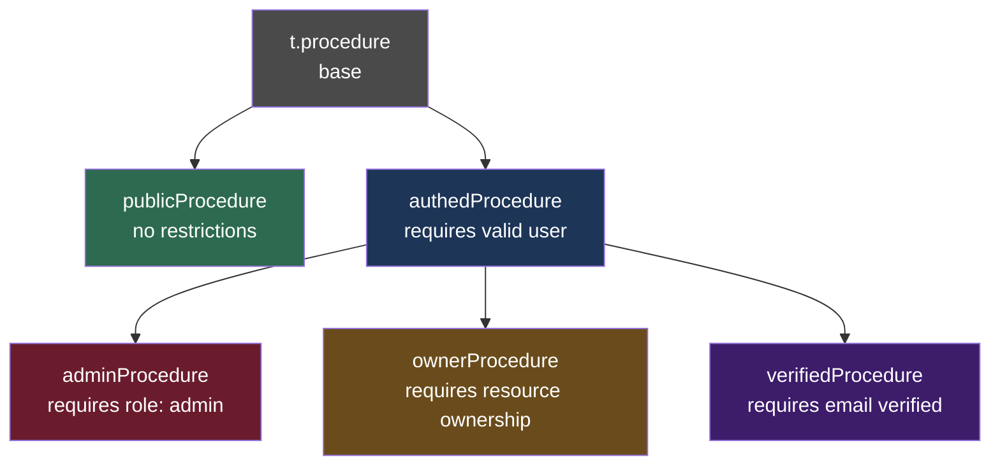
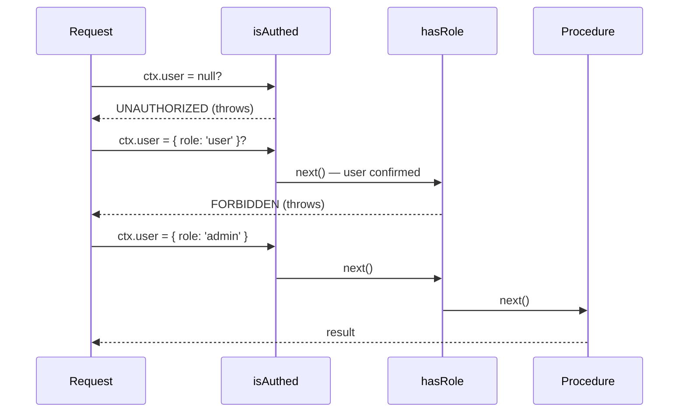

## Protected Procedure Pattern

### Overview

The protected procedure pattern in tRPC formalizes access control by creating **layered procedure builders** — each layer adds context requirements or enforces policies via middleware. Rather than scattering `if (!ctx.user)` checks across individual procedures, the pattern centralizes enforcement into reusable procedure factories.

---

### Conceptual Structure



Each node is a standalone procedure builder. Routers import whichever level they need.

---

### Base Setup

```ts
// server/trpc.ts
import { initTRPC, TRPCError } from '@trpc/server';
import type { Context } from './context';

const t = initTRPC.context<Context>().create();

export const router = t.router;
export const middleware = t.middleware;

// Base — no restrictions
export const publicProcedure = t.procedure;
```

`publicProcedure` is the foundation. All protected variants are derived from `t.procedure` via `.use()`.

---

### The Authentication Layer

```ts
// server/procedures/authed.ts
import { middleware, publicProcedure } from '../trpc';
import { TRPCError } from '@trpc/server';

const isAuthed = middleware(({ ctx, next }) => {
  if (!ctx.user) {
    throw new TRPCError({ code: 'UNAUTHORIZED' });
  }

  return next({
    ctx: { user: ctx.user }, // ctx.user is non-null from this point
  });
});

export const authedProcedure = publicProcedure.use(isAuthed);
```

**Key Points**
- `next({ ctx })` merges the new context with the existing one. Downstream middleware and the procedure handler receive the narrowed type.
- TypeScript narrows `ctx.user` to non-null after this middleware — no assertions needed inside procedures that use `authedProcedure`.
- Any procedure using `authedProcedure` that receives an unauthenticated request will receive `UNAUTHORIZED` before the procedure body executes. Behavior may vary with custom adapters or error formatters.

---

### Role-based Layer

Built on top of `authedProcedure`, not directly on `publicProcedure`.

```ts
// server/procedures/admin.ts
import { authedProcedure } from './authed';
import { TRPCError } from '@trpc/server';

export const adminProcedure = authedProcedure.use(({ ctx, next }) => {
  if (ctx.user.role !== 'admin') {
    throw new TRPCError({
      code: 'FORBIDDEN',
      message: 'Admin access required',
    });
  }

  return next({ ctx });
});
```

[Inference] Chaining on `authedProcedure` rather than duplicating the auth check keeps each middleware single-responsibility and avoids the case where a future change to auth logic must be updated in multiple places.

---

### Middleware Execution Order



Middleware runs in the order `.use()` calls are chained. Each must call `next()` or throw.

---

### Resource Ownership Layer

Ownership checks often require input (e.g., a resource ID) and a database lookup. These can be done in middleware.

```ts
// server/procedures/owner.ts
import { authedProcedure } from './authed';
import { TRPCError } from '@trpc/server';
import { z } from 'zod';

// Middleware with access to input requires a typed input schema first
const ownershipMiddleware = authedProcedure
  .input(z.object({ resourceId: z.string() }))
  .use(async ({ ctx, input, next }) => {
    const resource = await db.resource.findUnique({
      where: { id: input.resourceId },
    });

    if (!resource) {
      throw new TRPCError({ code: 'NOT_FOUND' });
    }

    if (resource.ownerId !== ctx.user.id) {
      throw new TRPCError({ code: 'FORBIDDEN' });
    }

    return next({ ctx: { ...ctx, resource } });
  });

export const ownerProcedure = ownershipMiddleware;
```

**Key Points**
- Input is available in middleware after `.input()` is declared on the chain. The schema defined in middleware applies to all procedures derived from it — [Inference] individual procedures can extend but not contradict it.
- `next({ ctx: { ...ctx, resource } })` passes the fetched resource downstream, avoiding a second DB lookup in the procedure body. Actual behavior depends on database client and connection handling.

**Usage:**

```ts
export const resourceRouter = router({
  deleteResource: ownerProcedure.mutation(({ ctx }) => {
    // ctx.resource is available and typed
    return db.resource.delete({ where: { id: ctx.resource.id } });
  }),
});
```

---

### Composing Multiple Policies

For cases where multiple independent checks are needed without a strict hierarchy, middleware can be composed manually:

```ts
// server/procedures/verifiedAdmin.ts
import { authedProcedure } from './authed';
import { TRPCError } from '@trpc/server';

export const verifiedAdminProcedure = authedProcedure
  .use(({ ctx, next }) => {
    if (!ctx.user.emailVerified) {
      throw new TRPCError({ code: 'FORBIDDEN', message: 'Email not verified' });
    }
    return next({ ctx });
  })
  .use(({ ctx, next }) => {
    if (ctx.user.role !== 'admin') {
      throw new TRPCError({ code: 'FORBIDDEN', message: 'Admin only' });
    }
    return next({ ctx });
  });
```

Each `.use()` call appends one responsibility. [Inference] Keeping each middleware function small and single-purpose makes individual checks independently testable.

---

### Exporting from a Central File

```ts
// server/procedures/index.ts
export { publicProcedure } from '../trpc';
export { authedProcedure } from './authed';
export { adminProcedure } from './admin';
export { ownerProcedure } from './owner';
export { verifiedAdminProcedure } from './verifiedAdmin';
```

Routers import only from this file:

```ts
import { authedProcedure, adminProcedure } from '../procedures';
```

---

### Using Protected Procedures in Routers

```ts
// server/routers/post.ts
import { router } from '../trpc';
import { publicProcedure, authedProcedure, adminProcedure } from '../procedures';
import { z } from 'zod';

export const postRouter = router({
  // Anyone can read
  list: publicProcedure.query(() => db.post.findMany()),

  // Must be logged in to create
  create: authedProcedure
    .input(z.object({ title: z.string(), body: z.string() }))
    .mutation(({ ctx, input }) =>
      db.post.create({
        data: { ...input, authorId: ctx.user.id },
      })
    ),

  // Only admins can delete any post
  forceDelete: adminProcedure
    .input(z.object({ postId: z.string() }))
    .mutation(({ input }) =>
      db.post.delete({ where: { id: input.postId } })
    ),
});
```

---

### Testing Protected Procedures

Protected procedures can be tested by calling them directly with a mock context, bypassing HTTP entirely.

```ts
// tests/post.test.ts
import { createCallerFactory } from '@trpc/server';
import { postRouter } from '../server/routers/post';

const createCaller = createCallerFactory(postRouter);

test('create requires authentication', async () => {
  const caller = createCaller({ user: null }); // unauthenticated

  await expect(
    caller.create({ title: 'Test', body: 'Body' })
  ).rejects.toMatchObject({ code: 'UNAUTHORIZED' });
});

test('create works with valid user', async () => {
  const caller = createCaller({
    user: { id: 'user-1', role: 'user', emailVerified: true },
  });

  const result = await caller.create({ title: 'Test', body: 'Body' });
  expect(result.authorId).toBe('user-1');
});
```

**Key Points**
- `createCallerFactory` is the tRPC v11 API for server-side direct invocation. API surface may differ in earlier versions — verify against your installed version.
- Testing with mock contexts validates middleware logic independently of HTTP transport.

---

### Common Pitfalls

**1. Putting auth logic in procedure bodies**
Checking `if (!ctx.user)` inside `.query()` or `.mutation()` bypasses the type narrowing that middleware provides and spreads access control across the codebase.

**2. Deriving protected procedures from `publicProcedure` directly**
Building `adminProcedure` from `publicProcedure` instead of `authedProcedure` means the role check runs without a prior auth check — a null dereference on `ctx.user.role` is possible if context returns `null`. [Inference] Always layer role checks on top of auth checks.

**3. Mutating `ctx` directly**
`ctx` in tRPC middleware is not intended to be mutated in place. Pass a new object through `next({ ctx: { ...ctx, newField } })`.

**4. Forgetting `return` before `next()`**
Omitting `return next(...)` causes the middleware to resolve `undefined` instead of the procedure result. This is a silent failure — the procedure appears to run but returns nothing.

---

### Summary of Procedure Hierarchy

| Procedure | Auth Required | Role Check | Ownership Check |
|---|---|---|---|
| `publicProcedure` | No | No | No |
| `authedProcedure` | Yes | No | No |
| `adminProcedure` | Yes | `admin` | No |
| `ownerProcedure` | Yes | No | Yes |
| `verifiedAdminProcedure` | Yes | `admin` + verified | No |