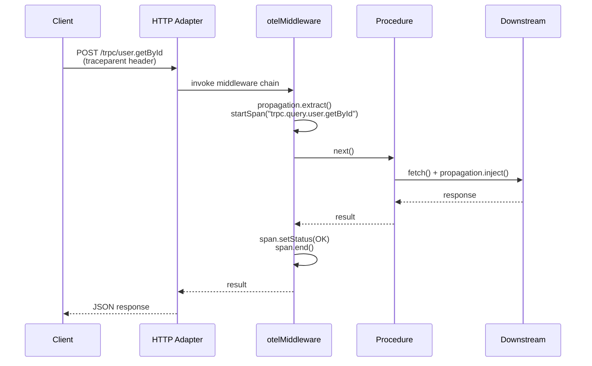

## Integrating OpenTelemetry

OpenTelemetry (OTel) is a vendor-neutral observability framework providing APIs, SDKs, and tooling for collecting traces, metrics, and logs. Integrating it with tRPC involves instrumenting middleware to emit telemetry from every procedure invocation.

---

### What OpenTelemetry Provides

OpenTelemetry organizes observability into three signals:

- **Traces** — distributed, causally-linked spans representing a unit of work
- **Metrics** — numeric measurements aggregated over time (counters, histograms, gauges)
- **Logs** — structured event records (OTel log bridge, not the primary focus here)

tRPC does not ship native OTel support. All instrumentation is added through middleware. [Inference: this is consistent with tRPC's design philosophy of staying agnostic to observability tooling — behavior in future versions may differ.]

---

### Core Concepts Relevant to tRPC

**Tracer** — the entry point for creating spans. Obtained from a `TracerProvider`.

**Span** — a single named, timed operation. Spans carry attributes, events, and status.

**Context propagation** — the mechanism for passing trace context (trace ID, span ID) across process boundaries, typically via HTTP headers.

**Exporter** — sends telemetry data to a backend (Jaeger, Zipkin, OTLP collector, Honeycomb, Datadog, etc.).

---

### Installation

```bash
npm install @opentelemetry/api \
  @opentelemetry/sdk-node \
  @opentelemetry/auto-instrumentations-node \
  @opentelemetry/exporter-trace-otlp-http \
  @opentelemetry/sdk-metrics
```

`@opentelemetry/api` is the stable, versioned surface your application code imports. The SDK packages are runtime concerns and can be swapped without touching application code.

---

### SDK Initialization

OTel must be initialized **before** any other module is imported. The conventional pattern is a separate `instrumentation.ts` (or `tracing.ts`) file loaded first via Node's `--require` flag or as the entry point.

```ts
// src/instrumentation.ts
import { NodeSDK } from '@opentelemetry/sdk-node';
import { OTLPTraceExporter } from '@opentelemetry/exporter-trace-otlp-http';
import { getNodeAutoInstrumentations } from '@opentelemetry/auto-instrumentations-node';
import { Resource } from '@opentelemetry/resources';
import { SEMRESATTRS_SERVICE_NAME } from '@opentelemetry/semantic-conventions';

const sdk = new NodeSDK({
  resource: new Resource({
    [SEMRESATTRS_SERVICE_NAME]: 'my-trpc-api',
  }),
  traceExporter: new OTLPTraceExporter({
    url: process.env.OTEL_EXPORTER_OTLP_ENDPOINT ?? 'http://localhost:4318/v1/traces',
  }),
  instrumentations: [getNodeAutoInstrumentations()],
});

sdk.start();

process.on('SIGTERM', () => {
  sdk.shutdown().finally(() => process.exit(0));
});
```

Start the process with:

```bash
node --require ./dist/instrumentation.js dist/server.js
# or with ts-node:
ts-node --require ./src/instrumentation.ts src/server.ts
```

> [Inference] `getNodeAutoInstrumentations()` patches HTTP, DNS, and common libraries automatically. Whether it instruments tRPC's internal HTTP usage depends on which underlying adapter (Express, Fastify, Fetch) tRPC uses in your setup. Behavior may vary.

---

### Creating a Tracer

```ts
// src/lib/tracer.ts
import { trace } from '@opentelemetry/api';

export const tracer = trace.getTracer('trpc-server', '1.0.0');
```

The tracer name is an instrumentation scope identifier — it appears in trace backends and helps distinguish spans from different libraries.

---

### tRPC Middleware for Tracing

The primary integration point is a tRPC middleware that:

1. Extracts or creates a root span for each procedure call
2. Attaches relevant attributes (procedure path, type, input shape)
3. Records errors and sets span status
4. Ends the span after the procedure resolves or rejects

```ts
// src/trpc/middleware/otel.ts
import { SpanKind, SpanStatusCode, context, propagation, trace } from '@opentelemetry/api';
import { middleware } from '../trpc'; // your initialized tRPC instance
import { tracer } from '../../lib/tracer';
import { TRPCError } from '@trpc/server';

export const otelMiddleware = middleware(async ({ path, type, next, ctx }) => {
  // Attempt to extract incoming trace context from HTTP headers if available
  // ctx.req must expose headers for propagation to work
  const incomingHeaders = (ctx as any).req?.headers ?? {};
  const parentContext = propagation.extract(context.active(), incomingHeaders);

  return context.with(parentContext, async () => {
    const span = tracer.startSpan(`trpc.${type}.${path}`, {
      kind: SpanKind.SERVER,
      attributes: {
        'rpc.system': 'trpc',
        'rpc.method': path,
        'trpc.procedure_type': type,
      },
    });

    try {
      const result = await context.with(
        trace.setSpan(context.active(), span),
        () => next()
      );

      span.setStatus({ code: SpanStatusCode.OK });
      return result;
    } catch (error) {
      if (error instanceof TRPCError) {
        span.setStatus({
          code: SpanStatusCode.ERROR,
          message: error.message,
        });
        span.setAttribute('trpc.error_code', error.code);
      } else {
        span.setStatus({
          code: SpanStatusCode.ERROR,
          message: error instanceof Error ? error.message : 'Unknown error',
        });
      }
      span.recordException(error as Error);
      throw error;
    } finally {
      span.end();
    }
  });
});
```

**Key Points:**
- `propagation.extract` reads W3C `traceparent` / `tracestate` headers (or B3, depending on configured propagators), enabling distributed tracing when a frontend or upstream service initiates the trace
- `context.with(trace.setSpan(...), ...)` ensures any nested spans created during procedure execution are children of this span
- `span.recordException` captures the full stack trace as a span event
- The span is always ended in `finally` regardless of outcome

---

### Registering the Middleware

```ts
// src/trpc/trpc.ts
import { initTRPC } from '@trpc/server';
import { otelMiddleware } from './middleware/otel';

const t = initTRPC.context<Context>().create();

export const publicProcedure = t.procedure.use(otelMiddleware);
export const protectedProcedure = t.procedure
  .use(otelMiddleware)
  .use(authMiddleware);
```

All procedures built from `publicProcedure` or `protectedProcedure` automatically emit spans. [Inference: middleware ordering matters — placing `otelMiddleware` first means the span wraps all downstream middleware execution, which is generally desirable for accurate timing. Verify against your specific middleware chain.]

---

### Span Attribute Conventions

OTel semantic conventions define standard attribute keys. Using them enables interoperability with observability backends that parse conventions for grouping and filtering.

| Attribute | Value | Notes |
|---|---|---|
| `rpc.system` | `"trpc"` | No official tRPC semantic convention exists yet |
| `rpc.method` | procedure path | e.g., `"user.getById"` |
| `trpc.procedure_type` | `"query"` \| `"mutation"` \| `"subscription"` | Custom attribute |
| `trpc.error_code` | tRPC error code string | Custom attribute |
| `http.method` | `"POST"` | If wrapping HTTP handler level |
| `http.status_code` | HTTP status | More relevant at adapter level |

> [Unverified] There is no officially ratified OTel semantic convention for tRPC as of the knowledge cutoff. The attributes above are community conventions and may not be recognized specially by all backends.

---

### Adding Input Attributes Safely

Attaching procedure input to spans can accelerate debugging but carries risk: inputs may contain PII or secrets.

```ts
// Selective, sanitized input recording — never log raw input blindly
function safeInputAttributes(input: unknown): Record<string, string> {
  if (input === null || input === undefined) return {};
  if (typeof input === 'object') {
    // Only record top-level keys, not values
    return { 'trpc.input_keys': Object.keys(input).join(',') };
  }
  return { 'trpc.input_type': typeof input };
}

// Inside middleware, before next():
span.setAttributes(safeInputAttributes(rawInput));
```

> [Inference] Logging input values verbatim is a common source of accidental credential or PII exposure in telemetry pipelines. The pattern above records structural shape without values. Whether this is sufficient depends on your data classification requirements.

---

### Metrics Integration

Alongside tracing, OTel metrics can capture procedure-level counters and latency histograms.

```ts
// src/lib/metrics.ts
import { metrics } from '@opentelemetry/api';

const meter = metrics.getMeter('trpc-server', '1.0.0');

export const procedureCounter = meter.createCounter('trpc.procedure.invocations', {
  description: 'Total tRPC procedure invocations',
});

export const procedureDuration = meter.createHistogram('trpc.procedure.duration_ms', {
  description: 'tRPC procedure execution time in milliseconds',
  unit: 'ms',
});

export const procedureErrors = meter.createCounter('trpc.procedure.errors', {
  description: 'Total tRPC procedure errors',
});
```

Integrate into the middleware:

```ts
import { procedureCounter, procedureDuration, procedureErrors } from '../../lib/metrics';

// Inside otelMiddleware, around the next() call:
const startTime = performance.now();
procedureCounter.add(1, { 'rpc.method': path, 'trpc.procedure_type': type });

try {
  const result = await context.with(trace.setSpan(context.active(), span), () => next());
  procedureDuration.record(performance.now() - startTime, {
    'rpc.method': path,
    'trpc.procedure_type': type,
    'trpc.success': 'true',
  });
  return result;
} catch (error) {
  procedureErrors.add(1, {
    'rpc.method': path,
    'trpc.procedure_type': type,
    'trpc.error_code': error instanceof TRPCError ? error.code : 'UNKNOWN',
  });
  procedureDuration.record(performance.now() - startTime, {
    'rpc.method': path,
    'trpc.procedure_type': type,
    'trpc.success': 'false',
  });
  throw error;
}
```

---

### Context Propagation in Detail

For distributed tracing to work end-to-end (browser → tRPC server → downstream service), trace context must flow through headers.

**Inbound propagation** (already shown above) — extract context from the incoming request headers before starting the span.

**Outbound propagation** — when tRPC procedures call downstream HTTP services, inject the current context into outgoing headers:

```ts
import { propagation, context } from '@opentelemetry/api';

async function callDownstreamService(url: string) {
  const headers: Record<string, string> = {};
  propagation.inject(context.active(), headers);

  const response = await fetch(url, { headers });
  return response.json();
}
```

If `getNodeAutoInstrumentations()` is active, the `fetch` and `http` instrumentations may handle outbound propagation automatically. [Inference: auto-instrumentation coverage varies by Node.js version and the specific HTTP library used. Manual injection is a reliable fallback.]

---

### Visualizing the Trace Flow

The following diagram shows how a single tRPC request produces a distributed trace:



---

### Exporter Options

| Exporter | Package | Use Case |
|---|---|---|
| OTLP HTTP | `@opentelemetry/exporter-trace-otlp-http` | OTel Collector, Honeycomb, Grafana Tempo |
| OTLP gRPC | `@opentelemetry/exporter-trace-otlp-grpc` | High-throughput collector setups |
| Jaeger | `@opentelemetry/exporter-jaeger` | Self-hosted Jaeger |
| Zipkin | `@opentelemetry/exporter-zipkin` | Self-hosted Zipkin |
| Console | `@opentelemetry/sdk-trace-base` (`ConsoleSpanExporter`) | Local development and debugging |

For local development, `ConsoleSpanExporter` prints spans to stdout without requiring a running collector:

```ts
import { ConsoleSpanExporter, SimpleSpanProcessor } from '@opentelemetry/sdk-trace-base';
import { NodeTracerProvider } from '@opentelemetry/sdk-trace-node';

const provider = new NodeTracerProvider();
provider.addSpanProcessor(new SimpleSpanProcessor(new ConsoleSpanExporter()));
provider.register();
```

> [Inference] `SimpleSpanProcessor` exports each span synchronously as it ends, which is convenient for development but adds latency in production. `BatchSpanProcessor` is the standard production choice, batching spans before export.

---

### Production Considerations

**Sampling** — tracing every request at high throughput is expensive. Configure a sampler in the SDK:

```ts
import { TraceIdRatioBasedSampler } from '@opentelemetry/sdk-trace-base';

const sdk = new NodeSDK({
  sampler: new TraceIdRatioBasedSampler(0.1), // sample 10% of traces
  // ...
});
```

Tail-based sampling (deciding after seeing the full trace) requires an OTel Collector with the `tail_sampling` processor — it cannot be done in the SDK alone.

**Sensitive data filtering** — use a custom `SpanProcessor` to scrub attributes before export:

```ts
import { SpanProcessor, ReadableSpan } from '@opentelemetry/sdk-trace-base';

class RedactingProcessor implements SpanProcessor {
  onStart() {}
  onEnd(span: ReadableSpan) {
    // Spans are read-only at this stage in some SDK versions
    // Redaction is better done at attribute-set time in middleware
  }
  shutdown() { return Promise.resolve(); }
  forceFlush() { return Promise.resolve(); }
}
```

> [Unverified] The mutability of `ReadableSpan` attributes in `onEnd` depends on the SDK version. In some versions attributes are frozen. Redaction at the point of `span.setAttribute()` in middleware is the more reliable approach.

**Collector deployment** — running an OTel Collector as a sidecar or daemonset decouples your application from backend changes and enables pipeline features (batching, retry, filtering, fan-out to multiple backends) without application code changes.

---

### Summary

| Component | Role |
|---|---|
| `instrumentation.ts` | SDK bootstrap, loaded before application code |
| `tracer.ts` | Named tracer instance shared across middleware |
| `otelMiddleware` | Creates spans, propagates context, records errors |
| `metrics.ts` | Counters and histograms per procedure |
| Exporter | Ships telemetry to a backend (OTLP, Jaeger, etc.) |
| Propagation | Connects tRPC spans into a distributed trace |

**Next Steps:**
- Configure an OTel Collector with `tail_sampling` for cost-effective production sampling
- Add a `baggage` propagator to carry request-scoped metadata (e.g., tenant ID) through the trace without explicit parameter threading
- Explore backend-specific integrations (Honeycomb, Grafana Tempo, Datadog Agent OTLP ingest) for richer querying and alerting on tRPC procedure metrics