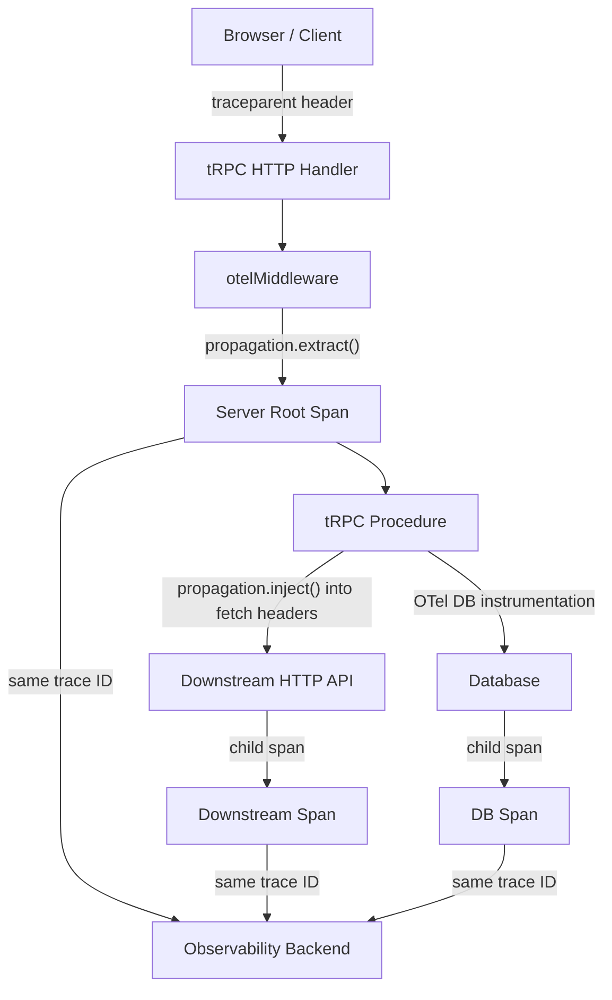

## Tracing Requests End to End

End-to-end tracing means a single trace ID flows from the originating client through the tRPC server and into every downstream service it touches — producing one unified timeline in your observability backend. This requires deliberate propagation at every boundary.

---

### What "End to End" Means

A complete trace spans:

1. **Client** — browser, mobile app, or upstream service initiates a request and generates or forwards a trace context
2. **HTTP transport** — trace context travels as headers (`traceparent`, `tracestate`)
3. **tRPC server** — extracts context, creates a server-side span as a child
4. **Downstream services** — databases, HTTP APIs, message queues — each receiving and continuing the trace

Without propagation at each boundary, you get isolated fragments instead of a connected timeline.

---

### The W3C Trace Context Standard

The dominant propagation format is W3C Trace Context (RFC 7523). Two headers carry the context:

**`traceparent`** — encodes the trace ID, parent span ID, and flags:

```
traceparent: 00-4bf92f3577b34da6a3ce929d0e0e4736-00f067aa0ba902b7-01
             ^  ^                                ^                ^
             version  trace-id (128-bit hex)     parent-span-id  flags (sampled=01)
```

**`tracestate`** — vendor-specific key-value pairs, forwarded opaquely:

```
tracestate: vendor1=value1,vendor2=value2
```

OTel's default propagator handles both. B3 (Zipkin's format) is an alternative; configure it explicitly if your stack requires it.

---

### Propagation Flow Diagram



Every node in the diagram shares the same `trace-id`. Spans differ only in their `span-id` and `parent-span-id`.

---

### Client-Side: Initiating the Trace

#### Browser with OTel JS SDK

```ts
// src/client/instrumentation.ts
import { WebTracerProvider } from '@opentelemetry/sdk-trace-web';
import { OTLPTraceExporter } from '@opentelemetry/exporter-trace-otlp-http';
import { BatchSpanProcessor } from '@opentelemetry/sdk-trace-base';
import { registerInstrumentations } from '@opentelemetry/instrumentation';
import { FetchInstrumentation } from '@opentelemetry/instrumentation-fetch';
import { W3CTraceContextPropagator } from '@opentelemetry/core';
import { propagation, trace } from '@opentelemetry/api';

const provider = new WebTracerProvider();

provider.addSpanProcessor(
  new BatchSpanProcessor(
    new OTLPTraceExporter({ url: 'https://collector.example.com/v1/traces' })
  )
);

provider.register({
  propagator: new W3CTraceContextPropagator(),
});

registerInstrumentations({
  instrumentations: [
    new FetchInstrumentation({
      propagateTraceHeaderCorsUrls: [/https:\/\/api\.example\.com/],
    }),
  ],
});
```

**Key Points:**
- `FetchInstrumentation` automatically injects `traceparent` into outgoing `fetch` calls
- `propagateTraceHeaderCorsUrls` is required — browsers block custom headers on cross-origin requests unless the server explicitly allows them via CORS
- Without this list, the header is silently dropped and the server receives no parent context

#### CORS Configuration on the Server

The server must allow `traceparent` and `tracestate` as allowed headers:

```ts
// Express example
import cors from 'cors';

app.use(cors({
  origin: 'https://app.example.com',
  allowedHeaders: [
    'Content-Type',
    'traceparent',
    'tracestate',
    'baggage',
  ],
}));
```

> [Inference] Omitting `traceparent` from `allowedHeaders` causes browsers to omit the header in preflight-guarded requests, silently breaking distributed tracing from the browser. The server-side span will start a new root trace instead of continuing the client trace.

---

### Server-Side: Extracting and Continuing the Trace

This is the middleware shown in the previous section, expanded with explicit propagator registration and request header access patterns.

#### Registering the Propagator

Propagators must be registered globally on the server before any extraction occurs:

```ts
// src/instrumentation.ts
import { W3CTraceContextPropagator } from '@opentelemetry/core';
import { propagation } from '@opentelemetry/api';

// If not using NodeSDK (which registers propagators automatically):
propagation.setGlobalPropagator(new W3CTraceContextPropagator());
```

When using `NodeSDK`, pass the propagator in config:

```ts
import { W3CTraceContextPropagator } from '@opentelemetry/core';

const sdk = new NodeSDK({
  textMapPropagator: new W3CTraceContextPropagator(),
  // ...
});
```

#### Accessing Headers in tRPC Context

tRPC middleware receives `ctx`, not a raw request object. The request must be threaded into the context explicitly at adapter setup:

```ts
// src/trpc/context.ts
import { inferAsyncReturnType } from '@trpc/server';
import { CreateExpressContextOptions } from '@trpc/server/adapters/express';

export function createContext({ req, res }: CreateExpressContextOptions) {
  return { req, res };
}

export type Context = inferAsyncReturnType<typeof createContext>;
```

```ts
// Express adapter setup
import { createExpressMiddleware } from '@trpc/server/adapters/express';

app.use('/trpc', createExpressMiddleware({
  router: appRouter,
  createContext,
}));
```

With `req` available on `ctx`, the middleware can extract headers:

```ts
// src/trpc/middleware/otel.ts
import { propagation, context, trace, SpanKind, SpanStatusCode } from '@opentelemetry/api';
import { middleware } from '../trpc';
import { tracer } from '../../lib/tracer';
import { TRPCError } from '@trpc/server';

export const otelMiddleware = middleware(async ({ path, type, next, ctx }) => {
  const req = (ctx as any).req;
  const incomingCarrier = req?.headers ?? {};

  // Extract W3C trace context from incoming headers
  const parentContext = propagation.extract(context.active(), incomingCarrier);

  return context.with(parentContext, async () => {
    const span = tracer.startSpan(`trpc.${type}.${path}`, {
      kind: SpanKind.SERVER,
      attributes: {
        'rpc.system': 'trpc',
        'rpc.method': path,
        'trpc.procedure_type': type,
        'http.method': req?.method ?? 'unknown',
      },
    });

    const spanContext = trace.setSpan(context.active(), span);

    try {
      const result = await context.with(spanContext, () => next());
      span.setStatus({ code: SpanStatusCode.OK });
      return result;
    } catch (error) {
      span.recordException(error as Error);
      span.setStatus({
        code: SpanStatusCode.ERROR,
        message: error instanceof Error ? error.message : String(error),
      });
      if (error instanceof TRPCError) {
        span.setAttribute('trpc.error_code', error.code);
      }
      throw error;
    } finally {
      span.end();
    }
  });
});
```

---

### Downstream Propagation: Outbound HTTP Calls

When a procedure calls another HTTP service, the active span context must be injected into the outgoing headers.

#### Manual Injection with `fetch`

```ts
// src/lib/tracedFetch.ts
import { propagation, context } from '@opentelemetry/api';

export async function tracedFetch(url: string, init: RequestInit = {}): Promise<Response> {
  const headers: Record<string, string> = {
    ...(init.headers as Record<string, string> ?? {}),
  };

  // Inject current active context (trace ID, span ID) into headers
  propagation.inject(context.active(), headers);

  return fetch(url, { ...init, headers });
}
```

```ts
// Usage inside a tRPC procedure
export const userRouter = router({
  getProfile: publicProcedure
    .input(z.object({ id: z.string() }))
    .query(async ({ input }) => {
      const data = await tracedFetch(
        `https://profile-service.internal/users/${input.id}`
      );
      return data.json();
    }),
});
```

> [Inference] If `getNodeAutoInstrumentations()` is active and includes `HttpInstrumentation`, outbound `http`/`https` module calls may be instrumented automatically. The `fetch` API in Node.js 18+ may or may not be covered depending on SDK version. `tracedFetch` is a reliable explicit fallback regardless of auto-instrumentation state. Verify against your SDK version.

#### With axios

```ts
import axios from 'axios';
import { propagation, context } from '@opentelemetry/api';

export function createTracedAxios() {
  const instance = axios.create();

  instance.interceptors.request.use((config) => {
    const headers: Record<string, string> = {};
    propagation.inject(context.active(), headers);
    Object.assign(config.headers, headers);
    return config;
  });

  return instance;
}
```

---

### Database Spans

OTel auto-instrumentation covers common database clients. When active, queries executed during a procedure automatically appear as child spans under the procedure span — no manual code required.

| Library | Auto-instrumentation Package |
|---|---|
| `pg` (PostgreSQL) | `@opentelemetry/instrumentation-pg` |
| `mysql2` | `@opentelemetry/instrumentation-mysql2` |
| `mongodb` | `@opentelemetry/instrumentation-mongodb` |
| `redis` / `ioredis` | `@opentelemetry/instrumentation-redis-4` |
| Prisma | `@prisma/instrumentation` |

**Example — Prisma:**

```ts
// src/instrumentation.ts
import { PrismaInstrumentation } from '@prisma/instrumentation';
import { NodeSDK } from '@opentelemetry/sdk-node';

const sdk = new NodeSDK({
  instrumentations: [
    new PrismaInstrumentation(),
    // ... other instrumentations
  ],
});
```

> [Unverified] `@prisma/instrumentation` behavior and attribute names depend on the Prisma version. Verify against current Prisma and OTel SDK release notes.

---

### Creating Manual Child Spans

For operations within a procedure that are not covered by auto-instrumentation, create child spans explicitly:

```ts
import { tracer } from '../lib/tracer';
import { SpanStatusCode } from '@opentelemetry/api';

export const orderRouter = router({
  process: protectedProcedure
    .input(orderSchema)
    .mutation(async ({ input, ctx }) => {

      // Child span for a validation step
      const validationSpan = tracer.startSpan('order.validate');
      let validationResult;
      try {
        validationResult = await validateOrder(input);
        validationSpan.setStatus({ code: SpanStatusCode.OK });
      } catch (e) {
        validationSpan.recordException(e as Error);
        validationSpan.setStatus({ code: SpanStatusCode.ERROR });
        throw e;
      } finally {
        validationSpan.end();
      }

      // Child span for external payment call
      const paymentSpan = tracer.startSpan('order.payment.charge');
      try {
        await chargePayment(validationResult);
        paymentSpan.setStatus({ code: SpanStatusCode.OK });
      } catch (e) {
        paymentSpan.recordException(e as Error);
        paymentSpan.setStatus({ code: SpanStatusCode.ERROR });
        throw e;
      } finally {
        paymentSpan.end();
      }
    }),
});
```

> [Inference] `tracer.startSpan` without an explicit parent uses the active context — which is the procedure span set by `otelMiddleware` via `context.with`. This makes the manual spans children automatically, provided they are created within the same async context chain. If context is lost across async boundaries (e.g., some callback-based APIs), pass the context explicitly.

---

### Baggage: Carrying Business Context Through the Trace

OTel Baggage propagates arbitrary key-value pairs across process boundaries alongside the trace. Unlike span attributes (which are local to a span), baggage values are forwarded to every downstream service automatically.

```ts
// src/trpc/middleware/baggage.ts
import { propagation, context, baggageEntryMetadataFromString } from '@opentelemetry/api';
import { middleware } from '../trpc';

export const baggageMiddleware = middleware(async ({ ctx, next }) => {
  const userId = (ctx as any).user?.id;
  const tenantId = (ctx as any).tenant?.id;

  const bag = propagation.createBaggage({
    ...(userId ? { 'app.user_id': { value: userId } } : {}),
    ...(tenantId ? { 'app.tenant_id': { value: tenantId } } : {}),
  });

  const baggageContext = propagation.setBaggage(context.active(), bag);

  return context.with(baggageContext, () => next());
});
```

> [Inference] Baggage values are transmitted in plain text across all service boundaries, including third-party services. Do not place sensitive values (tokens, passwords, PII) in baggage.

---

### Correlating Logs with Traces

To link log lines to the active span, inject `trace_id` and `span_id` into log records:

```ts
// src/lib/logger.ts
import { trace, context } from '@opentelemetry/api';
import pino from 'pino';

const baseLogger = pino();

export function getLogger() {
  const span = trace.getActiveSpan();
  const spanContext = span?.spanContext();

  return baseLogger.child({
    trace_id: spanContext?.traceId,
    span_id: spanContext?.spanId,
    trace_flags: spanContext?.traceFlags,
  });
}
```

```ts
// Usage inside a procedure
export const userRouter = router({
  getById: publicProcedure
    .input(z.object({ id: z.string() }))
    .query(async ({ input }) => {
      const log = getLogger();
      log.info({ userId: input.id }, 'Fetching user');
      // ...
    }),
});
```

Most observability backends (Grafana, Honeycomb, Datadog) recognize `trace_id` in log records and provide direct jump-to-trace links from log lines.

---

### Verifying End-to-End Traces Locally

**Option 1 — Jaeger (all-in-one Docker image):**

```bash
docker run -d --name jaeger \
  -p 16686:16686 \
  -p 4318:4318 \
  jaegertracing/all-in-one:latest
```

Set `OTEL_EXPORTER_OTLP_ENDPOINT=http://localhost:4318` and open `http://localhost:16686` to browse traces.

**Option 2 — Console exporter (no infrastructure):**

```ts
import { ConsoleSpanExporter, SimpleSpanProcessor } from '@opentelemetry/sdk-trace-base';

sdk = new NodeSDK({
  spanProcessor: new SimpleSpanProcessor(new ConsoleSpanExporter()),
});
```

Each span prints to stdout as JSON on `.end()`. Adequate for verifying parent-child relationships during development.

---

### Common Failure Modes

| Symptom | Likely Cause |
|---|---|
| Server span has no parent | `traceparent` header missing or blocked by CORS |
| Downstream spans appear as new root traces | `propagation.inject()` not called before outbound requests |
| DB spans not appearing | Auto-instrumentation package not installed or not registered |
| Spans missing from backend | Exporter misconfigured, collector unreachable, or sampling dropped them |
| Context lost mid-async | Callback-based API broke the async context chain; use explicit context passing |

---

### Summary

| Boundary | Mechanism |
|---|---|
| Browser → tRPC server | `FetchInstrumentation` + CORS `allowedHeaders` |
| tRPC server ingress | `propagation.extract()` from `ctx.req.headers` |
| tRPC server → downstream HTTP | `propagation.inject()` into outgoing headers |
| tRPC server → database | OTel auto-instrumentation for the DB client |
| Within a procedure | `tracer.startSpan()` inside active span context |
| Cross-service business context | OTel Baggage |
| Log correlation | `trace.getActiveSpan().spanContext().traceId` injected into log records |

**Next Steps:**
- Implement tail-based sampling at the OTel Collector level to retain 100% of error traces while sampling successful ones
- Add span links for async workflows where a background job is causally related to the originating request but not a direct child
- Explore exemplars to attach trace IDs directly to Prometheus metric data points, enabling metric-to-trace navigation in Grafana