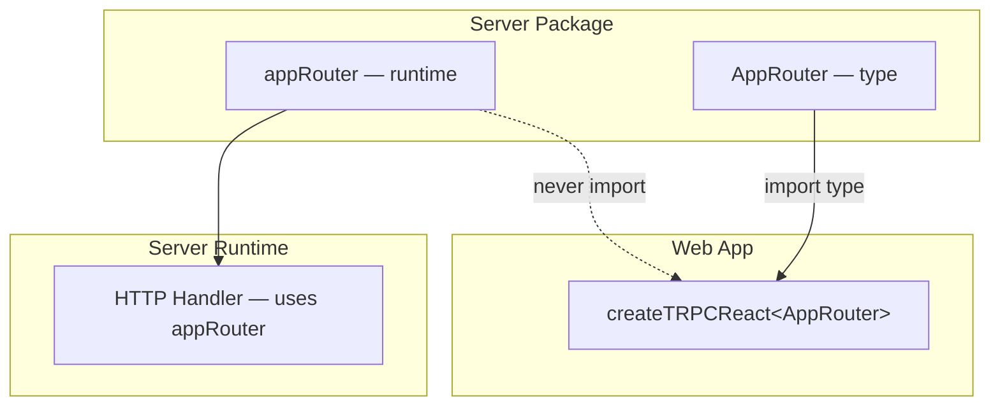

## Sharing the AppRouter Type Across Packages

One of tRPC's most powerful features is its ability to propagate full end-to-end type safety across a client–server boundary — but this only works if the client can access the `AppRouter` type defined on the server. In a monorepo, this means deliberately structuring how that type is exported, imported, and kept in sync across packages.

---

### Why the AppRouter Type Must Be Shared

tRPC's client does not generate code. It infers types directly from the router definition at compile time. The client-side `createTRPCClient` or `createTRPCReact` calls are generic over `AppRouter`, and TypeScript uses that type to:

- Autocomplete procedure paths (`trpc.user.getById.query(...)`)
- Validate input shapes against Zod schemas
- Infer output types from resolver return values

Without access to `AppRouter`, the client loses all of this. It degrades to an untyped HTTP client.

---

### The Core Constraint: Type-Only Sharing

`AppRouter` is a TypeScript type that describes the router's shape. The critical rule is:

> **The client must import the `AppRouter` type — never the runtime router implementation.**

Importing the actual router would pull in server-side code (database clients, secrets, Node.js-only modules) into a client bundle. TypeScript's `import type` syntax is the primary mechanism for enforcing this boundary.

```ts
// ✅ Correct — type-only import
import type { AppRouter } from '@myapp/server';

// ❌ Wrong — imports runtime server code into client bundle
import { appRouter } from '@myapp/server';
```

---

### Monorepo Package Structure

A typical monorepo layout for tRPC type sharing looks like this:

```
apps/
  web/          ← React/Next.js frontend
  server/       ← tRPC server (Express, Fastify, or Next.js API routes)
packages/
  trpc/         ← Optional: shared tRPC client config, hooks
  types/        ← Optional: shared domain types
```

Two common patterns exist for where the `AppRouter` export lives.

---

### Pattern 1: Export Directly from the Server Package

The simplest approach exports `AppRouter` from the server app itself.

**`apps/server/src/router/index.ts`**

```ts
import { router } from '../trpc';
import { userRouter } from './user';
import { postRouter } from './post';

export const appRouter = router({
  user: userRouter,
  post: postRouter,
});

export type AppRouter = typeof appRouter;
```

**`apps/server/package.json`**

```json
{
  "name": "@myapp/server",
  "exports": {
    ".": {
      "types": "./src/router/index.ts"
    }
  }
}
```

**`apps/web/src/trpc.ts`**

```ts
import type { AppRouter } from '@myapp/server';
import { createTRPCReact } from '@trpc/react-query';

export const trpc = createTRPCReact<AppRouter>();
```

**Key Points**

- Simple — no extra package needed
- Works well when the web app is the only consumer
- The `export type` or `import type` boundary is critical
- [Inference] TypeScript project references or `paths` aliases in `tsconfig.json` are usually needed for this to resolve correctly in non-Next.js monorepos

---

### Pattern 2: Dedicated Shared Package

For larger monorepos with multiple frontends or API consumers, a dedicated package (e.g., `@myapp/trpc`) isolates the shared type and client configuration.

**`packages/trpc/src/index.ts`**

```ts
// Re-export only the type from the server package
export type { AppRouter } from '@myapp/server';

// Export shared client factory
export { createTRPCReact } from '@trpc/react-query';
```

**`apps/web/src/trpc.ts`**

```ts
import type { AppRouter } from '@myapp/trpc';
import { createTRPCReact } from '@myapp/trpc';

export const trpc = createTRPCReact<AppRouter>();
```

**Key Points**

- The shared package becomes a stable interface layer
- Consumers depend on `@myapp/trpc`, not directly on `@myapp/server`
- Enables versioning and changelogs for the shared interface [Inference]
- Adds indirection — an extra package to maintain

---

### TypeScript Configuration for Cross-Package Types

Type sharing relies heavily on correct `tsconfig.json` setup. Two main approaches exist.

#### Path Aliases (`tsconfig.json` `paths`)

```json
// apps/web/tsconfig.json
{
  "compilerOptions": {
    "paths": {
      "@myapp/server": ["../../apps/server/src/router/index.ts"]
    }
  }
}
```

This resolves the import directly to source TypeScript files, bypassing any build step. It is the most common approach in Turborepo and Nx setups.

#### TypeScript Project References

```json
// apps/web/tsconfig.json
{
  "references": [
    { "path": "../../apps/server" }
  ]
}
```

Project references enable incremental builds and stricter dependency graphs. They require each referenced package to have its own `tsconfig.json` with `composite: true`. [Inference] This approach scales better for very large monorepos but requires more upfront configuration.

---

### Isolating Server-Only Code

Even with `import type`, it is worth auditing what the server package's entry point re-exports. If the same `index.ts` that exports `AppRouter` also exports a database client or secrets config, tree-shaking may not fully protect the client bundle depending on the bundler.

**Recommended practice:** Create a dedicated type-export entry point.

```ts
// apps/server/src/router/types.ts — safe to import from anywhere
export type { AppRouter } from './index';
```

Then point the `types` export in `package.json` to this file, or have consumers import from `@myapp/server/types`.

---

### Runtime vs. Type Boundary: A Visual Summary



---

### Turborepo-Specific Considerations

In a Turborepo workspace, package resolution follows the `workspaces` field in the root `package.json`.

**`package.json` (root)**

```json
{
  "workspaces": ["apps/*", "packages/*"]
}
```

Each consuming package lists the server (or shared tRPC package) as a dependency:

```json
// apps/web/package.json
{
  "dependencies": {
    "@myapp/server": "*"
  }
}
```

[Inference] Using `"*"` as the version resolves to the local workspace package rather than a published npm version. This is standard Turborepo and pnpm workspace behavior but should be verified against your package manager's documentation.

---

### Common Errors and Causes

| Error | Likely Cause |
|---|---|
| `AppRouter` resolves to `unknown` or `any` | Import is not `import type`, or path alias is misconfigured |
| Server-only module imported in client bundle | Router entry point exports runtime code alongside the type |
| Procedure path autocomplete not working | TypeScript server not picking up `tsconfig.json` `paths` correctly |
| Type mismatch after router change | Consuming app has stale type cache — restart TS server |

---

### Keeping Types in Sync

Because `AppRouter` is inferred at compile time from the live router definition, types are always derived from the current source. There is no separate schema file to keep in sync. [Inference] This is one of tRPC's primary advantages over REST+OpenAPI or GraphQL in a monorepo context — a procedure change in the server is immediately reflected as a type error in the client without any code generation step.

---

**Conclusion**

Sharing `AppRouter` across packages is the foundational act that makes tRPC's type safety real in a monorepo. The approach is straightforward — export the type from the server, configure `tsconfig.json` to resolve the import, and use `import type` on the consumer side. The choice between exporting directly from the server package versus a dedicated shared package depends on how many consumers exist and how much interface stability is desired.

---

**Related Topics**

- Setting up `tsconfig.json` project references in a Turborepo
- tRPC with Next.js App Router — type sharing in a collocated monorepo
- Using `@trpc/client` vs. `@trpc/react-query` in shared packages
- Versioning the AppRouter interface for multiple frontend apps
- tRPC with Nx monorepos — module boundaries and type sharing
- Inferring input and output types with `inferRouterInputs` and `inferRouterOutputs`