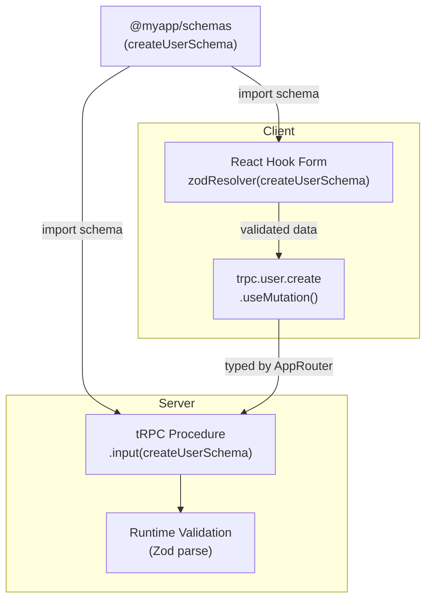

## Shared Zod Schemas Across Client and Server

Zod schemas in tRPC serve dual roles: they validate inputs at runtime on the server, and they describe input shapes that TypeScript infers at compile time on both sides. When the same schema is used on the client to build a form and on the server to validate a procedure input, keeping a single source of truth becomes essential. This topic covers how to structure, share, and maintain Zod schemas across the client–server boundary in a tRPC monorepo.

---

### Why Share Zod Schemas

Without a shared schema, the same validation logic tends to be duplicated — once in a form library on the client (React Hook Form, Formik) and once in the tRPC procedure on the server. Duplication leads to drift: a field becomes optional on the server but remains required on the client, or a string length constraint changes in one place but not the other.

Sharing schemas provides:

- A single source of truth for validation rules
- Automatic client-side form validation that mirrors server-side constraints
- Inferred TypeScript types (`z.infer<typeof schema>`) usable in both environments
- Reduced surface area for input validation bugs

---

### Where Shared Schemas Live

Shared Zod schemas must live in a package that is:

1. Free of server-only dependencies (no database clients, no Node.js-only modules)
2. Importable by both the server app and the client app
3. Bundleable by client-side bundlers (Vite, webpack, Next.js)

The two most common locations are a dedicated `packages/schemas` (or `packages/validators`) package, or a broader `packages/shared` package that also contains domain types.

```
packages/
  schemas/
    src/
      user.ts
      post.ts
      auth.ts
      index.ts
    package.json
    tsconfig.json
```

---

### Setting Up the Schemas Package

**`packages/schemas/package.json`**

```json
{
  "name": "@myapp/schemas",
  "version": "0.0.0",
  "main": "./src/index.ts",
  "types": "./src/index.ts",
  "dependencies": {
    "zod": "^3.22.0"
  }
}
```

**Key Points**

- Zod is a dependency of the schemas package itself, not just a peer dependency
- Both the server and client will resolve Zod through this package [Inference]
- Pointing `main` and `types` directly to `.ts` source files avoids a build step, which is standard in monorepos using `tsconfig` path aliases

---

### Defining Shared Schemas

Each domain area gets its own file. Schemas are plain Zod objects with no server-side imports.

**`packages/schemas/src/user.ts`**

```ts
import { z } from 'zod';

export const createUserSchema = z.object({
  username: z.string().min(3).max(32),
  email: z.string().email(),
  password: z.string().min(8).max(128),
});

export const updateUserSchema = z.object({
  username: z.string().min(3).max(32).optional(),
  bio: z.string().max(500).optional(),
});

export const userIdSchema = z.object({
  id: z.string().uuid(),
});

// Inferred types — usable anywhere TypeScript runs
export type CreateUserInput = z.infer<typeof createUserSchema>;
export type UpdateUserInput = z.infer<typeof updateUserSchema>;
export type UserIdInput = z.infer<typeof userIdSchema>;
```

**`packages/schemas/src/post.ts`**

```ts
import { z } from 'zod';

export const createPostSchema = z.object({
  title: z.string().min(1).max(200),
  body: z.string().min(1),
  tags: z.array(z.string().max(50)).max(10).default([]),
  published: z.boolean().default(false),
});

export const paginationSchema = z.object({
  page: z.number().int().positive().default(1),
  limit: z.number().int().min(1).max(100).default(20),
});

export type CreatePostInput = z.infer<typeof createPostSchema>;
export type PaginationInput = z.infer<typeof paginationSchema>;
```

**`packages/schemas/src/index.ts`**

```ts
export * from './user';
export * from './post';
export * from './auth';
```

---

### Using Shared Schemas on the Server

The server imports schemas from `@myapp/schemas` and passes them directly to tRPC procedure `.input()` calls.

**`apps/server/src/router/user.ts`**

```ts
import { router, protectedProcedure, publicProcedure } from '../trpc';
import {
  createUserSchema,
  updateUserSchema,
  userIdSchema,
} from '@myapp/schemas';
import { db } from '../db';

export const userRouter = router({
  create: publicProcedure
    .input(createUserSchema)
    .mutation(async ({ input }) => {
      // input is typed as CreateUserInput — inferred from the shared schema
      return db.user.create({ data: input });
    }),

  update: protectedProcedure
    .input(updateUserSchema.merge(userIdSchema))
    .mutation(async ({ input }) => {
      const { id, ...data } = input;
      return db.user.update({ where: { id }, data });
    }),

  getById: publicProcedure
    .input(userIdSchema)
    .query(async ({ input }) => {
      return db.user.findUnique({ where: { id: input.id } });
    }),
});
```

---

### Using Shared Schemas on the Client

The same schemas drive form validation on the client. React Hook Form with the Zod resolver is the most common pattern.

**`apps/web/src/features/user/CreateUserForm.tsx`**

```tsx
import { useForm } from 'react-hook-form';
import { zodResolver } from '@hookform/resolvers/zod';
import { createUserSchema, type CreateUserInput } from '@myapp/schemas';
import { trpc } from '../../trpc';

export function CreateUserForm() {
  const {
    register,
    handleSubmit,
    formState: { errors },
  } = useForm<CreateUserInput>({
    resolver: zodResolver(createUserSchema),
  });

  const createUser = trpc.user.create.useMutation();

  const onSubmit = (data: CreateUserInput) => {
    createUser.mutate(data);
  };

  return (
    <form onSubmit={handleSubmit(onSubmit)}>
      <input {...register('username')} />
      {errors.username && <span>{errors.username.message}</span>}

      <input {...register('email')} type="email" />
      {errors.email && <span>{errors.email.message}</span>}

      <input {...register('password')} type="password" />
      {errors.password && <span>{errors.password.message}</span>}

      <button type="submit">Create</button>
    </form>
  );
}
```

**Key Points**

- `zodResolver(createUserSchema)` means the form validates against the exact same rules the server enforces
- `CreateUserInput` is imported from `@myapp/schemas`, not redefined locally
- tRPC's `.useMutation()` input type is also inferred from `createUserSchema` via `AppRouter`, so TypeScript catches shape mismatches at the call site

---

### Schema Composition Patterns

Real applications rarely use flat schemas everywhere. Zod's composition utilities are particularly useful for shared schemas.

#### Extending Base Schemas

```ts
// packages/schemas/src/base.ts
import { z } from 'zod';

export const timestampsSchema = z.object({
  createdAt: z.date(),
  updatedAt: z.date(),
});

export const paginationSchema = z.object({
  page: z.number().int().positive().default(1),
  limit: z.number().int().min(1).max(100).default(20),
});
```

```ts
// packages/schemas/src/post.ts
import { z } from 'zod';
import { paginationSchema } from './base';

export const listPostsSchema = paginationSchema.extend({
  authorId: z.string().uuid().optional(),
  tag: z.string().optional(),
});
```

#### Partial and Pick for Update Schemas

```ts
export const createPostSchema = z.object({
  title: z.string().min(1).max(200),
  body: z.string().min(1),
  published: z.boolean().default(false),
});

// Derive update schema — all fields optional except id
export const updatePostSchema = createPostSchema
  .partial()
  .extend({ id: z.string().uuid() });

export type UpdatePostInput = z.infer<typeof updatePostSchema>;
```

#### Discriminated Unions for Multi-Step Forms

```ts
export const authSchema = z.discriminatedUnion('mode', [
  z.object({
    mode: z.literal('login'),
    email: z.string().email(),
    password: z.string().min(8),
  }),
  z.object({
    mode: z.literal('register'),
    email: z.string().email(),
    password: z.string().min(8),
    username: z.string().min(3),
  }),
]);

export type AuthInput = z.infer<typeof authSchema>;
```

---

### Avoiding Server-Only Leakage into Schemas

Shared schemas must contain only Zod logic. Common mistakes that break client bundling:

```ts
// ❌ — imports Prisma, a server-only package
import { Prisma } from '@prisma/client';

export const createUserSchema = z.object({
  role: z.nativeEnum(Prisma.Role), // pulls in Prisma runtime
});

// ✅ — define the enum explicitly in Zod
export const userRoleSchema = z.enum(['ADMIN', 'MEMBER', 'VIEWER']);
export const createUserSchema = z.object({
  role: userRoleSchema,
});
```

[Inference] Bundlers like Vite and Next.js will usually error or warn when a server-only module is imported into a client-rendered component tree, but the error message may not always point directly at the shared schema as the source.

---

### Zod Version Alignment

Multiple packages in a monorepo each declaring `zod` as a dependency can result in multiple Zod instances being resolved. This causes runtime errors because Zod schemas from one instance are not compatible with validators from another.

**Symptoms**

- `z.ZodError` instanceof checks fail
- Schema composition across packages throws at runtime [Unverified — behavior may vary by bundler and package manager]

**Resolution**

Hoist Zod to the monorepo root and declare it as a `peerDependency` in all packages that use it:

```json
// packages/schemas/package.json
{
  "peerDependencies": {
    "zod": "^3.22.0"
  }
}
```

```json
// root package.json
{
  "dependencies": {
    "zod": "^3.22.0"
  }
}
```

With pnpm, add Zod to the root and use `pnpm dedupe` to collapse instances. With npm/yarn workspaces, hoisting is the default but can be overridden by nested `node_modules` — verify with `npm ls zod` or `yarn why zod`.

---

### Type Inference Utilities

Beyond `z.infer`, tRPC exposes its own inference helpers that interact with shared schemas.

```ts
import type { inferRouterInputs, inferRouterOutputs } from '@trpc/server';
import type { AppRouter } from '@myapp/server';

type RouterInputs = inferRouterInputs<AppRouter>;
type RouterOutputs = inferRouterOutputs<AppRouter>;

// These are equivalent for the input side:
type CreateUserViaRouter = RouterInputs['user']['create'];
type CreateUserViaSchema = z.infer<typeof createUserSchema>;
// Both resolve to: { username: string; email: string; password: string }
```

[Inference] Using `inferRouterInputs` is preferable on the client when the procedure input has been transformed or augmented server-side (e.g., merged with auth context), as it reflects the final resolved type rather than the raw schema shape.

---

### Flow: Schema Across the Stack



---

### tsconfig Path Setup

Both apps must resolve `@myapp/schemas` to the source TypeScript files.

**`apps/web/tsconfig.json`**

```json
{
  "compilerOptions": {
    "paths": {
      "@myapp/schemas": ["../../packages/schemas/src/index.ts"]
    }
  }
}
```

**`apps/server/tsconfig.json`**

```json
{
  "compilerOptions": {
    "paths": {
      "@myapp/schemas": ["../../packages/schemas/src/index.ts"]
    }
  }
}
```

---

**Conclusion**

Shared Zod schemas are one of the highest-leverage patterns in a tRPC monorepo. A dedicated `@myapp/schemas` package that contains only Zod logic — no server-only imports — gives both client and server a single, authoritative source of validation rules. Combined with `z.infer`, this eliminates redundant type declarations. The main operational concerns are keeping Zod deduplicated to a single instance and ensuring the schemas package never pulls in runtime server dependencies.

---

**Related Topics**

- Using `superRefine` and `transform` in shared schemas — server-safe patterns
- Zod schema versioning for API evolution in tRPC
- `inferRouterInputs` and `inferRouterOutputs` in depth
- Sharing enums between Prisma models and Zod schemas without server leakage
- React Hook Form + Zod resolver patterns with tRPC mutations
- Validating environment variables with Zod in a monorepo (`@t3-oss/env-core`)