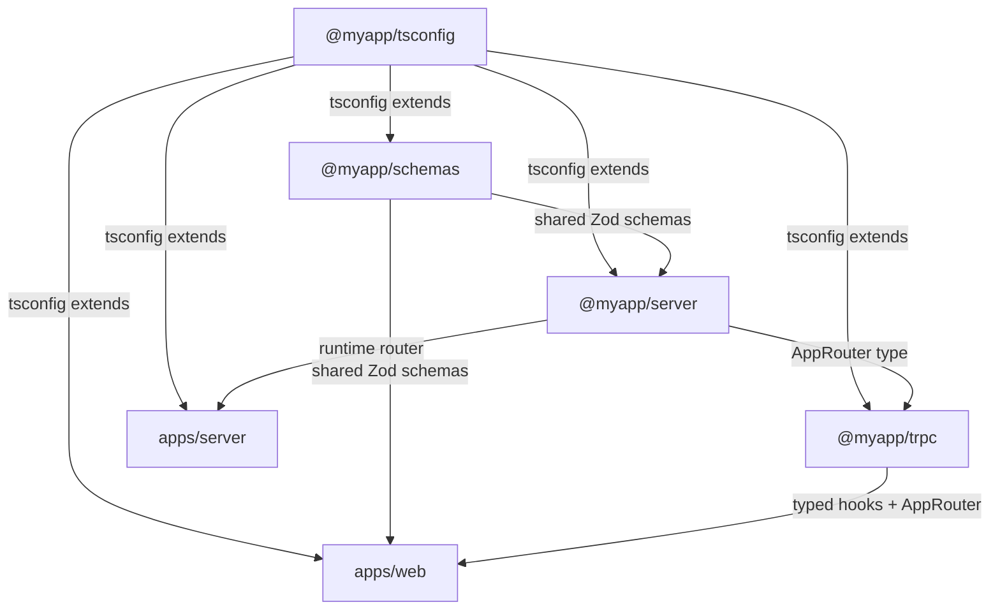

## tRPC in Turborepo

Turborepo is the most widely used monorepo build system in the tRPC ecosystem. It provides incremental builds, remote caching, and a task pipeline model that maps naturally onto the dependency relationships between a tRPC server, shared schema packages, and client applications. This topic covers the full setup — workspace structure, package configuration, TypeScript wiring, build pipelines, and development workflows — for running tRPC inside a Turborepo monorepo.

---

### What Turborepo Provides

Turborepo operates as a task runner layered on top of a package manager's workspace protocol (npm, yarn, or pnpm workspaces). It does not replace the package manager — it orchestrates tasks across packages defined by it.

For a tRPC monorepo, Turborepo provides:

- **Incremental builds** — only rebuilds packages whose inputs changed
- **Remote caching** — shares build artifacts across machines and CI runs
- **Task pipelines** — declares that `web#build` depends on `server#build`, so tasks run in correct order
- **Parallel execution** — independent tasks run concurrently
- **`turbo dev`** — runs all `dev` scripts in parallel with a unified log output

---

### Workspace Structure

A typical Turborepo + tRPC setup follows this layout:

```
my-app/
├── apps/
│   ├── web/                  ← Next.js or Vite frontend
│   └── server/               ← tRPC server (Express, Fastify, standalone)
├── packages/
│   ├── schemas/              ← Shared Zod schemas
│   ├── trpc/                 ← Shared tRPC client config and AppRouter type
│   └── tsconfig/             ← Shared TypeScript configs
├── turbo.json                ← Pipeline definitions
├── package.json              ← Workspace root
└── pnpm-workspace.yaml       ← (if using pnpm)
```

This structure separates concerns cleanly: apps are runnable targets, packages are shared building blocks.

---

### Root Package Configuration

**`package.json` (root)**

```json
{
  "name": "my-app",
  "private": true,
  "workspaces": ["apps/*", "packages/*"],
  "devDependencies": {
    "turbo": "^2.0.0"
  },
  "scripts": {
    "build": "turbo build",
    "dev": "turbo dev",
    "lint": "turbo lint",
    "type-check": "turbo type-check"
  }
}
```

**`pnpm-workspace.yaml`** (if using pnpm — preferred for Turborepo)

```yaml
packages:
  - "apps/*"
  - "packages/*"
```

**Key Points**

- `turbo` is installed at the root only — not in individual packages
- [Inference] pnpm is the most commonly used package manager with Turborepo in the tRPC community, primarily because its strict hoisting behavior avoids phantom dependency issues

---

### Shared TypeScript Config Package

A `packages/tsconfig` package centralizes TypeScript configuration to avoid drift between apps.

**`packages/tsconfig/base.json`**

```json
{
  "$schema": "https://json.schemastore.org/tsconfig",
  "compilerOptions": {
    "target": "ES2020",
    "lib": ["ES2020"],
    "module": "NodeNext",
    "moduleResolution": "NodeNext",
    "strict": true,
    "skipLibCheck": true,
    "esModuleInterop": true,
    "declaration": true,
    "declarationMap": true,
    "sourceMap": true
  },
  "exclude": ["node_modules"]
}
```

**`packages/tsconfig/nextjs.json`**

```json
{
  "$schema": "https://json.schemastore.org/tsconfig",
  "extends": "./base.json",
  "compilerOptions": {
    "target": "ES2017",
    "lib": ["dom", "dom.iterable", "ES2017"],
    "module": "ESNext",
    "moduleResolution": "Bundler",
    "jsx": "preserve",
    "allowJs": true,
    "incremental": true,
    "plugins": [{ "name": "next" }]
  }
}
```

**`packages/tsconfig/package.json`**

```json
{
  "name": "@myapp/tsconfig",
  "version": "0.0.0",
  "private": true,
  "exports": {}
}
```

---

### Shared Schemas Package

**`packages/schemas/package.json`**

```json
{
  "name": "@myapp/schemas",
  "version": "0.0.0",
  "private": true,
  "main": "./src/index.ts",
  "types": "./src/index.ts",
  "peerDependencies": {
    "zod": "^3.22.0"
  },
  "devDependencies": {
    "@myapp/tsconfig": "workspace:*"
  }
}
```

**`packages/schemas/tsconfig.json`**

```json
{
  "extends": "@myapp/tsconfig/base.json",
  "compilerOptions": {
    "outDir": "dist",
    "rootDir": "src"
  },
  "include": ["src"]
}
```

[Inference] The `workspace:*` version protocol is pnpm-specific. With npm or yarn workspaces, use `"*"` instead.

---

### Shared tRPC Package

This package re-exports `AppRouter` as a type and provides the configured tRPC client hooks.

**`packages/trpc/package.json`**

```json
{
  "name": "@myapp/trpc",
  "version": "0.0.0",
  "private": true,
  "main": "./src/index.ts",
  "types": "./src/index.ts",
  "dependencies": {
    "@myapp/server": "workspace:*"
  },
  "peerDependencies": {
    "@tanstack/react-query": "^5.0.0",
    "@trpc/client": "^11.0.0",
    "@trpc/react-query": "^11.0.0",
    "react": "^18.0.0"
  },
  "devDependencies": {
    "@myapp/tsconfig": "workspace:*"
  }
}
```

**`packages/trpc/src/index.ts`**

```ts
export type { AppRouter } from '@myapp/server';
export { createTRPCReact } from '@trpc/react-query';
export type { inferRouterInputs, inferRouterOutputs } from '@trpc/server';
```

---

### Server App

**`apps/server/package.json`**

```json
{
  "name": "@myapp/server",
  "version": "0.0.0",
  "private": true,
  "scripts": {
    "dev": "tsx watch src/index.ts",
    "build": "tsc",
    "start": "node dist/index.js",
    "type-check": "tsc --noEmit"
  },
  "dependencies": {
    "@myapp/schemas": "workspace:*",
    "@trpc/server": "^11.0.0",
    "zod": "^3.22.0"
  },
  "devDependencies": {
    "@myapp/tsconfig": "workspace:*",
    "tsx": "^4.0.0",
    "typescript": "^5.0.0"
  }
}
```

**`apps/server/tsconfig.json`**

```json
{
  "extends": "@myapp/tsconfig/base.json",
  "compilerOptions": {
    "outDir": "dist",
    "rootDir": "src"
  },
  "include": ["src"]
}
```

**`apps/server/src/router/index.ts`**

```ts
import { router } from '../trpc';
import { userRouter } from './user';
import { postRouter } from './post';

export const appRouter = router({
  user: userRouter,
  post: postRouter,
});

export type AppRouter = typeof appRouter;
```

---

### Web App (Next.js)

**`apps/web/package.json`**

```json
{
  "name": "@myapp/web",
  "version": "0.0.0",
  "private": true,
  "scripts": {
    "dev": "next dev",
    "build": "next build",
    "start": "next start",
    "type-check": "tsc --noEmit"
  },
  "dependencies": {
    "@myapp/schemas": "workspace:*",
    "@myapp/trpc": "workspace:*",
    "@tanstack/react-query": "^5.0.0",
    "@trpc/client": "^11.0.0",
    "@trpc/react-query": "^11.0.0",
    "next": "^14.0.0",
    "react": "^18.0.0",
    "zod": "^3.22.0"
  },
  "devDependencies": {
    "@myapp/tsconfig": "workspace:*",
    "typescript": "^5.0.0"
  }
}
```

**`apps/web/tsconfig.json`**

```json
{
  "extends": "@myapp/tsconfig/nextjs.json",
  "compilerOptions": {
    "outDir": "dist"
  },
  "include": ["src", "next-env.d.ts"],
  "exclude": ["node_modules"]
}
```

---

### turbo.json Pipeline Configuration

The pipeline is the heart of Turborepo. It declares task dependencies and caching behavior.

**`turbo.json`**

```json
{
  "$schema": "https://turbo.build/schema.json",
  "globalDependencies": ["**/.env.*local"],
  "tasks": {
    "build": {
      "dependsOn": ["^build"],
      "inputs": ["src/**", "tsconfig.json", "package.json"],
      "outputs": ["dist/**", ".next/**", "!.next/cache/**"]
    },
    "dev": {
      "cache": false,
      "persistent": true,
      "dependsOn": ["^build"]
    },
    "type-check": {
      "dependsOn": ["^build"],
      "inputs": ["src/**", "tsconfig.json"]
    },
    "lint": {
      "inputs": ["src/**", ".eslintrc*"]
    }
  }
}
```

**Key Points**

- `"dependsOn": ["^build"]` — the `^` prefix means "all packages this package depends on must finish their `build` task first"
- For `dev`, `"dependsOn": ["^build"]` means shared packages are built before dev servers start — important because `@myapp/server` must be built before `@myapp/trpc` can export its type
- `"cache": false` on `dev` prevents Turborepo from attempting to cache long-running watch processes
- `"persistent": true` marks dev tasks as long-running, allowing Turborepo to manage them correctly in v2+
- `outputs` tells Turborepo what to cache and restore — `.next/cache/**` is excluded to avoid caching Next.js's own incremental build cache on top of Turborepo's

---

### Development Workflow

With the pipeline configured, running `turbo dev` from the root starts all apps:

```bash
pnpm turbo dev
# or
npx turbo dev
```

**What happens in order:**

1. `@myapp/tsconfig` — no build needed (JSON only)
2. `@myapp/schemas` — built first (no local dependencies)
3. `@myapp/server` — built after schemas
4. `@myapp/trpc` — built after server (depends on `AppRouter` type)
5. `apps/web` and `apps/server` — dev servers start in parallel

[Inference] In practice, when using TypeScript source files directly (pointing `main` to `.ts` files), the "build" step for packages may just be a type-check rather than a full emit. This varies by setup.

---

### Filtering Tasks to Specific Apps

Turborepo allows running tasks for a specific app and its dependencies only:

```bash
# Run dev for the web app and all its dependencies
turbo dev --filter=@myapp/web

# Build only the server and its dependencies
turbo build --filter=@myapp/server

# Run type-check only on packages that have changed since main
turbo type-check --filter=...[origin/main]
```

The `--filter` flag is particularly useful in CI to avoid rebuilding unaffected packages.

---

### Remote Caching

Turborepo's remote cache stores task outputs (build artifacts, type-check results) in a shared store. On CI, a cache hit means skipping the task entirely.

```bash
# Authenticate with Vercel Remote Cache (free for Vercel users)
npx turbo login
npx turbo link

# Or self-host with an S3-compatible store
# turbo.json
```

```json
{
  "remoteCache": {
    "signature": true
  }
}
```

Set `TURBO_TOKEN` and `TURBO_TEAM` environment variables in CI to activate remote caching automatically.

**Key Points**

- [Inference] Remote caching provides the largest speedup on CI where clean installs are common
- Cache keys are computed from task inputs — source files, environment variables listed in `globalDependencies`, and `turbo.json` itself
- Changing a shared schema file invalidates the cache for all downstream packages automatically

---

### Package Dependency Graph



---

### Common Issues and Fixes

#### `AppRouter` resolves as `any` in the web app

The `@myapp/trpc` or `@myapp/server` package has not been built yet when the web app's TypeScript server starts. Run `turbo build --filter=@myapp/trpc...` before opening the editor, or configure `dev` to depend on `^build`.

#### Stale types after a procedure change

TypeScript language servers cache module resolution. After changing a tRPC procedure, restart the TS server in your editor (`TypeScript: Restart TS Server` in VS Code).

#### Multiple Zod instances

Run `pnpm why zod` or `npm ls zod` to check for duplicate instances. Move Zod to the root `package.json` and make it a `peerDependency` in all packages.

#### `workspace:*` not resolving

This protocol requires pnpm. With npm workspaces, use `"*"`. With yarn workspaces, use `"workspace:*"` only if on Yarn Berry (v2+).

#### `turbo dev` exits immediately

Missing `"persistent": true` on the `dev` task in `turbo.json` (required in Turborepo v2+). Without it, Turborepo may treat the task as completed when it first emits output.

---

### Environment Variables in Turborepo

Environment variables that affect build output must be declared in `turbo.json` so they are included in cache key computation.

```json
{
  "tasks": {
    "build": {
      "dependsOn": ["^build"],
      "env": [
        "NEXT_PUBLIC_API_URL",
        "NODE_ENV"
      ],
      "outputs": ["dist/**", ".next/**"]
    }
  }
}
```

[Inference] Undeclared environment variables that affect build output will cause incorrect cache hits — a build cached with one `API_URL` value will be served when a different `API_URL` is expected.

---

**Conclusion**

Turborepo provides a well-suited build orchestration layer for tRPC monorepos. The `turbo.json` pipeline, combined with workspace-linked packages and a shared `@myapp/tsconfig`, gives a reproducible, incrementally-built project where type safety flows correctly from `@myapp/schemas` through `@myapp/server` to the client. The most important configuration details are the `^build` dependency chain, correct `persistent` flags on dev tasks, and Zod deduplication. Remote caching becomes especially valuable once the monorepo grows beyond three or four packages.

---

**Related Topics**

- Turborepo with Next.js App Router and tRPC route handlers
- Setting up Changesets in a Turborepo for versioning shared packages
- Nx as an alternative to Turborepo for tRPC monorepos
- Docker and Turborepo — pruning the monorepo for containerized tRPC deployments
- Turborepo remote caching with a self-hosted cache server (ducktape, Nx Cloud alternatives)
- Environment variable management across Turborepo apps with `@t3-oss/env-core`