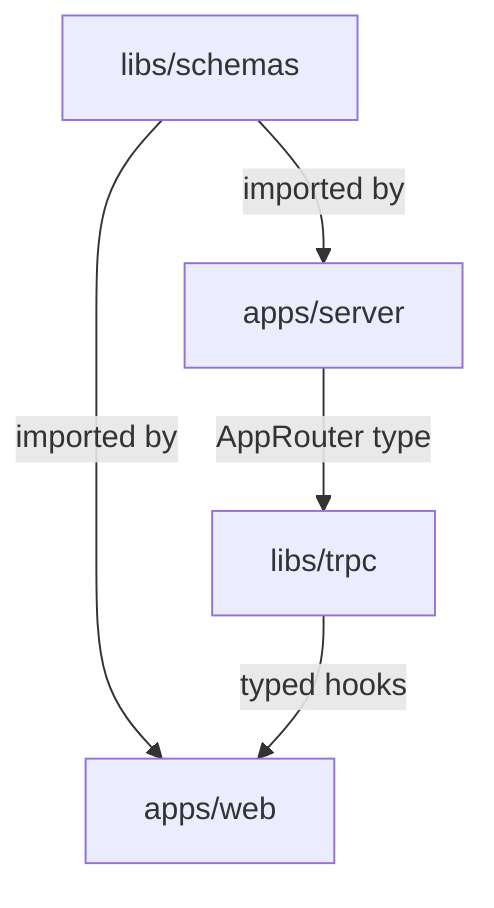

## tRPC in Nx Workspaces

Nx is a feature-rich monorepo build system with a different philosophy from Turborepo. Where Turborepo is a lightweight task runner, Nx provides a full workspace management layer: code generators, enforced module boundaries, project graph analysis, distributed task execution, and first-class support for multiple frameworks. Integrating tRPC into an Nx workspace requires understanding how Nx models projects, enforces boundaries, and wires TypeScript paths — all of which interact directly with how `AppRouter` types and shared Zod schemas are structured.

---

### Nx vs. Turborepo for tRPC — Key Differences

| Concern | Turborepo | Nx |
|---|---|---|
| Task orchestration | `turbo.json` pipelines | `project.json` targets + `nx.json` |
| Code generation | None built-in | Generators (`nx generate`) |
| Module boundary enforcement | None | `@nx/enforce-module-boundaries` ESLint rule |
| Project graph | Implicit from `package.json` deps | Explicit + inferred from imports |
| TypeScript paths | Manual `tsconfig.json` `paths` | Auto-managed via `tsconfig.base.json` |
| Remote caching | Vercel Remote Cache | Nx Cloud (or self-hosted) |
| Package structure | Always separate `package.json` per package | Can use either integrated or package-based repo style |

---

### Workspace Styles: Integrated vs. Package-Based

Nx supports two structural styles, and the choice affects how tRPC packages are wired.

#### Integrated Repo (Nx-native)

Libraries do not have their own `package.json`. They are TypeScript source folders referenced entirely through `tsconfig.base.json` path aliases. There is a single `node_modules` at the root. This is the Nx default and the style most Nx documentation assumes.

```
my-app/
├── apps/
│   ├── web/
│   └── server/
├── libs/
│   ├── schemas/
│   ├── trpc/
│   └── tsconfig/          ← not needed; Nx manages tsconfig centrally
├── nx.json
├── tsconfig.base.json     ← Nx manages path aliases here
└── package.json
```

#### Package-Based Repo (npm workspaces style)

Each library has its own `package.json`. This mirrors the Turborepo pattern. Nx can manage this style too, but with less automation.

[Inference] For tRPC projects starting fresh with Nx, the integrated repo style is generally the more idiomatic choice and benefits more from Nx's generators and module boundary tooling.

---

### Initial Nx Workspace Setup

```bash
# Create a new Nx workspace
npx create-nx-workspace@latest my-app --preset=ts

cd my-app

# Install tRPC and related packages at the root
npm install @trpc/server @trpc/client @trpc/react-query @tanstack/react-query zod
```

If adding Next.js as the web app:

```bash
npm install --save-dev @nx/next @nx/node
nx generate @nx/next:app apps/web
nx generate @nx/node:app apps/server
```

---

### Generating Shared Libraries

Nx generators scaffold the correct file structure, update `tsconfig.base.json` path aliases, and register the project in the workspace graph automatically.

```bash
# Shared Zod schemas library
nx generate @nx/js:library libs/schemas --unitTestRunner=none --bundler=tsc

# Shared tRPC client config library
nx generate @nx/js:library libs/trpc --unitTestRunner=none --bundler=tsc
```

After generation, `tsconfig.base.json` is updated automatically:

**`tsconfig.base.json`** (root, managed by Nx)

```json
{
  "compilerOptions": {
    "baseUrl": ".",
    "paths": {
      "@myapp/schemas": ["libs/schemas/src/index.ts"],
      "@myapp/trpc": ["libs/trpc/src/index.ts"]
    }
  }
}
```

**Key Points**

- Nx path aliases point directly to TypeScript source files — no build step is required for type resolution in an integrated repo
- All apps extend `tsconfig.base.json` and inherit these paths automatically
- Manual edits to `tsconfig.base.json` paths are valid but will be overwritten if the library is regenerated

---

### Project Configuration: project.json

Each app and library in an Nx workspace has a `project.json` that defines its build targets. This is the Nx equivalent of Turborepo's per-package `scripts`.

**`apps/server/project.json`**

```json
{
  "name": "server",
  "$schema": "../../node_modules/nx/schemas/project-schema.json",
  "sourceRoot": "apps/server/src",
  "projectType": "application",
  "targets": {
    "build": {
      "executor": "@nx/js:tsc",
      "outputs": ["{options.outputPath}"],
      "options": {
        "outputPath": "dist/apps/server",
        "main": "apps/server/src/main.ts",
        "tsConfig": "apps/server/tsconfig.app.json",
        "assets": []
      }
    },
    "serve": {
      "executor": "@nx/js:node",
      "options": {
        "buildTarget": "server:build",
        "watch": true
      }
    },
    "type-check": {
      "executor": "nx:run-commands",
      "options": {
        "command": "tsc --noEmit -p apps/server/tsconfig.app.json"
      }
    }
  }
}
```

**`apps/web/project.json`** (Next.js)

```json
{
  "name": "web",
  "$schema": "../../node_modules/nx/schemas/project-schema.json",
  "sourceRoot": "apps/web",
  "projectType": "application",
  "targets": {
    "build": {
      "executor": "@nx/next:build",
      "outputs": ["{options.outputPath}"],
      "options": {
        "outputPath": "dist/apps/web"
      }
    },
    "serve": {
      "executor": "@nx/next:server",
      "options": {
        "buildTarget": "web:build",
        "dev": true
      }
    }
  }
}
```

---

### nx.json — Global Task Configuration

`nx.json` defines global defaults for caching, task dependencies, and affected detection. It is the Nx counterpart to `turbo.json`.

**`nx.json`**

```json
{
  "$schema": "./node_modules/nx/schemas/nx-schema.json",
  "defaultBase": "main",
  "namedInputs": {
    "default": ["{projectRoot}/**/*", "sharedGlobals"],
    "sharedGlobals": ["{workspaceRoot}/tsconfig.base.json"],
    "production": [
      "default",
      "!{projectRoot}/**/*.spec.ts",
      "!{projectRoot}/tsconfig.spec.json"
    ]
  },
  "targetDefaults": {
    "build": {
      "dependsOn": ["^build"],
      "inputs": ["production", "^production"],
      "cache": true
    },
    "serve": {
      "dependsOn": ["^build"],
      "cache": false
    },
    "type-check": {
      "dependsOn": ["^build"],
      "cache": true
    },
    "lint": {
      "inputs": ["default"],
      "cache": true
    }
  }
}
```

**Key Points**

- `"dependsOn": ["^build"]` mirrors Turborepo's `^build` — upstream packages build first
- `namedInputs` allow reusing input sets across targets — `sharedGlobals` includes `tsconfig.base.json` so any path alias change invalidates all caches
- `cache: true` is the default for build tasks; it must be explicitly set to `false` for long-running `serve` tasks

---

### Schemas Library Implementation

**`libs/schemas/src/user.ts`**

```ts
import { z } from 'zod';

export const createUserSchema = z.object({
  username: z.string().min(3).max(32),
  email: z.string().email(),
  password: z.string().min(8),
});

export const userIdSchema = z.object({
  id: z.string().uuid(),
});

export type CreateUserInput = z.infer<typeof createUserSchema>;
export type UserIdInput = z.infer<typeof userIdSchema>;
```

**`libs/schemas/src/index.ts`**

```ts
export * from './user';
export * from './post';
```

No `package.json` is needed in an integrated Nx repo. The library is resolved entirely via the `tsconfig.base.json` path alias `@myapp/schemas`.

---

### Server App: tRPC Router

**`apps/server/src/trpc.ts`**

```ts
import { initTRPC } from '@trpc/server';

const t = initTRPC.create();

export const router = t.router;
export const publicProcedure = t.procedure;
```

**`apps/server/src/router/user.ts`**

```ts
import { router, publicProcedure } from '../trpc';
import { createUserSchema, userIdSchema } from '@myapp/schemas';

export const userRouter = router({
  create: publicProcedure
    .input(createUserSchema)
    .mutation(async ({ input }) => {
      // input typed as CreateUserInput
      return { id: crypto.randomUUID(), ...input };
    }),

  getById: publicProcedure
    .input(userIdSchema)
    .query(async ({ input }) => {
      return { id: input.id, username: 'example' };
    }),
});
```

**`apps/server/src/router/index.ts`**

```ts
import { router } from '../trpc';
import { userRouter } from './user';

export const appRouter = router({
  user: userRouter,
});

export type AppRouter = typeof appRouter;
```

---

### Shared tRPC Library

**`libs/trpc/src/index.ts`**

```ts
// Type-only re-export of AppRouter — never imports runtime server code
export type { AppRouter } from '../../apps/server/src/router/index';
export { createTRPCReact } from '@trpc/react-query';
export type { inferRouterInputs, inferRouterOutputs } from '@trpc/server';
```

[Inference] In an integrated Nx repo, relative imports across project boundaries work but are discouraged. The idiomatic approach is to add `@myapp/server` as a path alias in `tsconfig.base.json` pointing to the server router's type export file, then import via that alias.

**Preferred approach — add the server router as a path alias:**

```json
// tsconfig.base.json
{
  "compilerOptions": {
    "paths": {
      "@myapp/schemas": ["libs/schemas/src/index.ts"],
      "@myapp/trpc": ["libs/trpc/src/index.ts"],
      "@myapp/server": ["apps/server/src/router/index.ts"]
    }
  }
}
```

```ts
// libs/trpc/src/index.ts
export type { AppRouter } from '@myapp/server';
export { createTRPCReact } from '@trpc/react-query';
```

---

### Web App: tRPC Client Setup

**`apps/web/src/lib/trpc.ts`**

```ts
import { createTRPCReact } from '@myapp/trpc';
import type { AppRouter } from '@myapp/trpc';

export const trpc = createTRPCReact<AppRouter>();
```

**`apps/web/src/app/providers.tsx`** (Next.js App Router)

```tsx
'use client';

import { useState } from 'react';
import { QueryClient, QueryClientProvider } from '@tanstack/react-query';
import { httpBatchLink } from '@trpc/client';
import { trpc } from '../lib/trpc';

export function Providers({ children }: { children: React.ReactNode }) {
  const [queryClient] = useState(() => new QueryClient());
  const [trpcClient] = useState(() =>
    trpc.createClient({
      links: [httpBatchLink({ url: 'http://localhost:3001/trpc' })],
    })
  );

  return (
    <trpc.Provider client={trpcClient} queryClient={queryClient}>
      <QueryClientProvider client={queryClient}>
        {children}
      </QueryClientProvider>
    </trpc.Provider>
  );
}
```

---

### Module Boundary Enforcement

Nx's most distinctive feature for monorepo architecture is the `@nx/enforce-module-boundaries` ESLint rule. It prevents imports that violate declared architectural layers.

#### Tagging Projects

Each project is tagged in its `project.json`:

```json
// apps/web/project.json
{ "tags": ["scope:web", "type:app"] }

// apps/server/project.json
{ "tags": ["scope:server", "type:app"] }

// libs/schemas/project.json
{ "tags": ["scope:shared", "type:lib"] }

// libs/trpc/project.json
{ "tags": ["scope:shared", "type:lib"] }
```

#### Boundary Rules

```json
// .eslintrc.json (root)
{
  "rules": {
    "@nx/enforce-module-boundaries": [
      "error",
      {
        "enforceBuildableLibDependency": true,
        "allow": [],
        "depConstraints": [
          {
            "sourceTag": "scope:web",
            "onlyDependOn": ["scope:shared"]
          },
          {
            "sourceTag": "scope:server",
            "onlyDependOn": ["scope:shared"]
          },
          {
            "sourceTag": "scope:shared",
            "onlyDependOn": ["scope:shared"]
          },
          {
            "sourceTag": "type:app",
            "onlyDependOn": ["type:lib"]
          }
        ]
      }
    ]
  }
}
```

**Key Points**

- The boundary rule statically prevents the web app from importing directly from the server app at the source level
- `AppRouter` must flow through `libs/trpc` — a direct import from `apps/server` in the web app would fail the lint rule
- This enforces at the tooling level what `import type` enforces at the runtime level — both protections are complementary
- [Inference] Running `nx lint web` will catch boundary violations before they reach CI

---

### Nx Project Graph

Nx computes a project graph from actual import analysis. Visualizing it helps verify the dependency structure is correct.

```bash
nx graph
```

This opens a browser-based interactive graph showing all projects and their dependency edges. For a tRPC workspace it should show:



If an unexpected edge appears (e.g., `web → server` directly), it indicates a boundary violation.

---

### Affected Commands

Nx's `affected` commands run tasks only for projects impacted by changes since a base commit. This is critical for CI performance in large workspaces.

```bash
# Only build projects affected by changes since main
nx affected --target=build --base=main --head=HEAD

# Only type-check affected projects
nx affected --target=type-check --base=main

# See which projects are affected without running anything
nx show projects --affected --base=main
```

**Key Points**

- Changing `libs/schemas` marks both `apps/server` and `apps/web` as affected
- Changing only `apps/web` does not affect `apps/server`
- [Inference] Affected analysis is more granular than Turborepo's filter-by-changed because Nx understands the full import graph, not just `package.json` dependencies

---

### Running the Full Dev Environment

```bash
# Run all serve targets in parallel
nx run-many --target=serve --all

# Or run specific apps
nx serve server
nx serve web

# Run both concurrently (Nx handles the ^build dependency order)
nx run-many --target=serve --projects=server,web
```

---

### Nx Cloud Remote Caching

```bash
# Connect to Nx Cloud (free tier available)
npx nx connect
```

This adds an `nxCloudId` to `nx.json`. CI runs automatically use the remote cache without additional configuration. A cache hit skips the task entirely and replays its terminal output.

For self-hosted caching, Nx supports a custom remote cache runner via `nx-remotecache-s3`, `nx-remotecache-azure`, or similar community packages. [Unverified — availability and compatibility may vary by Nx version]

---

### Comparing Nx and Turborepo for tRPC Projects

| Factor | Nx | Turborepo |
|---|---|---|
| Setup complexity | Higher — more concepts | Lower — just `turbo.json` |
| Module boundary enforcement | Built-in ESLint rule | Not provided |
| Code generation | Full generator system | Not provided |
| Project graph visualization | `nx graph` built-in | Not provided |
| TypeScript path management | Auto-updated by generators | Manual |
| Affected analysis | Import-graph aware | Package-dependency aware |
| Remote caching | Nx Cloud or self-hosted | Vercel Remote Cache or self-hosted |
| Best fit | Large teams, strict architecture | Smaller teams, simpler setups |

---

**Conclusion**

Nx provides a more structured and enforced environment for tRPC monorepos than Turborepo. The integrated repo style eliminates per-package `package.json` files and lets Nx manage TypeScript path aliases automatically. The `@nx/enforce-module-boundaries` rule gives architectural guarantees that `import type` alone cannot — the web app physically cannot import server runtime code because the lint rule blocks it at the source level. The tradeoff is higher initial complexity: more configuration files, more concepts to internalize, and a steeper generator learning curve. For teams that need enforced boundaries and a growing number of apps sharing tRPC types, the investment pays off.

---

**Related Topics**

- Nx generators for scaffolding new tRPC routers and procedures automatically
- Using Nx with Next.js App Router and tRPC route handlers
- Buildable vs. non-buildable libraries in Nx — when to compile shared tRPC libs
- Nx module federation with tRPC — micro-frontend architecture
- Migrating a Turborepo tRPC project to Nx
- Nx task pipelines with Docker — pruning and containerizing tRPC server apps
- `@nx/storybook` and tRPC — testing UI components with mocked tRPC context