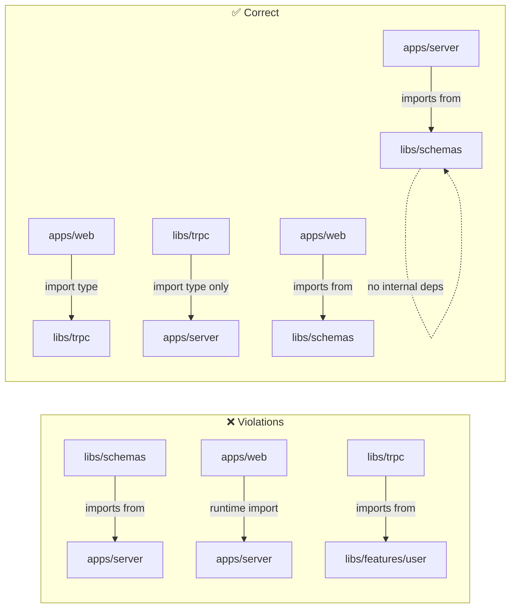

## Package Boundary Conventions

Package boundaries define which code is allowed to depend on which other code. In a tRPC monorepo, boundaries are not merely organizational preferences — they directly determine whether server-only code leaks into client bundles, whether type safety holds across packages, and whether the dependency graph remains acyclic and comprehensible as the codebase grows. This topic covers the conventions, enforcement mechanisms, and practical patterns for maintaining clean package boundaries in a tRPC workspace.

---

### Why Boundaries Matter in a tRPC Monorepo

tRPC's type inference works precisely because the client imports the `AppRouter` type from the server. This creates a deliberate, one-directional dependency. Left unmanaged, additional cross-package imports accumulate over time and produce problems that are difficult to diagnose:

- Server-only modules (database clients, secret loaders, filesystem access) pulled into client bundles
- Circular dependencies between packages that break TypeScript's project references and bundler resolution
- Shared packages that silently import framework-specific code, breaking reuse across apps
- Refactoring paralysis — changes in one package ripple unpredictably into others

Boundary conventions make the intended dependency graph explicit and enforceable.

---

### The Fundamental Dependency Rule

The core invariant for a tRPC monorepo is:

> **Dependencies flow in one direction: apps depend on libs, libs depend on other libs, nothing depends on apps.**

```
apps/web       ──►  libs/trpc
apps/server    ──►  libs/schemas
libs/trpc      ──►  libs/schemas
libs/trpc      ──►  apps/server   (type-only, AppRouter)
```

The one apparent exception — `libs/trpc` importing `AppRouter` from `apps/server` — is type-only and carries no runtime dependency. At build time, the server bundle does not include anything from `libs/trpc`, and the client bundle does not include anything from `apps/server`. TypeScript's `import type` is the mechanism that makes this safe.

---

### Layer Model

A useful mental model assigns every package to a layer. Imports are only permitted downward through the layers.

```mermaid
graph TD
  subgraph Layer 4 — Applications
    WEB["apps/web"]
    SRV["apps/server"]
  end

  subgraph Layer 3 — Feature Libraries
    FEAT["libs/features/*\n(domain-specific logic)"]
  end

  subgraph Layer 2 — Shared Utilities
    TRPC["libs/trpc\n(client config, AppRouter type)"]
    UI["libs/ui\n(shared components)"]
  end

  subgraph Layer 1 — Foundations
    SCH["libs/schemas\n(Zod schemas, inferred types)"]
    UTIL["libs/utils\n(pure helpers)"]
  end

  WEB --> FEAT
  WEB --> TRPC
  WEB --> UI
  SRV --> FEAT
  SRV --> SCH
  FEAT --> TRPC
  FEAT --> SCH
  TRPC --> SCH
  UI --> SCH
```

**Key Points**

- Layer 1 packages have no internal dependencies — they import only from `node_modules`
- Layer 2 packages depend only on Layer 1
- Layer 3 feature libraries depend on Layers 1 and 2
- Layer 4 applications depend on everything below but are never imported by anything else
- [Inference] Violations almost always flow upward — a lib importing from an app, or a foundation package importing from a feature library

---

### Classifying tRPC-Specific Packages

| Package | Layer | Allowed Dependencies | Forbidden Dependencies |
|---|---|---|---|
| `libs/schemas` | Foundation | `zod`, `node_modules` only | Anything internal |
| `libs/utils` | Foundation | `node_modules` only | Anything internal |
| `libs/trpc` | Shared | `libs/schemas`, `@trpc/*`, `AppRouter` type from server | Server runtime, DB clients |
| `libs/ui` | Shared | `libs/schemas`, `libs/utils`, React | Server runtime, tRPC client |
| `libs/features/*` | Feature | Layers 1–2 | Other feature libs (ideally), apps |
| `apps/server` | Application | All libs, DB clients, server frameworks | `apps/web`, `libs/ui` |
| `apps/web` | Application | All libs, client frameworks | `apps/server` runtime, DB clients |

---

### Type-Only vs. Runtime Boundaries

Two distinct boundary types exist in a tRPC monorepo and must be managed separately.

#### Runtime Boundary

Prevents server-only code from entering the client bundle. Enforced by:

- `import type` — TypeScript erases type imports at compile time; no runtime artifact is emitted
- Bundler tree-shaking — but this is unreliable as a primary mechanism
- Package entry point splitting — separate `types` and `main` export fields in `package.json`

#### Architectural Boundary

Prevents imports that violate the layer model, regardless of whether they are type-only or runtime. Enforced by:

- Nx `@nx/enforce-module-boundaries` ESLint rule
- Custom ESLint `no-restricted-imports` rules
- Code review conventions (weakest — relies on humans)

Both boundaries serve different purposes and should both be active. A type-only import can still violate an architectural boundary.

---

### Enforcing Boundaries with ESLint no-restricted-imports

In a Turborepo or any workspace without Nx, `no-restricted-imports` provides manual boundary enforcement.

**`apps/web/.eslintrc.json`**

```json
{
  "rules": {
    "no-restricted-imports": [
      "error",
      {
        "patterns": [
          {
            "group": ["@myapp/server", "apps/server/*"],
            "message": "Import AppRouter via @myapp/trpc only. Never import server runtime code into the client."
          },
          {
            "group": ["@prisma/client", "drizzle-orm", "pg", "mysql2"],
            "message": "Database clients must not be imported in client-side code."
          },
          {
            "group": ["fs", "path", "crypto", "os", "child_process"],
            "message": "Node.js built-in modules are not available in the browser bundle."
          }
        ]
      }
    ]
  }
}
```

**`apps/server/.eslintrc.json`**

```json
{
  "rules": {
    "no-restricted-imports": [
      "error",
      {
        "patterns": [
          {
            "group": ["@myapp/web", "apps/web/*"],
            "message": "Server must not import from the web app."
          },
          {
            "group": ["react", "react-dom", "@tanstack/react-query"],
            "message": "React and client-side libraries must not be imported in server code."
          }
        ]
      }
    ]
  }
}
```

---

### Enforcing Boundaries with Nx Tags

As covered in the Nx topic, tags applied in `project.json` combine with `depConstraints` in the ESLint config to produce declarative, checked boundaries.

```json
// libs/schemas/project.json
{ "tags": ["scope:shared", "type:lib", "layer:foundation"] }

// libs/trpc/project.json
{ "tags": ["scope:shared", "type:lib", "layer:utility"] }

// apps/server/project.json
{ "tags": ["scope:server", "type:app", "layer:application"] }

// apps/web/project.json
{ "tags": ["scope:web", "type:app", "layer:application"] }
```

```json
// .eslintrc.json
{
  "rules": {
    "@nx/enforce-module-boundaries": [
      "error",
      {
        "depConstraints": [
          {
            "sourceTag": "layer:application",
            "onlyDependOn": ["layer:utility", "layer:foundation", "layer:feature"]
          },
          {
            "sourceTag": "layer:feature",
            "onlyDependOn": ["layer:utility", "layer:foundation"]
          },
          {
            "sourceTag": "layer:utility",
            "onlyDependOn": ["layer:foundation"]
          },
          {
            "sourceTag": "layer:foundation",
            "onlyDependOn": []
          },
          {
            "sourceTag": "scope:web",
            "notDependOn": ["scope:server"]
          }
        ]
      }
    ]
  }
}
```

**Key Points**

- `notDependOn` provides negative constraints — the web scope can never import from the server scope even within a permitted layer
- Multiple tags can be combined — `scope` and `layer` serve orthogonal purposes
- [Inference] Tag violations are caught by `nx lint` and in editor ESLint integration without needing to run a build

---

### Barrel File Conventions

Barrel files (`index.ts`) at package entry points are the primary mechanism for declaring what a package publicly exports. Anything not re-exported from `index.ts` is considered internal.

#### Public API Pattern

```ts
// libs/schemas/src/index.ts — explicit public surface
export { createUserSchema, updateUserSchema, userIdSchema } from './user';
export type { CreateUserInput, UpdateUserInput, UserIdInput } from './user';
export { createPostSchema, paginationSchema } from './post';
export type { CreatePostInput, PaginationInput } from './post';

// Internal implementation detail — not exported
// export { _buildWhereClause } from './internal/query-builder';
```

**Key Points**

- Exporting everything with `export * from` is convenient but makes the public API implicit — any internal helper becomes accessible to consumers
- Explicit named exports document intent and make breaking changes visible
- [Inference] In large packages, a separate `internal/` directory with a convention of never importing from it outside the package communicates the boundary even without tooling enforcement

---

### Avoiding Circular Dependencies

Circular dependencies between packages are not always caught immediately but cause build failures and unpredictable type resolution. In a tRPC monorepo the most common source is a schemas package trying to import types from the trpc package, which itself imports from schemas.

```
libs/schemas → libs/trpc → libs/schemas   ← circular
```

**Detection:**

```bash
# Using madge
npx madge --circular --extensions ts apps/server/src
npx madge --circular --extensions ts apps/web/src

# Using Nx
nx graph  # visually reveals cycles
```

**Resolution strategies:**

- Move the shared type that both packages need into a lower-layer package
- Split a package that has grown to serve two concerns into two packages
- Use `import type` where possible — TypeScript's `--isolatedModules` flag surfaces implicit value imports that may be causing cycles [Inference]

---

### Server-Only Code Patterns

Some code is inherently server-only: database clients, environment secret access, file system operations, and crypto key material. These should be isolated in clearly named files or directories.

#### Naming Convention

```
apps/server/src/
├── db/              ← database client — never import outside server
├── env.ts           ← server environment validation (secret keys)
├── router/          ← tRPC router definitions
└── middleware/      ← tRPC middleware
```

#### Next.js Server-Only Package

In a Next.js app with both server and client components, the `server-only` package provides a runtime guard against accidental client imports:

```ts
// apps/web/src/lib/db.ts
import 'server-only';  // throws at bundle time if imported in a client component
import { PrismaClient } from '@prisma/client';

export const db = new PrismaClient();
```

```bash
npm install server-only
```

[Inference] This is primarily useful in Next.js App Router where the same app contains both server and client components. In a standalone tRPC server app, the boundary is enforced by the package structure itself.

---

### Package Entry Point Splitting

For packages that contain both type exports and runtime code, splitting entry points prevents consumers from accidentally importing runtime code when they only need types.

**`apps/server/package.json`** (package-based repo style)

```json
{
  "name": "@myapp/server",
  "exports": {
    ".": {
      "types": "./src/router/index.ts",
      "default": "./dist/router/index.js"
    },
    "./types": {
      "types": "./src/router/types.ts"
    }
  }
}
```

**`apps/server/src/router/types.ts`** — type-only file, safe to import from anywhere

```ts
export type { AppRouter } from './index';
```

Consumers that only need the type import from the `/types` entry:

```ts
import type { AppRouter } from '@myapp/server/types';
```

This makes the intent explicit in the import path itself.

---

### Dependency Direction Visualization



---

### Boundary Checklist for New Packages

When adding a new package to a tRPC monorepo, apply this checklist:

- [ ] Assigned to a layer (foundation / utility / feature / application)
- [ ] Tagged appropriately in `project.json` (Nx) or documented in a conventions file
- [ ] `index.ts` explicitly exports only the intended public API
- [ ] No imports from a higher layer or sibling app
- [ ] No server-only modules if the package is consumed by the client
- [ ] Zod is a `peerDependency` if the package uses Zod schemas
- [ ] `import type` used for all cross-package type imports
- [ ] Added to ESLint boundary rules if using `no-restricted-imports`
- [ ] Verified with `nx graph` or `madge` that no new cycles were introduced

---

### Convention Documentation

Tooling catches violations but does not explain intent. A short conventions document in the repository root communicates the reasoning to new contributors.

**`ARCHITECTURE.md` (excerpt)**

```markdown
## Package Boundaries

Dependencies flow downward through layers only:
  application → feature → utility → foundation

### Rules
- `apps/*` may import from `libs/*` but never from other `apps/*`
- `libs/schemas` has no internal dependencies — Zod only
- `libs/trpc` re-exports AppRouter as a type — never the runtime router
- Server-only code (DB, secrets) lives in `apps/server` and is never imported
  by `apps/web` or any `libs/*` package
- All cross-package type imports use `import type`

### Enforcement
- Nx `@nx/enforce-module-boundaries` — runs on `nx lint`
- `no-restricted-imports` in per-package `.eslintrc.json`
- `madge --circular` in CI pre-merge check
```

---

**Conclusion**

Package boundary conventions in a tRPC monorepo are not bureaucratic overhead — they are the structural guarantee that type safety remains coherent and server code stays out of client bundles. The layer model provides a simple mental framework: dependencies flow downward, nothing imports from apps, and foundation packages remain pure. Tooling (Nx boundary rules or custom ESLint rules) turns these conventions from guidelines into compile-time and lint-time errors. Combined with explicit barrel exports and `import type` discipline, well-maintained boundaries make the monorepo scale predictably as more procedures, routers, and apps are added.

---

**Related Topics**

- Nx buildable libraries — when to emit compiled output vs. source-only libraries
- Dependency cruiser as an alternative to Nx for boundary enforcement in Turborepo
- Versioning internal packages — when to publish shared libs to a private registry
- Feature flags across package boundaries in a tRPC monorepo
- Micro-frontend architecture with tRPC — Module Federation and boundary implications
- Circular dependency resolution strategies in TypeScript monorepos