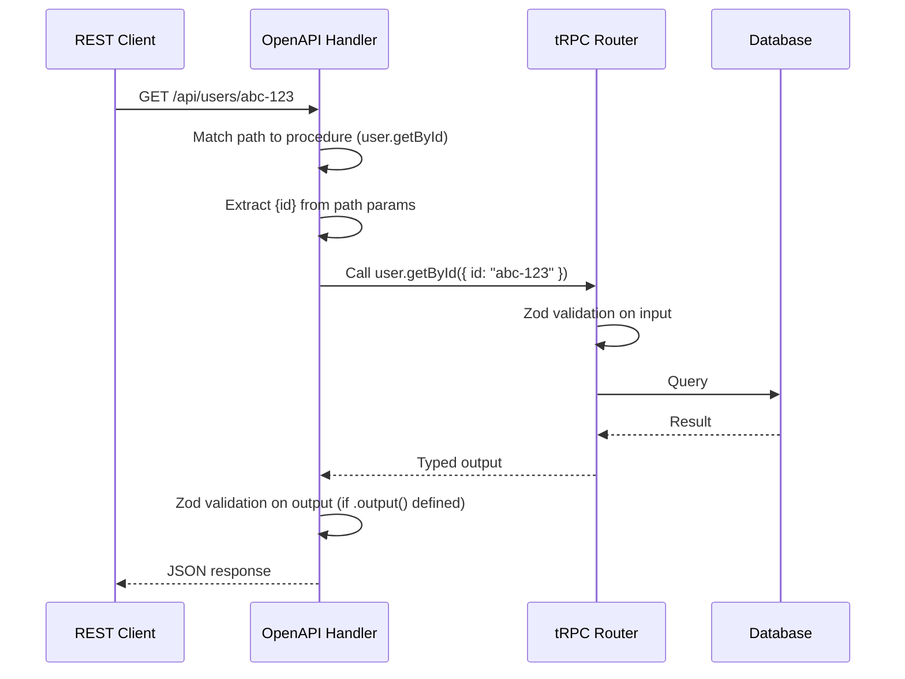

## trpc-openapi

`trpc-openapi` is a community library that generates OpenAPI 3.0-compatible HTTP endpoints from tRPC procedures and produces an OpenAPI specification document from the router definition. It bridges tRPC's type-safe RPC model with the REST+OpenAPI ecosystem — enabling REST clients, Swagger UI, code generators, and API gateways to consume a tRPC backend without any TypeScript.

---

### What trpc-openapi Solves

Standard tRPC procedures are accessed via a custom HTTP protocol: batched POST requests to `/trpc/[procedure]` with JSON bodies. This works perfectly for TypeScript clients but is opaque to:

- REST clients in other languages
- API documentation tools (Swagger UI, Redoc)
- API gateways and proxies that expect OpenAPI contracts
- Third-party integrations that cannot use the tRPC client

`trpc-openapi` adds a second HTTP layer on top of the existing tRPC router. The same procedures that serve tRPC clients also serve REST clients via conventional HTTP methods and paths, with a generated OpenAPI 3.0 document describing the full API surface.

---

### Installation

```bash
npm install trpc-openapi
# or
pnpm add trpc-openapi
```

`trpc-openapi` requires `@trpc/server` v10 or v11 and `zod` as peer dependencies. The OpenAPI document generation depends on Zod schemas — procedures without Zod input schemas will produce incomplete specification entries. [Inference]

---

### Core Concepts

#### OpenAPI Meta on Procedures

Each procedure that should be exposed as a REST endpoint is annotated with `.meta()` containing an `openapi` object:

```ts
procedure
  .meta({
    openapi: {
      method: 'GET',       // HTTP method
      path: '/users/{id}', // OpenAPI path with parameters
      tags: ['Users'],     // Grouping in Swagger UI
      summary: 'Get user by ID',
    },
  })
  .input(...)
  .query(...)
```

Procedures without `.meta({ openapi: ... })` are not exposed as REST endpoints — they remain accessible only through the standard tRPC protocol.

#### OpenAPI Router Handler

A separate HTTP handler (`createOpenApiHttpHandler` or adapter-specific equivalents) processes REST requests and maps them to the correct tRPC procedure.

#### OpenAPI Document Generator

`generateOpenApiDocument` introspects the router and its procedure metadata to produce a full OpenAPI 3.0 specification object, which can be serialized to JSON or YAML.

---

### Defining OpenAPI-Enabled Procedures

**`apps/server/src/router/user.ts`**

```ts
import { router, publicProcedure, protectedProcedure } from '../trpc';
import { z } from 'zod';

export const userRouter = router({
  list: publicProcedure
    .meta({
      openapi: {
        method: 'GET',
        path: '/users',
        tags: ['Users'],
        summary: 'List all users',
      },
    })
    .input(
      z.object({
        page: z.number().int().positive().default(1),
        limit: z.number().int().min(1).max(100).default(20),
      })
    )
    .output(
      z.object({
        users: z.array(
          z.object({
            id: z.string().uuid(),
            username: z.string(),
            email: z.string().email(),
          })
        ),
        total: z.number(),
      })
    )
    .query(async ({ input }) => {
      // input.page, input.limit available and typed
      return { users: [], total: 0 };
    }),

  getById: publicProcedure
    .meta({
      openapi: {
        method: 'GET',
        path: '/users/{id}',
        tags: ['Users'],
        summary: 'Get user by ID',
      },
    })
    .input(z.object({ id: z.string().uuid() }))
    .output(
      z.object({
        id: z.string().uuid(),
        username: z.string(),
        email: z.string().email(),
      })
    )
    .query(async ({ input }) => {
      return { id: input.id, username: 'example', email: 'example@example.com' };
    }),

  create: publicProcedure
    .meta({
      openapi: {
        method: 'POST',
        path: '/users',
        tags: ['Users'],
        summary: 'Create a new user',
      },
    })
    .input(
      z.object({
        username: z.string().min(3).max(32),
        email: z.string().email(),
        password: z.string().min(8),
      })
    )
    .output(z.object({ id: z.string().uuid(), username: z.string() }))
    .mutation(async ({ input }) => {
      return { id: crypto.randomUUID(), username: input.username };
    }),

  update: protectedProcedure
    .meta({
      openapi: {
        method: 'PATCH',
        path: '/users/{id}',
        tags: ['Users'],
        summary: 'Update a user',
        protect: true, // marks as requiring authentication in the spec
      },
    })
    .input(
      z.object({
        id: z.string().uuid(),
        username: z.string().min(3).max(32).optional(),
        bio: z.string().max(500).optional(),
      })
    )
    .output(z.object({ id: z.string().uuid(), username: z.string() }))
    .mutation(async ({ input }) => {
      return { id: input.id, username: input.username ?? 'unchanged' };
    }),

  delete: protectedProcedure
    .meta({
      openapi: {
        method: 'DELETE',
        path: '/users/{id}',
        tags: ['Users'],
        summary: 'Delete a user',
        protect: true,
      },
    })
    .input(z.object({ id: z.string().uuid() }))
    .output(z.object({ success: z.boolean() }))
    .mutation(async () => {
      return { success: true };
    }),
});
```

**Key Points**

- Path parameters like `{id}` must match a key in the `.input()` Zod schema
- `GET` and `DELETE` procedures map input fields to query string parameters (except path parameters)
- `POST`, `PUT`, and `PATCH` procedures map input fields to the request body
- `.output()` with a Zod schema is strongly recommended — it defines the response schema in the generated OpenAPI document and validates procedure outputs at runtime
- `protect: true` in the meta causes the generated spec to reference the security scheme defined at the document level

---

### Generating the OpenAPI Document

**`apps/server/src/openapi.ts`**

```ts
import { generateOpenApiDocument } from 'trpc-openapi';
import { appRouter } from './router';

export const openApiDocument = generateOpenApiDocument(appRouter, {
  title: 'My App API',
  version: '1.0.0',
  baseUrl: 'http://localhost:3000/api',
  // Optional fields
  description: 'REST API generated from tRPC router',
  tags: ['Users', 'Posts'],
  securitySchemes: {
    bearerAuth: {
      type: 'http',
      scheme: 'bearer',
      bearerFormat: 'JWT',
    },
  },
});
```

**Output** (abbreviated JSON structure)

```json
{
  "openapi": "3.0.3",
  "info": {
    "title": "My App API",
    "version": "1.0.0"
  },
  "paths": {
    "/users": {
      "get": {
        "tags": ["Users"],
        "summary": "List all users",
        "parameters": [
          { "name": "page", "in": "query", "schema": { "type": "integer" } },
          { "name": "limit", "in": "query", "schema": { "type": "integer" } }
        ],
        "responses": {
          "200": {
            "content": {
              "application/json": {
                "schema": { "$ref": "#/components/schemas/..." }
              }
            }
          }
        }
      },
      "post": { "..." : "..." }
    },
    "/users/{id}": { "..." : "..." }
  }
}
```

---

### Serving the OpenAPI Handler: Express

**`apps/server/src/index.ts`**

```ts
import express from 'express';
import cors from 'cors';
import { createExpressMiddleware } from '@trpc/server/adapters/express';
import { createOpenApiExpressMiddleware } from 'trpc-openapi';
import { appRouter } from './router';
import { createContext } from './context';
import { openApiDocument } from './openapi';

const app = express();

app.use(cors());
app.use(express.json());

// Standard tRPC endpoint — for TypeScript clients
app.use(
  '/trpc',
  createExpressMiddleware({ router: appRouter, createContext })
);

// OpenAPI REST endpoint — for REST clients
app.use(
  '/api',
  createOpenApiExpressMiddleware({ router: appRouter, createContext })
);

// Serve the OpenAPI spec as JSON
app.get('/openapi.json', (_, res) => {
  res.json(openApiDocument);
});

app.listen(3000, () => {
  console.log('Server running on http://localhost:3000');
});
```

With this setup:

- `POST /trpc/user.create` → tRPC client access
- `POST /api/users` → REST client access (same procedure)
- `GET /openapi.json` → OpenAPI specification document

---

### Serving the OpenAPI Handler: Fastify

```ts
import Fastify from 'fastify';
import { fastifyTRPCPlugin } from '@trpc/server/adapters/fastify';
import {
  fastifyTRPCOpenApiPlugin,
  generateOpenApiDocument,
} from 'trpc-openapi';
import { appRouter } from './router';
import { createContext } from './context';

const fastify = Fastify();

// Standard tRPC handler
await fastify.register(fastifyTRPCPlugin, {
  prefix: '/trpc',
  trpcOptions: { router: appRouter, createContext },
});

// OpenAPI REST handler
await fastify.register(fastifyTRPCOpenApiPlugin, {
  basePath: '/api',
  router: appRouter,
  createContext,
});

// Serve the spec
fastify.get('/openapi.json', () =>
  generateOpenApiDocument(appRouter, {
    title: 'My App API',
    version: '1.0.0',
    baseUrl: 'http://localhost:3000/api',
  })
);

await fastify.listen({ port: 3000 });
```

---

### Serving the OpenAPI Handler: Next.js

In Next.js, the OpenAPI handler integrates as a catch-all API route.

**`apps/web/src/pages/api/[...trpc].ts`** (Pages Router — tRPC standard)

```ts
import { createNextApiHandler } from '@trpc/server/adapters/next';
import { appRouter } from '../../server/router';
import { createContext } from '../../server/context';

export default createNextApiHandler({ router: appRouter, createContext });
```

**`apps/web/src/pages/api/[...path].ts`** (Pages Router — OpenAPI)

```ts
import { createOpenApiNextHandler } from 'trpc-openapi';
import { appRouter } from '../../server/router';
import { createContext } from '../../server/context';

export default createOpenApiNextHandler({ router: appRouter, createContext });
```

[Inference] Running both handlers requires separate catch-all route files under different path prefixes. Next.js App Router support may vary by `trpc-openapi` version — verify against the library's current documentation.

---

### Swagger UI Integration

Serving Swagger UI alongside the OpenAPI document gives a browser-based API explorer.

```bash
npm install swagger-ui-express
npm install --save-dev @types/swagger-ui-express
```

```ts
import swaggerUi from 'swagger-ui-express';
import { openApiDocument } from './openapi';

// Mount Swagger UI at /docs
app.use('/docs', swaggerUi.serve, swaggerUi.setup(openApiDocument));
```

Navigating to `http://localhost:3000/docs` shows the full interactive API documentation with all tagged procedures, request/response schemas, and a live try-it-out interface.

---

### Authentication in OpenAPI Procedures

REST clients cannot use tRPC's standard session cookie or custom header context the same way TypeScript clients can. The `createContext` function must handle both cases.

**`apps/server/src/context.ts`**

```ts
import { inferAsyncReturnType } from '@trpc/server';
import type { CreateExpressContextOptions } from '@trpc/server/adapters/express';
import { verifyJwt } from './auth';

export async function createContext({ req }: CreateExpressContextOptions) {
  const authHeader = req.headers.authorization;
  const token = authHeader?.startsWith('Bearer ')
    ? authHeader.slice(7)
    : null;

  const user = token ? await verifyJwt(token) : null;

  return { user };
}

export type Context = inferAsyncReturnType<typeof createContext>;
```

The `protect: true` flag on procedure meta causes `trpc-openapi` to attach the security requirement to that path in the OpenAPI document, and the bearer token is extracted in context as shown above.

---

### Input Mapping Rules

How input fields map to HTTP request components depends on the HTTP method. Understanding this is necessary to design clean REST paths.

| HTTP Method | Path parameter | Non-path input fields |
|---|---|---|
| `GET` | `{param}` in path | Query string |
| `DELETE` | `{param}` in path | Query string |
| `POST` | `{param}` in path | Request body (JSON) |
| `PUT` | `{param}` in path | Request body (JSON) |
| `PATCH` | `{param}` in path | Request body (JSON) |

**Example — GET with path and query parameters:**

```ts
// Input: { id: string, includeDeleted?: boolean }
// Path:  /users/{id}
// Result: GET /users/abc-123?includeDeleted=true
publicProcedure
  .meta({ openapi: { method: 'GET', path: '/users/{id}' } })
  .input(z.object({
    id: z.string().uuid(),              // → path parameter
    includeDeleted: z.boolean().optional(), // → query parameter
  }))
  .query(...)
```

---

### Limitations and Considerations

**Zod schema compatibility**

Not all Zod schema shapes translate cleanly to OpenAPI 3.0. Schemas that work in tRPC but may produce incomplete or incorrect OpenAPI output include:

- `z.discriminatedUnion` — [Inference] may render as `oneOf` with varying accuracy depending on library version
- `z.lazy` (recursive schemas) — not supported
- Complex `z.transform` chains — the output type may not be introspectable
- `z.function`, `z.promise` — not applicable to HTTP schemas

**Procedure naming vs. REST conventions**

tRPC procedure names (`user.getById`) do not automatically become REST paths. Every OpenAPI-exposed procedure needs an explicit `path` in its meta. This is deliberate but requires discipline when the router grows.

**No streaming support**

tRPC's subscription procedures and server-sent event streams have no OpenAPI equivalent. Only queries and mutations can be exposed via `trpc-openapi`.

**Version alignment**

`trpc-openapi` is a community package. [Unverified] Compatibility with specific `@trpc/server` versions (particularly v11) should be verified against the package's current release notes, as the tRPC v11 adapter API changed from v10.

---

### Request/Response Flow



---

### Exporting the Spec to a File

For CI pipelines, API contract testing, or client SDK generation, the spec can be written to disk at build time.

**`scripts/generate-openapi.ts`**

```ts
import { writeFileSync } from 'fs';
import { openApiDocument } from '../apps/server/src/openapi';

writeFileSync(
  './openapi.json',
  JSON.stringify(openApiDocument, null, 2),
  'utf-8'
);

console.log('OpenAPI document written to openapi.json');
```

```bash
npx tsx scripts/generate-openapi.ts
```

The output `openapi.json` can then be consumed by:

- `openapi-generator` or `swagger-codegen` for client SDK generation in other languages
- Postman or Insomnia for importing the API collection
- API linting tools like `spectral`
- Contract testing with `dredd` or similar

---

**Conclusion**

`trpc-openapi` is a practical bridge for tRPC backends that need to serve non-TypeScript clients or integrate with REST-centric tooling. The core design is additive — existing tRPC procedures gain REST exposure through `.meta()` annotations without restructuring the router. The generated OpenAPI document is derived entirely from Zod schemas and procedure metadata, so it stays in sync with the implementation as long as `.output()` schemas are defined. The main constraints are Zod schema compatibility limits, the need for explicit path annotations on every exposed procedure, and version alignment with the tRPC release being used.

---

**Related Topics**

- Generating TypeScript SDK clients from the trpc-openapi spec with `openapi-typescript`
- Contract testing tRPC REST endpoints with Dredd or Schemathesis
- Versioning the OpenAPI document alongside tRPC router evolution
- `@anatine/zod-openapi` — extending Zod schemas with OpenAPI metadata
- Serving Redoc as an alternative to Swagger UI for API documentation
- API gateway integration (AWS API Gateway, Kong) with a tRPC-generated OpenAPI spec
- Comparing trpc-openapi with hand-written OpenAPI specs for hybrid REST+tRPC backends