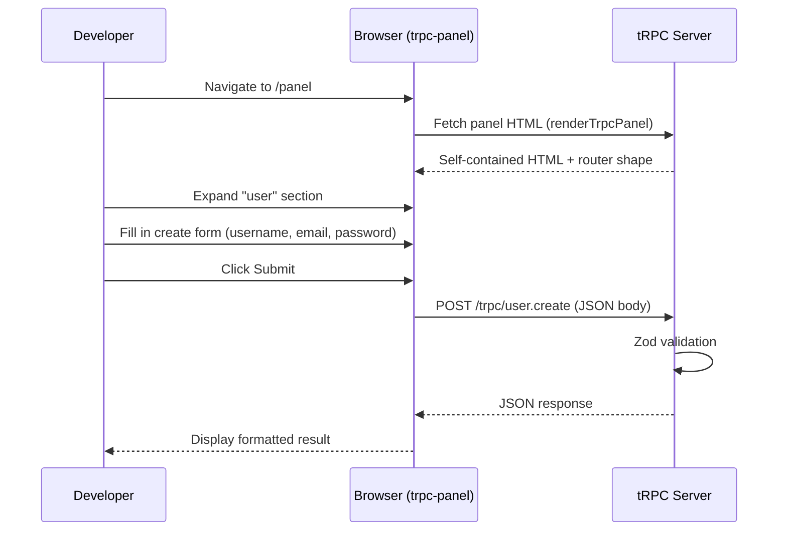

## trpc-panel for API exploration

`trpc-panel` is a community library that automatically generates a browser-based UI for exploring and testing tRPC procedures directly — without writing a client, without OpenAPI annotations, and without any manual documentation. It introspects the router at runtime and renders an interactive panel where every procedure can be called with filled-in inputs, and responses are displayed inline.

---

### What trpc-panel Solves

The standard tRPC development workflow has a documentation gap. Unlike REST APIs with Swagger UI or GraphQL with GraphiQL, a tRPC router has no built-in exploration interface. During development, testing a procedure requires either:

- Writing a client-side component or script
- Using a raw HTTP tool (curl, Postman) with manually constructed JSON bodies
- Writing unit or integration tests

`trpc-panel` fills this gap by generating a Swagger-UI-equivalent directly from the tRPC router — with zero annotations required. Input forms are generated from Zod schemas, outputs are displayed after execution, and the panel stays in sync with the router automatically because it is derived at runtime.

---

### How It Differs from trpc-openapi

| Concern | trpc-panel | trpc-openapi |
|---|---|---|
| Primary purpose | Developer exploration UI | REST API exposure + spec generation |
| Annotations required | None | `.meta({ openapi: ... })` on each procedure |
| Output | Browser UI | OpenAPI 3.0 JSON document |
| REST endpoint exposure | No | Yes |
| Suitable for production | No — dev tool only | Yes |
| Third-party client support | No | Yes |
| Zod schema rendering | Auto-generated forms | Schema objects in OpenAPI spec |

`trpc-panel` is a development tool. `trpc-openapi` is an API contract tool. They address different problems and can be used simultaneously.

---

### Installation

```bash
npm install trpc-panel
# or
pnpm add trpc-panel
```

`trpc-panel` has `@trpc/server` and `zod` as peer dependencies. No additional framework-specific adapters are required — it serves an HTML string that can be mounted in any HTTP framework. [Inference]

---

### Basic Setup: Express

**`apps/server/src/index.ts`**

```ts
import express from 'express';
import { createExpressMiddleware } from '@trpc/server/adapters/express';
import { renderTrpcPanel } from 'trpc-panel';
import { appRouter } from './router';
import { createContext } from './context';

const app = express();

app.use(express.json());

// Standard tRPC endpoint
app.use('/trpc', createExpressMiddleware({ router: appRouter, createContext }));

// trpc-panel UI — development only
if (process.env.NODE_ENV !== 'production') {
  app.use('/panel', (_, res) => {
    res.send(
      renderTrpcPanel(appRouter, {
        url: 'http://localhost:3000/trpc',
      })
    );
  });
}

app.listen(3000, () => {
  console.log('Panel available at http://localhost:3000/panel');
});
```

Navigating to `http://localhost:3000/panel` renders the full interactive UI.

**Key Points**

- `renderTrpcPanel` returns an HTML string — it is a self-contained document with inline styles and scripts
- The `url` option must point to the actual tRPC HTTP endpoint, not the panel route itself
- Gating behind `NODE_ENV !== 'production'` is a basic safeguard — the panel exposes the full procedure surface and should never be publicly accessible [Inference]

---

### Basic Setup: Fastify

```ts
import Fastify from 'fastify';
import { fastifyTRPCPlugin } from '@trpc/server/adapters/fastify';
import { renderTrpcPanel } from 'trpc-panel';
import { appRouter } from './router';
import { createContext } from './context';

const fastify = Fastify();

await fastify.register(fastifyTRPCPlugin, {
  prefix: '/trpc',
  trpcOptions: { router: appRouter, createContext },
});

if (process.env.NODE_ENV !== 'production') {
  fastify.get('/panel', (_, reply) => {
    reply.type('text/html').send(
      renderTrpcPanel(appRouter, {
        url: 'http://localhost:3000/trpc',
      })
    );
  });
}

await fastify.listen({ port: 3000 });
```

---

### Basic Setup: Next.js Pages Router

In a Next.js monolith where the tRPC server runs as API routes, the panel is served from a separate API route.

**`apps/web/src/pages/api/panel.ts`**

```ts
import type { NextApiRequest, NextApiResponse } from 'next';
import { renderTrpcPanel } from 'trpc-panel';
import { appRouter } from '../../server/router';

export default function handler(_req: NextApiRequest, res: NextApiResponse) {
  if (process.env.NODE_ENV === 'production') {
    return res.status(404).end();
  }

  res.setHeader('Content-Type', 'text/html');
  res.send(
    renderTrpcPanel(appRouter, {
      url: '/api/trpc',
    })
  );
}
```

**Key Points**

- In a Next.js setup the `url` is a relative path (`/api/trpc`) because the panel and the tRPC endpoint share the same origin
- Returning 404 in production is more robust than relying on `NODE_ENV` checks elsewhere — the route itself refuses to serve

---

### renderTrpcPanel Options

`renderTrpcPanel` accepts a configuration object as its second argument.

```ts
renderTrpcPanel(appRouter, {
  // Required — the URL of the tRPC HTTP endpoint
  url: 'http://localhost:3000/trpc',

  // Optional — inject headers into every request made from the panel
  // Useful for passing auth tokens during development
  headers: {
    Authorization: 'Bearer dev-token',
  },

  // Optional — transformer used by the tRPC server
  // Must match the transformer configured in initTRPC
  transformer: 'superjson',
})
```

#### transformer option

If the tRPC server is configured with `superjson` (or another transformer), the panel must be told so it can serialize/deserialize correctly:

```ts
// apps/server/src/trpc.ts
import { initTRPC } from '@trpc/server';
import superjson from 'superjson';

const t = initTRPC.create({ transformer: superjson });
```

```ts
// Panel setup
renderTrpcPanel(appRouter, {
  url: 'http://localhost:3000/trpc',
  transformer: 'superjson',
})
```

[Inference] Mismatching the transformer between the server and the panel will cause serialization errors that appear as malformed responses in the panel UI. Behavior may vary by `trpc-panel` version.

---

### What the Panel Renders

The panel UI renders one entry per procedure in the router, organized by the router namespace hierarchy.

#### For each procedure:

- **Name and path** — e.g., `user.create`, `post.list`
- **Type badge** — `query` or `mutation` displayed as a label
- **Input form** — generated from the Zod input schema:
  - `z.string()` → text input
  - `z.number()` → number input
  - `z.boolean()` → checkbox
  - `z.enum()` → select dropdown
  - `z.object()` → grouped fields
  - `z.array()` → repeatable field group with add/remove controls
  - `z.optional()` → field marked as optional, not required
- **Submit button** — executes the procedure against the live server
- **Response panel** — displays the returned data as formatted JSON
- **Error panel** — displays tRPC errors with code and message if the procedure throws

---

### Router Namespace Rendering

Nested routers render as collapsible sections in the panel. Given this router:

```ts
export const appRouter = router({
  user: userRouter,     // user.create, user.getById, user.list
  post: postRouter,     // post.create, post.list, post.delete
  auth: authRouter,     // auth.login, auth.logout, auth.refresh
});
```

The panel renders three top-level sections — `user`, `post`, `auth` — each expandable to reveal their procedures. Deeply nested routers continue to render hierarchically.

---

### Using Headers for Authentication

Many procedures require authentication context. During development, a static bearer token can be injected via the `headers` option so that every panel request carries the correct authorization header.

```ts
renderTrpcPanel(appRouter, {
  url: 'http://localhost:3000/trpc',
  headers: {
    Authorization: `Bearer ${process.env.DEV_AUTH_TOKEN}`,
  },
})
```

For more dynamic scenarios — where different requests need different tokens — the `headers` option accepts static values only. [Inference] A workaround is to configure `createContext` to accept a special development bypass header that grants elevated permissions when `NODE_ENV` is `development`, removing the need for a valid token entirely. This pattern carries risk if the bypass check is accidentally left active in production.

---

### Procedure Description Annotations

`trpc-panel` reads the `description` field from procedure metadata if present, and renders it as help text in the UI. This requires no OpenAPI dependency — it uses tRPC's standard `.meta()` mechanism.

```ts
export const userRouter = router({
  create: publicProcedure
    .meta({
      /* trpc-panel picks up the description field */
      description: 'Creates a new user account. Username must be unique.',
    })
    .input(createUserSchema)
    .mutation(async ({ input }) => {
      return createUser(input);
    }),

  getById: publicProcedure
    .meta({
      description: 'Retrieves a single user by their UUID.',
    })
    .input(userIdSchema)
    .query(async ({ input }) => {
      return getUserById(input.id);
    }),
});
```

[Inference] The exact meta field name recognized by `trpc-panel` may vary by version — consult the library's current documentation to confirm the supported fields.

---

### Security Considerations

The panel renders the full procedure surface of the router and executes live requests against the server. This has direct security implications.

**Risks if exposed in production:**
- Any visitor can call any procedure, including mutations
- Protected procedures may still be invoked — the panel will receive an authorization error, but the attempt is made
- The procedure list itself reveals the full API surface area

**Mitigations:**

```ts
// 1. Hard gate on NODE_ENV
if (process.env.NODE_ENV !== 'production') {
  app.use('/panel', panelHandler);
}

// 2. Restrict by IP address (Express example)
app.use('/panel', (req, res, next) => {
  const allowed = ['127.0.0.1', '::1'];
  if (!allowed.includes(req.ip ?? '')) {
    return res.status(403).end();
  }
  next();
}, panelHandler);

// 3. Protect with basic auth middleware
import basicAuth from 'express-basic-auth';
app.use('/panel',
  basicAuth({ users: { admin: process.env.PANEL_PASSWORD ?? '' } }),
  panelHandler
);
```

[Inference] In containerized deployments, the panel route can be omitted entirely from the production image by conditionally registering the route only in development Docker targets or local dev scripts.

---

### Integration with the Development Workflow



---

### Combining trpc-panel and trpc-openapi

Both libraries can run simultaneously on the same server. They serve complementary roles:

```ts
app.use('/trpc', createExpressMiddleware({ router: appRouter, createContext }));

// REST API for external consumers
app.use('/api', createOpenApiExpressMiddleware({ router: appRouter, createContext }));

// OpenAPI spec for SDK generation and documentation
app.get('/openapi.json', (_, res) => res.json(openApiDocument));

// Swagger UI for REST endpoint exploration
app.use('/docs', swaggerUi.serve, swaggerUi.setup(openApiDocument));

// trpc-panel for internal tRPC procedure exploration (dev only)
if (process.env.NODE_ENV !== 'production') {
  app.use('/panel', (_, res) => res.send(renderTrpcPanel(appRouter, { url: '/trpc' })));
}
```

`/panel` is the developer tool for testing procedures during development. `/docs` is the public-facing REST documentation. They cover different consumers.

---

### Limitations

**No subscription support**

tRPC subscriptions (WebSocket-based) are not rendered or executable in the panel. Only queries and mutations appear. [Inference]

**Static header injection only**

The `headers` option accepts a fixed object. Dynamic per-request header manipulation (e.g., different tokens per call) is not natively supported.

**No request history**

The panel does not persist previous requests or responses between page loads. Each session starts fresh.

**Zod schema coverage**

Complex Zod schemas may not render complete forms. Known limitations include:
- `z.lazy` (recursive schemas) — likely not supported
- `z.transform` — the input side renders but the transform is not reflected in the form
- `z.union` with many members — rendering quality may vary [Unverified — behavior depends on library version]

**Community maintenance**

`trpc-panel` is a community package, not an official tRPC project. [Unverified] Compatibility with tRPC v11 and maintenance cadence should be verified against the repository before adoption.

---

**Conclusion**

`trpc-panel` provides the fastest path to a working API exploration UI for a tRPC backend during development. With a single `renderTrpcPanel` call mounted on a development-only route, the entire procedure surface becomes browsable and testable without any annotations, code generation, or external tooling. Its constraint is its scope — it is strictly a developer tool with no role in production, no REST exposure, and no spec generation. Used alongside `trpc-openapi` for external API contracts, it covers the full spectrum from internal development exploration to external API documentation.

---

**Related Topics**

- Building a custom tRPC procedure explorer using `@trpc/server` router introspection
- `trpc-openapi` + Swagger UI for production-facing REST documentation
- Testing tRPC procedures with Vitest and `@trpc/server` caller
- Logging and observability for tRPC procedures during development
- tRPC DevTools browser extension — client-side request inspection
- Securing development-only routes in Express, Fastify, and Next.js