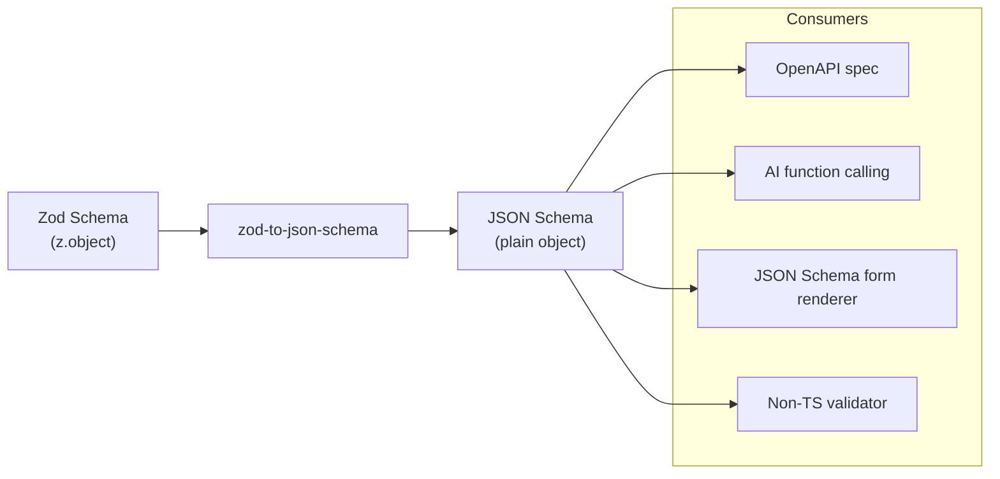

## zod-to-json-schema

`zod-to-json-schema` is a library that converts Zod schema definitions into JSON Schema documents. In a tRPC context it surfaces wherever the Zod schemas that drive procedure validation need to be consumed by tooling that speaks JSON Schema — documentation generators, form renderers, AI function calling interfaces, client SDK generators, and validation libraries outside the TypeScript ecosystem.

---

### What zod-to-json-schema Does

Zod schemas are TypeScript objects. Their structure is fully introspectable at runtime, but the introspection API is internal and unstable. `zod-to-json-schema` provides a stable, standards-based conversion layer: it walks the Zod schema graph and produces a JSON Schema Draft 7 (or Draft 2019-09) document that accurately represents the same constraints.

The output is a plain JavaScript object conforming to the JSON Schema specification, which can be:

- Serialized to JSON and embedded in API documentation
- Passed to a JSON Schema validator (`ajv`, `jsonschema`)
- Used as a function schema in OpenAI or Anthropic tool-calling APIs
- Consumed by form libraries that accept JSON Schema (`react-jsonschema-form`, `@rjsf/core`)
- Embedded in an OpenAPI document under `components/schemas`

---

### Relationship to tRPC

tRPC does not use JSON Schema internally. Its type inference and runtime validation both operate on Zod objects directly. `zod-to-json-schema` enters the picture at the boundary between the tRPC world and systems that do not speak Zod or TypeScript.



In a tRPC monorepo with shared schemas in `@myapp/schemas`, `zod-to-json-schema` is typically used in scripts or server routes that need to expose those schemas externally.

---

### Installation

```bash
npm install zod-to-json-schema
# or
pnpm add zod-to-json-schema
```

The library has `zod` as a peer dependency. No additional packages are required for basic usage.

---

### Basic Usage

```ts
import { z } from 'zod';
import { zodToJsonSchema } from 'zod-to-json-schema';

const createUserSchema = z.object({
  username: z.string().min(3).max(32),
  email: z.string().email(),
  password: z.string().min(8),
  role: z.enum(['admin', 'member', 'viewer']).default('member'),
});

const jsonSchema = zodToJsonSchema(createUserSchema);

console.log(JSON.stringify(jsonSchema, null, 2));
```

**Output**

```json
{
  "$schema": "http://json-schema.org/draft-07/schema#",
  "type": "object",
  "properties": {
    "username": {
      "type": "string",
      "minLength": 3,
      "maxLength": 32
    },
    "email": {
      "type": "string",
      "format": "email"
    },
    "password": {
      "type": "string",
      "minLength": 8
    },
    "role": {
      "type": "string",
      "enum": ["admin", "member", "viewer"],
      "default": "member"
    }
  },
  "required": ["username", "email", "password"],
  "additionalProperties": false
}
```

**Key Points**

- Fields without `.optional()` appear in the `required` array automatically
- `.default()` values are reflected in the `default` field
- `.email()` maps to `"format": "email"` — a hint, not a hard constraint in most validators
- `additionalProperties: false` is not emitted by default — Zod's `.strict()` triggers it [Inference]

---

### Configuration Options

`zodToJsonSchema` accepts an options object as its second argument.

```ts
const jsonSchema = zodToJsonSchema(schema, {
  // Name the root schema — emits a $ref to #/definitions/<name>
  name: 'CreateUser',

  // JSON Schema draft version
  // 'jsonSchema7' (default) | 'jsonSchema2019-09'
  target: 'jsonSchema7',

  // Where to place named definitions
  // 'root' (default) | 'inline'
  definitionPath: 'definitions',

  // Include Zod error messages as JSON Schema descriptions
  errorMessages: true,

  // Remove the $schema property from output
  $refStrategy: 'none',

  // Override how specific Zod types are converted
  // (advanced — see Custom Overrides section)
  // override: ...
})
```

#### Named Schema with Definitions

When `name` is provided, the output nests the schema under `definitions` and emits a top-level `$ref`:

```ts
const jsonSchema = zodToJsonSchema(createUserSchema, { name: 'CreateUser' });
```

```json
{
  "$schema": "http://json-schema.org/draft-07/schema#",
  "$ref": "#/definitions/CreateUser",
  "definitions": {
    "CreateUser": {
      "type": "object",
      "properties": { "..." : "..." },
      "required": ["username", "email", "password"]
    }
  }
}
```

This pattern is useful when embedding the schema into a larger document that uses `$ref` references.

---

### Zod Type Mapping Reference

| Zod Type | JSON Schema Output |
|---|---|
| `z.string()` | `{ "type": "string" }` |
| `z.string().min(n).max(m)` | `{ "type": "string", "minLength": n, "maxLength": m }` |
| `z.string().email()` | `{ "type": "string", "format": "email" }` |
| `z.string().url()` | `{ "type": "string", "format": "uri" }` |
| `z.string().uuid()` | `{ "type": "string", "format": "uuid" }` |
| `z.string().regex(r)` | `{ "type": "string", "pattern": "<regex>" }` |
| `z.number()` | `{ "type": "number" }` |
| `z.number().int()` | `{ "type": "integer" }` |
| `z.number().min(n).max(m)` | `{ "type": "number", "minimum": n, "maximum": m }` |
| `z.boolean()` | `{ "type": "boolean" }` |
| `z.null()` | `{ "type": "null" }` |
| `z.undefined()` | Not representable — omitted or `{}` [Inference] |
| `z.literal("x")` | `{ "type": "string", "const": "x" }` |
| `z.enum(["a","b"])` | `{ "type": "string", "enum": ["a","b"] }` |
| `z.nativeEnum(E)` | `{ "enum": [<values>] }` |
| `z.array(z.string())` | `{ "type": "array", "items": { "type": "string" } }` |
| `z.array(...).min(n).max(m)` | `{ "type": "array", "minItems": n, "maxItems": m }` |
| `z.object({...})` | `{ "type": "object", "properties": {...} }` |
| `z.object({...}).strict()` | `{ "type": "object", ..., "additionalProperties": false }` |
| `z.optional(s)` | Schema without `required` entry |
| `z.nullable(s)` | `{ "anyOf": [schema, { "type": "null" }] }` |
| `z.union([a, b])` | `{ "anyOf": [schemaA, schemaB] }` |
| `z.discriminatedUnion(...)` | `{ "oneOf": [...] }` with discriminator |
| `z.intersection(a, b)` | `{ "allOf": [schemaA, schemaB] }` |
| `z.record(z.string())` | `{ "type": "object", "additionalProperties": { "type": "string" } }` |
| `z.tuple([a, b])` | `{ "type": "array", "items": [schemaA, schemaB], "minItems": 2, "maxItems": 2 }` |
| `z.date()` | `{ "type": "string", "format": "date-time" }` [Inference] |
| `z.transform(...)` | Input schema only — output type is not representable |

---

### Extracting Schemas from a tRPC Router

In a tRPC monorepo, shared schemas live in `@myapp/schemas`. They can be converted and served as a schema registry endpoint.

**`apps/server/src/routes/schemas.ts`**

```ts
import { Router } from 'express';
import { zodToJsonSchema } from 'zod-to-json-schema';
import {
  createUserSchema,
  updateUserSchema,
  createPostSchema,
  paginationSchema,
} from '@myapp/schemas';

const router = Router();

const schemaRegistry = {
  CreateUser: createUserSchema,
  UpdateUser: updateUserSchema,
  CreatePost: createPostSchema,
  Pagination: paginationSchema,
};

// Serve all schemas as a JSON Schema definitions document
router.get('/schemas.json', (_, res) => {
  const definitions = Object.fromEntries(
    Object.entries(schemaRegistry).map(([name, schema]) => [
      name,
      zodToJsonSchema(schema, { name, $refStrategy: 'none' }),
    ])
  );

  res.json({
    $schema: 'http://json-schema.org/draft-07/schema#',
    definitions,
  });
});

// Serve a single schema by name
router.get('/schemas/:name', (req, res) => {
  const schema = schemaRegistry[req.params.name as keyof typeof schemaRegistry];
  if (!schema) return res.status(404).json({ error: 'Schema not found' });
  res.json(zodToJsonSchema(schema, { name: req.params.name }));
});

export { router as schemaRouter };
```

---

### AI Function Calling Integration

The most prominent recent use case for `zod-to-json-schema` in tRPC backends is generating tool schemas for LLM function calling APIs (OpenAI, Anthropic, etc.). These APIs require a JSON Schema object to describe each tool's parameters.

```ts
import { zodToJsonSchema } from 'zod-to-json-schema';
import { z } from 'zod';
import OpenAI from 'openai';

// Reuse the same Zod schema that validates the tRPC procedure input
const searchPostsSchema = z.object({
  query: z.string().min(1).describe('The search query string'),
  limit: z.number().int().min(1).max(50).default(10).describe('Number of results'),
  tags: z.array(z.string()).optional().describe('Filter by tags'),
});

const openai = new OpenAI();

const response = await openai.chat.completions.create({
  model: 'gpt-4o',
  messages: [{ role: 'user', content: 'Find posts about TypeScript' }],
  tools: [
    {
      type: 'function',
      function: {
        name: 'searchPosts',
        description: 'Search blog posts by query string and optional filters',
        parameters: zodToJsonSchema(searchPostsSchema, {
          target: 'jsonSchema7',
          $refStrategy: 'none',
        }),
      },
    },
  ],
});
```

**Key Points**

- `.describe()` on Zod fields populates the `description` property in JSON Schema, which most LLMs use to understand the parameter's purpose
- `$refStrategy: 'none'` inlines all definitions rather than using `$ref` — required by most LLM APIs that do not resolve JSON Schema references
- The same schema simultaneously validates tRPC procedure inputs and describes the tool to the LLM — a single source of truth for both

---

### Embedding in an OpenAPI Document

`zod-to-json-schema` output can be embedded directly into a hand-authored OpenAPI document, complementing or replacing `trpc-openapi` for cases where the OpenAPI spec is maintained manually.

```ts
import { zodToJsonSchema } from 'zod-to-json-schema';
import { createUserSchema } from '@myapp/schemas';

// Convert to JSON Schema, then cast to OpenAPI SchemaObject
// OpenAPI 3.0 uses a subset of JSON Schema Draft 7
const createUserJsonSchema = zodToJsonSchema(createUserSchema, {
  $refStrategy: 'none',
  target: 'jsonSchema7',
});

const openApiDocument = {
  openapi: '3.0.3',
  info: { title: 'My API', version: '1.0.0' },
  components: {
    schemas: {
      CreateUserRequest: createUserJsonSchema,
    },
  },
  paths: {
    '/users': {
      post: {
        requestBody: {
          required: true,
          content: {
            'application/json': {
              schema: { $ref: '#/components/schemas/CreateUserRequest' },
            },
          },
        },
        responses: { '201': { description: 'User created' } },
      },
    },
  },
};
```

[Inference] OpenAPI 3.0 uses a subset of JSON Schema Draft 7 with some divergences (e.g., `nullable` instead of `type: null`). The output of `zod-to-json-schema` targeting `jsonSchema7` is largely compatible but may require minor adjustments for full OpenAPI 3.0 compliance.

---

### Using .describe() for Documentation

Zod's `.describe()` method attaches a description string to any schema node. `zod-to-json-schema` converts these to `description` fields in the JSON Schema output, which propagates to Swagger UI, form renderers, and LLM tool descriptions.

```ts
const createPostSchema = z.object({
  title: z
    .string()
    .min(1)
    .max(200)
    .describe('The post title. Shown in listings and page headings.'),
  body: z
    .string()
    .min(1)
    .describe('Full post content in Markdown format.'),
  tags: z
    .array(z.string().max(50))
    .max(10)
    .default([])
    .describe('Up to 10 topic tags for categorization.'),
  published: z
    .boolean()
    .default(false)
    .describe('Set to true to make the post publicly visible immediately.'),
});

const jsonSchema = zodToJsonSchema(createPostSchema);
// Each property now has a "description" field in the output
```

This pattern keeps documentation co-located with the schema definition rather than in a separate documentation layer.

---

### Handling Unsupported Zod Types

Some Zod types do not have a clean JSON Schema equivalent. Understanding how `zod-to-json-schema` handles these avoids surprises.

#### z.transform

Only the input schema is converted. The output type after transformation is not representable in JSON Schema because it is a TypeScript-only concern.

```ts
const schema = z.string().transform(s => parseInt(s, 10));
zodToJsonSchema(schema);
// Output: { "type": "string" }
// The integer output type is not reflected
```

#### z.lazy (recursive schemas)

Recursive schemas are partially supported via JSON Schema's `$ref` mechanism. The `name` option must be provided for this to work correctly. [Unverified — behavior may vary by version]

```ts
type TreeNode = { value: number; children: TreeNode[] };

const treeNodeSchema: z.ZodType<TreeNode> = z.lazy(() =>
  z.object({
    value: z.number(),
    children: z.array(treeNodeSchema),
  })
);

const jsonSchema = zodToJsonSchema(treeNodeSchema, { name: 'TreeNode' });
// Produces a self-referencing $ref structure
```

#### z.function, z.promise, z.void

These have no JSON Schema representation and produce an empty schema `{}` or are omitted. [Inference]

#### z.preprocess

Similar to `z.transform` — the pre-processed input schema is not representable; the output schema is used. [Inference]

---

### Generating Schemas at Build Time

For projects where JSON Schema documents are consumed by external tools (code generators, contract tests), generating them at build time and committing the output provides a stable, diffable artifact.

**`scripts/generate-schemas.ts`**

```ts
import { writeFileSync, mkdirSync } from 'fs';
import { zodToJsonSchema } from 'zod-to-json-schema';
import * as schemas from '../packages/schemas/src/index';

const output: Record<string, unknown> = {};

for (const [name, schema] of Object.entries(schemas)) {
  // Skip non-Zod exports (e.g., inferred TypeScript types)
  if (schema?._def) {
    output[name] = zodToJsonSchema(schema, {
      name,
      $refStrategy: 'none',
    });
  }
}

mkdirSync('./dist/schemas', { recursive: true });

writeFileSync(
  './dist/schemas/all.json',
  JSON.stringify({ definitions: output }, null, 2),
  'utf-8'
);

console.log(`Generated ${Object.keys(output).length} schemas`);
```

```bash
npx tsx scripts/generate-schemas.ts
```

Add to `turbo.json` or `nx.json` as a `generate` target that runs after the schemas package builds and before any consumer that depends on the JSON output.

---

### Validating with the Generated Schema

`zod-to-json-schema` output can be passed to `ajv` (Another JSON Validator) for validation in environments where Zod is unavailable — Python services calling the API, test harnesses, or contract tests.

```ts
import Ajv from 'ajv';
import addFormats from 'ajv-formats';
import { zodToJsonSchema } from 'zod-to-json-schema';
import { createUserSchema } from '@myapp/schemas';

const ajv = new Ajv();
addFormats(ajv); // required for "format" keywords like "email", "uuid"

const validate = ajv.compile(
  zodToJsonSchema(createUserSchema, { $refStrategy: 'none' })
);

const data = { username: 'alice', email: 'alice@example.com', password: 'secret123' };

if (!validate(data)) {
  console.error(validate.errors);
}
```

**Key Points**

- `ajv-formats` is needed for Zod's string format validators (`.email()`, `.url()`, `.uuid()`) to be enforced by Ajv — without it, `format` keywords are ignored
- Zod's `.refine()` custom validators have no JSON Schema equivalent and will not be enforced by Ajv
- This pattern is useful for contract testing: verify that data passing Ajv validation also passes Zod validation and vice versa

---

### Limitations Summary

| Zod Feature | JSON Schema Support |
|---|---|
| `.min()` / `.max()` on strings and arrays | Full |
| `.email()`, `.url()`, `.uuid()` | Format hint only — not enforced by all validators |
| `.regex()` | Full via `pattern` |
| `.refine()` / `.superRefine()` | Not representable — silently dropped |
| `.transform()` | Input schema only |
| `.preprocess()` | Output schema only [Inference] |
| `.lazy()` (recursive) | Partial — requires `name` option |
| `.function()` / `.promise()` | Not representable |
| `z.undefined()` | Not representable in JSON Schema |
| `.brand()` | Dropped — structural type only |
| `.pipe()` | Input schema [Inference] |

---

**Conclusion**

`zod-to-json-schema` is a focused utility that converts the Zod schemas already present in a tRPC monorepo into a format consumable by the broader tooling ecosystem. Its value is highest when the same schemas need to serve multiple roles: runtime validation via Zod, type inference via TypeScript, and external documentation or tool description via JSON Schema. The `.describe()` pattern keeps documentation co-located with schema definitions and propagates automatically to every JSON Schema consumer. The key constraint to understand is that runtime-only Zod features — `.refine()`, `.transform()`, `.superRefine()` — have no JSON Schema equivalent and are silently dropped from conversion output.

---

**Related Topics**

- `@anatine/zod-openapi` — extending Zod schemas with OpenAPI-specific metadata
- Using `zod-to-json-schema` output with `react-jsonschema-form` for auto-generated forms
- Contract testing tRPC procedure inputs with Ajv and generated JSON Schema
- OpenAI and Anthropic tool-calling with tRPC-derived Zod schemas
- `zodToJsonSchema` in a schema registry service for polyglot microservices
- Comparing `zod-to-json-schema` with `typebox` for JSON Schema-first validation in tRPC