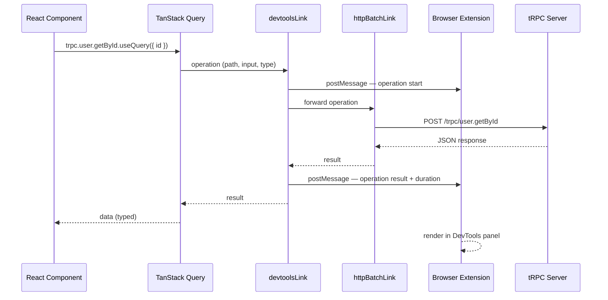

## tRPC DevTools

tRPC DevTools is a browser extension and companion ecosystem for inspecting, debugging, and monitoring tRPC client activity in real time. It surfaces the requests, responses, cache state, and errors that are otherwise invisible inside tRPC's batched HTTP transport and TanStack Query's internal cache — giving developers a view into client-side tRPC behavior equivalent to what the Network tab provides for raw HTTP requests.

---

### What tRPC DevTools Provides

Standard browser developer tools show tRPC activity as opaque batched POST requests to `/trpc/procedure.name`. The request payload is a JSON array, the response is a JSON array, and multiple procedures are collapsed into a single network entry. This makes debugging non-trivial:

- Which procedure triggered this request?
- What input was sent?
- What did the server return?
- Is this result coming from cache or the network?
- Why is this query refetching?

tRPC DevTools answers these questions by intercepting tRPC client calls before they hit the network and presenting them in a structured, procedure-aware UI.

---

### The tRPC DevTools Ecosystem

The DevTools surface consists of two related but distinct parts:

| Component | What it is | Where it runs |
|---|---|---|
| Browser extension | Chrome/Firefox extension with a DevTools panel | Browser |
| `@trpc-devtools/client` | Client-side link that feeds data to the extension | App code |
| TanStack Query DevTools | Not tRPC-specific — shows cache state for all queries | In-app panel |

All three can be used simultaneously and serve complementary purposes.

---

### Installation

```bash
# The DevTools client link
npm install @trpc-devtools/client
# or
pnpm add @trpc-devtools/client
```

The browser extension is installed separately from the Chrome Web Store or Firefox Add-ons. [Unverified — availability and current distribution method should be verified against the project repository, as community extensions may change hosting.]

---

### The DevTools Link

tRPC's link chain is the integration point for DevTools. A custom link is inserted into the chain and intercepts all operations passing through it, forwarding metadata to the browser extension via a `postMessage` bridge.

**`apps/web/src/lib/trpc.ts`**

```ts
import { createTRPCReact } from '@trpc/react-query';
import { httpBatchLink, loggerLink } from '@trpc/client';
import { devtoolsLink } from '@trpc-devtools/client';
import type { AppRouter } from '@myapp/trpc';

export const trpc = createTRPCReact<AppRouter>();

export function createTRPCClient() {
  return trpc.createClient({
    links: [
      // DevTools link must come first in the chain
      // to intercept both outgoing operations and incoming responses
      process.env.NODE_ENV === 'development'
        ? devtoolsLink({
            enabled: true,
          })
        : // No-op in production — tree-shaken by bundlers [Inference]
          loggerLink({ enabled: () => false }),

      httpBatchLink({
        url: `${process.env.NEXT_PUBLIC_API_URL}/trpc`,
      }),
    ],
  });
}
```

**Key Points**

- The DevTools link should be the first link in the chain so it observes both outgoing operations and incoming results
- Conditionally including the link only in development avoids any overhead in production builds
- [Inference] Bundlers with dead code elimination (Vite, Next.js, webpack with `NODE_ENV` inlining) will tree-shake the `devtoolsLink` import in production builds, but this should be verified for the specific build setup in use

---

### Link Chain Position

The position of `devtoolsLink` in the link chain determines what it sees.

```
devtoolsLink  →  loggerLink  →  splitLink  →  httpBatchLink
     ↑                                               ↓
  intercepts                                    network
  all ops                                       request
```

Placing it first means it observes every operation before any transformation by other links, and every response after all links have processed the return. Placing it after `splitLink` would mean subscription operations routed to a WebSocket link are not captured. [Inference]

---

### What the DevTools Panel Shows

Once the extension is installed and the client link is active, opening the browser DevTools panel reveals a tRPC-specific tab.

#### Operation List

Each procedure call appears as a separate entry:

```
● user.getById        query      200   42ms
● post.list           query      200   87ms
● user.create         mutation   200   134ms
● post.getById        query      ERROR  23ms
```

Fields visible per entry:

- Procedure path (`user.getById`)
- Operation type (`query` / `mutation` / `subscription`)
- HTTP status code
- Duration from request to response
- Timestamp

#### Operation Detail

Selecting an entry expands its detail view:

**Input tab**

```json
{
  "id": "a1b2c3d4-e5f6-7890-abcd-ef1234567890"
}
```

**Output tab**

```json
{
  "id": "a1b2c3d4-e5f6-7890-abcd-ef1234567890",
  "username": "alice",
  "email": "alice@example.com",
  "createdAt": "2024-01-15T09:30:00.000Z"
}
```

**Error tab** (when the procedure throws)

```json
{
  "code": "NOT_FOUND",
  "message": "User not found",
  "data": {
    "code": "NOT_FOUND",
    "httpStatus": 404,
    "path": "user.getById"
  }
}
```

---

### TanStack Query DevTools Integration

tRPC's React integration is built on TanStack Query. The TanStack Query DevTools panel is separate from the tRPC extension and shows the client-side cache state — which is complementary information.

**`apps/web/src/app/providers.tsx`**

```tsx
'use client';

import { useState } from 'react';
import { QueryClient, QueryClientProvider } from '@tanstack/react-query';
import { ReactQueryDevtools } from '@tanstack/react-query-devtools';
import { trpc, createTRPCClient } from '../lib/trpc';

export function Providers({ children }: { children: React.ReactNode }) {
  const [queryClient] = useState(() => new QueryClient({
    defaultOptions: {
      queries: {
        staleTime: 60 * 1000,
      },
    },
  }));

  const [trpcClient] = useState(() => createTRPCClient());

  return (
    <trpc.Provider client={trpcClient} queryClient={queryClient}>
      <QueryClientProvider client={queryClient}>
        {children}
        {/* TanStack Query DevTools — in-app floating panel */}
        {process.env.NODE_ENV === 'development' && (
          <ReactQueryDevtools initialIsOpen={false} />
        )}
      </QueryClientProvider>
    </trpc.Provider>
  );
}
```

```bash
npm install --save-dev @tanstack/react-query-devtools
```

**Key Points**

- `ReactQueryDevtools` renders as a floating button in the bottom corner of the app in development
- It shows all TanStack Query cache entries — tRPC queries appear with keys like `[["user","getById"],{"input":{"id":"..."}}]`
- Cache state (fresh, stale, fetching, paused), observer count, and last updated time are visible per cache entry
- Data can be invalidated, refetched, or removed from cache directly in the panel

---

### What TanStack Query DevTools Shows for tRPC

tRPC query cache keys follow a predictable structure:

```
[["<router>","<procedure>"], { "input": <input>, "type": "query" }]
```

**Example cache entries:**

```
["user","getById"]  →  input: { id: "abc" }   →  fresh    1 observer
["post","list"]     →  input: { page: 1 }      →  stale    2 observers
["user","profile"]  →  input: undefined         →  fetching 1 observer
```

This lets developers see which queries have active observers (components subscribed to them), which are stale and eligible for background refetch, and which are currently in flight.

---

### loggerLink as a Lightweight Alternative

The `@trpc/client` package includes a `loggerLink` that logs procedure calls to the browser console without requiring a browser extension. It is useful in environments where the extension cannot be installed (CI, automated tests, team members without the extension).

```ts
import { loggerLink, httpBatchLink } from '@trpc/client';

trpc.createClient({
  links: [
    loggerLink({
      enabled: (opts) =>
        process.env.NODE_ENV === 'development' ||
        (opts.direction === 'down' && opts.result instanceof Error),
    }),
    httpBatchLink({ url: '/trpc' }),
  ],
});
```

The `enabled` function receives each operation and its result. The pattern above logs everything in development and logs only errors in production — giving error visibility without verbose output.

**Console output format:**

```
>> query #1 user.getById { id: "abc" }
<< query #1 user.getById (42ms) { id: "abc", username: "alice" }

>> mutation #2 user.create { username: "bob", email: "bob@example.com" }
<< mutation #2 user.create ERROR (89ms) NOT_FOUND: User not found
```

---

### Custom Logging Link

For more control than `loggerLink` provides — structured logging, integration with an observability service, or custom filtering — a custom link can be written.

```ts
import { TRPCLink } from '@trpc/client';
import { observable } from '@trpc/server/observable';
import type { AppRouter } from '@myapp/trpc';

export const observabilityLink: TRPCLink<AppRouter> = () => {
  return ({ next, op }) => {
    const start = performance.now();

    return observable((observer) => {
      const subscription = next(op).subscribe({
        next(value) {
          const duration = performance.now() - start;

          console.log({
            type: 'trpc_success',
            procedure: op.path,
            operationType: op.type,
            input: op.input,
            durationMs: Math.round(duration),
            result: value.result,
          });

          observer.next(value);
        },
        error(err) {
          const duration = performance.now() - start;

          console.error({
            type: 'trpc_error',
            procedure: op.path,
            operationType: op.type,
            input: op.input,
            durationMs: Math.round(duration),
            error: {
              code: err.data?.code,
              message: err.message,
              httpStatus: err.data?.httpStatus,
            },
          });

          observer.error(err);
        },
        complete() {
          observer.complete();
        },
      });

      return subscription;
    });
  };
};
```

**Usage:**

```ts
trpc.createClient({
  links: [
    observabilityLink,
    httpBatchLink({ url: '/trpc' }),
  ],
});
```

---

### Debugging Common Issues with DevTools

#### Unexpected cache hits

**Symptom:** A query returns stale data even after a mutation that should invalidate it.

**DevTools approach:** Open TanStack Query DevTools, find the query cache entry, check `staleTime` and last updated. If the entry is still fresh, the `invalidateQueries` call either used a mismatched key or was not called.

```ts
// Common mistake — key mismatch
utils.user.list.invalidate();     // ← correct tRPC invalidation
queryClient.invalidateQueries(['user', 'list']); // ← raw key, may not match tRPC format
```

#### Batched requests collapsing procedures

**Symptom:** Multiple procedures appear as one network request in the Network tab.

**DevTools approach:** The tRPC DevTools panel separates batched procedures into individual entries, showing each procedure's input and output independently. This is the primary advantage over the Network tab for batched requests.

#### Procedure errors not surfacing

**Symptom:** An error is thrown on the server but the client silently returns undefined.

**DevTools approach:** Filter the operation list to show only errors. The error detail tab shows the tRPC error code, HTTP status, and message. Cross-reference with the server logs to verify the error shape.

#### Slow queries

**Symptom:** The UI feels sluggish but no individual network request appears slow.

**DevTools approach:** Sort operations by duration in the DevTools panel. Procedures are listed individually even when batched, so per-procedure latency is visible. A fast batch response with one slow procedure inside it is identifiable.

---

### DevTools in a Monorepo Setup

In a Turborepo or Nx monorepo where the web app and server are separate packages, DevTools configuration belongs in the web app only. No server-side changes are needed.

```
apps/
  web/
    src/
      lib/
        trpc.ts     ← devtoolsLink and loggerLink configured here
      app/
        providers.tsx ← ReactQueryDevtools mounted here
  server/
    src/            ← no DevTools configuration needed
packages/
  trpc/
    src/
      index.ts      ← exports AppRouter type only, no DevTools
```

[Inference] If the shared `@myapp/trpc` package exports the tRPC client factory, `devtoolsLink` should still be configured in the consuming app rather than the shared package, since the shared package is imported by all consumers and development tools should not be bundled into production builds of those consumers.

---

### Operation Flow with DevTools Link



---

### Production Considerations

DevTools links carry overhead — serializing inputs and outputs, posting messages to the extension, and maintaining operation history in memory. In production this overhead is unnecessary and the operation history may contain sensitive data.

**Checklist for production:**

- [ ] `devtoolsLink` is conditionally excluded via `NODE_ENV` check
- [ ] `loggerLink` is either excluded or configured to log errors only
- [ ] `ReactQueryDevtools` is conditionally excluded from the component tree
- [ ] Build output verified to not include DevTools packages (check bundle analyzer)

[Inference] Next.js, Vite, and most modern bundlers will eliminate dead code branches on `process.env.NODE_ENV === 'development'` checks during production builds, but bundle analysis with a tool like `rollup-plugin-visualizer` or `@next/bundle-analyzer` is the most reliable way to confirm exclusion.

---

**Conclusion**

tRPC DevTools fills the visibility gap that the browser Network tab leaves for batched tRPC traffic. The `devtoolsLink` provides per-procedure inspection even when multiple procedures are batched into a single HTTP request, and TanStack Query DevTools surfaces the cache state that determines whether a procedure call hits the network at all. For simpler setups or environments without the browser extension, `loggerLink` and custom observability links cover the same ground via the console. All DevTools integrations should be gated on `NODE_ENV` checks — the tooling is exclusively for development and carries both performance overhead and sensitive data exposure risk if left active in production.

---

**Related Topics**

- Writing custom tRPC links for metrics, tracing, and error reporting
- TanStack Query cache invalidation patterns with tRPC mutations
- Server-side observability for tRPC — OpenTelemetry and structured logging
- tRPC error handling and error formatting — surfacing errors correctly to DevTools
- Debugging tRPC subscriptions and WebSocket connections
- Bundle analysis for Next.js and Vite — verifying DevTools exclusion in production