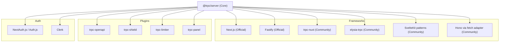

## tRPC Community Adapters and Plugins

The tRPC ecosystem extends well beyond its official packages. Community-contributed adapters and plugins bridge tRPC with a wide range of frameworks, runtimes, and tooling — enabling teams to adopt tRPC in environments not covered by the official integrations.

---

### Overview of the Community Ecosystem

tRPC's core is intentionally minimal and framework-agnostic. This design invites the community to build adapters that connect tRPC's request/response model to specific runtimes, meta-frameworks, and infrastructure layers.

Community contributions generally fall into these categories:

- **Framework adapters** — connect tRPC to HTTP servers or meta-frameworks
- **Runtime adapters** — target specific JavaScript runtimes (Deno, Bun, Cloudflare Workers, etc.)
- **Authentication plugins** — integrate auth providers with tRPC context and middleware
- **Validation plugins** — extend or replace the built-in Zod/Yup/Superstruct integration
- **Utility libraries** — add developer experience improvements (logging, rate limiting, caching)
- **OpenAPI and schema bridges** — expose tRPC routers as REST or GraphQL endpoints

---

### Framework and Runtime Adapters

#### Fastify Adapter

The official `@trpc/server` includes a Fastify plugin, but community wrappers extend it further — adding support for Fastify's plugin lifecycle, typed decorators, and hook integration.

**Key Points**

- Wraps `fastifyTRPCPlugin` with additional lifecycle hooks
- Supports Fastify's DI patterns for context building
- Enables access to `fastify.request` and `fastify.reply` in tRPC context

**Example**

```ts
import Fastify from 'fastify';
import { fastifyTRPCPlugin } from '@trpc/server/adapters/fastify';
import { appRouter } from './router';
import { createContext } from './context';

const fastify = Fastify();

fastify.register(fastifyTRPCPlugin, {
  prefix: '/trpc',
  trpcOptions: { router: appRouter, createContext },
});

fastify.listen({ port: 3000 });
```

Community wrappers may add typed plugin decorators or automatic schema reflection — behavior varies by package.

---

#### Hono Adapter

[Hono](https://hono.dev) is a lightweight router that runs on Cloudflare Workers, Deno, Bun, and Node.js. The community-maintained `trpc-hono` adapter (or patterns built on `fetchRequestHandler`) makes tRPC deployable on any Hono-compatible runtime.

**Key Points**

- Uses `fetchRequestHandler` from `@trpc/server/adapters/fetch`
- Hono's `Context` object is accessible inside `createContext`
- Compatible with Cloudflare Workers, Deno Deploy, and Bun natively

**Example**

```ts
import { Hono } from 'hono';
import { fetchRequestHandler } from '@trpc/server/adapters/fetch';
import { appRouter } from './router';

const app = new Hono();

app.all('/trpc/*', (c) => {
  return fetchRequestHandler({
    endpoint: '/trpc',
    req: c.req.raw,
    router: appRouter,
    createContext: () => ({ honoCtx: c }),
  });
});

export default app;
```

---

#### Elysia Adapter (`elysia-trpc`)

[Elysia](https://elysiajs.com) is a Bun-first web framework. The `elysia-trpc` plugin connects tRPC routers into Elysia's plugin system.

**Key Points**

- Mounts tRPC router as an Elysia plugin
- Leverages Bun's native performance for tRPC handlers
- [Inference] Elysia's type system and tRPC's may interact in ways that require explicit type annotations at the boundary

**Example**

```ts
import { Elysia } from 'elysia';
import { trpc } from '@elysiajs/trpc';
import { appRouter } from './router';

const app = new Elysia()
  .use(trpc(appRouter))
  .listen(3000);
```

---

#### SolidStart Adapter

SolidStart (the SolidJS meta-framework) has community patterns and sometimes official support for tRPC via `solid-trpc` or adapter wrappers around the fetch handler.

**Key Points**

- Uses `fetchRequestHandler` inside a SolidStart API route
- The client uses a custom `httpBatchLink` configured for SolidStart's routing

**Example**

```ts
// src/routes/trpc/[...trpc].ts (SolidStart API route)
import { fetchRequestHandler } from '@trpc/server/adapters/fetch';
import { appRouter } from '~/server/router';

export const GET = (event: Request) =>
  fetchRequestHandler({
    endpoint: '/trpc',
    req: event,
    router: appRouter,
    createContext: () => ({}),
  });

export const POST = GET;
```

---

#### Nuxt Adapter (`trpc-nuxt`)

`trpc-nuxt` is a community package that integrates tRPC into Nuxt 3 applications using server routes and auto-imported composables.

**Key Points**

- Provides `useClient` composable auto-imported by Nuxt
- Server routes are generated from the router using Nuxt's `~/server/trpc/` convention
- Supports Nuxt's SSR and hybrid rendering modes
- [Inference] Full compatibility with Nuxt's `useFetch` or `useAsyncData` patterns depends on version alignment

**Example**

```ts
// server/trpc/routers/index.ts
import { router, publicProcedure } from '../trpc';

export const appRouter = router({
  hello: publicProcedure.query(() => 'Hello from Nuxt tRPC'),
});
```

```ts
// server/trpc/[trpc].ts
import { createNuxtApiHandler } from 'trpc-nuxt';
import { appRouter } from '~/server/trpc/routers';

export default createNuxtApiHandler({
  router: appRouter,
  createContext: () => ({}),
});
```

```ts
// pages/index.vue
<script setup>
const { $client } = useNuxtApp();
const { data } = await $client.hello.useQuery();
</script>
```

---

#### SvelteKit Integration Patterns

SvelteKit does not have a dedicated `trpc-sveltekit` package that has reached widespread use, but community patterns establish tRPC inside SvelteKit's `+server.ts` files.

**Example**

```ts
// src/routes/trpc/[...trpc]/+server.ts
import { fetchRequestHandler } from '@trpc/server/adapters/fetch';
import { appRouter } from '$lib/server/router';
import type { RequestHandler } from './$types';

const handler: RequestHandler = (event) =>
  fetchRequestHandler({
    endpoint: '/trpc',
    req: event.request,
    router: appRouter,
    createContext: () => ({ event }),
  });

export const GET = handler;
export const POST = handler;
```

---

### OpenAPI and REST Bridge Plugins

#### `trpc-openapi`

`trpc-openapi` is one of the most widely used community plugins. It generates an OpenAPI 3.0-compliant specification from a tRPC router, enabling REST-compatible clients to consume tRPC procedures.

**Key Points**

- Procedures are annotated with `.meta({ openapi: { method, path } })` to expose them as REST endpoints
- Generates a full OpenAPI document for Swagger UI or Redoc integration
- Supports path and query parameters derived from Zod input schemas
- Useful for exposing tRPC APIs to non-TypeScript consumers or third-party integrations
- [Inference] Edge cases in Zod schema complexity (discriminated unions, transforms) may produce imprecise OpenAPI output — manual review of generated specs is advisable

**Example**

```ts
import { initTRPC } from '@trpc/server';
import { OpenApiMeta } from 'trpc-openapi';

const t = initTRPC.meta<OpenApiMeta>().create();

export const appRouter = t.router({
  getUser: t.procedure
    .meta({ openapi: { method: 'GET', path: '/users/{id}' } })
    .input(z.object({ id: z.string() }))
    .output(z.object({ name: z.string() }))
    .query(({ input }) => getUserById(input.id)),
});
```

```ts
// Generate the OpenAPI document
import { generateOpenApiDocument } from 'trpc-openapi';

const openApiDocument = generateOpenApiDocument(appRouter, {
  title: 'My API',
  version: '1.0.0',
  baseUrl: 'https://api.example.com',
});
```

---

#### `trpc-to-openapi` and Similar Alternatives

Several smaller community tools offer similar REST bridge functionality with different trade-offs — some focus on OpenAPI v3.1, others on Swagger v2. [Unverified] Maintenance status and compatibility with recent tRPC versions varies. Evaluate GitHub activity and peer usage before adopting.

---

### Authentication Plugins and Patterns

tRPC does not bundle authentication, but the community has produced reusable patterns and thin wrappers for major auth providers.

#### NextAuth.js / Auth.js Context Integration

A widely shared pattern passes the Auth.js session into tRPC context, enabling session-aware middleware.

**Example**

```ts
import { getServerSession } from 'next-auth';
import { authOptions } from '~/server/auth';
import { inferAsyncReturnType } from '@trpc/server';

export const createContext = async (opts: CreateNextContextOptions) => {
  const session = await getServerSession(opts.req, opts.res, authOptions);
  return { session };
};

export type Context = inferAsyncReturnType<typeof createContext>;
```

The community-maintained `create-t3-app` scaffold (discussed in a prior topic) codifies this pattern as a standard template.

---

#### Clerk Integration

Clerk provides a community guide and snippet libraries for injecting `userId` and `orgId` from Clerk's server SDK into tRPC context. No dedicated npm package is required — the integration is context-level.

---

### Validation Plugins

tRPC officially supports Zod, Yup, Superstruct, and Valibot as input parsers. Community adapters extend this to additional libraries.

#### `@trpc/zod-to-json-schema`

[Inference] Some community tools bridge Zod schemas used in tRPC procedures to JSON Schema format, enabling schema export for documentation or runtime validation in non-TypeScript environments.

#### Custom Parser Adapters

tRPC's input validation accepts any object implementing a `parse` method, meaning any schema library can be adapted:

**Example**

```ts
import * as v from 'valibot';

const schema = v.object({ name: v.string() });

// Wrap valibot schema to satisfy tRPC's parser interface
const valibotParser = (input: unknown) => v.parse(schema, input);

export const myProcedure = t.procedure
  .input(valibotParser)
  .query(({ input }) => input.name);
```

---

### Developer Experience and Utility Plugins

#### `trpc-shield`

Inspired by `graphql-shield`, `trpc-shield` provides a middleware-based permissions layer for tRPC routers.

**Key Points**

- Define rules as composable functions
- Apply rules per-router or per-procedure
- Integrates with tRPC middleware via `t.middleware()`
- [Inference] Rule evaluation order and middleware chaining behavior may differ from `graphql-shield` expectations — verify against actual tRPC middleware semantics

**Example**

```ts
import { shield, rule, allow } from 'trpc-shield';

const isAuthenticated = rule()(async (ctx) => {
  return ctx.session !== null;
});

const permissions = shield({
  query: {
    sensitiveData: isAuthenticated,
    publicData: allow,
  },
});
```

---

#### `trpc-limiter` and Rate Limiting Adapters

Community packages like `trpc-limiter` add rate limiting as tRPC middleware, integrating with backends such as Redis (via `ioredis` or `upstash`) or in-memory stores.

**Key Points**

- Rate limits are applied at middleware level, before procedure logic executes
- Window and threshold configuration is typically passed to the limiter factory
- [Inference] Accuracy of distributed rate limiting depends on the consistency guarantees of the chosen backing store

**Example**

```ts
import { createTRPCRateLimiter } from 'trpc-limiter';

const rateLimiter = createTRPCRateLimiter({
  windowMs: 60_000,
  max: 100,
  message: 'Too many requests',
});

export const limitedProcedure = t.procedure.use(rateLimiter);
```

---

#### `trpc-panel`

`trpc-panel` auto-generates an interactive web UI for exploring and testing tRPC routers — similar to GraphQL Playground but for tRPC.

**Key Points**

- Renders input forms derived from Zod schemas
- Supports query and mutation execution from the browser
- Useful during local development and internal tooling
- No client-side code generation required

**Example**

```ts
import { renderTrpcPanel } from 'trpc-panel';
import { appRouter } from './router';

// Express example
app.use('/panel', (req, res) => {
  res.send(renderTrpcPanel(appRouter, { url: 'http://localhost:3000/trpc' }));
});
```

---

#### Logging Middleware (Community Patterns)

No single dominant logging plugin exists, but several community snippets implement structured logging via `pino`, `winston`, or `consola` as tRPC middleware.

**Example**

```ts
const loggingMiddleware = t.middleware(async ({ path, type, next }) => {
  const start = Date.now();
  const result = await next();
  const duration = Date.now() - start;

  console.log(`[${type}] ${path} — ${duration}ms — ${result.ok ? 'OK' : 'ERR'}`);

  return result;
});
```

---

### Diagram: Community Adapter Landscape



---

### Evaluating Community Packages

Before adopting a community adapter or plugin, consider the following criteria:

| Criterion | Why It Matters |
|---|---|
| Last published date | tRPC releases breaking changes between major versions |
| Peer dependency range | Mismatches with `@trpc/server` version cause silent failures |
| GitHub issue activity | Indicates whether bugs are being addressed |
| TypeScript strictness | Poorly typed adapters erode tRPC's type safety guarantees |
| Test coverage | Adapters without tests are higher risk for edge case failures |
| Community usage (npm downloads) | Proxies for real-world validation |

**Key Points**

- Many community packages target specific tRPC major versions (v9, v10, v11) — always verify compatibility
- The tRPC Discord and GitHub Discussions are reliable sources for current community recommendations
- When no maintained adapter exists for a runtime, `fetchRequestHandler` from `@trpc/server/adapters/fetch` is the lowest-friction foundation for building a custom one

---

### Building a Minimal Custom Adapter

When no community adapter exists for a target runtime, `fetchRequestHandler` or the lower-level `resolveHTTPResponse` can be used directly.

**Example** using `resolveHTTPResponse` for a hypothetical custom runtime:

```ts
import { resolveHTTPResponse } from '@trpc/server/http';
import { appRouter } from './router';

async function handleRequest(rawRequest: SomeRuntimeRequest) {
  const req = {
    method: rawRequest.method,
    headers: rawRequest.headers,
    body: await rawRequest.text(),
    query: new URLSearchParams(rawRequest.url.split('?')[1] ?? ''),
  };

  const result = await resolveHTTPResponse({
    router: appRouter,
    req,
    path: rawRequest.pathname.replace('/trpc/', ''),
    createContext: () => ({}),
  });

  return new SomeRuntimeResponse(result.body, {
    status: result.status,
    headers: result.headers,
  });
}
```

> Note: `resolveHTTPResponse` is a lower-level API and its signature may change across tRPC versions. Behavior may vary — consult the version-specific source or changelog.

---

**Related Topics**

- Building a custom tRPC adapter from scratch using `resolveHTTPResponse`
- `trpc-openapi` deep dive — annotating procedures and handling complex schemas
- `trpc-panel` configuration and deployment for internal tooling
- `trpc-shield` — composing permission rules and combining with tRPC middleware
- Rate limiting strategies in tRPC — Redis-backed vs in-memory
- Integrating Auth.js v5 (beta) with tRPC context and protected procedures
- Community-maintained type utilities for tRPC (e.g., `trpc-transformer`, custom superjson configurations)
- Evaluating tRPC compatibility with emerging runtimes (Deno 2, Bun 1.x, WinterCG)