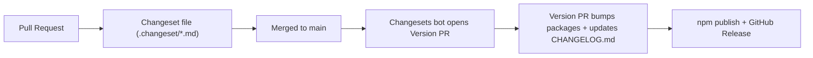
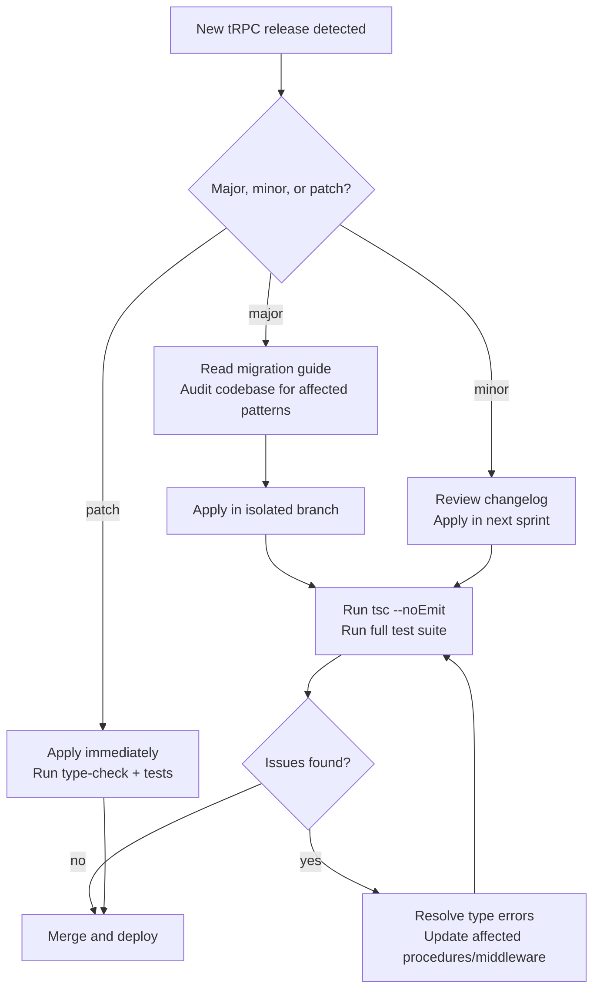

## Staying Current with the tRPC Changelog

Keeping up with tRPC's evolution is a practical necessity. tRPC has undergone significant breaking changes between major versions — most notably the v9-to-v10 rewrite — and continues to ship meaningful changes in minor and patch releases. Understanding where to find changes, how to interpret them, and how to act on them reduces upgrade risk and helps teams adopt improvements early.

---

### Why the Changelog Matters for tRPC Specifically

tRPC's type-level machinery means that changes to internal inference utilities, procedure builders, or middleware signatures can break TypeScript compilation silently in ways that runtime tests may not catch. A dependency update that passes CI could still produce incorrect inferred types in application code.

**Key Points**

- Type-breaking changes may not surface as runtime errors
- tRPC's public API surface includes both runtime behavior and TypeScript types — both can change
- The boundary between "internal" and "public" API has historically shifted between major versions
- [Inference] Relying on undocumented internal exports (e.g., deep imports from `@trpc/server/dist/...`) increases exposure to unannounced breaking changes

---

### Primary Sources for tRPC Changes

#### GitHub Releases Page

The canonical source for tRPC changelogs is the GitHub Releases page:

```
https://github.com/trpc/trpc/releases
```

Each release entry contains:

- Version tag and publish date
- Categorized changes (features, bug fixes, breaking changes)
- Links to relevant pull requests and issues
- Migration notes when applicable

**Key Points**

- Releases are tagged by package — `@trpc/server`, `@trpc/client`, `@trpc/react-query`, etc., often share a version but are released together
- Pre-release tags (`alpha`, `beta`, `next`, `rc`) appear here before stable promotion
- GitHub's "Watch" feature with "Releases only" notification mode is the lowest-noise way to receive alerts

---

#### `CHANGELOG.md` in the Repository

The monorepo contains `CHANGELOG.md` files per package under `packages/`:

```
https://github.com/trpc/trpc/blob/main/packages/server/CHANGELOG.md
https://github.com/trpc/trpc/blob/main/packages/client/CHANGELOG.md
https://github.com/trpc/trpc/blob/main/packages/react-query/CHANGELOG.md
```

**Key Points**

- These files are auto-generated using [Changesets](https://github.com/changesets/changesets)
- Each entry maps to a merged changeset file contributed alongside the PR that introduced the change
- Reading these files directly is useful when comparing versions programmatically or in CI scripts

---

#### npm Package Pages

Each tRPC package on npm shows version history:

```
https://www.npmjs.com/package/@trpc/server?activeTab=versions
```

This is useful for:

- Confirming publish timestamps
- Identifying yanked or deprecated versions
- Checking dist-tag assignments (`latest`, `next`, `beta`)

---

#### Official Documentation Changelog / Migration Guides

The tRPC documentation site hosts dedicated migration guides for major version transitions:

```
https://trpc.io/docs/migrate-from-v9-to-v10
https://trpc.io/docs/v11/migrate-from-v10-to-v11
```

**Key Points**

- Migration guides are more actionable than raw changelogs — they explain *why* changes were made and provide before/after code examples
- These guides are community-contributed and may lag slightly behind the actual release
- [Inference] For minor version changes, documentation updates may not be published simultaneously with the npm release — checking GitHub Releases directly is more reliable for recent changes

---

### Understanding the Changesets Workflow

tRPC uses [Changesets](https://github.com/changesets/changesets) to manage versioning and changelog generation. Understanding this workflow helps interpret what each changelog entry represents.



**Key Points**

- Each changeset file is categorized as `major`, `minor`, or `patch`
- A single PR may include multiple changesets affecting different packages
- The "Version PR" (typically titled `"Version Packages"`) is a reliable leading indicator that a release is imminent — it is visible on the GitHub PRs page before the release is published
- [Inference] Monitoring open "Version Packages" PRs gives advance notice of upcoming changes before they hit npm

---

### Semantic Versioning in tRPC

tRPC follows semantic versioning (semver), but with important nuances given its heavy reliance on TypeScript inference.

| Version Bump | What It Signals |
|---|---|
| `major` (e.g., v10 → v11) | Breaking changes to public API — runtime or type-level |
| `minor` (e.g., v10.1 → v10.2) | New features, backward-compatible |
| `patch` (e.g., v10.1.1 → v10.1.2) | Bug fixes, no new API surface |

**Key Points**

- TypeScript type changes that break compilation are treated as breaking changes and warrant a major bump — in practice, this has not always been perfectly consistent across all packages [Inference]
- A `minor` bump that introduces a new procedure option or context utility is safe to adopt without migration effort
- `patch` bumps are generally safe to apply immediately

---

### Monitoring Strategies

#### GitHub Watch — Releases Only

The lowest-friction approach. On the tRPC repository page:

1. Click **Watch**
2. Select **Custom**
3. Check **Releases**

This delivers a GitHub notification (and optionally an email) for every tagged release without noise from issues or PRs.

---

#### RSS Feed for GitHub Releases

GitHub exposes an Atom feed for releases:

```
https://github.com/trpc/trpc/releases.atom
```

This feed can be consumed by any RSS reader (Feedly, Inoreader, NetNewsWire, etc.) or piped into a Slack channel via a webhook integration.

---

#### Dependabot and Renovate Bot

Automated dependency update tools reduce the manual overhead of tracking releases.

**Dependabot** (GitHub-native):

```yaml
# .github/dependabot.yml
version: 2
updates:
  - package-ecosystem: "npm"
    directory: "/"
    schedule:
      interval: "weekly"
    allow:
      - dependency-name: "@trpc/*"
```

**Renovate** (more configurable):

```json
// renovate.json
{
  "extends": ["config:base"],
  "packageRules": [
    {
      "matchPackagePrefixes": ["@trpc/"],
      "groupName": "tRPC packages",
      "automerge": false,
      "reviewers": ["team:backend"]
    }
  ]
}
```

**Key Points**

- Grouping all `@trpc/*` packages into a single PR is important — they are versioned together and should be upgraded atomically
- Setting `automerge: false` for tRPC is advisable given the potential for type-level breakage that CI may not catch
- Renovate's `rangeStrategy` option controls whether `^` ranges in `package.json` are tightened or kept open during updates

---

#### `npm outdated` and `npm-check-updates`

For projects without automated bots:

```bash
# Check which @trpc packages are behind
npm outdated | grep trpc

# Use npm-check-updates for interactive upgrades
npx npm-check-updates --filter "@trpc/*" --interactive
```

---

### Reading a tRPC Changelog Entry

A typical entry in `CHANGELOG.md` looks like:

```
## 11.0.0

### Major Changes

- **breaking**: `inferRouterInputs` and `inferRouterOutputs` now require
  explicit generic parameter. ([#4512](https://github.com/trpc/trpc/pull/4512))

### Minor Changes

- Add `experimental_createFormData` helper for multipart form support.

### Patch Changes

- Fix edge case in `httpBatchStreamLink` where empty batches caused
  a 400 response.
```

**How to read this:**

- **Major Changes** require code changes before upgrading — read the linked PR for context
- **Minor Changes** can be adopted opportunistically — no action required to maintain existing behavior
- **Patch Changes** are safe to apply and often fix bugs you may already be encountering

**Key Points**

- Always click through to the linked PR for major changes — the PR description typically includes the rationale and a migration path
- Check whether the change affects `@trpc/server`, `@trpc/client`, or framework-specific packages — not all changes affect all packages equally

---

### Pre-release Tracking

tRPC uses pre-release dist-tags to signal stability:

| Dist-tag | Meaning |
|---|---|
| `latest` | Stable, production-recommended |
| `next` | Release candidate or pre-release for the next major |
| `beta` | Active development, API may still change |
| `alpha` | Early experimentation, not suitable for production |

**Installing a pre-release:**

```bash
npm install @trpc/server@next @trpc/client@next @trpc/react-query@next
```

**Key Points**

- Pre-release versions are valuable for testing upcoming changes against your codebase before a stable release
- [Inference] Reporting issues encountered on `next` or `beta` versions has historically influenced the final stable API — this is a practical way to participate in shaping the release
- Never pin a `next` or `beta` tag in production `package.json` — pin the exact version string if you must use a pre-release

---

### Upgrade Workflow Recommendation

A structured approach to applying tRPC updates reduces risk, especially for `major` bumps.



**Key Points**

- Always run `tsc --noEmit` after a tRPC upgrade — this catches type-level regressions that passing tests may miss
- If upgrading a monorepo, upgrade all `@trpc/*` packages in the same commit to avoid version skew between packages
- Lock the tRPC version in `package.json` using an exact version (`"@trpc/server": "11.0.4"`) rather than a caret range if your team is risk-averse about automatic patch uptakes

---

### Community Channels for Early Awareness

Beyond official release channels, the following sources surface tRPC changes early:

| Source | Value |
|---|---|
| tRPC Discord (`#releases`, `#v11`) | Maintainer announcements, pre-release discussion |
| tRPC GitHub Discussions | RFC proposals, design decisions before implementation |
| Alex / KATT on Twitter/X (`@alexdotjs`) | Informal previews of upcoming features |
| `create-t3-app` changelog | Reflects tRPC version adoption in the most common scaffold |
| tRPC GitHub `main` branch commits | Earliest possible signal — before changelogs are written |

**Key Points**

- The tRPC Discord is the fastest channel for learning about pre-releases and migration gotchas from other users who have already upgraded
- GitHub Discussions RFCs give visibility into future breaking changes before they are implemented — subscribing to these threads is useful for planning long upgrade horizons

---

### Automating Changelog Diffing in CI

For teams that want to enforce awareness of tRPC changes in their review process:

```bash
# In a CI script or pre-merge hook
CURRENT=$(node -p "require('./package.json').dependencies['@trpc/server']")
LATEST=$(npm view @trpc/server version)

if [ "$CURRENT" != "$LATEST" ]; then
  echo "tRPC is behind. Current: $CURRENT, Latest: $LATEST"
  echo "Review: https://github.com/trpc/trpc/releases"
  exit 1
fi
```

[Inference] This pattern is more useful as a notification mechanism than a hard CI failure — blocking deployments on dependency currency tends to create friction without proportional safety benefit.

---

**Related Topics**

- tRPC v10 to v11 migration — procedure API changes, middleware signature updates
- Monorepo upgrade strategies for tRPC — coordinating `@trpc/*` package versions across workspaces
- Using `tsc --noEmit` in CI to catch type regressions after dependency updates
- Renovate advanced configuration — grouping, scheduling, and auto-merge policies for tRPC
- tRPC versioning philosophy and the role of Changesets in the release process
- Tracking `create-t3-app` updates as a proxy for tRPC ecosystem best practices
- Contributing to tRPC — writing changeset files and participating in RFCs