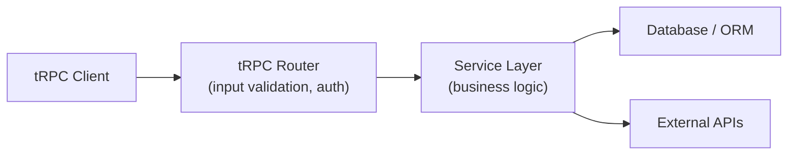
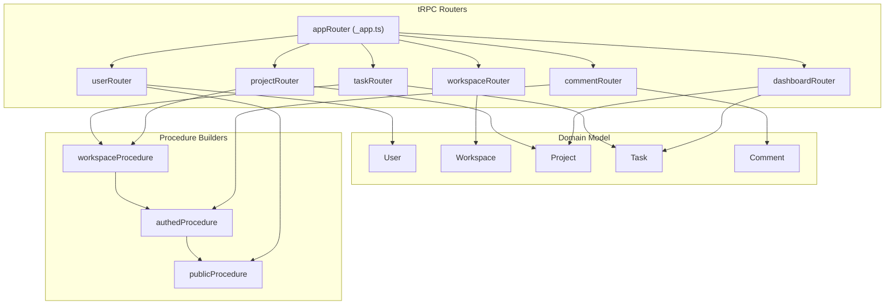

## Designing the Data Model and Router Structure

A well-designed data model and router structure is foundational to a maintainable tRPC application. Poor organization compounds quickly — routers become monolithic, procedures blur domain boundaries, and the type inference that makes tRPC valuable becomes difficult to reason about. This topic covers principled approaches to structuring both the data layer and the tRPC router layer, and how the two interact.

---

### The Relationship Between Data Model and Router Structure

tRPC routers do not enforce any particular data modeling strategy, but the shape of your data model heavily influences how routers should be organized. A mismatch between the two creates friction — either routers that cut across domain boundaries in awkward ways, or data models shaped by API convenience rather than domain logic.

**Key Points**

- Router structure should reflect domain boundaries, not database table structure
- A single router procedure may aggregate data from multiple models
- Input/output schemas (typically Zod) form the contract between router and consumer — they are part of the data model design, not incidental
- [Inference] Treating tRPC procedures as thin wrappers over database queries tends to produce routers that leak persistence concerns into the API layer

---

### Defining the Domain Model First

Before writing any tRPC code, define the domain entities and their relationships. This is independent of the database schema, ORM, or persistence strategy.

**Example domain: a project management application**

Entities:
- `User` — authenticated actor
- `Workspace` — top-level container, has members
- `Project` — belongs to a workspace
- `Task` — belongs to a project, assigned to a user
- `Comment` — belongs to a task

Relationships:
- A `User` belongs to many `Workspaces` (many-to-many via `WorkspaceMember`)
- A `Workspace` has many `Projects`
- A `Project` has many `Tasks`
- A `Task` has many `Comments`

This domain decomposition directly informs router structure — one router per aggregate root is a reasonable starting point.

---

### Router Hierarchy Design

#### Flat vs Nested Routers

tRPC supports both flat and nested router structures. The choice affects discoverability, code splitting, and how the client imports procedures.

**Flat structure** — all procedures in one router:

```ts
export const appRouter = t.router({
  userCreate: userProcedure,
  userGetById: userProcedure,
  projectCreate: projectProcedure,
  projectList: projectProcedure,
  taskCreate: taskProcedure,
});
```

**Nested structure** — sub-routers composed into a root router:

```ts
export const appRouter = t.router({
  user: userRouter,
  project: projectRouter,
  task: taskRouter,
  comment: commentRouter,
});
```

**Key Points**

- Nested routers produce procedure paths like `task.create`, `task.list`, `task.assignTo` — these are more readable and groupable on the client
- Flat routers are simpler for very small applications but do not scale well as procedure count grows
- tRPC's client mirrors the router structure exactly — `trpc.task.create.useMutation()` vs `trpc.taskCreate.useMutation()`
- Nesting depth beyond two levels (e.g., `workspace.project.task`) is generally inadvisable — it adds navigation overhead without proportional organizational benefit [Inference]

---

#### Recommended File Structure

```
src/
  server/
    routers/
      _app.ts          ← root router (composes sub-routers)
      user.ts
      workspace.ts
      project.ts
      task.ts
      comment.ts
    procedures/
      base.ts          ← base procedure builders (publicProcedure, authedProcedure)
      workspace.ts     ← workspace-scoped procedure with membership check
    context.ts
    trpc.ts            ← initTRPC, exports t.router, t.procedure, t.middleware
  db/
    schema.ts          ← database schema (Prisma, Drizzle, etc.)
    index.ts           ← db client export
  lib/
    validators/        ← shared Zod schemas (reused across routers)
      user.ts
      task.ts
```

**Key Points**

- `_app.ts` uses a leading underscore by convention to sort to the top and signal it is the composition root, not a domain router
- Keeping Zod validators in a separate `lib/validators/` directory allows them to be imported by both server routers and client-side forms
- `trpc.ts` should export only the tRPC primitives — no business logic

---

### The Root Router

```ts
// server/routers/_app.ts
import { t } from '../trpc';
import { userRouter } from './user';
import { workspaceRouter } from './workspace';
import { projectRouter } from './project';
import { taskRouter } from './task';
import { commentRouter } from './comment';

export const appRouter = t.router({
  user: userRouter,
  workspace: workspaceRouter,
  project: projectRouter,
  task: taskRouter,
  comment: commentRouter,
});

export type AppRouter = typeof appRouter;
```

**Key Points**

- `AppRouter` is the only export consumed by the client — keep this type export stable
- The root router file should contain no procedure definitions — only composition
- [Inference] Adding procedures directly to the root router alongside sub-routers tends to create an unnamed "miscellaneous" category that grows over time

---

### Designing Individual Routers

Each domain router should cover CRUD operations and domain-specific actions for its aggregate.

**Example: Task router**

```ts
// server/routers/task.ts
import { z } from 'zod';
import { t, authedProcedure } from '../trpc';
import { taskCreateSchema, taskUpdateSchema } from '../../lib/validators/task';

export const taskRouter = t.router({
  list: authedProcedure
    .input(z.object({ projectId: z.string().cuid() }))
    .query(async ({ ctx, input }) => {
      return ctx.db.task.findMany({
        where: { projectId: input.projectId },
        orderBy: { createdAt: 'desc' },
      });
    }),

  byId: authedProcedure
    .input(z.object({ id: z.string().cuid() }))
    .query(async ({ ctx, input }) => {
      const task = await ctx.db.task.findUnique({ where: { id: input.id } });
      if (!task) throw new TRPCError({ code: 'NOT_FOUND' });
      return task;
    }),

  create: authedProcedure
    .input(taskCreateSchema)
    .mutation(async ({ ctx, input }) => {
      return ctx.db.task.create({
        data: { ...input, createdById: ctx.session.user.id },
      });
    }),

  update: authedProcedure
    .input(taskUpdateSchema)
    .mutation(async ({ ctx, input }) => {
      const { id, ...data } = input;
      return ctx.db.task.update({ where: { id }, data });
    }),

  delete: authedProcedure
    .input(z.object({ id: z.string().cuid() }))
    .mutation(async ({ ctx, input }) => {
      await ctx.db.task.delete({ where: { id: input.id } });
    }),

  assign: authedProcedure
    .input(z.object({ taskId: z.string().cuid(), userId: z.string().cuid() }))
    .mutation(async ({ ctx, input }) => {
      return ctx.db.task.update({
        where: { id: input.taskId },
        data: { assignedToId: input.userId },
      });
    }),
});
```

**Key Points**

- Domain actions (`assign`, `complete`, `archive`) live alongside CRUD operations in the same router — they operate on the same aggregate
- Query procedures use noun-first naming (`byId`, `list`, `byProject`) — mutation procedures use verb-first naming (`create`, `update`, `delete`, `assign`)
- [Inference] Naming conventions are not enforced by tRPC — establishing a team convention early prevents inconsistency as the router grows

---

### Input Schema Design

Input schemas are the data model surface exposed to callers. Their design deserves as much care as the domain model itself.

#### Separate Create and Update Schemas

```ts
// lib/validators/task.ts
import { z } from 'zod';

const taskBase = z.object({
  title: z.string().min(1).max(256),
  description: z.string().max(4096).optional(),
  dueDate: z.coerce.date().optional(),
  priority: z.enum(['LOW', 'MEDIUM', 'HIGH']).default('MEDIUM'),
  projectId: z.string().cuid(),
});

export const taskCreateSchema = taskBase;

export const taskUpdateSchema = taskBase
  .partial()
  .extend({ id: z.string().cuid() })
  .refine(
    (data) => Object.keys(data).length > 1,
    { message: 'At least one field must be provided for update' }
  );

export type TaskCreateInput = z.infer<typeof taskCreateSchema>;
export type TaskUpdateInput = z.infer<typeof taskUpdateSchema>;
```

**Key Points**

- `taskBase` captures the shared shape — create and update schemas derive from it
- `.partial()` on the update schema makes all fields optional, reflecting that partial updates are valid
- The `.refine()` check prevents no-op update calls — behavior of this guard depends on how Zod processes the input [note: behavior may vary]
- Exporting inferred TypeScript types alongside schemas enables reuse in non-tRPC contexts (e.g., React Hook Form)

---

#### Output Schema Considerations

tRPC does not require output schemas, but defining them provides:

- Runtime validation of what the procedure actually returns
- Explicit API contracts visible to consumers
- Stripping of sensitive fields before they leave the server

```ts
export const taskOutputSchema = z.object({
  id: z.string().cuid(),
  title: z.string(),
  description: z.string().nullable(),
  priority: z.enum(['LOW', 'MEDIUM', 'HIGH']),
  dueDate: z.date().nullable(),
  assignedTo: z.object({
    id: z.string(),
    name: z.string(),
  }).nullable(),
  createdAt: z.date(),
});

// In the router:
list: authedProcedure
  .input(z.object({ projectId: z.string().cuid() }))
  .output(z.array(taskOutputSchema))
  .query(async ({ ctx, input }) => { ... }),
```

**Key Points**

- Output schemas add a runtime cost — Zod parses the return value before sending it to the client
- Without an output schema, the inferred return type is derived from the procedure's TypeScript return type, which may be wider than intended
- Output schemas are most valuable at trust boundaries — public APIs, third-party integrations, or procedures where the database model includes sensitive columns

---

### Handling Cross-Domain Procedures

Some procedures logically span multiple domain entities. Common approaches:

#### Option 1 — Place in the Primary Aggregate's Router

A procedure that creates a task and notifies assignees belongs in `taskRouter`, since `Task` is the primary entity being mutated.

#### Option 2 — Dedicated Cross-Domain Router

For procedures that are genuinely cross-cutting:

```ts
// server/routers/dashboard.ts
export const dashboardRouter = t.router({
  summary: authedProcedure
    .input(z.object({ workspaceId: z.string().cuid() }))
    .query(async ({ ctx, input }) => {
      const [projects, tasks, members] = await Promise.all([
        ctx.db.project.count({ where: { workspaceId: input.workspaceId } }),
        ctx.db.task.count({ where: { project: { workspaceId: input.workspaceId } } }),
        ctx.db.workspaceMember.count({ where: { workspaceId: input.workspaceId } }),
      ]);
      return { projects, tasks, members };
    }),
});
```

**Key Points**

- Avoid creating too many cross-domain routers — they tend to accumulate miscellaneous procedures over time
- Cross-domain read procedures (dashboards, search, aggregations) are a legitimate use case
- Cross-domain mutation procedures often signal that a domain service or use-case layer is needed between the router and the database [Inference]

---

### Service Layer Pattern

For non-trivial applications, placing business logic directly in router procedures creates tight coupling between the tRPC layer and the persistence layer. A service layer decouples them.



**Example**

```ts
// server/services/task.service.ts
export class TaskService {
  constructor(private db: PrismaClient) {}

  async createTask(input: TaskCreateInput, actorId: string) {
    const project = await this.db.project.findUnique({
      where: { id: input.projectId },
    });
    if (!project) throw new Error('Project not found');

    // Business rule: only project members can create tasks
    const isMember = await this.db.projectMember.findUnique({
      where: { projectId_userId: { projectId: project.id, userId: actorId } },
    });
    if (!isMember) throw new Error('Not a project member');

    return this.db.task.create({
      data: { ...input, createdById: actorId },
    });
  }
}

// server/routers/task.ts
import { TaskService } from '../services/task.service';

export const taskRouter = t.router({
  create: authedProcedure
    .input(taskCreateSchema)
    .mutation(async ({ ctx, input }) => {
      const service = new TaskService(ctx.db);
      return service.createTask(input, ctx.session.user.id);
    }),
});
```

**Key Points**

- The router procedure handles input validation and auth context; the service handles business logic and persistence
- Service methods throw plain `Error` instances — the router layer wraps these in `TRPCError` if needed, or a middleware handles the translation
- [Inference] This pattern adds indirection that may be unnecessary for simple CRUD applications — apply it where business rules are non-trivial or reused across multiple procedures

---

### Context Design for Authorization

The context object is the primary mechanism for carrying authorization state into procedures. Its design should reflect the access control model.

```ts
// server/context.ts
export async function createContext({ req, res }: CreateNextContextOptions) {
  const session = await getServerSession(req, res, authOptions);

  return {
    db,
    session,
    // Convenience: typed user or null
    user: session?.user ?? null,
  };
}

export type Context = inferAsyncReturnType<typeof createContext>;
```

**Base procedure builders derived from context:**

```ts
// server/trpc.ts
const t = initTRPC.context<Context>().create();

export const publicProcedure = t.procedure;

export const authedProcedure = t.procedure.use(({ ctx, next }) => {
  if (!ctx.user) throw new TRPCError({ code: 'UNAUTHORIZED' });
  return next({ ctx: { ...ctx, user: ctx.user } }); // narrows user to non-null
});

export const workspaceProcedure = authedProcedure.use(
  async ({ ctx, input, next }) => {
    const workspaceId = (input as { workspaceId?: string }).workspaceId;
    if (!workspaceId) throw new TRPCError({ code: 'BAD_REQUEST' });

    const membership = await ctx.db.workspaceMember.findUnique({
      where: { workspaceId_userId: { workspaceId, userId: ctx.user.id } },
    });
    if (!membership) throw new TRPCError({ code: 'FORBIDDEN' });

    return next({ ctx: { ...ctx, workspaceId, membership } });
  }
);
```

**Key Points**

- Each procedure builder adds a layer of context narrowing — `authedProcedure` guarantees `ctx.user` is non-null, `workspaceProcedure` guarantees `ctx.membership` is present
- This pattern avoids repeated null checks inside individual procedures
- [Inference] The `input as { workspaceId?: string }` cast in `workspaceProcedure` is a pragmatic workaround for middleware not having access to typed input — a cleaner alternative is passing `workspaceId` explicitly via context or restructuring the middleware chain

---

### Diagram: Full Router and Data Model Relationship



---

### Common Structural Anti-Patterns

#### God Router

All procedures in a single `appRouter` with no sub-routers. Breaks down beyond ~10 procedures.

#### Mirroring Database Tables Exactly

One router per table, with procedures that directly map to SQL operations. This exposes persistence internals as API surface and makes it difficult to evolve the schema independently.

#### Deep Nesting

Routers nested three or more levels deep (`workspace.project.task.comment.create`). Difficult to navigate and produces unwieldy client call paths.

#### Mixing Query and Mutation Logic

Using a `query` procedure to perform a mutation (e.g., incrementing a counter on fetch) breaks HTTP caching assumptions and makes the API harder to reason about.

#### Validation-Free Procedures

Procedures without `.input()` schemas accept arbitrary input. This is occasionally valid for procedures with no parameters, but should be a deliberate choice — not an oversight.

---

### Naming Conventions Summary

| Procedure Type | Recommended Convention | Example |
|---|---|---|
| Fetch single record | `byId`, `bySlug` | `task.byId` |
| Fetch collection | `list`, `listByProject` | `task.list` |
| Create | `create` | `task.create` |
| Update | `update`, `patch` | `task.update` |
| Delete | `delete`, `remove` | `task.delete` |
| Domain action | verb phrase | `task.assign`, `task.complete` |
| Aggregation | noun phrase | `dashboard.summary` |

---

**Related Topics**

- Middleware chaining for multi-level authorization (workspace → project → task)
- Zod schema composition patterns — discriminated unions, branded types, and transforms in tRPC input schemas
- Output schema design and field-level access control (stripping sensitive fields per role)
- Service layer patterns — dependency injection and testability in tRPC applications
- Prisma and tRPC — aligning Prisma models with tRPC input/output schemas
- Drizzle ORM and tRPC — schema inference and type sharing
- tRPC in a monorepo — sharing validators and types between server and client packages
- Versioning a tRPC API — strategies for introducing breaking changes without breaking clients